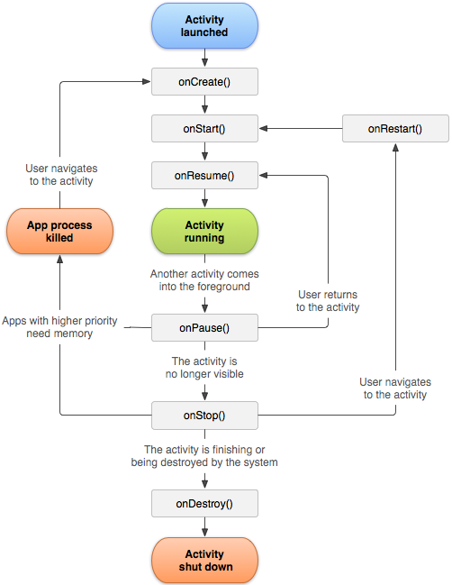
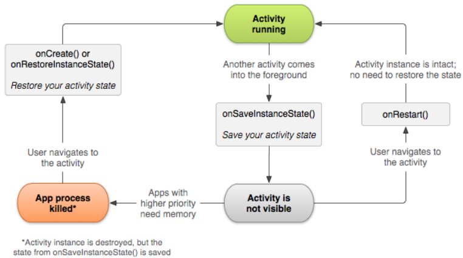

&emsp;&emsp;`Activity`是一个应用组件，用户可与其提供的屏幕进行交互，以执行拨打电话、拍摄照片、发送电子邮件或查看地图等操作。每个`Activity`都会获得一个用于绘制其用户界面的窗口。窗口通常会充满屏幕，但也可小于屏幕并浮动在其他窗口之上。
&emsp;&emsp;一个应用通常由多个彼此松散联系的`Activity`组成。一般会指定应用中的某个`Activity`为`主Activity`，即首次启动应用时呈现给用户的那个`Activity`。而且每个`Activity`均可启动另一个`Activity`，以便执行不同的操作。每次新`Activity`启动时，前一`Activity`便会停止，但系统会在堆栈(`返回栈`)中保留该`Activity`。当新`Activity`启动时，系统会将其推送到返回栈上，并取得用户焦点。返回栈遵循基本的`后进先出`堆栈机制，因此当用户完成当前`Activity`并按`返回`按钮时，系统会从堆栈中将其弹出(并销毁)，然后恢复前一`Activity`。
&emsp;&emsp;当一个`Activity`因某个新`Activity`启动而停止时，系统会通过该`Activity`的生命周期回调方法通知其这一状态变化。`Activity`因状态变化：系统是创建`Activity`、停止`Activity`、恢复`Activity`还是销毁`Activity`，而收到的回调方法可能有若干种，每一种回调都会为您提供执行与该状态变化相应的特定操作的机会。例如停止时，您的`Activity`应释放任何大型对象，例如网络或数据库连接。当`Activity`恢复时，您可以重新获取所需资源，并恢复执行中断的操作。这些状态转变都是`Activity`生命周期的一部分。

### 创建Activity

&emsp;&emsp;要创建`Activity`，您必须创建`Activity`的子类(或使用其现有子类)。您需要在子类中实现`Activity`在其生命周期的各种状态之间转变时(例如创建`Activity`、停止`Activity`、恢复`Activity`或销毁`Activity`时)系统调用的回调方法。两个最重要的回调方法是`onCreate`和`onPause`。

#### onCreate

&emsp;&emsp;您必须实现此方法。系统会在创建您的`Activity`时调用此方法。您应该在实现内初始化`Activity`的必需组件。最重要的是，您必须在此方法内调用`setContentView`，以定义`Activity`用户界面的布局。

#### onPause

&emsp;&emsp;系统将此方法作为用户离开`Activity`的第一个信号(但并不总是意味着`Activity`会被销毁)进行调用。您通常应该在此方法内确认在当前用户会话结束后仍然有效的任何更改(因为用户可能不会返回)。
&emsp;&emsp;您还应使用几种其他生命周期回调方法，以便提供流畅的`Activity`间用户体验，以及处理导致您的`Activity`停止甚至被销毁的意外中断。后文的管理`Activity`生命周期部分对所有生命周期回调方法进行了阐述。

### 实现用户界面

&emsp;&emsp;`Activity`的用户界面是由层级式视图(衍生自`View`类的对象)提供的。每个视图都控制`Activity`窗口内的特定矩形空间，可对用户交互作出响应。例如，视图可以是在用户触摸时启动某项操作的按钮。
&emsp;&emsp;您可以利用`Android`提供的许多现成视图设计和组织您的布局。`小部件`是提供按钮、文本字段、复选框或仅仅是一幅图像等屏幕视觉(交互式)元素的视图。`布局`是衍生自`ViewGroup`的视图，为其子视图提供唯一布局模型，例如线性布局、网格布局或相对布局。您还可以为`View`类和`ViewGroup`类创建子类(或使用其现有子类)来自行创建小部件和布局，然后将它们应用于您的`Activity`布局。
&emsp;&emsp;利用视图定义布局的最常见方法是借助保存在您的应用资源内的`XML`布局文件。这样一来，您就可以将用户界面的设计与定义`Activity`行为的源代码分开维护。您可以通过`setContentView`将布局设置为`Activity`的`UI`，从而传递布局的资源`ID`。不过，您也可以在`Activity`代码中创建新`View`，并通过将新`View`插入`ViewGroup`来创建视图层次，然后通过将根`ViewGroup`传递到`setContentView`来使用该布局。

### 在清单文件中声明Activity

&emsp;&emsp;您必须在清单文件中声明您的`Activity`，这样系统才能访问它。要声明您的`Activity`，请打开您的清单文件，并将`<activity>`元素添加为`<application>`元素的子项：

``` xml
<manifest ... >
    <application ... >
        <activity android:name=".ExampleActivity" />
        ...
        </application ... >
    ...
</manifest >
```

您还可以在此元素中加入几个其他特性，以定义`Activity`标签、`Activity`图标或风格主题等用于设置`Activity UI`风格的属性。`android:name`属性是唯一必需的属性，它指定`Activity`的类名。应用一旦发布，即不应更改此类名，否则可能会破坏诸如应用快捷方式等一些功能。

### 使用Intent过滤器

&emsp;&emsp;`<activity>`元素还可指定各种`Intent`过滤器，使用`<intent-filter>`元素以声明其他应用组件激活它的方法。
&emsp;&emsp;当您使用`Android SDK`工具创建新应用时，系统自动为您创建的根`Activity`包含一个`Intent`过滤器，其中声明了该`Activity`响应`主`操作，且应置于`launcher`类别内。`Intent`过滤器的内容如下：

``` xml
<activity android:name=".ExampleActivity" android:icon="@drawable/app_icon">
    <intent-filter>
        <action android:name="android.intent.action.MAIN" />
        <category android:name="android.intent.category.LAUNCHER" />
    </intent-filter>
</activity>
```

`<action>`元素指定这是应用的`主`入口点；`<category>`元素指定此`Activity`应列入系统的应用启动器内，以便用户启动该`Activity`。
&emsp;&emsp;如果您打算让应用成为独立应用，不允许其他应用激活其`Activity`，则您不需要任何其他`Intent`过滤器。正如前例所示，只应有一个`Activity`具有`主`操作和`launcher`类别。如果您想让`Activity`对衍生自其他应用(以及您的自有应用)的隐式`Intent`作出响应，则必须为`Activity`定义其他`Intent`过滤器。对于您想要作出响应的每一个`Intent`类型，您都必须加入相应的`<intent-filter>`，其中包括一个`<action>`元素，还可选择性地包括一个`<category>`元素和/或一个`<data>`元素。这些元素指定您的`Activity`可以响应的`Intent`类型。

### 启动Activity

&emsp;&emsp;您可以通过调用`startActivity`，并将其传递给描述您想启动的`Activity`的`Intent`来启动另一个`Activity`。`Intent`对象会指定您想启动的具体`Activity`或描述您想执行的操作类型(系统会为您选择合适的`Activity`，甚至是来自其他应用的`Activity`)。`Intent`对象还可能携带少量供所启动`Activity`使用的数据。
&emsp;&emsp;在您的自有应用内工作时，您经常只需要启动某个已知`Activity`。您可以通过使用类名创建一个显式定义您想启动的`Activity`的`Intent`对象来实现此目的。例如，可以通过以下代码让一个`Activity`启动另一个名为`SignInActivity`的`Activity`：

``` java
Intent intent = new Intent(this, SignInActivity.class);
startActivity(intent);
```

不过，您的应用可能还需要利用您的`Activity`数据执行某项操作，例如发送电子邮件、短信或状态更新。在这种情况下，您的应用自身可能不具有执行此类操作所需的`Activity`，因此您可以改为利用设备上其他应用提供的`Activity`为您执行这些操作。这便是`Intent`对象的真正价值所在：您可以创建一个`Intent`对象，对您想执行的操作进行描述，系统会从其他应用启动相应的`Activity`。如果有多个`Activity`可以处理`Intent`，则用户可以选择要使用哪一个。例如，如果您想允许用户发送电子邮件，可以创建以下`Intent`：

``` java
Intent intent = new Intent(Intent.ACTION_SEND);
intent.putExtra(Intent.EXTRA_EMAIL, recipientArray);
startActivity(intent);
```

添加到`Intent`中的`EXTRA_EMAIL extra`是一个字符串数组，其中包含应将电子邮件发送到的电子邮件地址。当电子邮件应用响应此`Intent`时，它会读取`extra`中提供的字符串数组，并将它们放入电子邮件撰写窗体的`收件人`字段。在这种情况下，电子邮件应用的`Activity`启动，并且当用户完成操作时，您的`Activity`会恢复执行。

### 启动Activity以获得结果

&emsp;&emsp;有时您可能需要从启动的`Activity`获得结果。在这种情况下，请通过调用`startActivityForResult`(而非`startActivity`)来启动`Activity`。要想在随后收到后续`Activity`的结果，请实现`onActivityResult`回调方法。当后续`Activity`完成时，它会使用`Intent`向您的`onActivityResult`方法返回结果。
&emsp;&emsp;例如您可能希望用户选取其中一位联系人，以便您的`Activity`对该联系人中的信息执行某项操作。您可以通过以下代码创建此类`Intent`并处理结果：

``` java
private void pickContact() {
    /* Create an intent to "pick" a contact, as defined by the content provider URI */
    Intent intent = new Intent(Intent.ACTION_PICK, Contacts.CONTENT_URI);
    startActivityForResult(intent, PICK_CONTACT_REQUEST);
}
​
@Override
protected void onActivityResult(int requestCode, int resultCode, Intent data) {
    /* If the request went well (OK) and the request was PICK_CONTACT_REQUEST */
    if (resultCode == Activity.RESULT_OK && requestCode == PICK_CONTACT_REQUEST) {
        /* Perform a query to the contact's content provider for the contact's name */
        Cursor cursor = getContentResolver().query(data.getData(),
        new String[] {Contacts.DISPLAY_NAME}, null, null, null);

        if (cursor.moveToFirst()) { /* True if the cursor is not empty */
            int columnIndex = cursor.getColumnIndex(Contacts.DISPLAY_NAME);
            String name = cursor.getString(columnIndex);
            /* Do something with the selected contact's name */
        }
    }
}
```

上例显示的是，您在处理`Activity`结果时应该在`onActivityResult`方法中使用的基本逻辑。第一个条件检查请求是否成功(如果成功，则`resultCode`将为`RESULT_OK`)以及此结果响应的请求是否已知：在此情况下，`requestCode`与随`startActivityForResult`发送的第二个参数匹配。代码通过查询`Intent`中返回的数据(`data`参数)从该处开始处理`Activity`结果。实际情况是，`ContentResolver`对一个内容提供程序执行查询，后者返回一个`Cursor`，让查询的数据能够被读取。

### 结束Activity

&emsp;&emsp;您可以通过调用`Activity`的`finish`方法来结束该`Activity`。您还可以通过调用`finishActivity`结束您之前启动的另一个`Activity`。
&emsp;&emsp;在大多数情况下，您不应使用这些方法显式结束`Activity`。正如下文有关`Activity`生命周期的部分所述，`Android`系统会为您管理`Activity`的生命周期，因此您无需结束自己的`Activity`。调用这些方法可能对预期的用户体验产生不良影响，因此只应在您确实不想让用户返回此`Activity`实例时使用。

### 管理Activity生命周期

&emsp;&emsp;通过实现回调方法管理`Activity`的生命周期对开发强大而又灵活的应用至关重要。`Activity`的生命周期会直接受到`Activity`与其他`Activity`、其任务及返回栈的关联性的影响。`Activity`基本上以三种状态存在：

- 继续：此`Activity`位于屏幕前台并具有用户焦点(有时也将此状态称作`运行中`)。
- 暂停：另一个`Activity`位于屏幕前台并具有用户焦点，但此`Activity`仍可见。也就是说，另一个`Activity`显示在此`Activity`上方，并且该`Activity`部分透明或未覆盖整个屏幕。暂停的`Activity`处于完全活动状态(`Activity`对象保留在内存中，它保留了所有状态和成员信息，并与窗口管理器保持连接)，但在内存极度不足的情况下，可能会被系统终止。
- 停止：该`Activity`被另一个`Activity`完全遮盖(该`Activity`目前位于`后台`)。已停止的`Activity`同样仍处于活动状态(`Activity`对象保留在内存中，它保留了所有状态和成员信息，但未与窗口管理器连接)。不过，它对用户不再可见，在他处需要内存时可能会被系统终止。

如果`Activity`处于暂停或停止状态，系统可通过要求其结束(调用其`finish`方法)或直接终止其进程，将其从内存中删除。(将其结束或终止后)再次打开`Activity`时，必须重建。

### 实现生命周期回调

&emsp;&emsp;当一个`Activity`转入和转出上述不同状态时，系统会通过各种回调方法向其发出通知。所有回调方法都是挂钩，您可以在`Activity`状态发生变化时，替代这些挂钩来执行相应操作。以下框架`Activity`包括每一个基本生命周期方法：

``` java
public class ExampleActivity extends Activity {
    @Override
    public void onCreate(Bundle savedInstanceState) {
        super.onCreate(savedInstanceState);
        /* The activity is being created */
    }

    @Override
    protected void onStart() {
        super.onStart();
        /* The activity is about to become visible */
    }
​
    @Override
    protected void onResume() {
        super.onResume();
        /* The activity has become visible (it is now "resumed") */
    }
​
    @Override
    protected void onPause() {
        super.onPause();
        /* Another activity is taking focus (this activity is about to be "paused") */
    }
​
    @Override
    protected void onStop() {
        super.onStop();
        /* The activity is no longer visible (it is now "stopped") */
    }
​
    @Override
    protected void onDestroy() {
        super.onDestroy();
        /* The activity is about to be destroyed */
    }
}
```

正如以上示例所示，您在实现这些生命周期方法时必须始终先调用超类实现，然后再执行任何操作。这些方法共同定义`Activity`的整个生命周期。您可以通过实现这些方法监控`Activity`生命周期中的三个嵌套循环：

- `Activity`的整个生命周期发生在`onCreate`调用与`onDestroy`调用之间。您的`Activity`应在`onCreate`中执行`全局`状态设置(例如定义布局)，并释放`onDestroy`中的所有其余资源。例如，如果您的`Activity`有一个在后台运行的线程，用于从网络上下载数据，它可能会在`onCreate`中创建该线程，然后在`onDestroy`中停止该线程。
- `Activity`的可见生命周期发生在`onStart`调用与`onStop`调用之间。在这段时间，用户可以在屏幕上看到`Activity`并与其交互。例如，当一个新`Activity`启动，并且此`Activity`不再可见时，系统会调用`onStop`。您可以在调用这两个方法之间保留向用户显示`Activity`所需的资源。例如，您可以在`onStart`中注册一个`BroadcastReceiver`以监控影响`UI`的变化，并在用户无法再看到您显示的内容时，在`onStop`中将其取消注册。在`Activity`的整个生命周期，当`Activity`在对用户可见和隐藏两种状态中交替变化时，系统可能会多次调用`onStart`和`onStop`。
- `Activity`的前台生命周期发生在`onResume`调用与`onPause`调用之间。在这段时间，`Activity`位于屏幕上的所有其他`Activity`之前，并具有用户输入焦点。`Activity`可频繁转入和转出前台：例如，当设备转入休眠状态或出现对话框时，系统会调用`onPause`。由于此状态可能经常发生转变，因此这两个方法中应采用适度轻量级的代码，以避免因转变速度慢而让用户等待。

&emsp;&emsp;下图说明了这些循环以及`Activity`在状态转变期间可能经过的路径。矩形表示回调方法，当`Activity`在不同状态之间转变时，您可以实现这些方法来执行操作：



&emsp;&emsp;下表列出了相同的生命周期回调方法，其中对每一种回调方法做了更详细的描述，并说明了每一种方法在`Activity`整个生命周期内的位置，包括在回调方法完成后系统能否终止`Activity`：

方法        | 说明                                                                                                                                                                                                                                                                                   | 是否能事后终止？ | 后接
------------|---------------------------------------------------------------------------------------------------------------------------------------------------------------------------------------------------------------------------------------------------------------------------------------|-----------------|------
`onCreate`  | 首次创建`Activity`时调用。您应该在此方法中执行所有正常的静态设置：创建视图、将数据绑定到列表等等。系统向此方法传递一个`Bundle`对象，其中包含`Activity`的上一状态，不过前提是捕获了该状态(请参阅后文的保存`Activity`状态)                                                                              | 否              | `onStart`
`onRestart` | 在`Activity`已停止并即将再次启动前调用                                                                                                                                                                                                                                                   | 否              | `onStart`
`onStart`   | 在`Activity`即将对用户可见之前调用。如果`Activity`转入前台，则后接`onResume`；如果`Activity`转入隐藏状态，则后接`onStop`                                                                                                                                                                     | 否              | `onResume`或`onStop`
`onResume`  | 在`Activity`即将开始与用户进行交互之前调用。此时，`Activity`处于`Activity`堆栈的顶层，并具有用户输入焦点                                                                                                                                                                                     | 否              | `onPause`
`onPause`   | 当系统即将开始继续另一个`Activity`时调用。此方法通常用于确认对持久性数据的未保存更改、停止动画以及其他可能消耗`CPU`的内容，诸如此类。它应该非常迅速地执行所需操作，因为它返回后，下一个`Activity`才能继续执行。如果`Activity`返回前台，则后接`onResume`，如果`Activity`转入对用户不可见状态，则后接`onStop` | 是              | `onResume`或`onStop`
`onStop`    | 在`Activity`对用户不再可见时调用。如果`Activity`被销毁，或另一个`Activity`(一个现有`Activity`或新`Activity`)继续执行并将其覆盖，就可能发生这种情况。如果`Activity`恢复与用户的交互，则后接`onRestart`，如果`Activity`被销毁，则后接`onDestroy`                                                      | 是              | `onRestart`或`onDestroy`
`onDestroy` | 在`Activity`被销毁前调用。这是`Activity`将收到的最后调用。当`Activity`结束(有人对`Activity`调用了`finish`)，或系统为节省空间而暂时销毁该`Activity`实例时，可能会调用它。您可以通过`isFinishin`方法区分这两种情形                                                                                   | 是              | 无

&emsp;&emsp;名为`是否能事后终止？`的列表示系统是否能在不执行另一行`Activity`代码的情况下，在方法返回后随时终止承载`Activity`的进程。有三个方法带有`是`标记：`onPause`、`onStop`和`onDestroy`。由于`onPause`是这三个方法中的第一个，因此`Activity`创建后，`onPause`必定成为最后调用的方法，然后才能终止进程：如果系统在紧急情况下必须恢复内存，则可能不会调用`onStop`和`onDestroy`。因此，您应该使用`onPause`向存储设备写入至关重要的持久性数据(例如用户编辑)。不过，您应该对`onPause`调用期间必须保留的信息有所选择，因为该方法中的任何阻止过程都会妨碍向下一个`Activity`的转变并拖慢用户体验。
&emsp;&emsp;在`是否能在事后终止？`列中标记为`否`的方法可从系统调用它们的一刻起，防止承载`Activity`的进程被终止。因此，在从`onPause`返回的时间到`onResume`被调用的时间，系统可以终止`Activity`。在`onPause`被再次调用并返回前，将无法再次终止`Activity`。

### 保存Activity状态

&emsp;&emsp;管理`Activity`生命周期的引言部分简要提及，当`Activity`暂停或停止时，`Activity`的状态会得到保留。确实如此，因为当`Activity`暂停或停止时，`Activity`对象仍保留在内存中：有关其成员和当前状态的所有信息仍处于活动状态。因此，用户在`Activity`内所做的任何更改都会得到保留，这样一来，当`Activity`返回前台(当它`继续`)时，这些更改仍然存在。
&emsp;&emsp;不过，当系统为了恢复内存而销毁某项`Activity`时，`Activity`对象也会被销毁，因此系统在继续`Activity`时根本无法让其状态保持完好，而是必须在用户返回`Activity`时重建`Activity`对象。但用户并不知道系统销毁`Activity`后又对其进行了重建，因此他们很可能认为`Activity`状态毫无变化。在这种情况下，您可以实现另一个回调方法对有关`Activity`状态的信息进行保存，以确保有关`Activity`状态的重要信息得到保留，即`onSaveInstanceState`。
&emsp;&emsp;系统会先调用`onSaveInstanceState`，然后再使`Activity`变得易于销毁。系统会向该方法传递一个`Bundle`，您可以在其中使用`putString`和`putInt`等方法以`名称-值对`形式保存有关`Activity`状态的信息。然后，如果系统终止您的应用进程，并且用户返回您的`Activity`，则系统会重建该`Activity`，并将`Bundle`同时传递给`onCreate`和`onRestoreInstanceState`。您可以使用上述任一方法从`Bundle`提取您保存的状态并恢复该`Activity`状态。如果没有状态信息需要恢复，则传递给您的`Bundle`是空值(如果是首次创建该`Activity`，就会出现这种情况)。



&emsp;&emsp;在两种情况下，`Activity`重获用户焦点时可保持状态完好：系统在销毁`Activity`后重建`Activity`，`Activity`必须恢复之前保存的状态；系统停止`Activity`后继续执行`Activity`，并且`Activity`状态保持完好。
&emsp;&emsp;无法保证系统会在销毁您的`Activity`前调用`onSaveInstanceState`，因为存在不需要保存状态的情况(例如用户使用`返回`按钮离开您的`Activity`时，因为用户的行为是在显式关闭`Activity`)。如果系统调用`onSaveInstanceState`，它会在调用`onStop`之前，并且可能会在调用`onPause`之前进行调用。
&emsp;&emsp;不过，即使您什么都不做，也不实现`onSaveInstanceState`，`Activity`类的`onSaveInstanceState`默认实现也会恢复部分`Activity`状态。具体地讲，默认实现会为布局中的每个`View`调用相应的`onSaveInstanceState`方法，让每个视图都能提供有关自身的应保存信息。`Android`框架中几乎每个小部件都会根据需要实现此方法，以便在重建`Activity`时自动保存和恢复对`UI`所做的任何可见更改。例如，`EditText`小部件保存用户输入的任何文本，`CheckBox`小部件保存复选框的选中或未选中状态。您只需为想要保存其状态的每个小部件提供一个唯一的`ID`(通过`android:id`属性)。如果小部件没有`ID`，则系统无法保存其状态。
&emsp;&emsp;您还可以通过将`android:saveEnabled`属性设置为`false`，或通过调用`setSaveEnabled`方法显式阻止布局内的视图保存其状态。您通常不应将该属性停用，但如果您想以不同方式恢复`Activity UI`的状态，就可能需要这样做。
&emsp;&emsp;尽管`onSaveInstanceState`的默认实现会保存有关您的`Activity UI`的有用信息，您可能仍需替换它以保存更多信息。例如，您可能需要保存在`Activity`生命周期内发生了变化的成员值(它们可能与`UI`中恢复的值有关联，但默认情况下系统不会恢复储存这些`UI`值的成员)。
&emsp;&emsp;由于`onSaveInstanceState`的默认实现有助于保存`UI`的状态，因此如果您为了保存更多状态信息而替换该方法，应始终先调用`onSaveInstanceState`的超类实现，然后再执行任何操作。同样，如果您替换`onRestoreInstanceState`方法，也应调用它的超类实现，以便默认实现能够恢复视图状态。
&emsp;&emsp;由于无法保证系统会调用`onSaveInstanceState`，因此您只应利用它来记录`Activity`的瞬态(`UI`的状态)：切勿使用它来存储持久性数据，而应使用`onPause`在用户离开`Activity`后存储持久性数据(例如应保存到数据库的数据)。
&emsp;&emsp;您只需旋转设备，让屏幕方向发生变化，就能有效地测试您的应用的状态恢复能力。当屏幕方向变化时，系统会销毁并重建`Activity`，以便应用可供新屏幕配置使用的备用资源。单凭这一理由，您的`Activity`在重建时能否完全恢复其状态就显得非常重要，因为用户在使用应用时经常需要旋转屏幕。

### 处理配置变更

&emsp;&emsp;有些设备配置可能会在运行时发生变化(例如屏幕方向、键盘可用性及语言)。发生此类变化时，`Android`会重建运行中的`Activity`(系统调用`onDestroy`，然后立即调用`onCreate`)。此行为旨在通过利用您提供的备用资源(例如适用于不同屏幕方向和屏幕尺寸的不同布局)自动重新加载您的应用来帮助它适应新配置。
&emsp;&emsp;如果您对`Activity`进行了适当设计，让它能够按以上所述处理屏幕方向变化带来的重启并恢复`Activity`状态，那么在遭遇`Activity`生命周期中的其他意外事件时，您的应用将具有更强的适应性。
&emsp;&emsp;正如上文所述，处理此类重启的最佳方法是利用`onSaveInstanceState`和`onRestoreInstanceState`(或`onCreate`)保存并恢复`Activity`的状态。

### 协调Activity

&emsp;&emsp;当一个`Activity`启动另一个`Activity`时，它们都会体验到生命周期转变。第一个`Activity`暂停并停止(但如果它在后台仍然可见，则不会停止)时，同时系统会创建另一个`Activity`。如果这些`Activity`共用保存到磁盘或其他地方的数据，必须了解的是，在创建第二个`Activity`前，第一个`Activity`不会完全停止。更确切地说，启动第二个`Activity`的过程与停止第一个`Activity`的过程存在重叠。
&emsp;&emsp;生命周期回调的顺序经过明确定义，当两个`Activity`位于同一进程，并且由一个`Activity`启动另一个`Activity`时，其定义尤其明确。以下是当`Activity A`启动`Activity B`时一系列操作的发生顺序：

- `Activity A`的`onPause`方法执行。
- `Activity B`的`onCreate`、`onStart`和`onResume`方法依次执行(`Activity B`现在具有用户焦点)。
- 然后，如果`Activity A`在屏幕上不再可见，则其`onStop`方法执行。

您可以利用这种可预测的生命周期回调顺序管理从一个`Activity`到另一个`Activity`的信息转变。例如，如果您必须在第一个`Activity`停止时向数据库写入数据，以便下一个`Activity`能够读取该数据，则应在`onPause`而不是`onStop`执行期间向数据库写入数据。

---

### 模拟页面跳转

&emsp;&emsp;`MainActivity.java`如下：

``` java
import android.os.Bundle;
import android.support.v7.app.AppCompatActivity;
import android.view.View;
import android.widget.Button;
​
public class Main3Activity extends AppCompatActivity {
    @Override
    protected void onCreate(Bundle savedInstanceState) {
        super.onCreate(savedInstanceState);
        setContentView(R.layout.activity_main3);
        Button button = findViewById(R.id.button_close);
        button.setOnClickListener(new View.OnClickListener() {
            @Override
            public void onClick(View v) {
                finish();
            }
        });
    }
}
```

`Main3Activity.java`如下：

``` java
import android.os.Bundle;
import android.support.v7.app.AppCompatActivity;
import android.view.View;
import android.widget.Button;
​
public class Main3Activity extends AppCompatActivity {
    @Override
    protected void onCreate(Bundle savedInstanceState) {
        super.onCreate(savedInstanceState);
        setContentView(R.layout.activity_main3);
        Button button = findViewById(R.id.button_close);
        button.setOnClickListener(new View.OnClickListener() {
            @Override
            public void onClick(View v) {
                finish();
            }
        });
    }
}
```

---

### startActivityForResult的使用

&emsp;&emsp;`startActivityForResult`的主要作用就是回传数据。假设我们有两个页面，在第一个页面上有一个按钮，用于进入下一个页面，当进入下一个页面时，进行设置操作，并在其`finish`动作或者`back`动作后，将设置的值回传给第一个页面，从而在第一个页面上显示所得到的值。这有点像回调方法，就是在第二个页面`finish`动作或者`back`动作后，会回调第一个页面的`onActivityResult`方法，所以我们可以重写一下这个方法。
&emsp;&emsp;`startActivityForResult`原型如下：

``` java
startActivityForResult(Intent intent, int requestCode);
```

- `Intent`：它是一个`Intent`对象，用于携带将跳转至下一个界面中使用的数据，使用`putExtra`方法夹载数据。此处存储的数据类型特别多，基本类型全部支持。
- `requestCode`：该参数大于等于`0`，当`Activity`结束时，`requestCode`将归还至`onActivityResult`中，以便确定返回的数据是从哪个`Activity`中返回，用来标识目标`activity`。与下面的`resultCode`功能一致，感觉`Android`为了保证数据的严格一致性特地设置了两把锁，来保证数据的发送和目的地的严格一致性。

&emsp;&emsp;`onActivityResult`原型如下：

``` java
onActivityResult(int requestCode, int resultCode, Intent data);
```

- `requestCode`：用于与`startActivityForResult`中的`requestCode`值进行比较判断，是以便确认返回的数据是从哪个`Activity`返回的。
- `resultCode`：由子`Activity`通过其`setResult`方法返回。适用于多个`activity`都返回数据时，来标识到底是哪一个`activity`返回的值。
- `data`：它是一个`Intent`对象，带有返回的数据。可以通过`data.getXxxExtra`方法来获取指定数据类型的数据。

&emsp;&emsp;`setResult`原型如下：

``` java
setResult(int resultCode, Intent data);
```

在目的界面调用这个方法可以把数据返回至上一个`Activity`。

- `resultCode`：当`Activity`结束时，`resultCode`将归还至`onActivityResult`中。
- `data`：它是一个`Intent`对象，也是返回给上一个`Activity`的数据，要使用`putExtra`方法装载数据。

&emsp;&emsp;`MainActivity.java`如下：

``` java
import android.content.Intent;
import android.support.v7.app.AppCompatActivity;
import android.os.Bundle;
import android.view.View;
import android.widget.Button;
import android.widget.Toast;
​
public class MainActivity extends AppCompatActivity {
    @Override
    protected void onCreate(Bundle savedInstanceState) {
        super.onCreate(savedInstanceState);
        setContentView(R.layout.activity_main);
        Button button = findViewById(R.id.button_first);
        button.setOnClickListener(new View.OnClickListener() {
            @Override
            public void onClick(View v) {
                Intent intent = new Intent(MainActivity.this, Main3Activity.class);
                int requestCode = 0x00;
                startActivityForResult(intent, requestCode);
            }
        });
    }
​
    protected void onActivityResult(int requestCode, int resultCode, Intent data) {
        if ((requestCode == 0x00) && (resultCode == 0x12)) {
            Bundle bundle = data.getExtras();
            String name = bundle.getString("name");
            String password = bundle.getString("password");
            Toast.makeText(MainActivity.this, name + " " + password, Toast.LENGTH_SHORT).show();
        }
    }
}
```

`Main3Activity.java`如下：

``` java
import android.content.Intent;
import android.os.Bundle;
import android.support.v7.app.AppCompatActivity;
import android.view.View;
import android.widget.Button;
​
public class Main3Activity extends AppCompatActivity {
    @Override
    protected void onCreate(Bundle savedInstanceState) {
        super.onCreate(savedInstanceState);
        setContentView(R.layout.activity_main3);
        Button button = findViewById(R.id.button_close);
        button.setOnClickListener(new View.OnClickListener() {
            @Override
            public void onClick(View v) {
                Intent intent = getIntent();
                Bundle bundle = new Bundle();
                bundle.putString("name", "fuxinzi");
                bundle.putString("password", "85056257");
                intent.putExtras(bundle);
                setResult(0x12, intent);
                finish();
            }
        });
    }
}
```