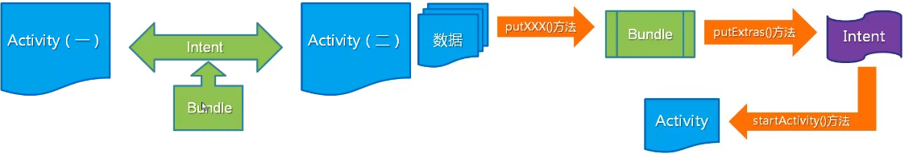

&emsp;&emsp;In this tutorial, we'll be discuss about android bundle to pass data between activities.



### Android Bundle

&emsp;&emsp;`Android` `Bundle` is used to pass data between activities. The values that are to be passed are mapped to `String` keys which are later used in the next activity to retrieve the values.
&emsp;&emsp;Following are the major types that are `passed/retrieved` `to/from` a `Bundle`:

Put                                                      | Get
---------------------------------------------------------|----
`putInt(String key, int value)`                          | `getInt(String key, int value)`
`putIntArray(String key, int[] value)`                   | `getStringArray(String key, int[] value)`
`putIntegerArrayList(String key, ArrayList value)`       | `getIntegerArrayList(String key, ArrayList value value)`
`putString(String key, String value)`                    | `getString(String key, String value)`
`putStringArray(String key, String[] value)`             | `getStringArray(String key, String[] value)`
`putStringArrayList(String key, ArrayList value)`        | `getStringArrayList(String key, ArrayList value value)`
`putLong(String key, long value)`                        | `getLong(String key, long value)`
`putLongArray(String key, long[] value)`                 | `getLongArray(String key, long[] value)`
`putBoolean(String key, boolean value)`                  | `getBoolean(String key, boolean value)`
`putBooleanArray(String key, boolean[] value)`           | `getBooleanArray(String key, boolean[] value)`
`putChar(String key, char value)`                        | `getChar(String key, char value)`
`putCharArray(String key, char[] value)`                 | `getBooleanArray(String key, char[] value)`
`putCharSequence(String key, CharSequence value)`        | `getCharSequence(String key, CharSequence value)`
`putCharSequenceArray(String key, CharSequence[] value)` | `getCharSequenceArray(String key, CharSequence[] value)`
`putCharSequenceArrayList(String key, ArrayList value)`  | `getCharSequenceArrayList(String key, ArrayList value value)`

### Using Android Bundle

&emsp;&emsp;A `Bundle` is passed in the following way:

``` java
Intent intent = new Intent(this,SecondActivity.class);
Bundle bundle = new Bundle();
bundle.putString("key_1", "MainActivity greeted you with a HI");
bundle.putBoolean("key_2", true);
intent.putExtras(bundle);
startActivity(intent);
```

Data from a `Bundle` is retrieved in the `SecondActivity.java` in the following manner:

``` java
Bundle bundle = getIntent().getExtras();
String title = bundle.getString("key_1");
boolean b = bundle.getBoolean("key_2");
```

&emsp;&emsp;If the key doesn't map to any value, it may lead to `NullPointerException`. Hence it's recommended to add null checks for the `Bundle` as well as the retrieved values.
&emsp;&emsp;Alternatively, we can set a default value too in case the mapped key doesn't have any value:

``` java
Bundle bundle = getIntent().getExtras();
String title = bundle.getString("key_1", "Default");
boolean b = bundle.getBoolean("key_2", false);
```

&emsp;&emsp;To remove a value from the bundle the `remove()` method is passed with the relevant key as shown below:

``` java
bundle.remove("key_2");
```

To remove all data from the `Bundle`, the method clear is called on the `Bundle` instance.

---

&emsp;&emsp;`MainActivity.java`如下：

``` java
import android.content.Intent;
import android.support.v7.app.AppCompatActivity;
import android.os.Bundle;
import android.view.View;
import android.widget.Button;
​
public class MainActivity extends AppCompatActivity {
    @Override
    protected void onCreate(Bundle savedInstanceState) {
        super.onCreate(savedInstanceState);
        setContentView(R.layout.activity_main);
        Button button = findViewById(R.id.button_first);
        button.setOnClickListener(new View.OnClickListener() {
            @Override
            public void onClick(View v) {
                Intent intent = new Intent(MainActivity.this, Main3Activity.class);
                Bundle bundle = new Bundle();
                bundle.putString("name", "fuxinzi");
                bundle.putString("password", "85056257");
                intent.putExtras(bundle);
                startActivity(intent);
            }
        });
    }
}
```

`Main3Activity.java`如下：

``` java
import android.os.Bundle;
import android.support.v7.app.AppCompatActivity;
import android.widget.Toast;
​
public class Main3Activity extends AppCompatActivity {
    @Override
    protected void onCreate(Bundle savedInstanceState) {
        super.onCreate(savedInstanceState);
        setContentView(R.layout.activity_main3);
        Bundle bundle = getIntent().getExtras();
        String name = bundle.getString("name");
        String password = bundle.getString("password");
        Toast.makeText(Main3Activity.this, name + " " + password, Toast.LENGTH_SHORT).show();
    }
}
```