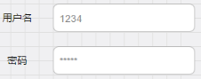

&emsp;&emsp;`EditText`和`TextView`非常类似，最大的区别是`EditText`可以接受用户输入。

### 设置默认提示文本

&emsp;&emsp;如下图：



这里只介绍默认提示文本的两个控制属性：

``` java
android:hint="默认提示文本"
android:textColorHint="#95A1AA"
```

有时需要在文本编辑框中的左边添加图片，可以使用如下语句：

``` java
android:drawableLeft="图片路径"
```

### 获得焦点后全选组件内所有文本内容

&emsp;&emsp;当我们想在点击输入框获得焦点后，不是将光标移动到文本的开始或者结尾，而是获取到输入框中所有的文本内容的话！这个时候我们可以使用`selectAllOnFocus`属性：

``` java
android:selectAllOnFocus="true"
```

### 限制EditText输入类型

&emsp;&emsp;有时我们可能需要对输入的数据进行限制，比如输入电话号码的时候，你输入了一串字母，这显然是不符合我们预期的，而限制输入类型可以通过`inputType`属性来实现。比如限制只能为电话号码、密码(`textPassword`)：

``` java
android:inputType="phone"
```

可选参数如下(文本类型，多为大写、小写和数字符号)：

``` java
android:inputType="none"
android:inputType="text"
android:inputType="textCapCharacters"
android:inputType="textCapWords"
android:inputType="textCapSentences"
android:inputType="textAutoCorrect"
android:inputType="textAutoComplete"
android:inputType="textMultiLine"
android:inputType="textImeMultiLine"
android:inputType="textNoSuggestions"
android:inputType="textUri"
android:inputType="textEmailAddress"
android:inputType="textEmailSubject"
android:inputType="textShortMessage"
android:inputType="textLongMessage"
android:inputType="textPersonName"
android:inputType="textPostalAddress"
android:inputType="textPassword"
android:inputType="textVisiblePassword"
android:inputType="textWebEditText"
android:inputType="textFilter"
android:inputType="textPhonetic"
```

数值类型如下：

``` java
android:inputType="number"
android:inputType="numberSigned"
android:inputType="numberDecimal"
android:inputType="phone" /* 拨号键盘 */
android:inputType="datetime"
android:inputType="date" /* 日期键盘 */
android:inputType="time" /* 时间键盘 */
```

### 设置最小行、最多行、单行、多行以及自动换行

&emsp;&emsp;`EditText`默认是多行显示的，并且能够自动换行，即当一行显示不完时，它会自动换到第二行。
&emsp;&emsp;设置最小行的行数使用属性`android:minLines="3"`，设置最大的行数使用属性`android:maxLines="3"`，当输入内容超过`maxline`，文字会自动向上滚动。
&emsp;&emsp;很多时候我们可能要限制`EditText`只允许单行输入，而且不会滚动(比如上面的登陆界面的例子)，只需要设置`android:singleLine="true"`。

### 设置文字间隔，设置英文字母大写类型

&emsp;&emsp;可以通过以下两个属性来设置字的间距：

``` java
android:textScaleX="1.5" /* 设置字与字的水平间隔 */
android:textScaleY="1.5" /* 设置字与字的垂直间隔 */
```

`EditText`还为我们提供了设置英文字母大写类型的属性`android:capitalize`(默认`none`)，提供了三个可选值：

- `sentences`：仅第一个字母大写。
- `words`：每一个单词首字母大小，用空格区分单词。
- `characters`:每一个英文字母都大写。

### 控制EditText四周的间隔距离与内部文字与边框间的距离

&emsp;&emsp;我们使用`margin`相关属性增加组件相对其他控件的距离，比如`android:marginTop = "5dp"`，使用`padding`增加组件内文字和组件边框的距离，比如`android:paddingTop = "5dp"`。