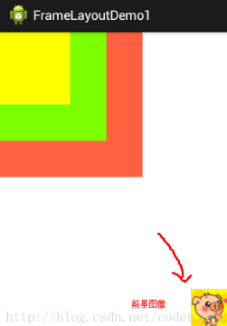

&emsp;&emsp;`FrameLayout`(帧布局)可以说是六大布局中最为简单的一个布局，这个布局直接在屏幕上开辟出一块空白的区域，当我们往里面添加控件的时候，会默认把它们放到这块区域的左上角，而这种布局方式却没有任何的定位方式，所以它应用的场景并不多。
&emsp;&emsp;帧布局的大小由控件中最大的子控件决定，如果控件的大小一样大的话，那么同一时刻就只能看到最上面的那个组件，后续添加的控件会覆盖前一个。虽然默认会将控件放置在左上角，但是我们也可以通过`layout_gravity`属性，指定到其他的位置。
&emsp;&emsp;`FrameLayout`只有两个属性，如下所示。在说之前，先介绍一下前景图像，它是永远处于帧布局最上面的，直接面对用户的图像，就是不会被覆盖的图片。

- `android:foreground`：设置改帧布局容器的前景图像。
- `android:foregroundGravity`：设置前景图像显示的位置。

&emsp;&emsp;最简单的例子如下：

``` xml
<FrameLayout xmlns:android="http://schemas.android.com/apk/res/android"
    android:id="@+id/FrameLayout1"
    android:layout_width="match_parent"
    android:layout_height="match_parent"
    android:foreground="@mipmap/aero3"
    android:foregroundGravity="right|bottom">
​
    <TextView
        android:layout_width="200dp"
        android:layout_height="200dp"
        android:background="#FF6143" />
​
    <TextView
        android:layout_width="150dp"
        android:layout_height="150dp"
        android:background="#7BFE00" />
​
    <TextView
        android:layout_width="100dp"
        android:layout_height="100dp"
        android:background="#FFFF00" />
</FrameLayout>
```



三个`TextView`设置不同大小与背景色，依次覆盖。接着右下角的是前景图像，通过`android:foreground="@mipmap/aero3"`设置前景图像的图片，`android:foregroundGravity="right|bottom"`设置前景图像的位置在右下角。