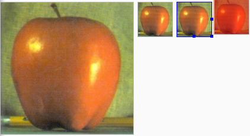

&emsp;&emsp;在`API`文档中，我们发现`ImageView`有两个可以设置图片的属性，分别是`src`和`background`。它们之间的区别如下：

- `background`通常指的都是背景，而`src`指的是内容。
- 当使用`src`填入图片时，是按照图片大小直接填充，并不会进行拉伸；而使用`background`填入图片,则会根据`ImageView`给定的宽度来进行拉伸。

&emsp;&emsp;`XML`文件如下：

``` xml
<?xml version="1.0" encoding="utf-8"?>
<LinearLayout xmlns:android="http://schemas.android.com/apk/res/android"
    android:layout_width="match_parent"
    android:layout_height="match_parent"
    android:orientation="horizontal">
    <!-- 原尺寸显示的图像 -->
    <ImageView
        android:id="@+id/imageView1"
        android:layout_width="wrap_content"
        android:layout_height="wrap_content"
        android:layout_margin="5dp"
        android:src="@mipmap/apple" />
    <!-- 限制最大宽度和高度 -->
    <ImageView
        android:id="@+id/imageView2"
        android:layout_width="wrap_content"
        android:layout_height="wrap_content"
        android:layout_margin="5dp"
        android:adjustViewBounds="true"
        android:maxHeight="90dp"
        android:maxWidth="90dp"
        android:src="@mipmap/apple" />
    <!-- 缩放图片后将其放在右下角 -->
    <ImageView
        android:id="@+id/imageView3"
        android:layout_width="90dp"
        android:layout_height="90dp"
        android:layout_margin="5dp"
        android:scaleType="fitEnd"
        android:src="@mipmap/apple" />
    <!-- 为图片进行着色 -->
    <ImageView
        android:id="@+id/imageView4"
        android:layout_width="90dp"
        android:layout_height="90dp"
        android:src="@mipmap/apple"
        android:tint="#77ff0000" />
​
</LinearLayout>
```



----

&emsp;&emsp;对于`ImageView`的旋转，可以通过在`xml`中设置`ImageView`的属性来实现：

``` xml
android:rotation="90"
```