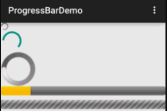

&emsp;&emsp;进度条常用属性如下：<!--more-->

- `android:max`：进度条的最大值。
- `android:progress`：进度条已完成进度值。
- `android:progressDrawable`：设置轨道对应的`Drawable`对象。
- `android:indeterminate`：如果设置成`true`，则进度条不精确显示进度。
- `android:indeterminateDrawable`：设置不显示进度的进度条的`Drawable`对象。
- `android:indeterminateDuration`：设置不精确显示进度的持续时间。
- `android:secondaryProgress`：二级进度条，类似于视频播放的一条是当前播放进度，一条是缓冲进度，前者通过`progress`属性进行设置。

在`Java`中，我们可调用下述方法：

- `getMax()`：返回这个进度条的范围的上限。
- `getProgress()`：返回进度。
- `getSecondaryProgress()`：返回次要进度。
- `incrementProgressBy(int diff)`：指定增加的进度。
- `isIndeterminate()`：指示进度条是否在不确定模式下。
- `setIndeterminate(boolean indeterminate)`：设置进度条处于不确定模式下。

&emsp;&emsp;进度条的种类如下：

``` xml
<LinearLayout xmlns:android="http://schemas.android.com/apk/res/android"
    xmlns:tools="http://schemas.android.com/tools"
    android:layout_width="match_parent"
    android:layout_height="match_parent"
    android:orientation="vertical"
    tools:context=".MainActivity">
​
    <!-- 系统提供的圆形进度条 -->
    <ProgressBar
        style="@android:style/Widget.ProgressBar.Small"
        android:layout_width="wrap_content"
        android:layout_height="wrap_content" />
​
    <ProgressBar
        android:layout_width="wrap_content"
        android:layout_height="wrap_content" />
​
    <ProgressBar
        style="@android:style/Widget.ProgressBar.Large"
        android:layout_width="wrap_content"
        android:layout_height="wrap_content" />
​
    <!-- 系统提供的水平进度条 -->
    <ProgressBar
        style="@android:style/Widget.ProgressBar.Horizontal"
        android:layout_width="match_parent"
        android:layout_height="wrap_content"
        android:max="100"
        android:progress="18" />
​
    <ProgressBar
        style="@android:style/Widget.ProgressBar.Horizontal"
        android:layout_width="match_parent"
        android:layout_height="wrap_content"
        android:layout_marginTop="10dp"
        android:indeterminate="true" />
</LinearLayout>
```



&emsp;&emsp;接下来要实现进度条更新的功能，`XML`文件如下：

``` xml
<LinearLayout xmlns:android="http://schemas.android.com/apk/res/android"
    xmlns:tools="http://schemas.android.com/tools"
    android:layout_width="match_parent"
    android:layout_height="match_parent"
    android:orientation="vertical"
    tools:context=".MainActivity">
​
    <!-- 水平进度条 -->
    <ProgressBar
        android:id="@+id/progressBar1"
        style="@android:style/Widget.ProgressBar.Horizontal"
        android:layout_width="match_parent"
        android:layout_height="25dp"
        android:layout_marginBottom="60dp"
        android:max="100" />
</LinearLayout>
```

`Java`文件如下：

``` java
import android.app.Activity;
import android.os.Bundle;
import android.os.Handler;
import android.os.Message;
import android.view.View;
import android.widget.ProgressBar;
import android.widget.Toast;
​
public class MainActivity extends Activity {
    private ProgressBar horizonP; /* 水平进度条 */
    private int mProgressStatus = 0; /* 完成进度 */
    private Handler mHandler; /* 声明一个用于处理消息的Handler类的对象 */
​
    @Override
    protected void onCreate(Bundle savedInstanceState) {
        super.onCreate(savedInstanceState);
        setContentView(R.layout.activity_main);
        horizonP = (ProgressBar) findViewById(R.id.progressBar1); /* 获取水平进度条 */
        mHandler = new Handler() {
            @Override
            public void handleMessage(Message msg) {
                if (msg.what == 0x111) {
                    horizonP.setProgress(mProgressStatus); /* 更新进度 */
                } else {
                    Toast.makeText(MainActivity.this, "耗时操作已经完成", Toast.LENGTH_SHORT).show();
                    horizonP.setVisibility(View.GONE);  /* 设置进度条不显示，并且不占用空间 */
                }
            }
        };

        new Thread(new Runnable() {
            public void run() {
                while (true) {
                    mProgressStatus = doWork(); /* 获取耗时操作完成的百分比 */
                    Message m = new Message();

                    if (mProgressStatus < 100) {
                        m.what = 0x111; /* 自定义的消息代码 */
                        mHandler.sendMessage(m); /* 发送信息 */
                    } else {
                        m.what = 0x110; /* 自定义的消息代码 */
                        mHandler.sendMessage(m); /* 发送消息 */
                        break;
                    }
                }
            }
​
            private int doWork() { /* 模拟一个耗时操作 */
                mProgressStatus += Math.random() * 10; /* 改变完成进度 */

                try {
                    Thread.sleep(200); /* 线程休眠200毫秒 */
                } catch (InterruptedException e) {
                    e.printStackTrace();
                }

                return mProgressStatus; /* 返回新的进度 */
            }
        }).start(); /* 开启一个线程 */
    }
}
```