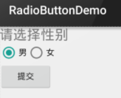

&emsp;&emsp;`RadioButton`只能够选中一个，所以我们需要把`RadioButton`放到`RadioGroup`按钮组中，从而实现单选功能：<!--more-->



``` xml
<LinearLayout xmlns:android="http://schemas.android.com/apk/res/android"
    xmlns:tools="http://schemas.android.com/tools"
    android:id="@+id/LinearLayout1"
    android:layout_width="match_parent"
    android:layout_height="match_parent"
    android:orientation="vertical"
    tools:context=".MainActivity">

    <TextView
        android:layout_width="wrap_content"
        android:layout_height="wrap_content"
        android:text="请选择性别"
        android:textSize="23dp" />
​
    <RadioGroup
        android:id="@+id/radioGroup"
        android:layout_width="wrap_content"
        android:layout_height="wrap_content"
        android:orientation="horizontal">
​
        <RadioButton
            android:id="@+id/btnMan"
            android:layout_width="wrap_content"
            android:layout_height="wrap_content"
            android:checked="true"
            android:text="男" />
​
        <RadioButton
            android:id="@+id/btnWoman"
            android:layout_width="wrap_content"
            android:layout_height="wrap_content"
            android:text="女" />
    </RadioGroup>
​
    <Button
        android:id="@+id/btnpost"
        android:layout_width="wrap_content"
        android:layout_height="wrap_content"
        android:text="提交" />
</LinearLayout>
```

&emsp;&emsp;如果需要获得选中的值，可以为`RadioButton`设置一个事件监听器`setOnCheckChangeListener`：

``` java
import android.support.v7.app.AppCompatActivity;
import android.os.Bundle;
import android.widget.RadioGroup;
import android.widget.Toast;
import android.widget.RadioButton;
import android.widget.RadioGroup.OnCheckedChangeListener;
​
public class MainActivity extends AppCompatActivity {
    @Override
    protected void onCreate(Bundle savedInstanceState) {
        super.onCreate(savedInstanceState);
        setContentView(R.layout.activity_main);
        RadioGroup radgroup = (RadioGroup) findViewById(R.id.radioGroup);
        radgroup.setOnCheckedChangeListener(new OnCheckedChangeListener() {
            @Override
            public void onCheckedChanged(RadioGroup group, int checkedId) {
                RadioButton radbtn = (RadioButton) findViewById(checkedId);
                Toast.makeText(getApplicationContext(), "按钮组值发生改变，你选了" + \
                               radbtn.getText(), Toast.LENGTH_LONG).show();
            }
        });
    }
}
```

第二种方法是通过单击其他按钮获取选中单选按钮的值：

``` java
import android.support.v7.app.AppCompatActivity;
import android.os.Bundle;
import android.view.View;
import android.widget.Button;
import android.widget.RadioGroup;
import android.widget.Toast;
import android.widget.RadioButton;
​
public class MainActivity extends AppCompatActivity {
    @Override
    protected void onCreate(Bundle savedInstanceState) {
        super.onCreate(savedInstanceState);
        setContentView(R.layout.activity_main);
        Button btnchange = (Button) findViewById(R.id.btnpost);
        final RadioGroup radgroup = (RadioGroup) findViewById(R.id.radioGroup);
        btnchange.setOnClickListener(new View.OnClickListener() {
            @Override
            public void onClick(View v) {
                for (int i = 0; i < radgroup.getChildCount(); i++) {
                    RadioButton rd = (RadioButton) radgroup.getChildAt(i);
                    if (rd.isChecked()) {
                        Toast.makeText(getApplicationContext(), \
                                       "点击提交按钮,获取你选择的是:" + rd.getText(), \
                                       Toast.LENGTH_LONG).show();
                        break;
                    }
                }
            }
        });
    }
}
```

这里我们为提交按钮设置了一个`setOnClickListener`事件监听器，如果出现一次单击按钮事件，则遍历一次`RadioGroup`，判断哪个按钮被选中。我们可以通过下述方法获得`RadioButton`的相关信息：

- `getChildCount`：获得按钮组中的单选按钮的数目。
- `getChinldAt`：根据索引值获取我们的单选按钮。
- `isChecked`：判断按钮是否选中。