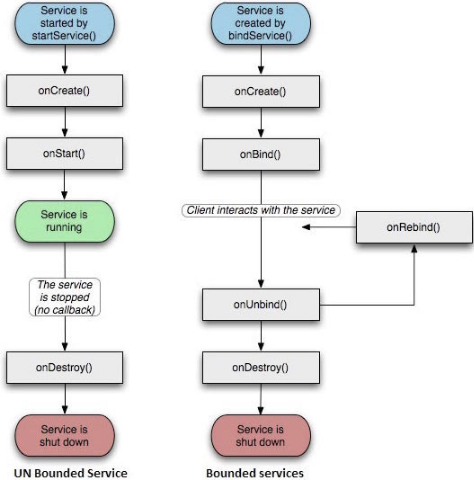

&emsp;&emsp;服务是一个后台运行的组件，执行长时间运行且不需要用户交互的任务。即使应用被销毁也依然可以工作。服务基本上包含两种状态：

状态      | 描述
----------|----
`Started` | `Android`的应用程序组件(例如活动)通过`startService`启动了服务，则服务是`Started`状态。一旦启动，服务可以在后台无限期运行，即使启动它的组件已经被销毁
`Bound`   | 当`Android`的应用程序组件通过`bindService`绑定了服务，则服务是`Bound`状态。`Bound`状态的服务提供了一个客户服务器接口来允许组件与服务进行交互，如发送请求、获取结果，甚至通过`IPC`来进行跨进程通信

服务拥有生命周期方法，可以实现监控服务状态的变化，可以在合适的阶段执行工作。下面的左图展示了当服务通过`startService`被创建时的声明周期，右图则显示了当服务通过`bindService`被创建时的生命周期：

&emsp;&emsp;要创建服务，你需要创建一个继承自`Service`基类或者它的已知子类的`Java`类。`Service`基类定义了不同的回调方法和多数重要方法，你不需要实现所有的回调方法：

回调             | 描述
-----------------|-----
`onStartCommand` | 其他组件(例如活动)通过调用`startService`来请求启动服务时，系统调用该方法。如果你实现该方法，你有责任在工作完成时通过`stopSelf`或者`stopService`方法来停止服务
`onBind`         | 当其他组件想要通过`bindService`来绑定服务时，系统调用该方法。如果你实现该方法，你需要返回`IBinder`对象来提供一个接口，以便客户来与服务通信。你必须实现该方法，如果你不允许绑定，则直接返回`null`
`onUnbind`       | 当客户中断所有服务发布的特殊接口时，系统调用该方法
`onRebind`       | 当新的客户端与服务连接，且此前它已经通过`onUnbind`通知断开连接时，系统调用该方法
`onCreate`       | 当服务通过`onStartCommand`和`onBind`被第一次创建的时候，系统调用该方法。该调用要求执行一次性安装
`onDestroy`      | 当服务不再有用或者被销毁时，系统调用该方法。你的服务需要实现该方法来清理任何资源，例如线程、已注册的监听器或接收器等