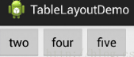
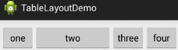
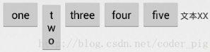
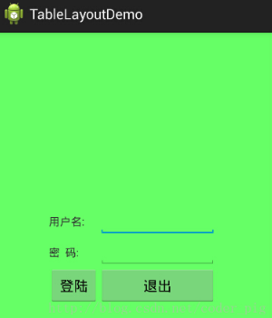

&emsp;&emsp;相信学过`HTML`的朋友都知道，我们可以通过`<table>`、`<tr>`、`<td>`就可以生成一个`HTML`的表格，而`Android`的`TableLayout`也允许我们使用表格的方式来排列组件，就是行与列的方式。但它却不像`Android 4.0`后引入的`GridLayout`(网格)布局一样，无法直接设置多少行与多少列！

### 如何确定行数与列数

&emsp;&emsp;如下所示：

- 如果我们直接往`TableLayout`中添加组件的话，那么这个组件将占满一行。
- 如果我们想在一行上有多个组件的话，就要添加一个`TableRow`的容器，把组件都丢到里面。
- `tablerow`中的组件个数就决定了该行有多少列，而列的宽度由该列中最宽的单元格决定。
- `tablerow`的`layout_width`属性默认是`fill_parent`的，我们自己设置成其他的值也不会生效！但`layout_height`默认是`wrapten_content`的，我们可以自己设置大小。
- 整个表格布局的宽度取决于父容器的宽度(占满父容器本身)。
- 有多少行就要自己数啦，一个`tablerow`是一行，一个单独的组件也是一行。多少列则是看`tablerow`中的组件个数，组件最多的就是`TableLayout`的列数。

### 三个常用属性

&emsp;&emsp;如下所示：

- `android:collapseColumns`：设置需要被隐藏的列的序号。
- `android:shrinkColumns`：设置允许被收缩的列的列序号。
- `android:stretchColumns`：设置运行被拉伸的列的列序号。

以上这三个属性的列号都是从`0`开始算的，比如`shrinkColunmns = "2"`，对应的是第三列。可以设置多个，用逗号隔开(比如`0,2`)。如果是所有列都生效，则用`*`号即可。
&emsp;&emsp;除了这三个常用属性，还有两个属性，分别是跳格子以及合并单元格，这和`HTML`中的`Table`类似。`android:layout_column = "2"`表示的就是跳过第二个，直接显示到第三个格子处，从`1`开始算。

### collapseColumns(隐藏列)

&emsp;&emsp;在`TableRow`中定义`5`个按钮后，接着在最外层的`TableLayout`中添加属性`android:collapseColumns = "0,2"`，就是隐藏第一与第三列：

``` xml
<TableLayout xmlns:android="http://schemas.android.com/apk/res/android"
    android:id="@+id/TableLayout2"
    android:layout_width="fill_parent"
    android:layout_height="wrap_content"
    android:collapseColumns="0,2">
​
    <TableRow>
        <Button
            android:layout_width="wrap_content"
            android:layout_height="wrap_content"
            android:text="one" />
​
        <Button
            android:layout_width="wrap_content"
            android:layout_height="wrap_content"
            android:text="two" />
​
        <Button
            android:layout_width="wrap_content"
            android:layout_height="wrap_content"
            android:text="three" />
​
        <Button
            android:layout_width="wrap_content"
            android:layout_height="wrap_content"
            android:text="four" />
​
        <Button
            android:layout_width="wrap_content"
            android:layout_height="wrap_content"
            android:text="five" />
    </TableRow>
</TableLayout>
```



### stretchColumns(拉伸列)

&emsp;&emsp;在`TableLayout`中设置了四个按钮，接着在最外层的`TableLayout`中添加属性`android:stretchColumns = "1"`，设置第二列为可拉伸列，让该列填满这一行所有的剩余空间：

``` xml
<TableLayout xmlns:android="http://schemas.android.com/apk/res/android"
    android:id="@+id/TableLayout2"
    android:layout_width="fill_parent"
    android:layout_height="wrap_content"
    android:stretchColumns="1">
​
    <TableRow>
        <Button
            android:layout_width="wrap_content"
            android:layout_height="wrap_content"
            android:text="one" />
​
        <Button
            android:layout_width="wrap_content"
            android:layout_height="wrap_content"
            android:text="two" />
​
        <Button
            android:layout_width="wrap_content"
            android:layout_height="wrap_content"
            android:text="three" />
​
        <Button
            android:layout_width="wrap_content"
            android:layout_height="wrap_content"
            android:text="four" />
    </TableRow>
</TableLayout>
```



### shrinkColumns(收缩列)

&emsp;&emsp;这里设置了`5`个按钮和一个文本框，在最外层的`TableLayout`中添加属性`android:shrinkColumns = "1"`，设置第二个列为可收缩列：

``` xml
<TableLayout xmlns:android="http://schemas.android.com/apk/res/android"
    android:id="@+id/TableLayout2"
    android:layout_width="fill_parent"
    android:layout_height="wrap_content"
    android:shrinkColumns="1">
​
    <TableRow>
        <Button
            android:layout_width="wrap_content"
            android:layout_height="wrap_content"
            android:text="one" />
​
        <Button
            android:layout_width="wrap_content"
            android:layout_height="wrap_content"
            android:text="two" />
​
        <Button
            android:layout_width="wrap_content"
            android:layout_height="wrap_content"
            android:text="three" />
​
        <Button
            android:layout_width="wrap_content"
            android:layout_height="wrap_content"
            android:text="four" />
​
        <Button
            android:layout_width="wrap_content"
            android:layout_height="wrap_content"
            android:text="five" />
​
        <TextView
            android:layout_width="wrap_content"
            android:layout_height="wrap_content"
            android:text="文本XX" />
        </TableRow>
</TableLayout>
```



从图中可以看到`two`这个按钮被挤压成条条状，这个就是收缩，为了保证表格能适应父容器的宽度。

### 使用实例

&emsp;&emsp;使用`TableLayout`来完成简单的登录界面：



&emsp;&emsp;流程解析如下：

1. 调用`gravity`属性，设置为`center_vertical`，让布局里面的组件在竖直方向上居中。
2. 将`TableLayout`中的第一和第四列设置为可拉伸。
3. 在每个`TableRow`中添加两个`TextView`，用于拉伸填满该行，这样可以让表格水平居中。
4. 设置属性`android:stretchColumns = "0,3"`，是为了让两边都充满，那么中间部分就可以居中了。

``` xml
<TableLayout xmlns:android="http://schemas.android.com/apk/res/android"
    xmlns:tools="http://schemas.android.com/tools"
    android:id="@+id/TableLayout1"
    android:layout_width="match_parent"
    android:layout_height="match_parent"
    android:background="#66FF66"
    android:gravity="center_vertical"
    android:stretchColumns="0,3"
    tools:context=".MainActivity">
​
    <TableRow>
        <TextView
            android:layout_width="wrap_content"
            android:layout_height="wrap_content"
            android:text="用户名:" />
​
        <EditText
            android:layout_width="wrap_content"
            android:layout_height="wrap_content"
            android:minWidth="150dp" />
    </TableRow>
​
    <TableRow>
        <TextView
            android:layout_width="wrap_content"
            android:layout_height="wrap_content"
            android:text="密  码:" />
​
        <EditText
            android:layout_width="wrap_content"
            android:layout_height="wrap_content"
            android:minWidth="150dp" />
    </TableRow>
​
    <TableRow>
        <Button
            android:layout_width="wrap_content"
            android:layout_height="wrap_content"
            android:text="登陆" />
​
        <Button
            android:layout_width="wrap_content"
            android:layout_height="wrap_content"
            android:text="退出" />
    </TableRow>
</TableLayout>
```