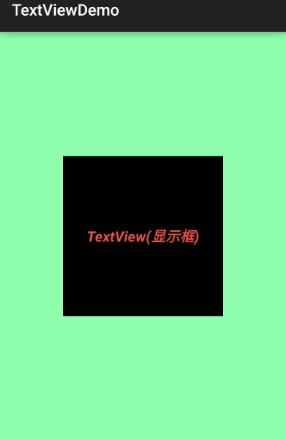
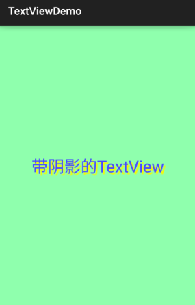
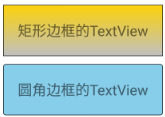

&emsp;&emsp;先介绍几个单位：<!--more-->

- `dp`(`dip`)：`device independent pixels`，译为设备独立像素。
- `px`：`pixels`，译为像素。
- `pt`：`point`是一个标准的长度单位，`1pt`是`1/72`英寸。
- `sp`：`scaled pixels`，译为放大像素。

### 基础属性详解

&emsp;&emsp;通过下面这个简单的界面，来了解几个最基本的属性：

``` xml
<RelativeLayout xmlns:android="http://schemas.android.com/apk/res/android"
    xmlns:tools="http://schemas.android.com/tools"
    android:layout_width="match_parent"
    android:layout_height="match_parent"
    android:background="#8fffad"
    android:gravity="center"
    tools:context=".MainActivity">
​
    <TextView
        android:id="@+id/txtOne"
        android:layout_width="200dp"
        android:layout_height="200dp"
        android:background="#000000"
        android:gravity="center"
        android:text="TextView(显示框)"
        android:textColor="#EA5246"
        android:textSize="18sp"
        android:textStyle="bold|italic" />
​
</RelativeLayout>
```



上面的`TextView`中有下述几个属性:

- `id`：为`TextView`设置一个组件`id`。根据`id`，我们可以在`Java`代码中通过`findViewById`的方法获取到该对象，然后进行相关属性的设置；或者使用`RelativeLayout`时，参考组件用的也是`id`。
- `layout_width`：组件的宽度，一般写`wrap_content`或者`match_parent`(`fill_parent`)，前者是控件显示的内容多大，控件就多大，而后者会填满该控件所在的父容器。当然也可以设置成特定的大小，比如这里为了显示效果，设置成了`200dp`。
- `layout_height`：组件的宽度，内容同上。
- `gravity`：设置控件中内容的对齐方向，`TextView`是对齐文字，`ImageView`是对齐图片。
- `text`：设置显示的文本内容。一般我们是把字符串写到`string.xml`文件中，然后通过`@String/xxx`取得对应的字符串内容，这里为了方便直接就写到该属性里，不建议这样写。
- `textColor`：设置字体颜色，一般通过`colors.xml`资源来引用。
- `textStyle`：设置字体风格，三个可选值：`normal`(无效果)、`bold`(加粗)、`italic`(斜体)。
- `textSize`：字体大小，单位一般是用`sp`。
- `background`：控件的背景颜色，可以理解为填充整个控件的颜色，也可以是图片。

### 实际开发例子

#### 带阴影的TextView

&emsp;&emsp;涉及到的几个属性：

- `android:shadowColor`：设置阴影颜色，需要与`shadowRadius`一起使用。
- `android:shadowRadius`：设置阴影的模糊程度，设为`0.1`就变成字体颜色了，建议使用`3.0`。
- `android:shadowDx`：设置阴影在水平方向的偏移，就是水平方向阴影开始的横坐标位置。
- `android:shadowDy`：设置阴影在竖直方向的偏移，就是竖直方向阴影开始的纵坐标位置。

``` xml
<TextView
    android:layout_width="wrap_content"
    android:layout_height="wrap_content"
    android:layout_centerInParent="true"
    android:shadowColor="#F9F900"
    android:shadowDx="10.0"
    android:shadowDy="10.0"
    android:shadowRadius="3.0"
    android:text="带阴影的TextView"
    android:textColor="#4A4AFF"
    android:textSize="30sp" />
```



#### 带边框的TextView

&emsp;&emsp;如果你想为`TextView`设置一个边框背景(普通矩形边框或者圆角边框)，下面可能帮到你。另外`TextView`是很多其他控件的父类(比如`Button`)，也可以设置这样的边框。实现原理很简单，编写一个`ShapeDrawable`的资源文件，然后`TextView`将`background`设置为这个`drawable`资源即可。
&emsp;&emsp;简单说一下`shapeDrawable`资源文件的几个节点以及属性：

- `<solid android:color = "xxx">`：这个是设置背景颜色的。
- `<stroke android:width = "xdp" android:color="xxx">`：这个是设置边框的粗细以及边框颜色的。
- `<padding androidLbottom = "xdp">`：这个是设置边距的。
- `<corners android:topLeftRadius="10px">`：这个是设置圆角的。
- `<gradient>`：这个是设置渐变色的，可选属性如下：

1. `startColor`：起始颜色。
2. `endColor`：结束颜色。
3. `centerColor`：中间颜色。
4. `angle`：方向角度，等于`0`是从左到右，然后逆时针方向转；等于`90`度时，从下往上。
5. `type`：设置渐变的类型。

&emsp;&emsp;在`Drawable`目录下新建文件`txt_rectborder.xml`：

``` xml
<?xml version="1.0" encoding="utf-8"?>
<shape xmlns:android="http://schemas.android.com/apk/res/android">
    <!-- 设置一个黑色边框 -->
    <stroke
        android:width="2px"
        android:color="#000000" />
    <!-- 渐变 -->
    <gradient
        android:angle="270"
        android:endColor="#C0C0C0"
        android:startColor="#FCD209" />
    <!-- 设置一下边距，让空间大一点 -->
    <padding
        android:bottom="5dp"
        android:left="5dp"
        android:right="5dp"
        android:top="5dp" />
</shape>
```

在`Drawable`目录下新建文件`txt_radiuborder.xml`：

``` xml
<?xml version="1.0" encoding="utf-8"?>
<shape xmlns:android="http://schemas.android.com/apk/res/android">
    <!-- 设置透明背景色 -->
    <solid android:color="#87CEEB" />
    <!-- 设置一个黑色边框 -->
    <stroke
        android:width="2px"
        android:color="#000000" />
    <!-- 设置四个圆角的半径 -->
    <corners
        android:bottomLeftRadius="10px"
        android:bottomRightRadius="10px"
        android:topLeftRadius="10px"
        android:topRightRadius="10px" />
    <!-- 设置一下边距，让空间大一点 -->
    <padding
        android:bottom="5dp"
        android:left="5dp"
        android:right="5dp"
        android:top="5dp" />
</shape>
```

将`TextView`的`background`属性设置成上面这两个`Drawable`：

``` xml
<LinearLayout xmlns:android="http://schemas.android.com/apk/res/android"
    xmlns:tools="http://schemas.android.com/tools"
    android:layout_width="match_parent"
    android:layout_height="match_parent"
    android:background="#FFFFFF"
    android:gravity="center"
    android:orientation="vertical"
    tools:context=".MainActivity">
​
    <TextView
        android:id="@+id/txtOne"
        android:layout_width="200dp"
        android:layout_height="64dp"
        android:background="@drawable/txt_rectborder"
        android:gravity="center"
        android:text="矩形边框的TextView"
        android:textSize="18sp" />
​
    <TextView
        android:id="@+id/txtTwo"
        android:layout_width="200dp"
        android:layout_height="64dp"
        android:layout_marginTop="10dp"
        android:background="@drawable/txt_radiuborder"
        android:gravity="center"
        android:text="圆角边框的TextView"
        android:textSize="18sp" />
</LinearLayout>
```

