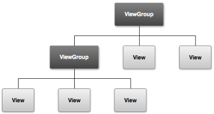

&emsp;&emsp;在`Android`的`APP`中，所有的用户界面元素都是由`View`和`ViewGroup`的对象构成的。`View`是绘制在屏幕上的用户能与之交互的一个对象，而`ViewGroup`则是一个用于存放其他`View`(和`ViewGroup`)对象的布局容器。`Android`为我们提供了一个`View`和`ViewGroup`子类的集合，集合中提供了一些常用的输入控件(比如按钮和文本域)和各种各样的布局模式(比如线性或相对布局)。

### User Interface Layout

&emsp;&emsp;一个`UI`布局的层次结构如下所示。有了层次树，你就可以根据自己的需要设计简单或者复杂的布局了(布局越简单性能越好)。



&emsp;&emsp;你可以在代码中实例化`View`对象并且开始构建层次树，但最容易和最高效的方式则是使用一个`XML`文件，用`XML`来构成布局更加符合人的阅读习惯。`XML`类似于`HTML`，使用`XML`元素的名称代表一个`View`。所以`<TextView>`元素会在你的界面中创建一个`TextView`控件，而一个`<LinearLayout>`则会创建一个`LinearLayout`的容器。举个例子，一个简单的垂直布局上面有一个文本视图和一个按钮：

``` xml
<?xml version="1.0" encoding="utf-8"?>
<LinearLayout xmlns:android="http://schemas.android.com/apk/res/android"
    android:layout_width="fill_parent"
    android:layout_height="fill_parent"
    android:orientation="vertical" >

    <TextView
        android:id="@+id/text"
        android:layout_width="wrap_content"
        android:layout_height="wrap_content"
        android:text="I am a TextView" />

    <Button
        android:id="@+id/button"
        android:layout_width="wrap_content"
        android:layout_height="wrap_content"
        android:text="I am a Button" />
</LinearLayout>
```

当你的`App`加载上述的布局资源时，`Android`会将布局中的每个节点进行实例化成一个个对象，然后你可以为这些对象定义一些额外的行为，例如查询对象的状态或者修改布局。

### User Interface Components

&emsp;&emsp;你无需全部用`View`和`ViewGroup`对象来创建`UI`布局。`Android`给我们提供了一些`app`控件以及标准的`UI`布局，你只需要定义其中的内容即可。