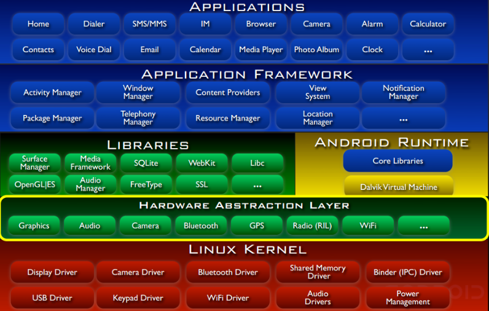
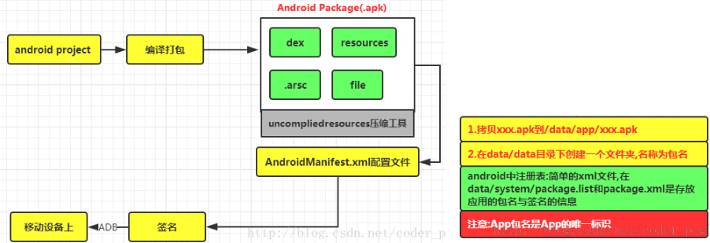

&emsp;&emsp;`Android`是一个开源的，基于`Linux`的移动设备操作系统，常用于智能手机和平板电脑。`Android`是由谷歌及其他公司带领的开放手机联盟开发的。
&emsp;&emsp;`Android`提供了一个统一的应用程序开发方法，这意味着开发人员只需要为`Android`进行开发，这样他们的应用程序就能够运行在不同搭载`Android`的移动设备上。
&emsp;&emsp;`Android`源代码具有自由和开放源码软件许可证。谷歌发布的大部分代码遵循`Apache`许可证`2.0`版，`Linux`内核遵循`GNU`通用公共许可证版本`2`。
<!--more-->

### Android的特性

&emsp;&emsp;`Android`是一款与`iOS`竞争的功能强大的操作系统，以下列举出部分功能：

特性             | 描述
-----------------|-----
漂亮的`UI`        | `Android`操作系统的基本屏幕提供了漂亮又直观的用户界面。
连接性            | `GSM/EDGE`、`IDEN`、`CDMA`、`EV-DO`、`UMTS`、`Bluetooth`、`Wi-Fi`、`LTE`、`NFC`和`WiMAX`
存储              | 用于数据存储的轻量级关系型数据库`SQLite`
媒体支持          | `H.263`、`H.264`、`MPEG-4 SP`、`AMR`、`AMR-WB`、`AAC`、`HE-AAC`、`AAC 5.1`、`MP3`、`MIDI`、`Ogg Vorbis`、`WAV`、`JPEG`、`PNG`、`GIF`和`BMP`
消息              | `SMS`和`MMS`
`Web`浏览器       | 基于开源的`WebKit`布局引擎，再加上支持`HTML5`、`CSS3`和`Chrome`的`V8 JavaScript`引擎
多点触控          | `Android`原生支持多点触控
多任务            | 用户可以跳从一个任务到另一个任务，并且相同时间可以同时运行各种应用
可调整的`widgets` | `Widgets`可调整大小，这样用户就可以扩大以获得更多的内容或缩小以节省空间
多语言            | 支持单向和多向文本
`GCM`谷歌云消息   | `GCM`是一种服务，让开发人员对`Android`设备的用户发送短消息数据，而无需专有的同步解决方案
`Wi-Fi Direct`   | 一种通过高带宽的对等网络连接来直接发现和配对应用的技术
`Android Beam`   | 一个流行的基于`NFC`的技术，使用户能够即时共享，只需通过触摸`NFC`功能将两个手机连在一起

### Android应用程序

&emsp;&emsp;`Android`应用程序一般使用`Android`软件开发工具包，采用`Java`语言来开发。一旦开发完成，`Android`应用程序可以容易的打包，并在诸如`Google Play`和亚马逊应用商店上出售。

### 什么是API级别

&emsp;&emsp;`API`级别是一个用于唯一标识`API`框架版本的整数，由某个版本的`Android`平台提供：

平台版本                         | API等级 | VERSION_CODE
--------------------------------|---------|------------
`Android 5.1`                   | `22`    | `LOLLIPOP_MR1`
`Android 5.0`                   | `21`    | `LOLLIPOP`
`Android 4.4W`                  | `20`    | `KITKAT_WATCH(KitKat for Wearables Only)`
`Android 4.4`                   | `19`    | `KITKAT`
`Android 4.3`                   | `18`    | `JELLY_BEAN_MR2`
`Android 4.2`、`4.2.2`          | `17`    | `JELLY_BEAN_MR1`
`Android 4.1`、`4.1.1`          | `16`    | `JELLY_BEAN`
`Android 4.0.3`、`4.0.4`        | `15`    | `ICE_CREAM_SANDWICH_MR1`
`Android 4.0`、`4.0.1`、`4.0.2` | `14`    | `ICE_CREAM_SANDWICH`
`Android 3.2`                   | `13`    | `HONEYCOMB_MR2`
`Android 3.1.x`                 | `12`    | `HONEYCOMB_MR1`
`Android 3.0.x`                 | `11`    | `HONEYCOMB`
`Android 2.3.3`、`2.3.4`        | `10`    | `GINGERBREAD_MR1`
`Android 2.4`、`2.3.1`、`2.3.2` | `9`     | `GINGERBREAD`
`Android 2.2.x`                 | `8`     | `FROYO`
`Android 2.1.x`                 | `7`     | `ECLAIR_MR1`
`Android 2.0.1`                 | `6`     | `ECLAIR_0_1`
`Android 2.0`                   | `5`     | `ECLAIR`
`Android 1.6`                   | `4`     | `DONUT`
`Android 1.5`                   | `3`     | `CUPCAKE`
`Android 1.1`                   | `2`     | `BASE_1_1`
`Android 1.0`                   | `1`     | `BASE`

### Android系统特性与平台架构

&emsp;&emsp;平台架构图如下：

&emsp;&emsp;对架构的简单理解：

- `Application`(应用程序层)：我们一般说的应用层的开发就是在这个层次上进行的，当然包括了系统内置的一组应用程序，使用的是`Java`语言。
- `Application Framework`(应用程序框架层)：无论系统内置或者我们自己编写的`App`，都需要使用到这层。比如我们想做一个来电黑名单，自动挂断电话，就需要用到电话管理(`TelephonyManager`)。通过该层，我们就可以很轻松地实现挂断操作，而不需要关心底层实现。
- `Libraries`(库) + `Android Runtime`(`Android`运行时环境)：`Android`给我们提供了一组`C/C++`库，为平台的不同组件所使用，比如媒体框架；而`Android Runtime`则由`Android`核心库集和`Dalvik`虚拟机构成，`Dalvik`虚拟机是针对移动设备的虚拟机，它的特点是不需要很快的`CPU`计算速度和大量的内存空间，每个`App`都单独地运行在单独的`Dalvik`虚拟机内。简单运行流程如下：

- `Linux`内核：这里就是涉及底层驱动的东西了，例如内存管理以及进程管理等。

### APP程序打包与安装的流程

&emsp;&emsp;打包过程如左图，安装过程如右图：

