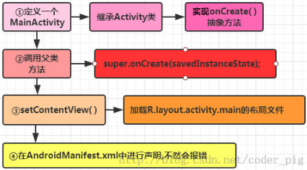
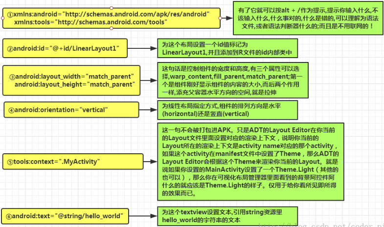
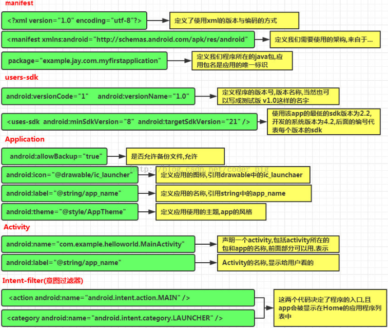

&emsp;&emsp;有许多东西用来构建一个优秀的`Android`应用程序。除了应用程序的编码，你需要关注各种各样的资源，诸如用到的各种静态内容(位图、颜色、布局定义、用户界面字符串、动画)。这些资源一般放置在项目的`res/`下独立子目录中。
<!--more-->
### 在eclipse中组织资源

&emsp;&emsp;你需要将每种资源放置在项目中`res/`目录的特定子目录下。例如这是一个简单项目的文件层级：

``` xml
MyProject/
    src/
        MyActivity.java  
    res/
        drawable/
            icon.png
        layout/
            activity_main.xml
            info.xml
        values/
        strings.xml
```

`res/`目录在各种子目录中包含了所有的资源，这里有一个图片资源，两个布局资源和一个字符串资源文件。下表详细地给出了在项目中`res/`目录里面支持的资源：

目录       | 资源类型
-----------|---------
`anim`     | 定义动画属性的`XML`文件，它们被保存在`res/anim/`文件夹下，通过`R.anim`类访问
`color`    | 定义颜色状态列表的`XML`文件，它们被保存在`res/color/`文件夹下，通过`R.color`类访问
`drawable` | 图片文件，如`.png`、`.jpg`、`.gif`或者`XML`文件，被编译为位图、状态列表、形状、动画图片。它们被保存在`res/drawable/`文件夹下，通过`R.drawable`类访问
`layout`   | 定义用户界面布局的XML文件，它们被保存在`res/layout/`文件夹下，通过`R.layout`类访问
`menu`     | 定义应用程序菜单的XML文件，如选项菜单、上下文菜单、子菜单等。它们被保存在`res/menu/`文件夹下，通过`R.menu`类访问
`raw`      | 任意的文件以它们的原始形式保存。需要根据名为`R.raw.filename`的资源`ID`，通过调用`Resource.openRawResource`来打开`raw`文件
`values`   | 包含简单值(如字符串、整数、颜色等)的`XML`文件。这里有一些文件夹下的资源命名规范：`arrays.xml`代表数组资源，通过`R.array`类访问；`integers.xml`代表整数资源，通过`R.integer`类访问；`bools.xml`代表布尔值资源，通过`R.bool`类访问；`colors.xml`代表颜色资源，通过`R.color`类访问；`dimens.xml`代表维度值，通过`R.dimen`类访问；`strings.xml`代表字符串资源，通过`R.string`类访问；`styles.xml`代表样式资源，通过`R.style`类访问
`xml`      | 可以通过调用`Resources.getXML`来在运行时读取任意的XML文件。可以在这里保存运行时使用的各种配置文件

### 替代资源

&emsp;&emsp;该机制可以让`app`为不同的屏幕分辨率提供替代的图片资源，或者为不同的语言提供替代的字符串资源。在运行时，`Android`检测当前设备配置，并为应用程序加载合适的资源。
&emsp;&emsp;要为特定的配置的确定一系列替代资源，需要遵循如下的步骤：

1. 在`res/`下创建一个新的目录，以`<resource_name>_<config_qualifier>`的方式命名。这里的`resources_name`是上表中提到的任意资源，如布局、图片等；`qualifier`将确定个性的配置使用哪些资源。你可以查看官方文档来了解不同类型资源的一个完整`qualifier`列表。
2. 在这个目录中保存相应的的替代资源，例如为高分辨率的屏幕准备高分辨率的图片。

&emsp;&emsp;下面的例子指定默认屏幕的图片和高分辨率的替代图片：

``` xml
MyProject/
    src/
    main/
    java/
        MyActivity.java
    res/
        drawable/
            icon.png
            background.png
        drawable-hdpi/  
            icon.png
            background.png  
        layout/  
            activity_main.xml
            info.xml
        values/
            strings.xml
```

下面的例子指定默认语言的布局和阿拉伯语言的替代布局：

``` xml
MyProject/
    src/
    main/
    java/
        MyActivity.java
    res/
        drawable/
            icon.png
            background.png
        drawable-hdpi/
            icon.png
            background.png  
        layout/
            activity_main.xml
            info.xml
        layout-ar/
            main.xml
        values/
            strings.xml
```

### 访问资源

&emsp;&emsp;在应用程序开发中，需要访问定义好的资源，不论是通过代码还是通过`XML`文件。下面的章节介绍如何分别在这两种场景中访问资源。

#### 在代码访问资源

&emsp;&emsp;当`Android`应用程序被编译时，它生成一个`R`类，其中包含了所有`res/`目录下资源的`ID`。你可以使用`R`类通过子类加上资源名，或者直接使用资源`ID`来访问资源。
&emsp;&emsp;如果访问`res/drawable/myimage.png`，并将其设置到`ImageView`上，你将使用以下代码：

``` java
ImageView imageView = (ImageView) findViewById(R.id.myimageview);
imageView.setImageResource(R.drawable.myimage);
```

这里第一行代码用`R.id.myimageview`来在布局文件中获取定义为`myimageview`的`ImageView`，第二行用`R.drawable.myimage`来获取在`res/`的`drawable`子目录下名为`myimage`的图片。
&emsp;&emsp;假设`res/values/strings.xml`有如下定义：

``` xml
<?xml version="1.0" encoding="utf-8"?>
<resources>
    <string name="hello">Hello, World!</string>
</resources>
```

现在你可以在`ID`为`msg`的`TextView`对象上使用资源`ID`来设置文本：

``` java
TextView msgTextView = (TextView) findViewById(R.id.msg);
msgTextView.setText(R.string.hello);
```

&emsp;&emsp;考虑如下定义的布局`res/layout/activity_main.xml`：

``` xml
<?xml version="1.0" encoding="utf-8"?>
<LinearLayout xmlns:android="http://schemas.android.com/apk/res/android"
    android:layout_width="fill_parent"
    android:layout_height="fill_parent"
    android:orientation="vertical" >

    <TextView android:id="@+id/text"
        android:layout_width="wrap_content"
        android:layout_height="wrap_content"
        android:text="Hello, I am a TextView" />
    <Button android:id="@+id/button"
        android:layout_width="wrap_content"
        android:layout_height="wrap_content"
        android:text="Hello, I am a Button" />
</LinearLayout>
```

这个应用程序代码将为活动加载这个布局，`onCreate`方法中如下：

``` java
public void onCreate(Bundle savedInstanceState) {
    super.onCreate(savedInstanceState);
    setContentView(R.layout.main_activity);
}
```

#### 在XML中访问

&emsp;&emsp;考虑下面的`XML`资源文件`res/values/strings.xml`，其中包含一个颜色资源和一个字符串资源：

``` xml
<?xml version="1.0" encoding="utf-8"?>
<resources>
    <color name="opaque_red">#f00</color>
    <string name="hello">Hello!</string>
</resources>
```

现在你可以在下面的布局文件中使用这些资源来设置文本颜色和文本内容：

``` xml
<?xml version="1.0" encoding="utf-8"?>
<EditText xmlns:android="http://schemas.android.com/apk/res/android"
    android:layout_width="fill_parent"
    android:layout_height="fill_parent"
    android:textColor="@color/opaque_red"
    android:text="@string/hello" />
```

### 深入了解三个文件

&emsp;&emsp;接下来我们就要剖析工程里三个比较重要的文件：`MainActivity.java`，布局文件`activity_main`和`Android`配置文件`AndroidManifest.xml`。

#### MainActivity.java

&emsp;&emsp;代码如下：

``` java
import android.support.v7.app.AppCompatActivity;
import android.os.Bundle;
​
public class MainActivity extends AppCompatActivity {
    @Override
    protected void onCreate(Bundle savedInstanceState) {
        super.onCreate(savedInstanceState);
        setContentView(R.layout.activity_main);
    }
}
```



`R.layout.activity_main`引用`res/layout`目录下的`activity_main.xml`文件。`onCreate`是活动被加载之后众多被调用的方法之一。

#### activity_main.xml

&emsp;&emsp;代码如下：

``` xml
<RelativeLayout xmlns:android="http://schemas.android.com/apk/res/android"
    xmlns:tools="http://schemas.android.com/tools"
    android:layout_width="match_parent"
    android:layout_height="match_parent"
    tools:context=".MainActivity">
​
    <TextView
        android:layout_width="wrap_content"
        android:layout_height="wrap_content"
        android:text="@string/hello_world" />
</RelativeLayout>
```



`Android`的控件使用`TextView`来构建用户图形界面，它包含有许多不同的属性，诸如`android:layout_width`、`android:layout_height`设置它的宽度和高度等。`@string`指的是`res/values`文件夹下的`strings.xml`文件，因此`@string/hello_world`指的是定义在`strings.xml`中的名为`hello`的字符串`Hello World!`。

#### AndroidManifest.xml

&emsp;&emsp;代码如下：

``` xml
<manifest xmlns:android="http://schemas.android.com/apk/res/android"
   package="com.example.helloworld"
   android:versionCode="1"
   android:versionName="1.0" >
​
   <uses-sdk
      android:minSdkVersion="8"
      android:targetSdkVersion="22" />
​
   <application
       android:icon="@drawable/ic_launcher"
       android:label="@string/app_name"
       android:theme="@style/AppTheme" >
​
       <activity
          android:name=".MainActivity"
          android:label="@string/title_activity_main" >
​
          <intent-filter>
             <action android:name="android.intent.action.MAIN" />
             <category android:name="android.intent.category.LAUNCHER"/>
          </intent-filter>
​
       </activity>
​
   </application>
</manifest>
```



&emsp;&emsp;该文件中显式地声明程序需要的权限，防止`app`错误地使用服务，不恰当地访问资源，最终提高`android`应用程序的健壮性。`android.permission.SEND_SMS`这句话表示`app`需要使用发送信息的权限，安装的时候就会提示用户，相关权限可以在`sdk`参考手册查找。
&emsp;&emsp;无论你开发什么组件用作应用程序中的一部分，都需要在`AndroidManifest.xml`文件中声明所有的组件。这个文件是`Android`操作系统与你的应用程序之间的接口，因此如果没有在这个文件中声明你的组件，将无法被操作系统所识别。
&emsp;&emsp;`application`标签之间是应用程序相关的组件。`andnroid:icon`属性指出位于`res/drawable-hdpi`下面的应用程序图标，这个应用使用`drawable`文件夹下名为`ic_launcher.png`的图片。
&emsp;&emsp;`activity`标签用于指定一个活动，`android:name`属性指定一个`Activity`类子类的全名，`android:label`属性指定用于活动名称的字符串，可以使用标签来指定多个活动。
&emsp;&emsp;意图过滤器(`intent-filter`)的`action`被命名为`android.intent.action.MAIN`，表明这个活动被用做应用程序的入口。意图过滤器的`category`被命名为`android.intent.category.LAUNCHER`，表明应用程序可以通过设备启动器的图标来启动。
&emsp;&emsp;`@string`指的是`strings.xml`，因此`@string/app_name`指的是定义在`strings.xml`中的`app_name`，实际为`Hello World`。

### Strings文件

&emsp;&emsp;`strings.xml`文件在`res/value`文件夹下，它包含应用程序使用到的所有文本，例如按钮或标签的名称、默认文本以及其他相似的`strings`。一个默认的`strings`文件看起来如下：

``` xml
<resources>
    <string name="app_name">HelloWorld</string>
    <string name="hello_world">Hello world!</string>
    <string name="menu_settings">Settings</string>
    <string name="title_activity_main">MainActivity</string>
</resources>
```

### R文件

&emsp;&emsp;`R.java`文件是活动的`Java`文件(例如`MainActivity.java`)和资源(例如`strings.xml`)之间的胶水。这是一个自动生成的文件，不要修改`R.java`文件的内容。