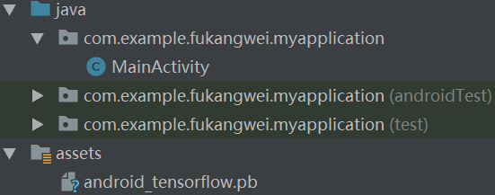

&emsp;&emsp;首先确保`Android studio`安装了`SDK`和`NDK`。`NDK`的安装位置是`File -> Settings -> Android SDK -> SDK Tools`。然后在项目文件`build.gradle`的`dependencies`中加入如下语句：

``` java
implementation 'org.tensorflow:tensorflow-android:+'
```

随后`Android studio`就会自动从网上下载`TensorFlow`的`jar`包。
&emsp;&emsp;首先写一个简单的`python`代码：

``` python
import tensorflow as tf
​
# 1、这里的name很重要，我们给tensorflow模型喂值就靠name
first = tf.constant([1, 2], dtype=tf.float32, name="input")
​
# 测试简单的矩阵相加
result = tf.add(first, first, name="output")
​
# 2、开启一个Session
sess = tf.Session()
sess.run(tf.global_variables_initializer())
​
# 3、这几行代码就是把当前的模型保存为PB文件，PB文件会保存当前tensorflow的模型，将其他值固化为常量
# 第一个参数sess指定为当前的Session，第二个参数是要保存的图的定义(默认是当前图)，然后是要输出的节点
output_graph_def = \
    tf.graph_util.convert_variables_to_constants(
        sess, sess.graph_def,
        output_node_names=['output']
    )

# 这里是选择要保存的位置
with tf.gfile.FastGFile('android_tensorflow.pb', mode='wb') as f:
    f.write(output_graph_def.SerializeToString())
```

将生成的`PB`文件放在`Android studio`相应的目录下：



&emsp;&emsp;在`Android`中调用`feed`函数，并且运行`TensorFlow`模型：

``` java
import android.os.Bundle;
import android.app.Activity;
import android.widget.Toast;
​
import org.tensorflow.contrib.android.TensorFlowInferenceInterface;
​
public class MainActivity extends Activity {
    @Override
    protected void onCreate(Bundle savedInstanceState) {
        super.onCreate(savedInstanceState);
        setContentView(R.layout.activity_main);
        /* 保存要输入和输出的结果 */
        float[] inputs = new float[]{9, 8}; /* 随机给定值，看是否达到相加的效果 */
        float[] outputs = new float[2];
​
        String filename = "android_tensorflow.pb"; /* 这里是那个PB文件的绝对路径 */
​
        /* 以那个PB文件创建一个tensorflow的接口 */
        TensorFlowInferenceInterface tensorFlowInferenceInterface = \
            new TensorFlowInferenceInterface(getAssets(), filename);
        /* 1、第一个参数是张量的名称，第二参数是一个用于存放数据的一维数组，
              最后的参数指定矩阵的维度，我这里是1行2列 */
        tensorFlowInferenceInterface.feed("input", inputs, 1, 2);
        /* 2、运行要输出的张量 */
        tensorFlowInferenceInterface.run(new String[]{"output"});
        /* 3、然后获取到结果，保存在数组中 */
        tensorFlowInferenceInterface.fetch("output", outputs);
        /* 将结果进行显示 */
        Toast.makeText(MainActivity.this, String.valueOf(outputs[0]) + ":" + \
                       String.valueOf(outputs[1]), Toast.LENGTH_SHORT).show();
    }
}
```