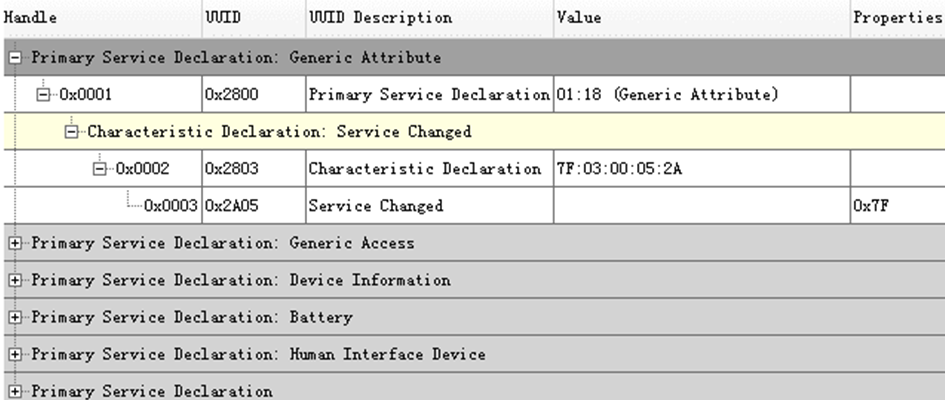
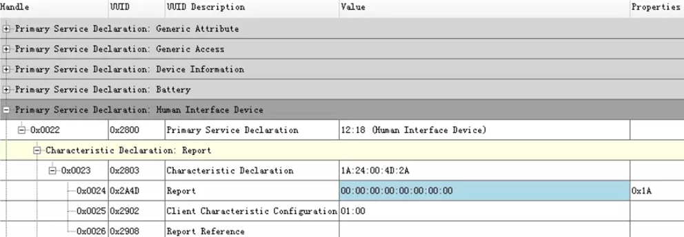
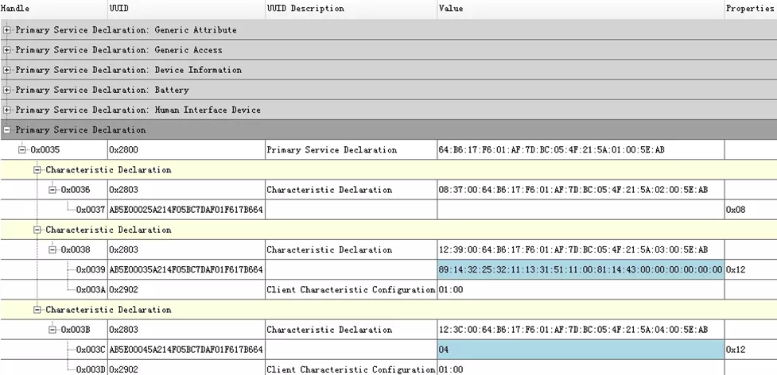
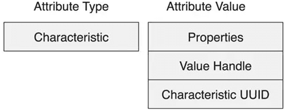
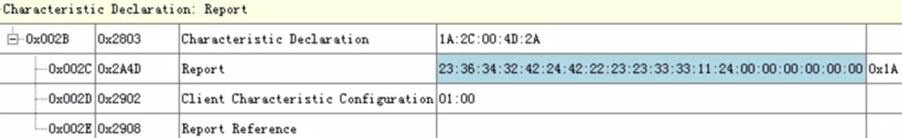

### 属性(Attribute)

#### 属性句柄(Attribute Handle)

&emsp;&emsp;有效的`ATT`句柄范围是`0x0001`至`0xFFFF`。下图是属性的实例，最左侧一列就是`ATT`句柄，从`0x0001`开始。<!--more-->

#### 属性类型(Attribute Type)

&emsp;&emsp;`128`位通用唯一识别码(`UUID`)用来标识`ATT`的类型。为了提高传输效率，蓝牙技术联盟(`SIG`)定义了一个`128`位的蓝牙`UUID`基数，即`00000000-0000-1000-8000-00805F9B34FB`，需要结合一个`16`位的数使用。
&emsp;&emsp;例如，上图中`0x2800`是`16`位`UUID`，完整的`128`位`UUID`便是`00002800-0000-1000-8000-00805F9B34FB`。
&emsp;&emsp;低功耗蓝牙使用的`UUID`被分为`5`组：

1. `0x1800`至`0x26FF`：服务类型。
2. `0x2700`至`0x27FF`：计量单位。
3. `0x2800`至`0x28FF`：属性类型。
4. `0x2900`至`0x29FF`：特性描述。
5. `0x2A00`至`0x7FFF`：特性类型。

&emsp;&emsp;下面是`SIG`官网对各组`UUID`定义的链接地址：

- **服务类型**：`https://www.bluetooth.com/specifications/gatt/services`
- **属性类型**：`https://www.bluetooth.com/specifications/gatt/declarations`
- **特性描述**：`https://www.bluetooth.com/specifications/gatt/descriptors`
- **特性类型**：`https://www.bluetooth.com/specifications/gatt/characteristics`

&emsp;&emsp;例如，在下图中：

- `ATT`句柄为`0x0022`的属性，第`2`列`UUID`为`0x2800`表示`ATT`类型是`主服务`，第`4`列值为`0x1812`表示服务类型是`HID`服务(`Human Interface Device`)。
- `ATT`句柄为`0x0023`的属性，第`2`列`UUID`为`0x2803`表示`ATT`类型是`特性声明`。
- `ATT`句柄为`0x0024`的属性，第`2`列`UUID`为`0x2A4D`表示`ATT`类型是`报告`。
- `ATT`句柄为`0x0025`的属性，第`2`列`UUID`为`0x2902`表示特性描述是`客户端特性配置`。

&emsp;&emsp;如果自定义一个服务，一般会指定一个`128`位的`UUID`，这个`UUID`不能和`SIG`已经定义的服务类型相同。
&emsp;&emsp;下图展示了一个未知服务，包含`1`个主服务，`UUID`为`AB5E0001-5A21-4F05-BC7D-AF01F617B664`。

&emsp;&emsp;还包含`3`个特性，第`1`个特性声明了`UUID`为`AB5E0002-5A21-4F05-BC7D-AF01F617B664`的属性用于接收客户端发来的数据，支持写入操作(`ATT`句柄为`0x0036`的属性，属性值的第`1`个字节为`0x08`，即`Bit3`为`1`，所以支持写入操作。参考后面的特性声明)。
&emsp;&emsp;第`2`个特性声明了`UUID`为`AB5E0003-5A21-4F05-BC7D-AF01F617B664`的属性用于发送数据给客户端，支持读取和通知操作(`ATT`句柄为`0x0038`的属性，属性值的第`1`个字节为`0x12`。`Bit1`为`1`，所以支持读取操作；`Bit4`为`1`，所以支持通知操作)，从图中蓝色部分可以看出数据长度为`20`字节。
&emsp;&emsp;第`3`个特性声明了`UUID`为`AB5E0004-5A21-4F05-BC7D-AF01F617B664`的属性用于发送数据给客户端，支持读取和通知操作(`ATT`句柄为`0x003B`的属性，属性值的第`1`个字节为`0x12`。`Bit1`为`1`，所以支持读取操作；`Bit4`为`1`，所以支持通知操作)，从图中蓝色部分可以看出数据长度为`1`字节。

#### 属性值(Attribute Value)

&emsp;&emsp;`ATT`值长度从`0`字节到最长`512`字节，但某些类型的`ATT`值长度是固定的。上图中`ATT`句柄为`0x003A`的属性，`UUID`为`0x2902`表示`ATT`类型是`客户端特性配置`，该属性的`ATT`值就是固定的`2`个字节长度。

### 特性(Characteristic)

&emsp;&emsp;特性就是把一些属性组合在一起，归为一类。例如，上图中`ATT`句柄从`0x003B`到`0x003D`的`3`个属性就组成了一个特性。特性包含`3`个要素：声明、数值、描述。

#### 特性声明(Characteristic Declaration)

&emsp;&emsp;特性声明的`UUID`为`0x2803`，即`ATT`类型为特性声明(`0x2803`)。

&emsp;&emsp;`Properties`的长度为`8`位，确定了特性数值属性对操作的支持情况，包括：读取、写入、通知、指示、广播、命令、签名认证。每一位表示一种操作，`Bit`位为`1`表示支持该项操作，为`0`表示不支持，如下所示：

Bit | Name
----|-----
`0` | `Broadcast`
`1` | `Read`
`2` | `Write Without Response`
`3` | `Write`
`4` | `Notify`
`5` | `Indicate`
`6` | `Authenticated Signed Writes`
`7` | `Extended Properties`

&emsp;&emsp;数值句柄(`Value Handle`)是与客户端进行数据交互的属性句柄，即实际用来传输数据的属性句柄。
&emsp;&emsp;特性`UUID`(`Characteristic UUID`)是用于标识特性数值的类型的`UUID`。例如，图中`ATT`句柄为`0x002B`的属性就是一个特性声明，第`4`列`ATT`值为`1A:2C:00:4D:2A`。

1. 第`1`个字节`0x1A`(`0b00011010`)表示性质支持读取、写入和通知。
2. 第`2`和`3`字节组合后即为`0x002C`，表示用来传递数据的`ATT`句柄为`0x002C`。
3. 第`4`和`5`字节组合后即为`0x2A4D`，表示该特性数值的类型`UUID`为`0x2A4D`(`Report`)。

#### 特性数值

&emsp;&emsp;特性数值也是一个属性，属性类型必须与特性声明的特性`UUID`字段一致。
&emsp;&emsp;例如，上图中`ATT`句柄为`0x002C`的属性就是一个特性数值，`ATT`类型`UUID`为`0x2A4D`，就是在`ATT`句柄为`0x002B`的`Characteristic Declaration`的`ATT`值中指定的。

#### 特性描述

&emsp;&emsp;特性描述的`UUID`范围`0x2900`至`0x290F`，如下所示。一个特性可以包含任意多的描述：

UUID     | Name
---------|-----
`0x2900` | `Characteristic Extended Properties`
`0x2901` | `Characteristic User Description`
`0x2902` | `Client Characteristic Configuration`
`0x2903` | `Server Characteristic Configuration`
`0x2904` | `Characteristic Presentation Format`
`0x2905` | `Characteristic Aggregate Format`
`0x2906` | `Valid Range`
`0x2907` | `External Report Reference`
`0x2908` | `Report Reference`
`0x2909` | `Number of Digitalis`
`0x290A` | `Value Trigger Setting`
`0x290B` | `Environmental Sensing Configuration`
`0x290C` | `Environmental Sensing Measurement`
`0x290D` | `Environmental Sensing Trigger Setting`
`0x290E` | `Time Trigger Setting`

&emsp;&emsp;例如，客户端特性配置的`ATT`值长度`2`个字节，`Bit0`表示通知是否使能，`Bit1`表示指示是否使能，其它`14`个`Bit`未定义。在上图中，`ATT`句柄为`0x002D`的属性就是一个客户端特性配置，其`ATT`值为`0x0001`，就表示通知操作已打开。