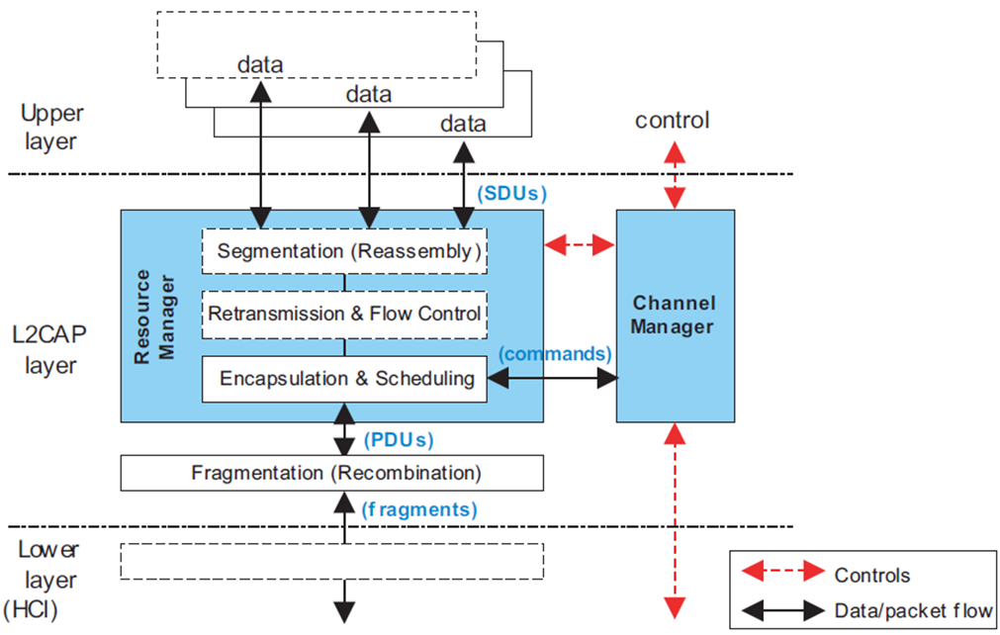
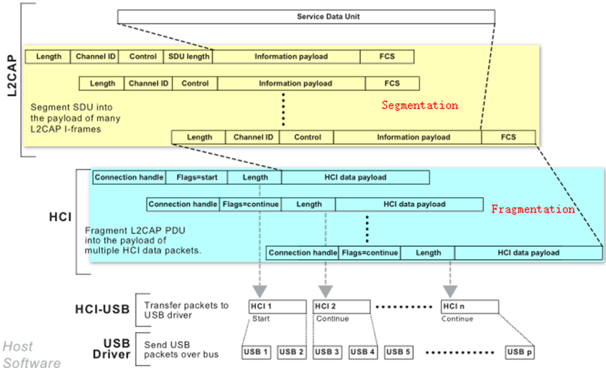
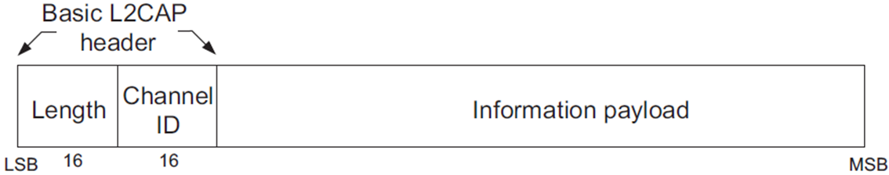
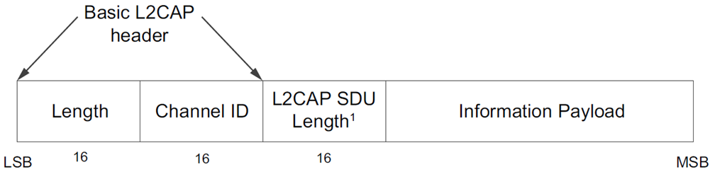
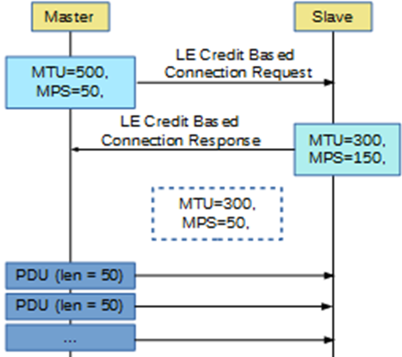
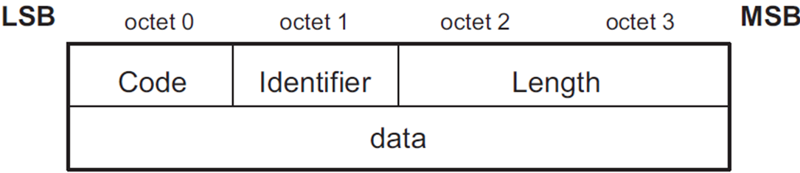

### L2CAP层

&emsp;&emsp;经过`Link Layer`的抽象之后，两个`BLE`设备之间可能存在两条逻辑上的数据通道：<!--more-->

1. 一条是无连接的广播通道，天高任鸟飞。
2. 一条是基于连接的数据通道，是一个点对点(`Master`对`Slave`)的逻辑通道。

&emsp;&emsp;广播通道暂且不用去管，点对点的逻辑通道(`Logical Channel`)要怎么使用，还需要一番思索，例如：

- `Logical Channel`只有一条，而要利用它传输数据的上层应用却不止一个(例如`ATT`和`SMP`)，怎样进行复用？
- `Logical Channel`所能传输的有效`Payload`长度最大只有`251 bytes`，这是否意味着上层应用每次只能传输少于这个长度的数据？显然这是不被允许的！
- `Logical Channel`仅仅提供了简单的应答以及流控机制，如果传输的数据出错怎么办？

&emsp;&emsp;以上问题都是由`L2CAP`(`Logical Link Control and Adaptation Protocol`)进行解决，它是一个介于应用程序(`Profile`、`Application`等)和`Link Layer`之间的`Protocol`。它提供的功能主要包括：

- `Channel Multiplexing`：通道的多路复用。
- `Segmentation and Reassembly`：对上层应用数据(`L2CAP Service Data Units`，`SDUs`)的分割和重组，生成协议数据单元(`L2CAP Packet Data Units`，`PDUs`)，便于后续的重传、流控等机制的实现。
- `Flow Control Per L2CAP Channel`：基于`L2CAP Channel`的流控机制。
- `Error Control and Retransmissions`：错误控制和重传机制。
- `Support for Streaming`：支持流式传输(例如音频、视频等，不需要重传或只需要有限重传)。
- `Fragmentation and Recombination`：协议数据单元(`PDUs`)的分片和重组，生成符合`Link Layer`传输要求的数据片(长度不超过`251`)。
- `Quality of Service`：`QoS`的支持。

&emsp;&emsp;`BLE`的`L2CAP`层是经典蓝牙`L2CAP`层的简化版本，它在基础模式下不执行分段和重组，不涉及流控制和重传机制，仅使用固定信道进行通信；在`LE`令牌流控制模式下，实现了流控制，执行数据分段和重组，使用动态信道进行通信。

### L2CAP层的架构

&emsp;&emsp;`L2CAP`层的作用如下：

- 对于下层，它在用户类`XXX-U Logical Link`的基础上，抽象出和具体技术无关的数据传输通道(包括单播和广播两类)，至此用户就不再需要关心繁杂的蓝牙技术细节。
- 对于上层，它以`L2CAP Channel Endpoints`的概念(类似于`TCP/IP`协议中的端口)，为具体的应用程序(`Profile`)提供独立的数据传输通道(当然，也是一个逻辑通道)。

&emsp;&emsp;`L2CAP`层包括两个功能模块：资源管理器(`Resource Manager`)和信道管理器(`Channel Manager`)。
&emsp;&emsp;`Channel Manager`负责将不同协议的数据分派到合适的信道中。
&emsp;&emsp;应用层发送给`L2CAP`层的数据称为`SDU`(`Service Data Unit`)，`SDU`可能是属性协议层(`ATT`)的读写数据，也可能是链接配置命令，也可能是配对绑定数据。
&emsp;&emsp;`SDU`在`Resource Manager`中添加`L2CAP`协议头信息，封装成`L2CAP`数据包，简称`PDU`(`Protocol Data Unit`)。`PDU`的`Payload`字段就包含了`SDU`或`SDU`的一部分。
&emsp;&emsp;如果`Resource Manager`中采用了流控制或重传机制，则可以实现传输很长的数据包，理论上长度最大可以达到`65535`个字节。一个很长的`SDU`需要先进行分段(`Segmentation`)，分成一个个短小的数据片段，然后再分别添加协议头封装成对应的`PDU`。
&emsp;&emsp;通常`HCI`接口无法发送较长数据包，需要对`PDU`进行分解(`Fragmentation`)，变成数据碎片(`Fragment`)再依次发送到`Controller`。`PDU`总是包含完整的`L2CAP`协议头，而数据碎片则不是完整的`L2CAP`数据包。
&emsp;&emsp;`L2CAP`协议给出两个数据包长度参数以指导分段和分解操作：`MTU`和`MPS`。

- `MTU`(`Maximum Transmission Unit`)：表示`L2CAP`层的最大可传输单元，该参数限制了应用层与`L2CAP`层之间传输数据的最大长度，即最大的`SDU`长度。经典蓝牙默认`MTU`值为`672`字节，`BLE`默认`MTU`值为`23`字节，意味着`BLE`的应用层发送给`L2CAP`层的数据包长度最大为`23`字节，超过该长度的数据包将会触发错误处理机制。
- `MPS`(`Maximum PDU payload Size`)：表示`L2CAP`层`PDU`的`Payload`最大长度，该参数限制了单个`PDU`的长度。分段操作时，每个段的最大长度等于`MPS`。

&emsp;&emsp;显然，`L2CAP`层中`MPS`值小于等于`MTU`值。两个设备建立连接时，会交换`MTU`和`MPS`信息，取最小值作为有效值进行工作。
&emsp;&emsp;下图为经典蓝牙的分段和分解过程示意图：

&emsp;&emsp;`SDU`进入`L2CAP`层，先进行分段(`Segmentation`)操作，对各`PDU`再执行分解(`Fragmentation`)操作变成数据片段传入`HCI`层。注意到，分解(`Fragmentation`)操作实际上是在`HCI`层执行。

### L2CAP的Channel Multiplexing

&emsp;&emsp;所谓的`Multiplexing`(多路复用)还是很好理解的：可用于传输用户数据的`Logical Channel`只有一条，而`L2CAP`需要服务的上层`Profile`和`Application`的数目肯定会大于这个数量。因此，需要使用多路复用的手段，将这些用户数据`Map`到有限的链路资源上去。
&emsp;&emsp;至于`Multiplexing`的手段，简单又直接：

- 数据发送时，将用户数据分割为一定长度的数据包(`PDUs`)，加上一个包含特定`ID`的`Header`后，通过`Logical Channel`发送出去。
- 数据接收时，从`Logical Channel`接收数据，解析其中的`ID`，并以此判断需要将数据转发给哪个应用。

&emsp;&emsp;基于`L2CAP`的应用程序在通信之前，先建立一个基于`Logical Channel`的虚拟通道(称作`L2CAP Channel`)。`L2CAP`会为这个通道分配一个编号，称作`Channel ID`(简称`CID`)。
&emsp;&emsp;`L2CAP Channel`建立之后，就可以把`CID`放到数据包的`Header`中，以达到`Multiplexing`的目的。这种基于`CID`实现的多路复用就被称作`Channel Multiplexing`(基于通道的多路复用)。那么`CID`是怎么确定的呢？有一些固定用途的`L2CAP Channel`，其`CID`是固定值；另外一些则是动态分配的，如下图所示：

- `0x0004`属性协议信道：用于收发属性协议层(`ATT`)的数据，也就是`BLE`应用层通信所传输的数据。
- `0x0005`信令(`Signaling Command`)信道：用于处理应用层发送的命令。
- `0x0006`安全管理协议信道：用于处理加密、配对和绑定等相关数据。这些概念的解释如下：

1. **配对**：生成共享密钥。
2. **绑定**：保存配对过程中生成的密钥，下次重连时就不需要再次配对了。
3. **设备认证**：确定对方就是要对话的设备，而非第三方。
4. **加密**：消息加密。

- `0x0020`至`0x003E`官方编码信道：没有明确指明如何使用。官方编码是指包括`UUID`、`BD_ADDR`、`Comany_ID`等一系列已经授权过的数字串。
- `0x0040`至`0x007F`令牌连接的通信信道：动态信道，它专用于LE令牌流控制工作模式。
注意，广播数据不适用于任何一个`L2CAP`信道，事实上广播数据将从应用层直接发送到`HCI`接口。

### L2CAP的工作模式

&emsp;&emsp;`L2CAP`层有多种工作模式，如下所示：

工作模式           | 适用范围
------------------|--------
基础`L2CAP`模式    | `Classic`，`LE`
流程控制模式        | `Classic`
重传模式            | `Classic`
增强型重传模式       | `Classic`
数据流模式           | `Classic`
`LE`令牌流程控制模式 | `LE`

&emsp;&emsp;基础模式为默认工作模式，`L2CAP`层不执行流程控制，对数据不执行分段和重组操作；其他`5`种模式均使用了流程控制或重传机制，需要执行分段和重组操作。在`L2CAP`层配置阶段，会设置参数是否使用流控制和重传机制：如果不使用流控制和重传机制，则使用基础模式，否则按参数配置情况使用其他模式。

#### 基础模式

&emsp;&emsp;`L2CAP`层基础模式分为`面向连接`和`面向无连接`两类子模式，其中面向无连接仅应用于经典蓝牙的一对多通信场景。
&emsp;&emsp;面向连接的基础模式的数据帧称为`B-Frame`(`Basic Frame`)，其`PDU`格式如下：

&emsp;&emsp;前`4`个字节表示基础`L2CAP`协议头，后面的信息载荷(`Information Payload`)包字段含应用层发送的数据。
&emsp;&emsp;协议头中的长度信息(`Length`)表示`Information Payload`的有效长度，它的取值范围为`0`至`65535`字节，即`Information Payload`的理论最大长度为`65535`个字节。实际上`Information Payload`的长度受限于`MTU`值：当`MTU = 23`时，`Information Payload`的最大长度为`23`字节，此时`PDU`总长度为`23 + 4 = 27`字节。
&emsp;&emsp;`L2CAP`工作在基础模式时，仅使用固定信道进行通信，不对`SDU`进行分段和重组，应用层传输的数据长度被`MTU`严格限制，此时`MPS`等于`MTU`。

#### LE令牌流控制模式

&emsp;&emsp;`LE`令牌流控制模式实现了流控制，以一个令牌参数作为流控制依据。`LE`令牌流控制模式下的分段与重组与经典蓝牙分段重组操作类似。
&emsp;&emsp;`LE`令牌流程控制模式下的数据帧称为`LE-Frame`(`LE Information Frame`)，其`PDU`格式如下：

&emsp;&emsp;相比于基础模式，该模式增加了一个`2`字节的`L2CAP SDU Length`字段，该字段记录了`SDU`的总长度。在分段过程中，第一个`LE-Frame`将包含该字段，在后续`LE-Frame`中不包含该字段。
&emsp;&emsp;`LE-Frame`的`Information Payload`长度不能超过`MPS`值，且`MPS`值小于等于`MTU`值。
&emsp;&emsp;`L2CAP`工作在`LE`令牌流程控制模式时，将使用动态信道，主机使用`LE Credit Based Connection Request`信令作为连接请求，该信令中包含了一个令牌初值。从机返回`LE Credit Based Connection Response`信令。
&emsp;&emsp;建立连接以后，两端设备每发送一个`LE-Frame`，令牌值都将被减`1`。这意味着令牌初值代表该连接能够发送的`LE-Frame`总数，比如令牌`Credit = 100`，意味着两端设备最多只能发送`100`个数据帧，超过后将断开连接。
&emsp;&emsp;为了发送更多数据帧，设备需要发送`LE Flow Control Credit`信令以申请一个新的令牌值，新的令牌值包含在该信令参数中。
&emsp;&emsp;建立连接时，主机与从机交换`MTU`和`MPS`值，获得有效值`MTU = 300`和`MPS = 50`，此时应用层最大数据包长度必须小于`300`。假如主机发送数据包的大小是`210`字节，它将在`L2CAP`层被分成`5`个`PDU`：

1. 第一个`PDU`中包含`L2CAP SDU Length`，`Payload`长度为`48`。
2. 第二至第四个`PDU`中不包含`L2CAP SDU Length`，`Payload`长度为`50`。
3. 第五个`PDU`中不包含`L2CAP SDU Length`，`Payload`长度为`12`。

### 信令

&emsp;&emsp;信令(`Signaling Command`)指`L2CAP`层执行的信号命令，不同的信令将驱动`L2CAP`执行特定的任务。
&emsp;&emsp;信令包也属于`L2CAP`数据包，其内容位于数据包的`Information Payload`中。传输信令包使用信令信道，所以协议头的`CID`等于`0x0005`。
&emsp;&emsp;信令包的格式如下图所示：

- 编码(`Code`)：用于区分不同的信令。
- 识别码(`Identifier`)：用于两端设备收发数据时识别对应的请求与响应，一个请求对应的响应数据应该具有相同的识别码，不同的请求对应不同的识别码。

&emsp;&emsp;`BLE`设备共支持`8`个信令，如下所示：

Code   | 信令                                   | 描述
-------|----------------------------------------|--------
`0x01` | `Command reject`                       | 拒绝一个无效的`L2CAP`命令，参数中包含了拒绝的原因
`0x06` | `Disconnection request`                | 断开连接请求
`0x07` | `Disconnection response`               | 断开连接响应
`0x12` | `Connection Parameter Update request`  | 更新连接参数请求
`0x13` | `Connection Parameter Update response` | 更新连接参数响应
`0x14` | `LE Credit Based Connection request`   | `LE`令牌连接请求，参数中包含了`MTU`
`0x15` | `LE Credit Based Connection response`  | `LE`令牌连接响应
`0x16` | `LE Flow Control Credit`               | 申请新的流程控制令牌

### 状态机

&emsp;&emsp;`L2CAP`共有`12`种状态：

1. `CLOSED`：`Channel`未连接。
2. `WAIT_CONNECT`：发出一个连接请求，收到操作被挂起的回复。
3. `WAIT_CONNECT_RSP`：发出一个连接请求，没有收到回复。
4. `CONFIG`：配置项正在协商。
5. `OPEN`：数据可以传输。
6. `WAIT_DISCONNECT`：发出了一个断开连接请求，但没有收到回复。
7. `WAIT_CREATE`：发出一个建立通道的请求，收到操作被挂起的回复。
8. `WAIT_CREATE_RSP`：发出一个建立通道的请求，但没有收到回复。
9. `WAIT_MOVE`：发出了移除当前通道的请求，收到操作被挂起的回复。
10. `WAIT_MOVE_RSP`：发出了移除当前通道的请求，但没有收到回复。
11. `WAIT_MOVE_CONFIRM`：已经对移除通道的请求做了回复，等待对端的确认。
12. `WAIT_CONFIRM_RSP`：对移除通道回复的确认，等待确认回复。