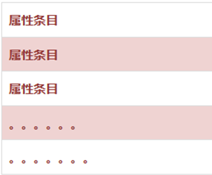
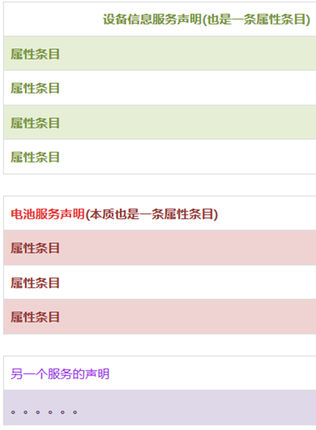
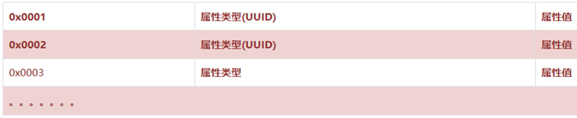
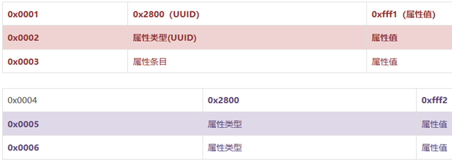

&emsp;&emsp;简单来说，`BLE`的服务端属性数据库可以就看做是一张表，表中包含很多个条目，每一个条目就被称为属性，如下图所示。<!--more-->



&emsp;&emsp;服务端(比如一个简单的防丢器)可能包含有好几个服务，例如设备信息服务、电池服务、警告服务等，这些服务创建后都是存在数据库中，都是以一个个属性条目的形式存在于数据库中。
&emsp;&emsp;那么如何区分这些服务？区分的方式就是使用一条叫做`服务声明`的属性条目，它作为一个服务的开始，其后直到下一个服务声明，这之间的所有属性条目都属于这个服务。



&emsp;&emsp;具体的属性条目组织如下：

``` cpp
属性句柄 | 属性类型(UUID) | 属性值
```

&emsp;&emsp;**属性句柄**：你可以把它当做一个地址来理解。`BLE`的通信都是通过特征(特征也是一种属性条目，包括句柄、`UUID`和属性值，本质上数据传输是通过其中的属性值)来传输的。那么当手机发一串数据过来时，设备怎么知道是发到那个特征里面的？就是通过这个属性句柄来标示的。
&emsp;&emsp;一般在开发时，这个值通常是协议栈自动生成的。比如你调用一个创建特征的`API`时，是不需要指定属性句柄。协议栈内部会在每次创建一个属性时，自动地赋予一个值，通常就是属性句柄递增赋值。
&emsp;&emsp;比如一个属性数据库如下：



&emsp;&emsp;**属性类型**：可以简单理解为这个属性条目中的属性值所代表的含义。
&emsp;&emsp;比如属性类型`UUID`为`0x2800`表示的是首要服务，那么这个属性条目的属性值就是服务的`UUID`。
&emsp;&emsp;比如如下的几条属性条目：



&emsp;&emsp;第一个属性条目的属性句柄为`0x0001`；属性类型即`UUID`为`0x2800`，表示这是个主要服务；属性值为`0xfff1`表示这个主要服务的`UUID`，这是为了区分不同的服务。
&emsp;&emsp;从`0x0004`开始，这个属性条目的`UUID`也是`0x2800`，表示另一个服务的开始。该服务的属性值为`0xfff2`，表示该服务的`UUID`为`0xfff2`。
&emsp;&emsp;**属性值**：属性值的含义是由属性类型的`UUID`决定。
&emsp;&emsp;如果属性类型为`0x2800`，则表示这个属性条目代表主要服务声明，那么它的属性值就是这个服务的`UUID`；如果属性类型为`0x2803`，它后面跟随的属性值就是特性声明。