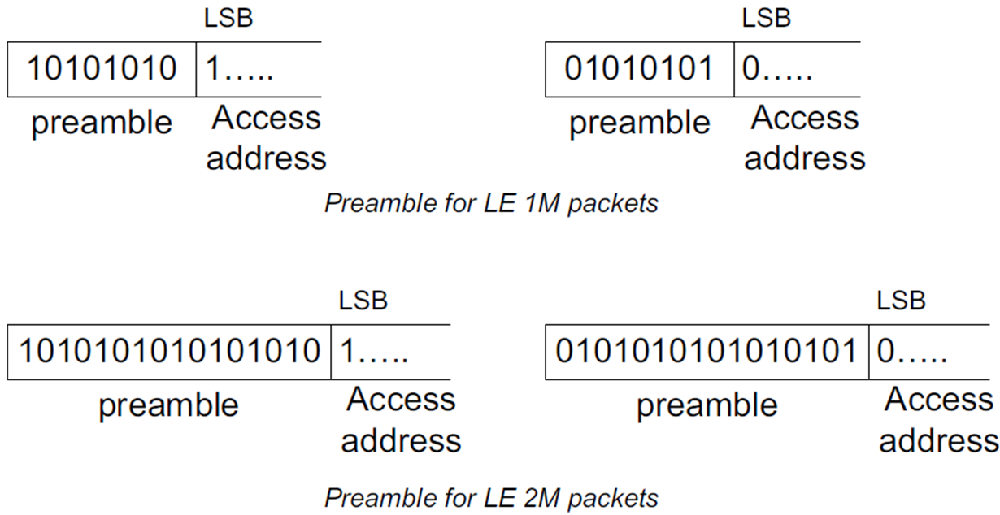
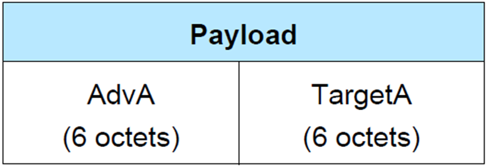
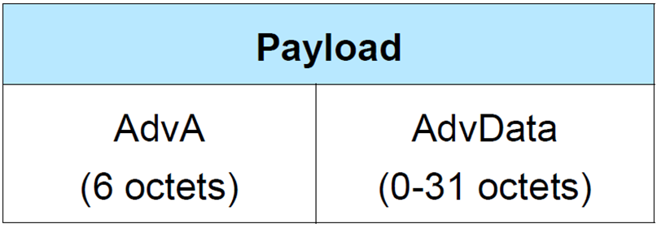
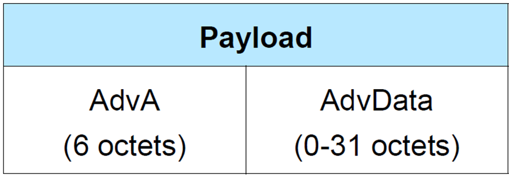
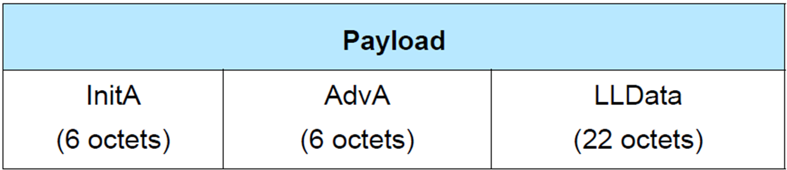
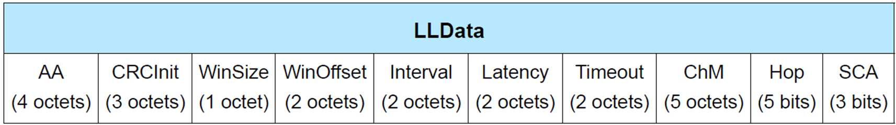

### Air Interface Protocol(空中接口协议)

&emsp;&emsp;状态和角色定义完成后，剩下的事情就简单了，主要包括`2`类：<!--more-->

- 提供某一状态下，和其它实体对应状态之间的数据交换机制。
- 根据上层实体的指令，以及当前的实际情况，负责状态之间的切换。

&emsp;&emsp;在`BLE`协议中，这些事情是由`空中接口协议`(`Air Interface Protocol`)负责，主要思路如下：

### 定义数据包格式(Packet Format)

&emsp;&emsp;在`BLE`中，两种类型的`Physical Channel`(`Advertising Channel`和`Data Channel`)统一使用下图所示的`Packet Format`：

- `Preamble`：前导码，数据包最先传输的部分。
- `Access Address`：用于识别接收该数据包的设备。
- `PDU`：`BLE`在`Link Layer`的`PDU`长度最大为`257 octets`(`octet`实际上就是`bytes`)。这决定了上层实体(例如`L2CAP`、`Application`)，需要拆分、重组才能支持更大数据量的传输。

&emsp;&emsp;该`Packet Format`又分为`2`种格式，一种是`Uncoded PHY`，另一种是`Coded PHY`：

- `Uncoded PHY`：数据传输时，未经过额外的编码。

- `Coded PHY`：数据传输时，在数据包中加上了`FEC`向前纠错编码。

&emsp;&emsp;`2`种数据格式的总结如下图所示：

&emsp;&emsp;对于在`LE 1M`上发送的数据包，前导码为`8`位；对于在`LE 2M`上传输的数据包，前导码为`16`位，如下图所示：

### 定义PDU及其格式

&emsp;&emsp;`Link Layer`有`5`种状态，每种状态下所传输数据的功能不尽相同，因此`Air Interface Protocol`定义出如下的`PDU`类型：

&emsp;&emsp;1) `Advertising Channel`中`Advertising`有关的`PDU`

- `ADV_IND`：`Advertiser`发送的、可被连接的、可扫描的、无方向的广播数据(`Connectable Undirected Advertising Event`)。`可被连接`指的是，我发出去这个包，别人想连接我，是没有问题的；`可扫描`指的是，有人处于`Scanning`状态，收到我的这个`ADV_IND`后，它发出了`SCAN_REQ`，咱们回复它`SCAN_RSP`。

- `ADV_DIRECT_IND`：`Advertiser`发送的、可被连接的、单向广播数据(`Connectable Directed Advertising Event`)。单向指的是，这个数据报文是专门为某个设备准备的。因此，该报文携带了本机地址和对方设备地址。其数据格式如下，`AdvA`是本机地址，`TargetA`是对端地址。

- `ADV_NONCONN_IND`：`Advertiser`发送的、不可被连接的、无方向的广播数据(`Non-Connectable Undirected Advertising Event`)。

- `ADV_SCAN_IND`：`Advertiser`发送的、可接受`SCAN_REQ`请求的、不可被连接的、无方向的广播数据(`Scannable Undirected Advertising Event`)。

&emsp;&emsp;2) `Advertising Channel`中`Scanning`有关的`PDU`

- `SCAN_REQ`：`Scanner`发送的、向`Advertiser`请求额外信息的数据包(一般需要在收到`ADV_SCAN_IND`或`ADV_IND`后才可发送)。
- `SCAN_RSP`：`Advertiser`发送的、响应`SCAN_REQ`请求的数据包。

&emsp;&emsp;3) `Advertising Channel`中`Initialing`有关的`PDU`

- `CONNECT_REQ`(又称为`CONNECT_IND`)：`Initiator`发起的、请求建立连接的数据包。其数据格式如下图所示，`InitA`指的是本机`Initiator`地址，`AdvA`指的是对端`Advertiser`地址。

&emsp;&emsp;连接建立是一件大事，需要交互的信息非常多，基本上全部包含在`CONNECT_IND`的`LLData`中，如下图所示：

- `AA`：`Access Address`，连接建立的接入地址，由`Master`生成，是一个随机数。在不同设备组合之间需要唯一的`Access Address`，并遵守一些原则。
- `CRCInit`：`CRC`计算的初始值，由`Link Layer`随机生成。
- `WinSize`：用于计算`transmitWindowSize`，`transmitWindowSize = WinSize * 1.25 ms`。在建立连接初期，需要计算第一个数据包交互的锚点。
- `WinOffset`：用于计算`transmitWindowOffset`，`transmitWindowOffset = WinOffset * 1.25 ms`。和`WinSize`一样，用于计算第一个数据包的锚点。
- `Interval`：连接间隔，每隔`connInterval`来一次`Connection Event`交互(连接双方收发数据)，`connInterval = Interval * 1.25 ms`。由于一个`Master`可能会和多个`Slave`建立连接，因此蓝牙的信道资源不能被某一个`LL Connection`所独占，所以一个收发周期中可能有多个连接进行收发数据(具体的时间窗口由`transmitWindowOffset`决定)。
- `Latency`：全称是`connSlaveLatency`。`Slave`并不是每个`connInterval`都需要回复数据包，间隔`Latency`个回复也是可以的。
- `Timeout`：超过时间`connSupervisionTimeout`没有交互，就认为连接断开，`connSupervisionTimeout = Timeout * 10 ms`。
- `ChM`：全称为`Channel Map`，表示`40`个`Bitmap`(其实只有`37`个有用，因为`37`、`38`和`39`只用于`Advertising`相关交互，不用于`Connection`)。该参数用于告诉对方，我们在哪些频道上进行数据发送。如果对应频道为`1`，则代表有效，否则是无效的。
- `Hop`：跳频参数，代表`hopIncrement`。它和`ChM`一起决定了数据传输过程中的跳频算法。
- `SCA`：`Master`的时钟精度，单位是`ppm`，即百万分之一。

&emsp;&emsp;4) `Data channel`中`LL Data`(注意，不是`LLData`！)有关的`PDU`
&emsp;&emsp;已连接的双方进行数据通信所用的`PDU`。

&emsp;&emsp;5) `Data channel`中`LL Control`有关的`PDU`

&emsp;&emsp;用于管理、维护、更新已连接的数据通道的`PDU`，例如：

- `LL_CHANNEL_MAP_REQ`：请求更改所使用的`Physical Channel`的数据包。
- `LL_TERMINATE_IND`：告知对方此次连接即将结束，以及结束的原因。

### Access Address

&emsp;&emsp;`Access Address`称为接入地址(与设备的`48 bits`地址不一样)，用来标示接收者`ID`或者空中包。根据`Access Address`的不同，又区分两种`Packet`类型：

- **广播包**：`Access Address`固定为`0x8E89BED6`，广播包只能在广播信道(`Channel`)上传输，即只能在`37`、`38`和`39`信道上传输。
- **数据包**：`Access Address`是一个`32 bit`的随机值，由`Initiator`生成。数据包是给连接通信使用的，即用于`Master`和`Slave`之间通信。数据包只在数据信道上传输，即除了`37`、`38`和`39`之外的其余`37`个信道。每建立一次连接，就要重新生成一次`Access Address`。

### 字节序

&emsp;&emsp;`BLE`协议规定，空中数据传送都使用`Little-Endian Format`，即`Least Significant Bit`(`LSB`)。

### 数据发送接收流程

#### LE Uncoded PHYs

&emsp;&emsp;`LE Uncoded PHYs`数据包发送和接收的过程如下：

&emsp;&emsp;数据流从左至右，`BLE`数据先进行加密，然后生成`CRC`校验信息，再进行白化(`Whiten`)，从天线发射出去。下面一行表示接收过程，数据流从右至左，执行发送过程的逆过程。
&emsp;&emsp;白化过程是对数据序列执行多项式变化，使连续的`0`或连续的`1`数字序列(例如`0000000b`或`1111111b`)被打散。因为接收机长时间接收`0`或`1`会误以为信号发生了频偏。
&emsp;&emsp;反白化则将白化数据还原成原始数据。由于白化和反白化是公开可逆的，所以它们无需加密。
&emsp;&emsp;`BLE`数据接收时，再进入反白化之前，首先检查访问地址是否正确，检测失败的数据会被抛弃。`CRC`校验失败的数据也会被抛弃。

#### LE Coded PHYs

&emsp;&emsp;`LE Coded PHYs`数据包发送和接收的过程如下：

&emsp;&emsp;编码过程包含前向纠错编码(`FEC`)和模式映射(`Pattern Mapper`)这`2`个子过程：

- 前向编码将原始数据做卷积处理，处理后`1`个比特原始数据变成`2`个比特。
- 模式映射对卷积结果进行展宽，展宽映射如下所示：

卷积结果 | 模式映射(S=2) | 模式映射(S=8)
---------|--------------|--------------
`0`      | `0`          | `0011`
`1`      | `1`          | `1100`

&emsp;&emsp;在`S = 2`的情况下，`1`个比特变成了`2`个比特；在`S = 8`情况下，`1`个比特变为`8`个比特。冗余的比特可以用来自矫正，从而减少重传次数，间接地提升了接收灵敏度。