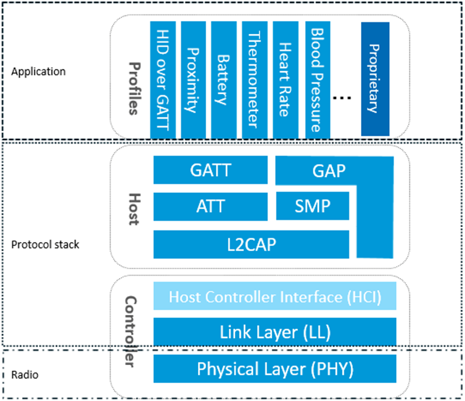
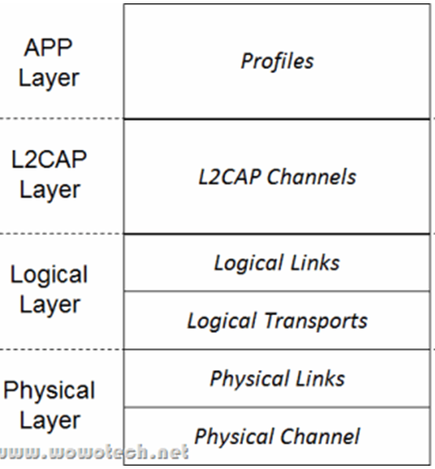

### 蓝牙基础知识

&emsp;&emsp;蓝牙是一种无线的、短距离的通信技术。其工作在`2.4 GHz ISM`频段，其主要特点如下：<!--more-->

- 高稳定性、低功耗和价格低廉。
- 支持点对点或者点对多点通信。

&emsp;&emsp;蓝牙技术分为以下`3`种：

- `Basic Rate`(`BR`)：数据传输速率为`721.2 kb/s`。
- `Enhanced Data Rate`(`EDR`)：数据传输速率为`2.1 Mb/s`。
- `Bluetooth Low Energy`(`BLE`)：更低的复杂度，更低的功耗。

&emsp;&emsp;`Basic Rate`与`Enhanced Data Rate`之间是可以互通的，但`Basic Rate`和`Low Energy`是不能互通的，虽然它们都包含搜索管理(`Discovery`)、连接管理(`Connection`)等机制。

### 核心系统架构

#### 蓝牙的核心系统架构

&emsp;&emsp;蓝牙的核心系统架构如下图所示，图中的`Application`、`Host`、`Controller`等组成部分都是指逻辑实体。所谓的逻辑实体，它不同于物理实体，例如在做电路设计时，一个蓝牙芯片或主控`CPU`就是指物理实体。而蓝牙协议所描述的这些逻辑实体不一定会和物理实体一一对应，例如`Application`和`Host`可能会位于同一个物理实体中(主控`CPU`)，而`Controller`单独位于另一个物理实体中(蓝牙芯片)。

&emsp;&emsp;蓝牙协议规定了两个层次的协议，分别为`蓝牙核心协议`(`Bluetooth Core`)和`蓝牙应用层协议`(`Bluetooth Application`)。

- `Bluetooth Core`关注对蓝牙核心技术的描述和规范，它只提供基础的机制，并不关心如何使用这些机制。
- `Bluetooth Application`是在`Bluetooth Core`的基础上，根据具体的应用需求，定义出各种各样的策略，例如`FTP`、文件传输、局域网等。

#### Host和Controller

&emsp;&emsp;`Bluetooth Core`由两部分组成，即`Host`和`Controller`。在一个`BLE`中，`Host`只能有一个，但是`Controller`可以有多个。

- `Controller`：定义`RF`、`Baseband`等偏硬件的规范，并在此之上抽象出用于通信的逻辑链路(`Logical Link`)。
- `Host`：在`Logical Link`的基础上，进行更为友好的封装，这样就可以屏蔽掉蓝牙技术的细节，让`Bluetooth Application`的使用更为方便。

&emsp;&emsp;`Controller`包括物理层`PHY`(`Physical Layer`)、链路层`LL`(`Linker Layer`)、直接测试模式`DTM`(`Direct Test Mode`)。实现射频相关的模拟和数字部分，完成最基本的数据发送和接收。`Controller`对外接口是天线，对内接口是主机控制器接口`HCI`(`Host Controller Interface`)。

&emsp;&emsp;`Host`主机协议层包括：

- 逻辑连接控制和适配层(`L2CAP`)：提供数据封装服务。
- 属性协议层(`ATT`)：定义`BLE`协议栈上层的数据结构，这是一种`Protocol`。
- 通用属性配置层(`GATT`)：提供通用的信息存储和共享等功能，这是一种`Profile Framework`。
- 通用访问文件配置层(`GAP`)：负责指定设备工作的角色。
- 安全协议层(`SMP`)：负责指定安全连接。

### 蓝牙协议架构

&emsp;&emsp;蓝牙协议是通信协议的一种，为了把复杂问题简单化，任何通信协议都具有层次性，特点如下：

- 从下到上分层，通过层层封装，每一层只需要关心特定的、独立的功能，易于实现和维护。
- 在通信实体内部，下层向上层提供服务，上层是下层的用户。

&emsp;&emsp;蓝牙协议也不例外，其协议层次如下图所示：

- 物理层(`Physical Layer`)：负责提供数据传输的物理通道(通常称为`信道`)。通常情况下，一个通信系统中存在几种不同类型的信道，例如控制信道、数据信道、语音信道等。
- 逻辑层(`Logical Layer`)：在物理层的基础上，提供两个或多个设备之间、和物理无关的逻辑传输通道(也称作`逻辑链路`)。
- `L2CAP`层(`L2CAP Layer`)：`L2CAP`层负责管理逻辑层提供的逻辑链路。基于该协议，不同`Application`可共享同一个逻辑链路，类似于`TCP/IP`协议中端口(`Port`)的概念。
- `APP`层(`APP Layer`)：蓝牙协议中的应用层，基于`L2CAP`提供的`Channel`，实现各种各样的应用功能。