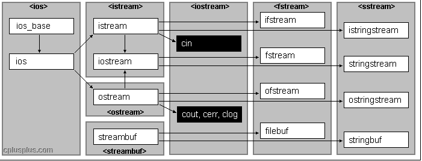

&emsp;&emsp;`C++`对于文件操作的头文件，主要有以下`3`类：<!--more-->

- `ofstream`：文件写操作，内存写入存储设备。
- `ifstream`：文件读操作，存储设备读区到内存中。
- `fstream`：读写操作，对打开的文件可进行读写操作。



### 打开文件

&emsp;&emsp;在`fstream`类中，成员函数`open`函数实现打开文件的操作，从而将数据流和文件进行关联，通过`ofstream`、`ifstream`、`fstream`对象进行对文件的读写操作。

``` cpp
void open (
    const char *filename,
    ios_base::openmode mode = ios_base::in | ios_base::out );
void open (
    const wchar_t *_Filename,
    ios_base::openmode mode = ios_base::in | ios_base::out,
    int prot = ios_base::_Openprot );
```

参数`filename`是操作文件名，`mode`是打开文件的方式，`prot`是打开文件的属性。打开文件的方式在`ios`类(所有流式`I/O`的基类)中定义，有如下几种方式：

方式          | 说明
--------------|-------
`ios::in`     | 为输入(读)而打开文件
`ios::out`    | 为输出(写)而打开文件
`ios::ate`    | 初始位置为文件尾
`ios::app`    | 所有输出附加在文件末尾
`ios::trunc`  | 如果文件已存在，则先删除该文件
`ios::binary` | 二进制方式

这些方式是能够进行组合使用的，以`或`运算(`|`)的方式：

``` cpp
ofstream out;
out.open ( "Hello.txt", ios::in | ios::out | ios::binary );
```

打开文件的属性同样在`ios`类中也有定义：

属性 | 说明
-----|----
`0`  | 普通文件
`1`  | 只读文件
`2`  | 隐含文件
`4`  | 系统文件

对于文件的属性，也可以使用`或`运算和`+`进行组合。
&emsp;&emsp;很多程序中，可能会碰到`ofstream out("Hello.txt")`、`ifstream in("...")`、`fstream foi("...")`这样的的使用，并没有显式的去调用`open`函数就进行文件的操作，直接调用了其默认的打开方式。这是因为在`stream`类的构造函数中调用了`open`函数，并拥有同样的构造函数，所以在这里可以直接使用流对象进行文件的操作，默认方式如下：

``` cpp
ofstream out ( "...", ios::out );
ifstream in ( "...", ios::in );
fstream foi ( "...", ios::in | ios::out );
```

当使用默认方式进行对文件的操作时，你可以使用成员函数`is_open`对文件是否打开进行验证。

### 关闭文件

&emsp;&emsp;当文件读写操作完成之后，我们必须将文件关闭以使文件重新变为可访问的。成员函数`close`负责将缓存中的数据排放出来并关闭文件。这个函数一旦被调用，原先的流对象就可以被用来打开其它的文件，这个文件也就可以重新被其它的进程所访问。为防止流对象被销毁时还联系着打开的文件，析构函数将会自动调用关闭函数`close`。

### 文本文件的读写

&emsp;&emsp;类`ofstream`、`ifstream`和`fstream`是分别从`ostream`、`istream`和`iostream`中引申而来的。这就是为什么`fstream`的对象可以使用其父类的成员来访问数据。一般来说，我们将使用这些类与同控制台(`console`)交互同样的成员函数(`cin`和`cout`)来进行输入输出：

``` cpp
#include <iostream>
#include <fstream>
​
using namespace std;
​
int main () {
    ofstream out ( "out.txt" );
​
    if ( out.is_open() ) {
        out << "This is a line.\n";
        out << "This is another line.\n";
        out.close();
    }
​
    return 0;
}
```

执行结果是在`out.txt`中写入：

``` cpp
This is a line.
This is another line
```

从文件中读入数据也可以用与`cin >>`同样的方法：

``` cpp
#include <iostream>
#include <fstream>
#include <stdlib.h>
​
using namespace std;
​
int main () {
    char buffer[256];
    ifstream in ( "out.txt" );
​
    if ( ! in.is_open() ) {
        cout << "Error opening file";
        exit ( 1 );
    }
​
    while ( !in.eof() ) {
        in.getline ( buffer, 100 );
        cout << buffer << endl;
    }
​
    return 0;
}
```

上面的例子读入一个文本文件的内容，然后将它打印到屏幕上。注意我们使用了一个新的成员函数叫做`eof`，它是`ifstream`从类`ios`中继承过来的，当到达文件末尾时返回`true`。

### 状态标志符的验证(Verification of state flags)

&emsp;&emsp;除了`eof`以外，还有一些验证流的状态的成员函数(所有都返回`bool`型返回值)：

- `bad`：如果在读写过程中出错，返回`true`。例如，当我们要对一个不是打开为写状态的文件进行写入时，或者我们要写入的设备没有剩余空间的时候。
- `fail`：除了与`bad`同样的情况下会返回`true`以外，当格式错误时也返回`true`。例如当想要读入一个整数，而获得了一个字母的时候。
- `eof`：如果读文件到达文件末尾，返回`true`。
- `good`：如果调用以上任何一个函数返回`true`的话，此函数返回`false`。

要想重置以上成员函数所检查的状态标志，你可以使用成员函数`clear`，没有参数。

### 获得和设置流指针(get and put stream pointers)

&emsp;&emsp;所有输入输出流对象(`I/O streams objects`)都有至少一个流指针：

- `ifstream`：类似`istream`，有一个指针`get pointer`，指向下一个将被读取的元素。
- `ofstream`：类似`ostream`，有一个指针`put pointer`，指向写入下一个元素的位置。
- `fstream`：类似`iostream`，同时继承了`get`和`put`。

我们可以通过使用以下成员函数来读出或配置这些指向流中读写位置的流指针：

- `tellg`和`tellp`：这两个成员函数不用传入参数，返回`pos_type`类型的值，就是一个整数，代表当前`get`流指针的位置(用`tellg`)或`put`流指针的位置(用`tellp`)。
- `seekg`和`seekp`：这对函数分别用来改变流指针`get`和`put`的位置。两个函数都被重载为两种不同的原型：

``` cpp
seekg ( pos_type position );
seekp ( pos_type position );
```

上述函数可以使流指针被改变为指向从文件开始计算的一个绝对位置。要求传入的参数类型与函数`tellg`和`tellp`的返回值类型相同。

``` cpp
seekg ( off_type offset, seekdir direction );
seekp ( off_type offset, seekdir direction );
```

上述函数可以指定由参数`direction`决定的一个具体的指针开始计算的一个位移(`offset`)。它们可以是：

direction  | 说明
-----------|-----
`ios::beg` | 从流开始位置计算的位移
`ios::cur` | 从流指针当前位置开始计算的位移
`ios::end` | 从流末尾处开始计算的位移

&emsp;&emsp;流指针`get`和`put`的值对文本文件(`text file`)和二进制文件(`binary file`)的计算方法都是不同的，因为文本模式的文件中某些特殊字符可能被修改。由于这个原因，建议对以文本文件模式打开的文件总是使用`seekg`和`seekp`的第一种原型，而且不要对`tellg`或`tellp`的返回值进行修改。对二进制文件，你可以任意使用这些函数，应该不会有任何意外的行为产生。
&emsp;&emsp;以下例子使用这些函数来获得一个二进制文件的大小：

``` cpp
#include <iostream>
#include <fstream>
​
const char *filename = "out.txt";
​
int main () {
    long l, m;
    ifstream in ( filename, ios::in | ios::binary );
    l = in.tellg();
    in.seekg ( 0, ios::end );
    m = in.tellg();
    in.close();
    cout << "size of " << filename;
    cout << " is " << ( m - l ) << " bytes.\n";
    return 0;
}
```

执行结果：

``` cpp
size of out.txt is 40 bytes.
```

### 二进制文件

&emsp;&emsp;在二进制文件中，使用`<<`和`>>`，以及`getline`等函数来操作符输入和输出数据，没有什么实际意义，虽然它们是符合语法的。
&emsp;&emsp;文件流包括两个为顺序读写数据特殊设计的成员函数：`write`和`read`。`write`是`ostream`的一个成员函数，都是被`ofstream`所继承；而`read`是`istream`的一个成员函数，被`ifstream`所继承。类`fstream`的对象同时拥有这两个函数。它们的原型是：

``` cpp
write ( char *buffer, streamsize size );
read ( char *buffer, streamsize size );
```

`buffer`是一块内存的地址，用来存储或读出数据。参数`size`是一个整数值，表示要从缓存(`buffer`)中读出或写入的字符数。

``` cpp
#include <iostream>
#include <fstream>
​
using namespace std;
​
const char *filename = "out.txt";
​
int main () {
    char *buffer;
    long size;
    ifstream in ( filename, ios::in | ios::binary | ios::ate );
    size = in.tellg();
    in.seekg ( 0, ios::beg );
    buffer = new char [size];
    in.read ( buffer, size );
    in.close();
    cout << "the complete file is in a buffer";
    delete[] buffer;
    return 0;
}
```

执行结果：

``` cpp
The complete file is in a buffer
```

### 缓存和同步(Buffers and Synchronization)

&emsp;&emsp;当我们对文件流进行操作的时候，它们与一个`streambuf`类型的缓存(`buffer`)联系在一起。这个缓存实际是一块内存空间，作为流(`stream`)和物理文件的媒介。例如，对于一个输出流，每次成员函数`put`(写一个单个字符)被调用，这个字符不是直接被写入该输出流所对应的物理文件中的，而是首先被插入到该流的缓存中。当缓存被排放出来(`flush`)时，它里面的所有数据或者被写入物理媒质中(如果是一个输出流的话)，或者简单的被抹掉(如果是一个输入流的话)。这个过程称为同步(`synchronization`)，它会在以下任一情况下发生：

- 当文件被关闭时：在文件被关闭之前，所有还没有被完全写出或读取的缓存都将被同步。
- 当缓存`buffer`满时：缓存`Buffers`有一定的空间限制。当缓存满时，它会被自动同步。
- 控制符明确指明：当遇到流中某些特定的控制符时，同步会发生。这些控制符包括`flush`和`endl`。
- 明确调用函数`sync`：调用成员函数`sync`(无参数)可以引发立即同步。这个函数返回一个`int`值，等于`-1`表示流没有联系的缓存或操作失败。

---

### C++对二进制文件的读写操作

&emsp;&emsp;二进制文件不是以`ASCII`代码存放数据的，它将内存中数据存储形式不加转换地传送到磁盘文件，因此它又称为内存数据的映像文件。因为文件中的信息不是字符数据，而是字节中的二进制形式的信息，因此它又称为字节文件。
&emsp;&emsp;对二进制文件的操作也需要先打开文件，用完后要关闭文件。在打开时要用`ios::binary`指定为以二进制形式传送和存储。二进制文件除了可以作为输入文件或输出文件外，还可以是既能输入又能输出的文件，这是和`ASCII`文件不同的地方。
&emsp;&emsp;对二进制文件的读写主要用`istream`类的成员函数`read`和`write`来实现：

``` cpp
istream & read ( char *buffer, int len );
ostream & write ( const char *buffer, int len );
```

字符指针`buffer`指向内存中一段存储空间，`len`是读写的字节数。调用的方式为：

``` cpp
a.write ( p1, 50 );
b.read ( p2, 30 );
```

上面第一行中的`a`是输出文件流对象，`write`函数将字符指针`p1`所给出的地址开始的`50`个字节的内容不加转换地写到磁盘文件中。在第二行中，`b`是输入文件流对象，`read`函数从`b`所关联的磁盘文件中，读入`30`个字节(或遇`EOF`结束)，存放在字符指针`p2`所指的一段空间内。
&emsp;&emsp;将一批数据以二进制形式存放在磁盘文件中：

``` cpp
#include <fstream>
#include <iostream>
​
using namespace std;
​
struct student {
    char name[20];
    int num;
    int age;
    char sex;
};
​
int main() {
    student stud[3] = {"Li", 1001, 18, 'f', "Fun", 1002, 19, 'm', "Wang", 1004, 17, 'f'};
    ofstream outfile ( "stud.dat", ios::out | ios::binary );
​
    if ( !outfile ) {
        cerr << "open error!" << endl;
        return 1;
    }
​
    for ( int i = 0; i < 3; i++ ) {
        outfile.write ( ( char * ) &stud[i], sizeof ( stud[i] ) );
    }
​
    outfile.close();
    return 0;
}
```

用成员函数`write`向`stud.dat`输出数据，从`write`的函数原型可以看出，第`1`个形参是指向`char`型常变量的指针变量`buffer`，之所以用`const`声明，是因为不允许通过指针改变其指向数据的值。现在要将结构体数组的一个元素(包含`4`个成员)一次输出到磁盘文件`stud.dat`。`&stud[i]`是结构体数组第`i`个元素的首地址，但这是指向结构体的指针，与形参类型不匹配，因此要用`char *`把它强制转换为字符指针。第`2`个参数是指定一次输出的字节数，`sizeof (stud[i])`的值是结构体数组的一个元素的字节数。调用一次`write`函数，就将从`&stud[i]`开始的结构体数组的一个元素输出到磁盘文件中，执行`3`次循环输出结构体数组的`3`个元素。
&emsp;&emsp;其实可以一次输出结构体数组的所有元素，将`for`循环代码改为以下：

``` cpp
outfile.write ( ( char * ) &stud[0], sizeof ( stud ) );
```

执行一次`write`函数即输出了结构体数组的全部数据。
&emsp;&emsp;将刚才以二进制形式存放在磁盘文件中的数据读入内存并在显示器上显示：

``` cpp
#include <fstream>
#include <iostream>
​
using namespace std;
​
struct student {
    char name[20];
    int num;
    int age;
    char sex;
};
​
int main() {
    student stud[3];
    int i;
    ifstream infile ( "stud.dat", ios::in | ios::binary );
​
    if ( !infile ) {
        cerr << "open error!" << endl;
        return 1;
    }
​
    for ( i = 0; i < 3; i++ ) {
        infile.read ( ( char * ) &stud[i], sizeof ( stud[i] ) );
    }
​
    infile.close();
​
    for ( i = 0; i < 3; i++ ) {
        cout << "NO." << i + 1 << endl;
        cout << "name:" << stud[i].name << endl;
        cout << "num:" << stud[i].num << endl;
        cout << "age:" << stud[i].age << endl;
        cout << "sex:" << stud[i].sex << endl << endl;
    }
​
    return 0;
}
```

执行结果：

``` cpp
NO.1
name: Li
num: 1001
age: 18
sex: f

NO.2
name: Fun
num: 1001
age: 19
sex: m

NO.3
name: Wang
num: 1004
age: 17
sex: f
```

能否一次读入文件中的全部数据：

``` cpp
infile.read ( ( char * ) &stud[0], sizeof ( stud ) );
```

答案是可以的，将指定数目的字节读入内存，依次存放在以地址`&stud[0]`开始的存储空间中。要注意读入的数据的格式要与存放它的空间的格式匹配。由于磁盘文件中的数据是从内存中结构体数组元素得来的，因此它仍然保留结构体元素的数据格式。现在再读入内存，存放在同样的结构体数组中，这必然是匹配的。如果把它放到一个整型数组中，就不匹配了，会出错。
&emsp;&emsp;在磁盘文件中有一个文件指针，用来指明当前应进行读写的位置。在输入时，每读入一个宇节，指针就向后移动一个字节；在输出时，每向文件输出一个字节，指针就向后移动一个字节，随着输出文件中字节不断增加，指针不断后移。对于二进制文件，允许对指针进行控制，使它按用户的意图移动到所需的位置，以便在该位置上进行读写。注意，在移动文件读写位置时，必须保证移动后的文件读写值大于等于`0`，并且小于等于文件尾字节编号。
&emsp;&emsp;文件流提供一些有关文件指针的成员函数，为了查阅方便，将它们归纳为下表，并作必要的说明。

成员函数                  | 作用
-------------------------|----
`gcount`                 | 返回最后一次输入所读入的字节数
`tellg`                  | 返回输入文件指针的当前位置
`seekg(文件中的位置)`     | 将输入文件中指针移到指定的位置
`seekg(位移量, 参照位置)` | 以参照位置为基础移动若干字节
`tellp`                  | 返回输出文件指针当前的位置
`seekp(文件中的位置)`     | 将输出文件中指针移到指定的位置
`seekp(位移量, 参照位置)` | 以参照位置为基础移动若干字节

&emsp;&emsp;在这里做如下几点说明：
&emsp;&emsp;1. 这些函数名的第一个字母或最后一个字母不是`g`就是`p`。带`g`的是用于输入的函数(`g`是`get`的第一个字母，以`g`作为输入的标识，容易理解和记忆)，带`p`的是用于输出的函数(`p`是`put`的第一个字母，以`p`作为输出的标识)。例如有两个`tell`函数，`tellg`用于输入文件，`tellp`用于输出文件。同样，`seekg`用于输入文件，`seekp`用于输出文件。如果是既可输入又可输出的文件，则任意用`seekg`或`seekp`。
&emsp;&emsp;2. 函数参数中的`文件中的位置`和`位移量`已被指定为`long`型整数，以字节为单位。`参照位置`可以是下面三者之一：

- `ios::beg`：文件开头(`beg`是`begin`的缩写)，这是默认值。
- `ios::cur`：指针当前的位置(`cur`是`current`的缩写)。
- `ios::end`：文件末尾。

它们是在`ios`类中定义的枚举常量。

``` cpp
infile.seekg ( 100 ); /* 输入文件中的指针从文件头后移到100字节位置 */
infile.seekg ( 50, ios::cur ); /* 输入文件中的指针从当前位置后移50字节 */
outfile.seekp ( -75, ios::end ); /* 输出文件中的指针从文件尾前移75字节 */
```

&emsp;&emsp;一般情况下，读写是顺序进行的，即逐个字节进行读写。但是对于二进制数据文件来说，可以利用上面的成员函数移动指针，随机地访问文件中任一位置上的数据，还可以修改文件中的内容。
&emsp;&emsp;例如有一个学生数据，要求如下所示：把它们存到磁盘文件中；将磁盘文件中的第`1`、`3`、`5`个学生数据读入程序，并显示出来；将第`3`个学生的数据修改后存回磁盘文件中的原有位置；从磁盘文件读入修改后的各个学生的数据并显示出来：

``` cpp
#include <fstream>
#include <iostream>
#include <cstring>
​
using namespace std;
​
struct student {
    int num;
    char name[20];
    float score;
};
​
int main() {
    student stud[5] = {
        1001, "Li", 85,
        1002, "Fun", 97.5,
        1004, "Wang", 54,
        1006, "Tan", 76.5,
        1010, "ling", 96
    };

    /* 用fstream类定义输入输出二进制文件流对象iofile */
    fstream iofile ( "stud.dat", ios::in | ios::out | ios::binary );
​
    if ( !iofile ) {
        cerr << "open error!" << endl;
        abort();
    }
​
    for ( int i = 0; i < 5; i++ ) { /* 向磁盘文件输出个学生的数据 */
        iofile.write ( ( char * ) &stud[i], sizeof ( stud[i] ) );
    }
​
    student stud1[5]; /* 用来存放从磁盘文件读入的数据 */
​
    for ( int i = 0; i < 5; i = i + 2 ) {
        iofile.seekg ( i * sizeof ( stud[i] ), ios::beg ); /* 定位于第0、2、4学生数据开头 */
        /* 先后读入个学生的数据，存放在stud1[0]、stud[1]和stud[2]中 */
        iofile.read ( ( char * ) &stud1[i / 2], sizeof ( stud1[0] ) );
        /* 输出stud1[0]、stud[1]和stud[2]各成员的值 */
        cout << stud1[i / 2].num << " " << stud1[i / 2].name << " " << stud1[i / 2].score << endl;
    }
​
    cout << endl;
    stud[2].num = 1012; /* 修改第个学生(序号为2)的数据 */
    strcpy ( stud[2].name, "Wu" );
    stud[2].score = 60;
    iofile.seekp ( 2 * sizeof ( stud[0] ), ios::beg ); /* 定位于第2个学生数据的开头 */
    iofile.write ( ( char * ) &stud[2], sizeof ( stud[2] ) ); /* 更新第个学生数据 */
    iofile.seekg ( 0, ios::beg ); /* 重新定位于文件开头 */
​
    for ( int i = 0; i < 5; i++ ) {
        iofile.read ( ( char * ) &stud[i], sizeof ( stud[i] ) ); /* 读入5个学生的数据 */
        cout << stud[i].num << " " << stud[i].name << " " << stud[i].score << endl;
    }
​
    iofile.close();
    return 0;
}
```

执行结果：

``` cpp
1001 Li 85
1004 Wang 54
1010 ling 96

1001 Li 85
1002 Fun 97.5
1012 Wu 60
1006 Tan 76.5
1010 ling 96
```

&emsp;&emsp;本程序也可以将磁盘文件`stud.dat`先后定义为输出文件和输入文件，在结束第一次的输出之后关闭该文件，然后再按输入方式打开它，输入完后再关闭它，然后再按输出方式打开，再关闭文件，显然这是很烦琐的。在程序中把它指定为输入输出型的二进制文件，这样不仅可以向文件添加新的数据或读入数据，还可以修改(更新)数据。利用这些功能，可以实现比较复杂的输入输出任务。
&emsp;&emsp;请注意，不能用`ifstream`或`ofstream`类定义输入输出的二进制文件流对象，而应当用`fstream`类。