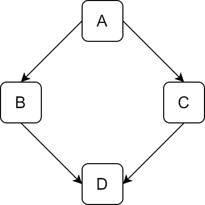

### 菱形继承

&emsp;&emsp;多继承时很容易产生命名冲突，例如菱形继承：<!--more-->



&emsp;&emsp;类`A`派生出类`B`和类`C`，类`D`继承自类`B`和类`C`，这个时候类`A`中的成员变量和成员函数继承到类`D`中变成了`2`份：

1. 一份来自`A --> B --> D`这条路径。
2. 另一份来自`A --> C --> D`这条路径。

&emsp;&emsp;假如类`A`有一个成员变量`a`，那么在类`D`中直接访问`a`就会产生歧义，编译器不知道它究竟来自`A --> B --> D`，还是来自`A --> C --> D`。

### 虚继承

&emsp;&emsp;为了解决多继承时的命名冲突和冗余数据问题，`C++`提出了虚继承，使得在派生类中只保留一份间接基类的成员：

``` cpp
#include <iostream>

using namespace std;

class B0 { /* 间接基类 */
    int nv;

  public:
    B0 ( int n ) {
        nv = n;
        cout << "Member of B0" << endl;
    }

    void fun() {
        cout << "fun of B0" << endl;
    }
};

class B1 : virtual public B0 {
    int nv1;

  public:
    B1 ( int a ) : B0 ( a ) {
        cout << "Member of B1" << endl;
    }
};

class B2 : virtual public B0 {
    int nv2;

  public:
    B2 ( int a ) : B0 ( a ) {
        cout << "Member of B2" << endl;
    }
};

class D1 : public B1, public B2 {
    int nvd;

  public:
    D1 ( int a ) : B0 ( a ), B1 ( a ), B2 ( a ) {
        cout << "Member of D1" << endl;
    }

    void fund() {
        cout << "fun of D1" << endl;
    }
};

int main ( void ) {
    D1 d1 ( 1 );
    d1.fund();
    d1.fun();
    return 0;
}
```

执行结果：

``` cpp
Member of B0
Member of B1
Member of B2
Member of D1
fun of D1
fun of B0
```