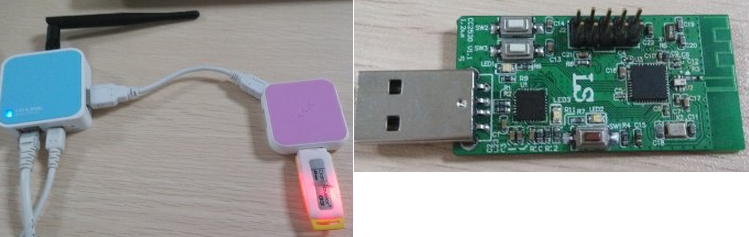

&emsp;&emsp;`OpenWrt`是一个功能强大的开源路由器`linux`系统，用户可以很方便地对其进行定制和优化。`6Lowpan`是当前无线传感器网络研究的热门领域，通过对`IPv6`数据包头进行压缩、解压缩，以及在`IP`层从添加适用于无线自组网的路由协议`RPL`，实现了在无线传感器网络中也能直接使用`IPv6`协议。<!--more-->
&emsp;&emsp;目前支持`6Lowpan`协议的开源系统有`Contiki`和`Tinyos`，本文使用的是`Contki`。边缘路由器是指将局域网汇接到广域互联网的一种路由设备。本文实现了将运行`OpenWrt`系统的路由器增加对`6Lowpan`的支持，使其成为`6Lowpan`网络的边缘路由器，最终实现传感器网络节点能够直接访问`IPv6`互联网。
&emsp;&emsp;硬件使用的是`TP-link`的路由器，具体型号为`703N`。黑色天线是后来`DIY`上去的，硬件也改为`8M`的`FLASH`和`64M`的`RAM`。由于需要安装`Python`，`8M`的`FLASH`还是不够，因此通过`USB-Hub`连接了一个`U`盘，把需要安装的软件都装在`U`盘上。运行`Contiki`系统的`USB`小板如下，这个小板上面的两个芯片分别是`CC2530`无线单片机、型号为`CP210x`的`USB`转串口芯片。



&emsp;&emsp;移植`contiki`内核完成后，还要添加`border-router.c`和`slip-bridge.c`文件，为当前工程添加边缘路由器功能。该节点将成为`6Lowpan`网络中的根节点，接管其他所有无线传感器网络中向外部发送的`IP`数据包，并通过串口方式传递给边缘路由器。将程序烧写至`USB`小板，然后将其连接至电脑`USB`口，并打开串口调试助手。此时应该可以看到节点开始不停地打印`?P`，用来向边缘路由器请求网络地址的前缀信息。
&emsp;&emsp;先将路由器连接上网络，把`USB`无线小板也连接到路由器上。通过`ssh`登录到路由，使用`opkg`安装所需的软件包：

``` cpp
opkg update
opkg install kmod-usb-serial-cp210x kmod-ipv6 kmod-tun tunslip6
```

安装完毕后，应该就能在`/dev/`目录下看到`ttyUSB0`这个设备，说明`USB`小板已经成功被系统识别为串口了。
&emsp;&emsp;`tunslip6`程序就是用来打通`6Lowpan`无线传感器网络与真实广域网的桥梁。在运行时，该程序创建一个虚拟网卡`tun0`，并打开串口利用`slip`协议与`USB`小板通信。`tunslip6`做的事情实际上很简单，即`tun0 ip packet <--> serial data packet`，把从根节点发过来的数据包进行解包，写入到`tun`网卡。如果`tun`网卡接收到了外界的数据包，则把该数据包发送到串口上。在`shell`上运行如下命令：

``` bash
tunslip6 aaaa::1/64 -s /dev/ttyUSB0 -B 57600
```

该命令为虚拟网口指定网络前缀、相关设备以及串口波特率。成功运行后，`USB`小板会自动被分配到`aaaa::/64`的网络地址前缀，根据`64`位`mac`地址形成小板的全球唯一的`128`位`IPv6`地址。此时`shell`被`tunslip6`占用了，不能继续输入。打开另一个终端，输入`ifconfig`，查看`tun`网卡是否成功生成：

``` bash
tun0 Link encap:UNSPEC HWaddr 00-00-00-00-00-00-00-00-00-00-00-00-00-00-00-00
inet6 addr: aaaa::1/64 Scope:Global
UP POINTOPOINT RUNNING NOARP MULTICAST MTU:1500 Metric:1
RX packets:0 errors:0 dropped:0 overruns:0 frame:0
TX packets:2 errors:0 dropped:0 overruns:0 carrier:0
collisions:0 txqueuelen:500
RX bytes:0 (0.0 B) TX bytes:152 (152.0 B)
```

由于小板的`mac`地址固化成`0x0000000000000001`，结合刚才已经设置的`aaaa::/64`前缀，则小板的`IPv6`地址应该是`aaaa::200:0:0:1`，然后对小板进行`ping`测试。
&emsp;&emsp;最后一个问题，无线网里的设备怎么访问外部的`ipv6`网络？要让无线节点也能直接访问互联网，其实仅仅按照前面的方法搭建起边缘路由器是不够的，有细心的读者会发现我设置`tunslip6`的时候用的前缀是`aaaa::`，其实这个前缀是随便填的，因为我这里的网络没有`ipv6`的环境，无法在路由上获得`ipv6`地址。如果有`ipv6`网络支持，并且通过网络管理员获得了一个全球唯一可识别的地址前缀，那么把这个前缀设置给`tunslip6`，应该就可以使无线传感网的节点具有获得访问互联网的能力。

---

### 通过OpenWrt路由器访问6LowPAN网络

&emsp;&emsp;现在假设你已经有一个安装好`OpenWrt`并且带有`USB`口的无线路由器，那么就把你电脑的网口和路由器的`LAN`相连，`border router`节点和路由器的`USB`口相连。
&emsp;&emsp;1. 把你电脑的以太网`IP`地址设置成`192.168.1.100`(主要在`192.168.1`这个网段即可)，不要设默认网关，这样做的好处是如果你用的是笔记本的话，你依然可以通过`wifi`连上`Internet`。
&emsp;&emsp;2. 使用`putty`登录到`Openwrt`路由器，其地址是`192.168.1.1`，默认用户名是`root`，密码是`admin`，并确认安装了以下软件包：

- `kmod-ipv6`
- `kmod-slip`
- `kmod-tun`
- `kmod-usb-core`
- `kmod-usb-serial-cp210x` (根据边界路由器使用的芯片进行选择)
- `kmod-usb-serial`
- `kmod-usb2`
- `libusb`
- `radvd`
- `tunslip6`

&emsp;&emsp;3. 配置`lan`口`IPv6`地址，该地址和后面`radvd`的配置有关，这里用的是`2001:1::1/64`。输入`vi /etc/config/network`修改`network`的配置文件，只需要找到`lan`那部分，并添加`IPv6`地址即可：

``` makefile
config interface        'lan'
    option type         'bridge'
    option ifname       'eth1.0'
    option proto        'static'
    option ipaddr       '192.168.1.1'
    option netmask      '255.255.255.0'
    option nat          '1'
    option defaultroute '0'
    option peerdns      '0'
    option ip6addr      '2001:1::1/64'
```

除了最后一句外，其它配置不要改动，否则会导致`OpenWrt`路由器无法访问。配置保存后，需要通过`/etc/init.d/network restart`指令来使配置生效。
&emsp;&emsp;4. 启动`slip`服务。首先通过`ls /dev/ttyU*`来确认一下`border router`节点的端口号，一般是`/dev/ttyUSB0`。然后通过下面的语句启动`tunslip6`程序，该程序会把`border router`节点虚拟成`tun0`网卡：

``` bash
tunslip6 aaaa::1/64 -B 38400 -s /dev/ttyUSB0
```

&emsp;&emsp;5. 配置`radvd`服务。`Radvd`是`ipv6`中的路由宣告服务，只有它工作正常了，才能让电脑知道怎么去访问`Contiki`节点，否则电脑没有去节点的路由。这时需要使用`putty`打开另外一个控制台，登陆后输入`vi /etc/config/radvd`进行编辑。修改后的文件内容如下，这里的`2001:1::/64`要与前面配置的`lan`口地址相对应：

``` makefile
config interface
    option interface          'tun0'
    option ignore             0
    option AdvSendAdvert      1
    option AdvLinkMTU         1280
    option AdvCurHopLimit     128
    option AdvReachableTime   360000
    option MinRtrAdvInterval  100
    option MaxRtrAdvInterval  150
    option AdvDefaultLifetime 200

config prefix
    option interface            'tun0'
    list prefix                 'aaaa::/64'
    option AdvOnLink            1
    option AdvAutonomous        1
    option AdvPreferredLifetime 4294967295
    option AdvValidLifetime     4294967295
    option ignore               0

config rdnss
    option interface 'tun0'
    list   addr      ''
    option ignore    1

config interface
    option interface            'lan'
    option AdvSendAdvert        1
    option AdvManagedFlag       0
    option AdvOtherConfigFlag   0
    option ignore               0
    option MinRtrAdvInterval    5
    option MaxRtrAdvInterval    10
    option AdvDefaultPreference low

config prefix
    option interface     'lan'
    option prefix        '2001:1::/64'
    option AdvOnLink     1
    option AdvAutonomous 1
    option AdvRouterAddr 1
    option ignore        0

config route
    option interface 'lan'
    list prefix      ''
    option ignore    1

config dnssl
    option interface 'lan'
    list suffix      ''
    option ignore    1
```

配置保存后，需要使用`/etc/init.d/radvd restart`来使配置生效。如果没有问题的话，此时你的电脑应该可以`ping`通地址`aaaa::1`了，当然也能`ping`通其它`6Lowpan`节点。