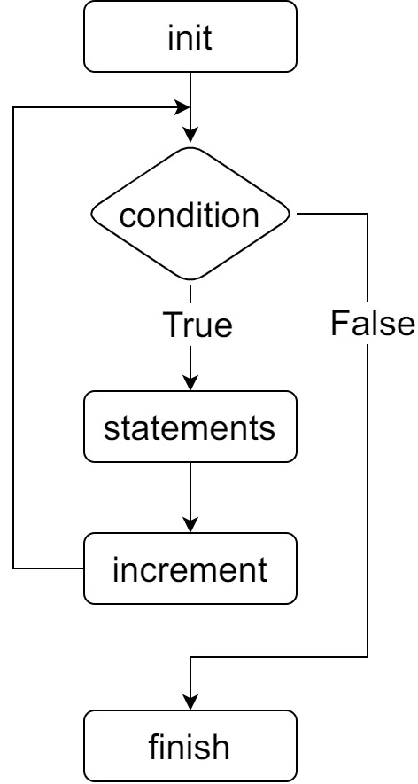

### while循环

&emsp;&emsp;只要给定的条件为`真`，`C`语言中的`while`循环语句将会重复执行：<!--more-->

``` cpp
while ( condition ) {
    statement;
}
```

- `statement`可以是一个单独的语句，也可以是几个语句组成的代码块。
- `condition`可以是任意的表达式：

1. 当`condition`为`true`时，执行循环中的`statement`。
2. 当`condition`为`false`时，退出循环，程序流将执行紧接着该循环的下一条语句。

### for循环

&emsp;&emsp;`for`循环允许你编写一个执行指定次数的循环控制结构：

``` cpp
for ( init; condition; increment ) {
    statements;
}
```

&emsp;&emsp;下面是`for`循环的控制流：



### do-while循环

&emsp;&emsp;不像`for`和`while`循环，它们是在循环头部测试循环条件。在`C`语言中，`do-while`是在循环的尾部检查它的条件。
&emsp;&emsp;`do-while`循环与`while`循环类似，但是`do-while`会确保至少执行一次循环。

``` cpp
do {
    statements;
} while ( condition );
```

### 嵌套循环

&emsp;&emsp;`C`语言允许在一个循环内使用另一个循环：

``` cpp
for ( initialization; condition; increment ) {
    statements;

    for ( initialization; condition; increment ) {
        statements;
    }
}
```

### break语句

&emsp;&emsp;`C`语言中`break`语句有以下`2`种用法：

- 终止循环，程序流将继续执行紧接着该循环的下一条语句。
- 终止`switch`语句中的一个`case`。

&emsp;&emsp;如果使用的是嵌套循环，`break`语句会停止执行该层的循环，然后开始执行该层循环之后的下一行代码。

### continue语句

&emsp;&emsp;`C`语言中的`continue`语句类似于`break`语句，但它不是强制终止。`continue`会跳过当前循环中的代码，强制开始下一次循环。

- 对于`while`和`do-while`循环，`continue`语句重新执行条件判断语句。
- 对于`for`循环，`continue`语句执行后，`increment`语句仍然会执行。

``` cpp
continue;
```