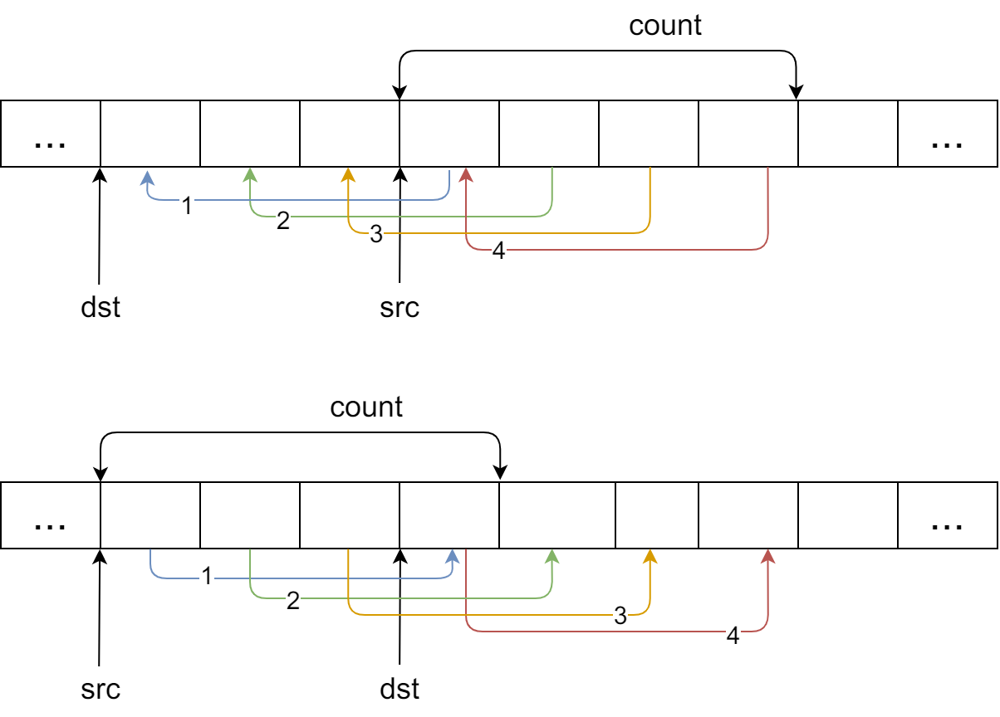

### 函数原型

&emsp;&emsp;`memcpy`和`memmove`的作用是拷贝一定长度的数据：<!--more-->

``` cpp
void *memcpy ( void *dst, const void *src, size_t count );
void *memmove ( void *dst, const void *src, size_t count );
```

它们唯一的区别是当内存发生局部重叠时，`memmove`会保证拷贝的结果是正确的，而`memcpy`不会保证。

### 代码实例

&emsp;&emsp;代码实例如下：

``` cpp
#include <stdio.h>
#include <string.h>

int main () {
    char s[] = "1234567890";
    char* p1 = s;
    char* p2 = s + 2;
    memmove ( p2, p1, 5 );
    printf ( "s is %s\n", s );
    return 0;
}
```

执行结果：

``` cpp
s is 1212345890
```

### 内存拷贝

&emsp;&emsp;内存拷贝有如下`2`种情况：

- 对第一种情况，拷贝重叠的区域不会出现问题，内容均可以被正确地拷贝。
- 对第二种情况，`dst`右边的一个字节原来的内容被覆盖了，所以接下来拷贝的时候，拷贝的是已经被覆盖的内容，显然这是有问题的。



### 应用区别

&emsp;&emsp;对于库函数来说，应该使用`memmove`函数。对于应用程序来说，可以安全地使用`memcpy`函数。

### 具体实现

&emsp;&emsp;`memcpy`函数的具体实现如下：

``` cpp
void* my_memcpy ( void *dest, const void *src, int count ) {
    void *ret = dest;

    while ( count-- ) {
        * ( char* ) dest = * ( const char* ) src;
        dest = ( char* ) dest + 1;
        src = ( char* ) src + 1;
    }

    return ret;
}
```

&emsp;&emsp;`memmove`函数的具体实现如下：

``` cpp
void *my_memmove ( void *dest, const void *src, int count ) {
    void *ret = dest;

    if ( dest < src ) {
        while ( count-- ) {
            * ( char* ) dest = * ( char* ) src;
            dest = ( char* ) dest + 1;
            src = ( char* ) src + 1;
        }
    } else {
        while ( count-- ) {
            * ( ( char * ) dest + count ) = * ( ( char * ) src + count );
        }
    }
}
```