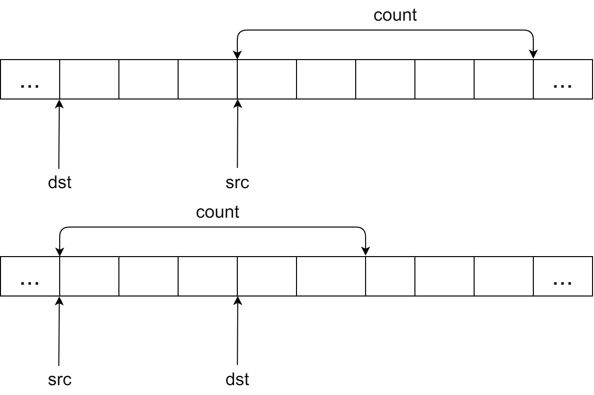

### memchr

&emsp;&emsp;`memchr`函数原型如下：

``` cpp
#include <string.h>
extern void *memchr ( void *ptr, int value, size_t num );
```

函数作用为从`ptr`所指内存区域的前`num`个字节查找字符`value`，当第一次遇到字符`ch`时停止查找如果成功，返回指向字符`ch`的指针，否则返回`NULL`。
&emsp;&emsp;与`strchr`的区别是，`memchr`检测的是一段内存，`strchr`检测的是一个字符串，如果一段内存中有`0x0`的话，显然不能用`strchr`去查找。

``` cpp
#include <stdio.h>
#include <string.h>
​
int main ( void ) {
    char *pch = NULL;
    char str[] = "Example string";
    pch = ( char * ) memchr ( str, 'p', strlen ( str ) );
​
    if ( pch != NULL ) {
        printf ( "'p' found at position %d\n", pch - str + 1 );
    }
    else {
        printf ( "'p' not found.\n" );
    }
​
    return 0;
}
```

具体实现如下：

``` cpp
#include <stdio.h>
#include <assert.h>
​
void *mymemchar ( void *buffer, int ch, size_t count );
​
int main ( void ) {
    char ss[] = "Hello, Programmers!\n";
    char *p = NULL;
    p = ( char * ) mymemchar ( ss, 'P', strlen ( ss ) );
​
    if ( p ) {
        printf ( "%s\n", p );
    }
    else {
        printf ( "Not Found\n" );
    }

    return 0;
}
​
void *mymemchar ( void *buffer, int ch, size_t count ) {
    assert ( NULL != buffer );
​
    while ( count && ( * ( unsigned char * ) buffer != ( unsigned char ) ch ) ) {
        buffer = ( unsigned char * ) buffer + 1;
        count--;
    }
​
    return ( count ? ( void * ) buffer : NULL );
}
```

### memcmp

&emsp;&emsp;`memcmp`函数原型如下：

``` cpp
#include <string.h>
int memcmp ( const void *buf1, const void *buf2, unsigned int count );
```

`memcmp`比较内存区域`buf1`和`buf2`的前`count`个字节，该函数是按字节比较的。其返回值为：

- 当`buf1 < buf2`时，返回值`< 0`。
- 当`buf1 = buf2`时，返回值`= 0`。
- 当`buf1 > buf2`时，返回值`> 0`。

``` cpp
#include <stdio.h>
#include <string.h>
​
int main ( void ) {
    char buffer1[] = "DWgaOtP12df0";
    char buffer2[] = "DWGAOTP12DF0";
    int n;
    n = memcmp ( buffer1, buffer2, sizeof ( buffer1 ) );
​
    if ( n > 0 ) {
        printf ( "'%s' is greater than '%s'.\n", buffer1, buffer2 );
    }
    else if ( n < 0 ) {
        printf ( "'%s' is less than '%s'.\n", buffer1, buffer2 );
    }
    else {
        printf ( "'%s' is the same as '%s'.\n", buffer1, buffer2 );
    }
​
    return 0;
}
```

执行结果：

``` cpp
'DWgaOtP12df0' is greater than 'DWGAOTP12DF0'.
```

### memcpy、memmove和memccpy

&emsp;&emsp;`memcpy`和`memmove`都是`C`语言中的库函数，作用是拷贝一定长度的内存的内容。

``` cpp
#include <string.h>
void *memcpy ( void *dst, const void *src, size_t count );
void *memmove ( void *dst, const void *src, size_t count );
```

它们的作用是一样的，唯一的区别是当内存发生局部重叠的时候，`memmove`保证拷贝的结果是正确的，`memcpy`不保证拷贝的结果的正确。实际上，`memcpy`只是`memmove`的一个子集，`memcpy`比`memmove`的速度要快一些。

``` cpp
#include <stdio.h>
#include <string.h>
​
int main ( void ) {
    char s[] = "Golden Global View";
    memmove ( s, s + 7, strlen ( s ) + 1 - 7 );
    printf ( "%s", s );
    getchar();
    return 0;
}
```

程序输出结果为`Global View`。注意，这里的拷贝长度`strlen(s) + 1 - 7`表示把字符串结尾的`\0`也拷贝进来。



&emsp;&emsp;第一种情况下，拷贝重叠的区域不会出现问题，内容均可以被正确地拷贝。第二种情况下，问题出现在右边的两个字节，这两个字节的原来的内容首先就被覆盖了，而且没有保存。所以接下来拷贝的时候，拷贝的是已经被覆盖的内容，显然这是有问题的。
&emsp;&emsp;对于库函数来说，由于没有办法知道传递给它的内存区域的情况，所以应该使用`memmove`函数。通过这个函数，可以保证不会出现任何内存块重叠问题。而对于应用程序来说，因为代码`知道`两个内存块不会重叠，所以可以安全地使用`memcpy`函数。
&emsp;&emsp;`memcpy`、`memmove`和`memccpy`这三个函数的功能均是将某个内存块复制到另一个内存块。前两个函数的区别在于它们处理内存区域重叠(`overlapping`)的方式不同。第三个函数的功能也是复制内存，但是如果遇到某个特定值时立即停止复制。

``` cpp
void *memccpy ( void *dest, void *src, unsigned char ch, unsigned int count );
```

由`src`所指内存区域复制不多于`count`个字节到`dest`所指内存区域，如果遇到字符`ch`则停止复制(`ch`也被复制)。注意，返回指向字符`ch`后的第一个字符的指针，如果`src`前`n`个字节中不存在`ch`，则返回`NULL`。

``` cpp
char s[] = "Goldenx Global View";
char d[20];
char *p;
p = ( char * ) memccpy ( d, s, 'x', strlen ( s ) );
​
if ( p ) {
    *p = '\0'; /* MUST Do This */
    printf ( "Char found: %s.\n", d );
} else {
    printf ( "Char not found.\n" );
}
```

&emsp;&emsp;关于`memmove`的实现：

``` cpp
void *mymemmove ( void *dest, const void *src, size_t n ) {
    char temp[n];
    int i;
    char *d = dest;
    const char *s = src;
​
    for ( i = 0; i < n; i++ ) {
        temp[i] = s[i];
    }
​
    for ( i = 0; i < n; i++ ) {
        d[i] = temp[i];
    }
​
    return dest;
}
```

&emsp;&emsp;关于`memcpy`的实现：

``` cpp
void *mymemcpy ( void *dest, const void *src, size_t n ) {
    char *d = dest;
    const char *s = src;
    int *di;
    const int *si;
    int r = n % 4;
​
    while ( r-- ) {
        *d++ = *s++;
    }
​
    di = ( int * ) d;
    si = ( const int * ) s;
    n /= 4;
​
    while ( n-- ) {
        *di++ = *si++;
    }
​
    return dest;
}
```

---

### memset函数详解

&emsp;&emsp;函数原型如下：

``` cpp
#include <string.h>
void *memset ( void *s, char ch, unsigned n );
```

其功能是将`s`所指向的某一块内存中的每个字节的内容全部设置为`ch`指定的`ASCII`值，内存大小由第三个参数指定，这个函数通常为新申请的内存做初始化工作。

``` cpp
#include <string.h>
#include <stdio.h>
​
int main ( void ) {
    char buffer[] = "Hello world\n";
    printf ( "Buffer before memset: %s\n", buffer );
    memset ( buffer, '*', strlen ( buffer ) );
    printf ( "Buffer after memset: %s\n", buffer );
    return 0;
}
```

执行结果：

``` cpp
Buffer before memset: Hello world
Buffer after memset: ***********
```

### memcpy函数

&emsp;&emsp;`memcpy`用来做内存拷贝，你可以用它拷贝任何数据类型的对象(可以指定拷贝的数据长度)：

``` cpp
char a[100], b[50];
/* 注意如用sizeof(a)，会造成b的内存地址溢出 */
memcpy ( b, a, sizeof ( b ) );
```

`strcpy`只能拷贝字符串，它遇到`\0`就结束拷贝：

``` cpp
char a[100], b[50];
/* 要注意a中的字符串长度是否超过50，如果超过，则会造成b的内存地址溢出 */
strcpy ( a, b );
```

&emsp;&emsp;`memset`可以很方便地清空一个结构类型的变量或数组，例如有如下结构体：

``` cpp
struct sample_struct {
    char csName[16];
    int iSeq;
    int iType;
};
```

对于变量`struct sample_strcut stTest;`，清空`stTest`的一般方法为：

``` cpp
stTest.csName[0] = '\0';
stTest.iSeq = 0;
stTest.iType = 0;
```

用`memset`就非常方便：

``` cpp
memset ( &stTest, 0, sizeof ( struct sample_struct ) );
```

如果是数组`struct sample_struct TEST[10];`，则清空方法如下：

``` cpp
memset ( TEST, 0, sizeof ( struct sample_struct ) * 10 );
```