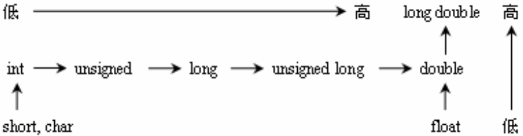
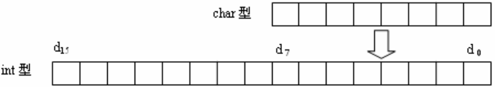

&emsp;&emsp;`C`语言规定，不同类型的数据在参加运算时，要先转换成相同的类型，然后再进行运算。运算结果的类型是转换后的类型。而类型转换的规则可归纳为`3`种转换方式：算术运算时的自动类型转换、赋值运算时的类型转换和强制类型转换。

### 自动类型转换

&emsp;&emsp;自动类型转换的规则为：双目运算符的两个运算量中，值域较窄的类型向值域较宽的类型转换：



- 有符号和无符号`short`型及`char`型一律转换为`int`型。
- `int`型与`unsigned`型数据运算，直接将`int`型转换成`unsigned`型。
- `int`型与`long`型数据运算，直接将`int`型转换成`long`型。
- `int`型与`double`型数据运算，直接将`int`型转换成`double`型。
- `float`型数据自动转换成`double`型。

### 赋值转换

&emsp;&emsp;对于赋值运算，`C`语言规定：当赋值运算符右边表达式的类型与左边变量的类型不一致时，首先将右边表达式的类型转换为左边变量的类型，然后将转换后表达式的结果值赋给左边变量，整个赋值表达式的结果类型是左边变量的类型。赋值类型转换具体规则如下：
&emsp;&emsp;1. 将整型数据赋给单、双精度变量时，数值不变，但以单、双精度实型数形式存储到变量中。

``` cpp
float x;
x = 9; /* x的值为9.000000 */
```

&emsp;&emsp;2. 将单、双精度实型数据赋给整型变量时，舍去实数的小数部分。

``` cpp
int n;
n = 3.14159; /* n的值为3 */
```

&emsp;&emsp;3. 字符型数据赋给整型变量时，由于字符型数据只占一个字节，而整型变量占`2`个字节。因此，将字符型数据存放到整型变量低`8`位中，而在高`8`位中补`1`或`0`(视具体机器系统处理有符号量或无符号量两种不同情况而定)。



&emsp;&emsp;4. 带符号整型数据`int`赋给`long int`型变量时，要进行符号扩展。
&emsp;&emsp;5. `unsigned int`型数据赋给`long int`型变量时，只需在高位补`0`即可。

### 强制类型转换

&emsp;&emsp;在程序中可以使用强制类型转换操作符来实现数据类型的转换。强制类型转换也称为显式转换，而自动类型转换又称为隐式转换。强制类型转换的一般形式为：

``` cpp
(类型说明符) (表达式)
```

其功能是把表达式的运算结果强制转换成类型说明符所表示的数据类型。例如`(float)(7 % 4)`将表达式`7 % 4`的结果转换为实型，`(int)(x + y)`将表达式`x + y`的结果转换为整型。
&emsp;&emsp;在使用强制类型转换时应注意以下问题：

- 类型说明符和表达式都必须加括号(单个变量可以不加括号)。例如将`(int)(x + y)`写成`(int)x + y`则成了只将`x`转换成`int`型之后再与`y`相加。
- 无论是强制类型转换或是自动类型转换，都只是为了本次运算的需要而对常量或变量的值的类型进行临时性转换，而常量或变量本身的数据类型和值并不改变。