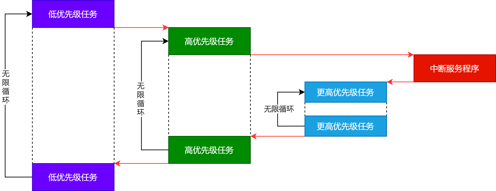
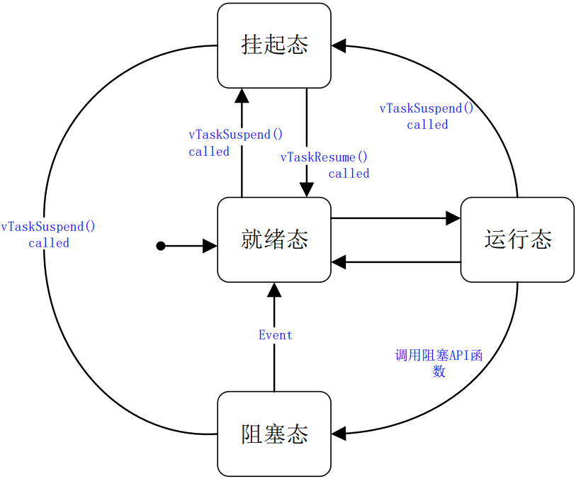

### 抢占式多任务系统

&emsp;&emsp;`FreeRTOS`是一个抢占式的实时多任务系统，运行过程如下：

&emsp;&emsp;高优先级的任务可以打断低优先级任务的运行，从而取得`CPU`的使用权，这样就保证了紧急任务的运行。
&emsp;&emsp;可以为那些对实时性要求高的任务设置一个很高的优先级，例如自动驾驶中的障碍物检测任务。
&emsp;&emsp;高优先级的任务执行完成以后，重新把`CPU`的使用权归还给低优先级的任务，这个就是抢占式多任务系统的基本原理。

### 时间片调度

&emsp;&emsp;对于同等优先级任务来说，每个任务允许运行一个时间片。当前任务消耗完一个时间片后，`CPU`的使用权将会移交给同等优先级下的另一个任务。
&emsp;&emsp;时间片的长度是由`configTICK_RATE_HZ`决定的。如果`configTICK_RATE_HZ`为`1000`，那么一个时间片的长度就是`1ms`。

### 任务状态

&emsp;&emsp;`FreeRTOS`中的任务永远处于下面几个状态中的某一个：

#### 运行态

&emsp;&emsp;当一个任务正在运行时，那么这个任务就处于运行态。

#### 就绪态

&emsp;&emsp;就绪态是指那些已经准备就绪，随时可以运行的任务，但是目前还没有运行。
&emsp;&emsp;处于就绪态是因为有一个同优先级或者更高优先级的任务正在运行。

#### 阻塞态

&emsp;&emsp;如果一个任务当前正在等待某个外部事件，那么就说它处于阻塞态。
&emsp;&emsp;例如某个任务调用了函数`vTaskDelay`，那么它就会进入阻塞态，直到延时周期完成。
&emsp;&emsp;任务在等待队列、信号量、事件组或者通知时，也会进入阻塞态。
&emsp;&emsp;任务进入阻塞态会有一个超时时间，当超过这个超时时间，任务就会退出阻塞态，即使所等待的事件还没有来临。

#### 挂起态

&emsp;&emsp;任务进入挂起态之后，不能被调度器进行调度。
&emsp;&emsp;进入挂起态的任务没有超时时间。

### 任务状态转换

&emsp;&emsp;任务状态之间的转换如下所示：

### 任务堆栈

&emsp;&emsp;`FreeRTOS`之所以能正确地恢复一个任务的运行，就是因为有任务堆栈：

1. 任务调度器在进行任务切换时，会将当前任务的现场保存在此任务的任务堆栈中。
2. 等到此任务下次运行时，就会用堆栈中保存的值来恢复现场。
3. 恢复现场以后，任务就会接着从上次中断的地方开始运行。