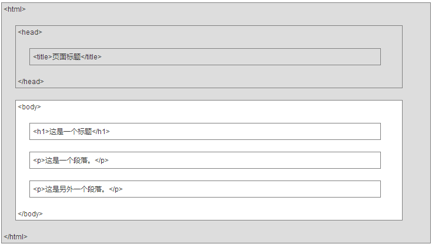
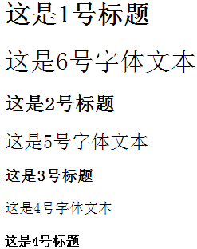
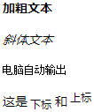
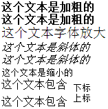
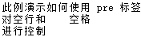
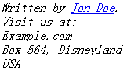
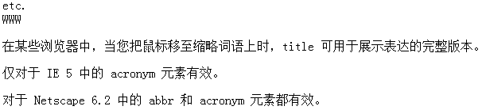
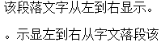
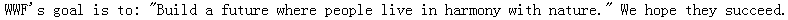
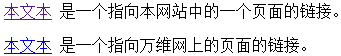

### 什么是HTML

&emsp;&emsp;超文本标记语言(`HyperText Markup Language`，简称`HTML`)是一种用于创建网页的标准标记语言，运行在浏览器上，由浏览器来解析。`HTML`文档的后缀名为`.html`或`.htm`，这两种后缀名没有区别，都可以使用。
&emsp;&emsp;`HTML`的实例如下，对于中文网页，需要使用`<meta charset="utf-8">`声明编码，否则会出现乱码：

``` xml
<!DOCTYPE html>
<html>
    <head>
        <meta charset="utf-8">
        <title>菜鸟教程(runoob.com)</title>
    </head>
    <body>
        <h1>我的第一个标题</h1>
        <p>我的第一个段落。</p>
    </body>
</html>
```
<!--more-->
&emsp;&emsp;`HTML`最好使用小写标签，实际上标签对大小写不敏感，例如`<P>`等同于`<p>`，许多网站都使用大写的`HTML`标签。
&emsp;&emsp;`<!DOCTYPE html>`声明为`HTML5`文档，`<html>`元素是`HTML`页面的根元素，`<head>`元素包含了文档的元数据，`<title>`元素描述了文档的标题，`<body>`元素包含了可见的页面内容，`<h1>`元素定义一个大标题，`<p>`元素定义一个段落。
&emsp;&emsp;`HTML`是用来描述网页的一种语言，它不是一种编程语言，而是一种标记语言，标记语言实际上是一套标记标签(`markup tag`)。`HTML`使用标记标签来描述网页，其文档包含了`HTML`标签及文本内容，也叫做`Web`页面。`HTML`标记标签通常被称为`HTML`标签(`HTML tag`)，是由尖括号包围的关键词组成(比如`<html>`)，通常是成对出现的(比如`<b>`和`</b>`)，第一个标签是开始标签，第二个标签是结束标签：

``` xml
<标签>内容</标签>
```

### HTML网页结构

&emsp;&emsp;下面是一个可视化的`HTML`页面结构：



只有`<body>`区域(白色部分)才会在浏览器中显示。

- `HTML`标题：`HTML`标题(`Heading`)是通过`<h1>`至`<h6>`标签来定义的：

``` xml
<h1>这是一个标题</h1>
<h2>这是一个标题</h2>
<h3>这是一个标题</h3>
```

- `HTML`段落：`HTML`段落是通过标签`<p>`来定义的：

``` xml
<p>这是一个段落。</p>
<p>这是另外一个段落。</p>
```

- `HTML`链接：`HTML`链接是通过标签`<a>`来定义的，在`href`属性中指定链接的地址：

``` xml
<a href="http://www.runoob.com">这是一个链接</a>
```

- `HTML`图像：`HTML`图像是通过标签``来定义的：

``` xml

```

### HTML元素

&emsp;&emsp;`HTML`文档由`HTML`元素定义，`HTML`元素如下：

开始标签                  | 元素内容    | 结束标签
-------------------------|-------------|--------
`<p>`                    | 这是一个段落 | `</p>`
`<a href="default.htm">` | 这是一个链接 | `</a>`
`<br>`                   |

开始标签常被称为`起始标签`(`opening tag`)，结束标签常称为`闭合标签`(`closing tag`)。
&emsp;&emsp;`HTML`文档由嵌套的`HTML`元素构成：

``` xml
<!DOCTYPE html>
<html>
    <body>
        <p>这是第一个段落。</p>
    </body>
</html>
```

&emsp;&emsp;以上实例包含了三个`HTML`元素：

- `<p>`元素：`<p>`元素定义了`HTML`文档中的一个段落，该元素拥有一个开始标签`<p>`以及一个结束标签`</p>`，元素内容是`这是第一个段落`。
- `<body>`元素：`<body>`元素定义了`HTML`文档的主体，这个元素拥有一个开始标签`<body>`以及一个结束标签`</body>`，元素内容是另一个`HTML`元素，即`<p>`元素。
- `<html>`元素：`<html>`元素定义了整个`HTML`文档，这个元素拥有一个开始标签`<html>`以及一个结束标签`</html>`，元素内容是另一个`HTML`元素，即`<body>`元素。

&emsp;&emsp;不要忘记结束标签，即使您忘记了使用结束标签，大多数浏览器也会正确地显示`HTML`，但不要依赖这种做法，忘记使用结束标签会产生不可预料的结果。

### HTML属性

&emsp;&emsp;属性是`HTML`元素提供的附加信息，一般描述于开始标签，总是以`名称/值`对的形式出现，比如`name="value"`。
&emsp;&emsp;`HTML`链接由`<a>`标签定义，链接的地址在`href`属性中指定：

``` xml
<a href="http://www.runoob.com">这是一个链接</a>
```

属性值应该始终被包括在引号内，双引号是最常用的，不过使用单引号也没有问题。注意，在某些个别的情况下，比如属性值本身就含有双引号，那么您必须使用单引号，例如`name='John "ShotGun" Nelson'`。
&emsp;&emsp;下面列出了适用于大多数`HTML`元素的属性：

### HTML标题

&emsp;&emsp;标题(`Heading`)是通过`<h1>`至`<h6>`标签进行定义的，`<h1>`定义最大的标题，`<h6>`定义最小的标题。注意，浏览器会自动地在标题的前后添加空行。
&emsp;&emsp;请确保将`HTML`标题标签只用于标题，不要仅仅是为了生成粗体或大号的文本而使用标题。搜索引擎使用标题为您的网页的结构和内容编制索引，并且用户可以通过标题来快速浏览您的网页，所以用标题来呈现文档结构是很重要的。应该将`h1`用作主标题，其后是`h2`，再其次是`h3`，以此类推。
&emsp;&emsp;`<hr>`标签在`HTML`页面中创建水平线，该元素可用于分隔内容：

``` xml
<p>这是一个段落。</p>
<hr>
<p>这是一个段落。</p>
<hr>
<p>这是一个段落。</p>
```

&emsp;&emsp;标题大小与字体大小的关系：`1`到`6`号标题与`1`到`6`号字体逆序对应，比如`1`号字体对应`6`号标题，`2`号字体对应`5`号标题：

``` xml
<h1>这是1号标题</h1>
<font size="6">这是6号字体文本</font>
<h2>这是2号标题</h2>
<font size="5">这是5号字体文本</font>

<h3>这是3号标题</h3>
<font size="4">这是4号字体文本</font>

<h4>这是4号标题</h4>
<font size="3">这是3号字体文本</font>

<h5>这是5号标题</h5>
<font size="2">这是2号字体文本</font>

<h6>这是6号标题</h6>
<font size="1">这是1号字体文本</font>
```



&emsp;&emsp;可以将注释插入到`HTML`代码中，这样可以提高其可读性，使代码更易被人理解。浏览器会忽略注释，不会显示它们。注释写法如下：

``` xml
<!-- 这是一个注释 -->
```

### HTML段落

#### HTML段落标签

&emsp;&emsp;`HTML`可以将文档分割为若干段落，段落是通过`<p>`标签定义的：

``` xml
<p>这是一个段落</p>
<p>这是另一个段落</p>
```

注意，浏览器会自动地在段落的前后添加空行(`</p>`是块级元素)。

#### HTML折行

&emsp;&emsp;如果您希望在不产生一个新段落的情况下进行换行，请使用`<br/>`标签：

``` xml
<p>这个<br>段落<br>演示了分行的效果</p>
```


`<br>`元素是一个空的`HTML`元素，由于其结束标签没有任何意义，因此它没有结束标签。

### HTML文本格式化

&emsp;&emsp;`HTML`文本格式化标签如下：

标签       | 描述
-----------|-----
`<b>`      | 定义粗体文本
`<em>`     | 定义着重文字
`<i>`      | 定义斜体字
`<small>`  | 定义小号字
`<strong>` | 定义加重语气
`<sub>`    | 定义下标字
`<sup>`    | 定义上标字
`<ins>`    | 定义插入字
`<del>`    | 定义删除字

&emsp;&emsp;`HTML`的计算机输出标签如下：

标签     | 描述
---------|-----
`<code>` | 定义计算机代码
`<kbd>`  | 定义键盘码
`<samp>` | 定义计算机代码样本
`<var>`  | 定义变量
`<pre>`  | 定义预格式文本

&emsp;&emsp;`HTML`引文、引用以及标签定义如下：

标签           | 描述
---------------|-----
`<abbr>`       | 定义缩写
`<address>`    | 定义地址
`<bdo>`        | 定义文字方向
`<blockquote>` | 定义长的引用
`<q>`          | 定义短的引用语
`<cite>`       | 定义引用、引证
`<dfn>`        | 定义一个定义项目

&emsp;&emsp;`HTML`文本格式化效果如下：



&emsp;&emsp;`HTML`使用标签`<b>`与`<i>`对输出的文本进行格式，这些`HTML`标签被称为`格式化标签`。通常标签`<strong>`替换加粗标签`<b>`来使用，`<em>`替换`<i>`标签使用，然而这些标签的含义是不同的：`<b>`与`<i>`定义粗体或斜体文本，`<strong>`或者`<em>`意味着你要呈现的文本是重要的，所以要突出显示。
&emsp;&emsp;下例演示如何在一个`HTML`文件中对文本进行格式化：

``` xml
<!DOCTYPE html>
<html>
    <head>
        <meta charset="utf-8">
    </head>
    <body>
        <b>这个文本是加粗的</b>
        <br />
        <strong>这个文本是加粗的</strong>
        <br />
        <big>这个文本字体放大</big>
        <br />
        <em>这个文本是斜体的</em>
        <br />
        <i>这个文本是斜体的</i>
        <br />
        <small>这个文本是缩小的</small>
        <br />
        这个文本包含
        <sub>下标</sub>
        <br />
        这个文本包含
        <sup>上标</sup>
    </body>
</html>
```



&emsp;&emsp;下例演示如何使用`pre`标签对空行和空格进行控制：

``` xml
<!DOCTYPE html>
<html>
    <head>
        <meta charset="utf-8">
    </head>
    <body>
        <pre>
        此例演示如何使用 pre 标签
        对空行和    空格
        进行控制
        </pre>
    </body>
</html>
```



&emsp;&emsp;下例演示不同的`计算机输出`标签的显示效果：

``` xml
<!DOCTYPE html>
<html>
    <head>
        <meta charset="utf-8">
    </head>
    <body>
        <code>计算机输出</code>
        <br />
        <kbd>键盘输入</kbd>
        <br />
        <tt>打字机文本</tt>
        <br />
        <samp>计算机代码样本</samp>
        <br />
        <var>计算机变量</var>
        <br />
        <p>
            <b>注释：</b>这些标签常用于显示计算机/编程代码。
        </p>
    </body>
</html>
```


&emsp;&emsp;下例演示如何在`HTML`文件中写地址：

``` xml
<!DOCTYPE html>
<html>
    <head>
        <meta charset="utf-8">
    </head>
    <body>
        <address>
        Written by <a href="mailto:webmaster@example.com">Jon Doe</a>.<br>
        Visit us at:<br>
        Example.com<br>
        Box 564, Disneyland<br>
        USA
        </address>
    </body>
</html>
```



&emsp;&emsp;下例演示如何实现缩写或首字母缩写：

``` xml
<!DOCTYPE html>
<html>
    <head>
        <meta charset="utf-8">
    </head>
    <body>
        <abbr title="etcetera">etc.</abbr>
        <br />
        <acronym title="World Wide Web">WWW</acronym>
        <p>在某些浏览器中，当您把鼠标移至缩略词语上时，title 可用于展示表达的完整版本。</p>
        <p>仅对于 IE 5 中的 acronym 元素有效。</p>
        <p>对于 Netscape 6.2 中的 abbr 和 acronym 元素都有效。</p>
    </body>
</html>
```



&emsp;&emsp;下例演示如何改变文字的方向：

``` xml
<!DOCTYPE html>
<html>
    <head>
        <meta charset="utf-8">
    </head>
    <body>
        <p>该段落文字从左到右显示。</p>
        <p><bdo dir="rtl">该段落文字从右到左显示。</bdo></p>
    </body>
</html>
```



&emsp;&emsp;下例演示如何实现长短不一的引用语：

``` xml
<!DOCTYPE html>
<html>
    <head>
        <meta charset="utf-8">
    </head>
    <body>
        <p>WWF's goal is to:
        <q>Build a future where people live in harmony with nature.</q>
        We hope they succeed.</p>
    </body>
</html>
```



&emsp;&emsp;此例演示如何标记删除文本和插入文本：

``` xml
<!DOCTYPE html>
<html>
    <head>
        <meta charset="utf-8">
    </head>
    <body>
        <p>My favorite color is <del>blue</del> <ins>red</ins>!</p>
    </body>
</html>
```


### HTML链接

&emsp;&emsp;`HTML`使用超级链接与网络上的另一个文档相连。几乎可以在所有的网页中找到链接，点击链接可以从一张页面跳转到另一张页面：

``` xml
<!DOCTYPE html>
<html>
    <head>
        <meta charset="utf-8">
    </head>
    <body>
        <p>
        <a href="/index.html">本文本</a> 是一个指向本网站中的一个页面的链接。</p>
        <p><a href="http://www.microsoft.com/">本文本</a> 是一个指向万维网上的页面的链接。</p>
    </body>
</html>
```



&emsp;&emsp;`HTML`使用标签`<a>`来设置超文本链接，超链接可以是一个字、一个词或者一组词，也可以是一幅图像，您可以点击这些内容来跳转到新的文档或者当前文档中的某个部分。当您把鼠标指针移动到网页中的某个链接上时，箭头会变为一只小手。
&emsp;&emsp;默认情况下，链接将以以下形式出现在浏览器中：一个未访问过的链接显示为蓝色字体并带有下划线；访问过的链接显示为紫色并带有下划线；点击链接时，链接显示为红色并带有下划线。

#### 链接的target属性

&emsp;&emsp;你可以定义被链接的文档在何处显示。下面的这行会在新窗口打开文档：

``` xml
<a href="http://www.runoob.com/" target="_blank">访问菜鸟教程!</a>
```

#### 链接的id属性

&emsp;&emsp;`id`属性可用于创建`HTML`文档书签标记。书签不以任何特殊的方式显示，在`HTML`文档中是不显示的。在`HTML`文档中插入`ID`：

``` xml
<a id="tips">有用的提示部分</a>
```

在`HTML`文档中创建一个链接，定位到`有用的提示部分`(`id="tips"`)：

``` xml
<a href="#tips">访问有用的提示部分</a>
```

或者从另一个页面创建一个链接，定位到`有用的提示部分`(`id="tips"`)：

``` xml
<a href="http://www.runoob.com/html/html-links.html#tips">
访问有用的提示部分</a>
```

&emsp;&emsp;注意，请始终将正斜杠添加到子文件夹。假如这样书写链接`href="http://www.runoob.com/html"`，就会向服务器产生两次`HTTP`请求，这是因为服务器会添加正斜杠到这个地址，然后创建一个新的请求，就像这样`href="http://www.runoob.com/html/"`。
&emsp;&emsp;下例演示如何使用图片链接：

``` xml
<!DOCTYPE html>
<html>
    <head>
        <meta charset="utf-8">
    </head>
    <body>
        <p>创建图片链接:
        <a href="http://www.runoob.com/html/html-tutorial.html">
        </a></p>

        <p>无边框的图片链接:
        <a href="http://www.runoob.com/html/html-tutorial.html">
        </a></p>
    </body>
</html>
```


&emsp;&emsp;下例演示如何使用书签：

``` xml
<!DOCTYPE html>
<html>
    <head>
        <meta charset="utf-8">
    </head>
    <body>
        <p>
        <a href="#C4">查看章节 4</a>
        </p>
        <h2>章节 1</h2>
        <p>这边显示该章节的内容……</p>
        <h2>章节 2</h2>
        <p>这边显示该章节的内容……</p>
        <h2>章节 3</h2>
        <p>这边显示该章节的内容……</p>
        <h2><a id="C4">章节 4</a></h2>
        <p>这边显示该章节的内容……</p>
    </body>
</html>
```

&emsp;&emsp;下例演示如何跳出框架，假如你的页面被固定在框架之内：

``` xml
<!DOCTYPE html>
<html>
    <head>
        <meta charset="utf-8">
    </head>
    <body>
        <p>跳出框架?</p>
        <a href="http://www.runoob.com/" target="_top">点击这里!</a>
    </body>
</html>
```

&emsp;&emsp;下例演示如何链接到一个邮件，本例在安装邮件客户端程序后才能工作：

``` xml
<!DOCTYPE html>
<html>
    <head>
        <meta charset="utf-8">
    </head>
    <body>
        <p>
        这是一个电子邮件链接：
        <a href="mailto:someone@example.com?Subject=Hello%20again" target="_top">
        发送邮件</a>
        </p>
        <p>
        <b>注意:</b> 单词之间空格使用 %20 代替，以确保浏览器可以正常显示文本。
        </p>
    </body>
</html>
```

### HTML头部

&emsp;&emsp;`<title>`定义了`HTML`文档的标题：

``` xml
<!DOCTYPE html>
<html>
    <head>
        <meta charset="utf-8">
        <title>我的 HTML 的第一页</title>
    </head>
    <body>
        <p>浏览器中包含body元素的内容。</p>
        <p>浏览器的标题包含title元素的内容</p>
    </body>
</html>
```

`<base>`定义页面中所有链接默认的链接目标地址：

``` xml
<!DOCTYPE html>
<html>
    <head>
        <meta charset="utf-8">
        <title>菜鸟教程(runoob.com)</title>
        <base href="http://www.runoob.com/images/" target="_blank">
    </head>

    <body>
         - 注意这里我们设置了图片的相对地址。能正常显示是因为我们在 head 部分设置了 base 标签，该标签指定了页面上所有链接的默认 URL，所以该图片的访问地址为 "http://www.runoob.com/images/logo.png"
        <br><br>
        <a href="http://www.runoob.com">菜鸟教程</a> - 注意这个链接会在新窗口打开，即便它没有 target="_blank" 属性。因为在 base 标签里我们已经设置了 target 属性的值为 "_blank"。
    </body>
</html>
```

`<meta>`元素来描述`HTML`文档的关键词、作者、字符集等：

``` xml
<!DOCTYPE html>
<html>
    <head>
        <meta charset="utf-8">
        <title>菜鸟教程(runoob.com)</title>
        <meta name="description" content="免费在线教程">
        <meta name="keywords" content="HTML,CSS,XML,JavaScript">
        <meta name="author" content="runoob">
        <meta charset="UTF-8">
    </head>

    <body>
        <p>所有 meta 标签显示在 head 部分...</p>
    </body>
</html>
```

&emsp;&emsp;`HTML`的`<head>`元素包含了所有的头部标签元素。在`<head>`元素中，你可以插入脚本(`scripts`)、样式文件(`CSS`)及各种`meta`信息。可以添加在头部区域的元素标签为：`<title>`、`<style>`、`<meta>`、`<link>`、`<script>`、`<noscript>`和`<base>`。
&emsp;&emsp;`HTML`的`<title>`元素定义了不同文档的标题，在`HTML/XHTML`文档中是必须的。`<title>`元素定义了浏览器工具栏的标题，当网页添加到收藏夹时显示在收藏夹中的标题以及显示在搜索引擎结果页面的标题。
&emsp;&emsp;`HTML`的`<base>`元素描述了基本的`链接地址/链接目标`，该标签作为`HTML`文档中所有的链接标签的默认链接：

``` xml
<head>
    <base href="http://www.runoob.com/images/" target="_blank">
</head>
```

&emsp;&emsp;`HTML`的`<link>`元素定义了文档与外部资源之间的关系，`<link>`标签通常用于链接到样式表：

``` xml
<head>
    <link rel="stylesheet" type="text/css" href="mystyle.css">
</head>
```

&emsp;&emsp;`HTML`的`<style>`元素定义了`HTML`文档的样式文件引用地址，在`<style>`元素中你也可以直接添加样式来渲染`HTML`文档：

``` xml
<head>
    <style type="text/css">
    body {background-color:yellow}
    p {color:blue}
    </style>
</head>
```

&emsp;&emsp;`HTML`的`<meta>`元素`meta`标签描述了一些基本的元数据，它`<meta>`标签提供了元数据。元数据也不显示在页面上，但会被浏览器解析。`META`元素通常用于指定网页的描述、关键词，文件的最后修改时间、作者和其他元数据。
&emsp;&emsp;元数据可以使用于浏览器(如何显示内容或重新加载页面)、搜索引擎(关键词)或其他`Web`服务，一般放置于`<head>`区域。使用实例如下：

``` xml
<meta name="keywords" content="HTML, CSS, XML, XHTML, JavaScript"> #为搜索引擎定义关键词
<meta name="description" content="免费 Web & 编程 教程"> #为网页定义描述内容
<meta name="author" content="Runoob"> #定义网页作者
<meta http-equiv="refresh" content="30"> #每30秒中刷新当前页面
```

&emsp;&emsp;`HTML`的`<script>`元素用于加载脚本文件，如`JavaScript`。

### HTML图像

&emsp;&emsp;`HTML`图像标签如下：

标签     | 描述
---------|------
``  | 定义图像
`<map>`  | 定义图像地图
`<area>` | 定义图像地图中的可点击区域

&emsp;&emsp;下例演示如何在网页中显示图像：

``` xml
<!DOCTYPE html>
<html>
    <head>
        <meta charset="utf-8">
    </head>
    <body>
        <p>
        一个图像:
        </p>
        <p>
        一个动图:
        </p>
        <p>
        注意插入动图的语法和静态图的语法是一样的。
        </p>
    </body>
</html>
```

&emsp;&emsp;下例演示如何将其他文件夹或服务器的图片显示到网页中：

``` xml
<!DOCTYPE html>
<html>
    <head>
        <meta charset="utf-8">
    </head>
    <body>
        <p>一个来自文件夹中的图像:</p>
        <p>一个来自菜鸟教程的图像:</p>
        
    </body>
</html>
```

&emsp;&emsp;在`HTML`中，图像由``标签定义。``是空标签，意思是说它只包含属性，并且没有闭合标签。要在页面上显示图像，你需要使用源属性`src`，其值是图像的URL地址。定义图像的语法如下：

``` xml

```

`URL`指存储图像的位置。如果名为`plpit.jpg`的图像位于`www.runoob.com`的`images`目录中，那么其`URL`为`http://www.runoob.com/images/pulpit.jpg`。
&emsp;&emsp;`HTML`图像的`Alt`属性用来为图像定义一串预备的可替换的文本，替换文本属性的值是用户定义的：

``` xml

```

在浏览器无法载入图像时，替换文本属性告诉读者它们失去的信息，此时浏览器将显示这个替代性的文本而不是图像。
&emsp;&emsp;`height`与`width`属性用于设置图像的高度与宽度，属性值默认单位为像素：

``` xml

```

&emsp;&emsp;下例演示如何在文字中排列图像：

``` xml
<!DOCTYPE html>
<html>
    <head>
        <meta charset="utf-8">
    </head>
    <body>
        <h4>默认对齐的图像 (align="bottom"):</h4>
        <p>这是一些文本。  这是一些文本。</p>
        <h4>图片使用 align="middle":</h4>
        <p>这是一些文本。 这是一些文本。</p>
        <h4>图片使用 align="top":</h4>
        <p>这是一些文本。 这是一些文本。</p>
        <p><b>注意:</b>在HTML 4中 align 属性已废弃，HTML5 已不支持该属性，可以使用 CSS 代替。</p>
    </body>
</html>
```

&emsp;&emsp;下例演示如何使图片浮动至段落的左边或右边：

``` xml
<!DOCTYPE html>
<html>
    <head>
        <meta charset="utf-8">
    </head>
    <body>
        <p>
         一个带图片的段落，图片浮动在这个文本的左边。
        </p>
        <p>
         一个带图片的段落，图片浮动在这个文本的右边。
        </p>
        <p><b>注意:</b> 在这里我们使用了 CSS "float" 属性，在HTML 4中 align 属性已废弃，HTML5 已不支持该属性，可以使用 CSS 代替。</p>
    </body>
</html>
```

&emsp;&emsp;下例演示如何将图像作为一个链接使用：

``` xml
<!DOCTYPE html>
<html>
    <head>
        <meta charset="utf-8">
    </head>
    <body>
        <p>创建图片链接:
        <a href="http://www.runoob.com/html/html-tutorial.html">
        </a></p>
        <p>无边框的图片链接:
        <a href="http://www.runoob.com/html/html-tutorial.html">
        </a></p>
    </body>
</html>
```

&emsp;&emsp;下例显示如何创建带有可供点击区域的图像地图，其中的每个区域都是一个超级链接：

``` xml
<!DOCTYPE html>
<html>
    <head>
        <meta charset="utf-8">
    </head>
    <body>
        <p>点击太阳或其他行星，注意变化：</p>
        
        <map name="planetmap">
            <area shape="rect" coords="0,0,82,126" alt="Sun" href="sun.htm">
            <area shape="circle" coords="90,58,3" alt="Mercury" href="mercur.htm">
            <area shape="circle" coords="124,58,8" alt="Venus" href="venus.htm">
        </map>
    </body>
</html>
```

### HTML表格

&emsp;&emsp;`HTML`表格标签如下：

标签         | 描述
-------------|-------
`<table>`    | 定义表格
`<th>`       | 定义表格的表头
`<tr>`       | 定义表格的行
`<td>`       | 定义表格单元
`<caption>`  | 定义表格标题
`<colgroup>` | 定义表格列的组
`<col>`      | 定义用于表格列的属性
`<thead>`    | 定义表格的页眉
`<tbody>`    | 定义表格的主体
`<tfoot>`    | 定义表格的页脚

&emsp;&emsp;`HTML`表格实例如下：

``` xml
<!DOCTYPE html>
<html>
    <head>
        <meta charset="utf-8">
    </head>
    <body>
        <p>
        每个表格从一个 table 标签开始。
        每个表格行从 tr 标签开始。
        每个表格的数据从 td 标签开始。
        </p>

        <h4>一列:</h4>

        <table border="1">
            <tr>
            <td>100</td>
            </tr>
        </table>
        <h4>一行三列:</h4>
        <table border="1">
            <tr>
            <td>100</td>
            <td>200</td>
            <td>300</td>
            </tr>
        </table>
        <h4>两行三列:</h4>
        <table border="1">
            <tr>
            <td>100</td>
            <td>200</td>
            <td>300</td>
            </tr>
            <tr>
            <td>400</td>
            <td>500</td>
            <td>600</td>
            </tr>
        </table>
        <h4>两行三列:</h4>

        <table border="1">
            <tr>
            <td>100</td>
            <td>200</td>
            <td>300</td>
            </tr>
            <tr>
            <td>400</td>
            <td>500</td>
            <td>600</td>
            </tr>
        </table>
    </body>
</html>
```

&emsp;&emsp;表格由`<table>`标签来定义，每个表格均有若干行(由`<tr>`标签定义)，每行被分割为若干单元格(由`<td>`标签定义)。字母`td`指表格数据(`table data`)，即数据单元格的内容。数据单元格可以包含文本、图片、列表、段落、表单、水平线、表格等。

``` xml
<table border="1">
    <tr>
        <td>row 1, cell 1</td>
        <td>row 1, cell 2</td>
    </tr>
    <tr>
        <td>row 2, cell 1</td>
        <td>row 2, cell 2</td>
    </tr>
</table>
```

&emsp;&emsp;如果不定义边框属性，表格将不显示边框，但是大多数时候，我们希望显示边框。使用边框属性来显示一个带有边框的表格：

``` xml
<table border="1">
    <tr>
        <td>Row 1, cell 1</td>
        <td>Row 1, cell 2</td>
    </tr>
</table>
```

&emsp;&emsp;表格的表头使用`<th>`标签进行定义，大多数浏览器会把表头显示为粗体居中的文本：

``` xml
<table border="1">
    <tr>
        <th>Header 1</th>
        <th>Header 2</th>
    </tr>
    <tr>
        <td>row 1, cell 1</td>
        <td>row 1, cell 2</td>
    </tr>
    <tr>
        <td>row 2, cell 1</td>
        <td>row 2, cell 2</td>
    </tr>
</table>
```

&emsp;&emsp;下例演示一个没有边框的表格：

``` xml
<!DOCTYPE html>
<html>
    <head>
        <meta charset="utf-8">
    </head>
    <body>
        <h4>这个表格没有边框:</h4>
        <table>
            <tr>
            <td>100</td>
            <td>200</td>
            <td>300</td>
            </tr>
            <tr>
            <td>400</td>
            <td>500</td>
            <td>600</td>
            </tr>
        </table>
        <h4>这个表格没有边框:</h4>

        <table border="0">
            <tr>
            <td>100</td>
            <td>200</td>
            <td>300</td>
            </tr>
            <tr>
            <td>400</td>
            <td>500</td>
            <td>600</td>
            </tr>
        </table>
    </body>
</html>
```

&emsp;&emsp;下例演示如何显示表格表头：

``` xml
<!DOCTYPE html>
<html>
    <head>
        <meta charset="utf-8">
    </head>
    <body>
        <h4>水平标题:</h4>
        <table border="1">
            <tr>
            <th>Name</th>
            <th>Telephone</th>
            <th>Telephone</th>
            </tr>
            <tr>
            <td>Bill Gates</td>
            <td>555 77 854</td>
            <td>555 77 855</td>
            </tr>
        </table>
        <h4>垂直标题:</h4>
        <table border="1">
            <tr>
            <th>First Name:</th>
            <td>Bill Gates</td>
            </tr>
            <tr>
            <th>Telephone:</th>
            <td>555 77 854</td>
            </tr>
            <tr>
            <th>Telephone:</th>
            <td>555 77 855</td>
            </tr>
        </table>
    </body>
</html>
```

&emsp;&emsp;下例演示一个带标题的表格：

``` xml
<!DOCTYPE html>
<html>
    <head>
        <meta charset="utf-8">
    </head>
    <body>
        <table border="1">
            <caption>Monthly savings</caption>
            <tr>
            <th>Month</th>
            <th>Savings</th>
            </tr>
            <tr>
            <td>January</td>
            <td>$100</td>
            </tr>
            <tr>
            <td>February</td>
            <td>$50</td>
            </tr>
        </table>
    </body>
</html>
```

&emsp;&emsp;下例演示如何定义跨行或跨列的表格单元格：

``` xml
<!DOCTYPE html>
<html>
    <head>
        <meta charset="utf-8">
    </head>
    <body>
        <h4>单元格跨两格:</h4>
        <table border="1">
            <tr>
            <th>Name</th>
            <th colspan="2">Telephone</th>
            </tr>
            <tr>
            <td>Bill Gates</td>
            <td>555 77 854</td>
            <td>555 77 855</td>
            </tr>
        </table>
        <h4>单元格跨两列:</h4>
            <table border="1">
            <tr>
            <th>First Name:</th>
            <td>Bill Gates</td>
            </tr>
            <tr>
            <th rowspan="2">Telephone:</th>
            <td>555 77 854</td>
            </tr>
            <tr>
            <td>555 77 855</td>
            </tr>
        </table>
    </body>
</html>
```

&emsp;&emsp;下例演示如何显示在不同的元素内显示元素：

``` xml
<!DOCTYPE html>
<html>
    <head>
        <meta charset="utf-8">
    </head>
    <body>
        <table border="1">
            <tr>
            <td>
            <p>这是一个段落</p>
            <p>这是另一个段落</p>
            </td>
            <td>这个单元格包含一个表格:
            <table border="1">
                <tr>
                <td>A</td>
                <td>B</td>
                </tr>
                <tr>
                <td>C</td>
                <td>D</td>
                </tr>
            </table>
            </td>
            </tr>
            <tr>
            <td>这个单元格包含一个列表
                <ul>
                <li>apples</li>
                <li>bananas</li>
                <li>pineapples</li>
                </ul>
            </td>
            <td>HELLO</td>
            </tr>
        </table>
    </body>
</html>
```

&emsp;&emsp;下例演示如何使用`Cell padding`来创建单元格内容与其边框之间的空白：

``` xml
<!DOCTYPE html>
<html>
    <head>
        <meta charset="utf-8">
    </head>
    <body>
        <h4>没有单元格边距:</h4>
        <table border="1">
            <tr>
            <td>First</td>
            <td>Row</td>
            </tr>
            <tr>
            <td>Second</td>
            <td>Row</td>
            </tr>
        </table>
        <h4>有单元格边距:</h4>

        <table border="1"
            cellpadding="10">
            <tr>
            <td>First</td>
            <td>Row</td>
            </tr>
            <tr>
            <td>Second</td>
            <td>Row</td>
            </tr>
        </table>
    </body>
</html>
```

&emsp;&emsp;下例演示如何使用`Cell spacing`增加单元格之间的距离：

``` xml
<!DOCTYPE html>
<html>
    <head>
        <meta charset="utf-8">
    </head>
    <body>
        <h4>没有单元格间距:</h4>
        <table border="1">
            <tr>
            <td>First</td>
            <td>Row</td>
            </tr>
            <tr>
            <td>Second</td>
            <td>Row</td>
            </tr>
        </table>

        <h4>单元格间距="0":</h4>
        <table border="1" cellspacing="0">
            <tr>
            <td>First</td>
            <td>Row</td>
            </tr>
            <tr>
            <td>Second</td>
            <td>Row</td>
            </tr>
        </table>
        <h4>单元格间距="10":</h4>

        <table border="1" cellspacing="10">
            <tr>
            <td>First</td>
            <td>Row</td>
            </tr>
            <tr>
            <td>Second</td>
            <td>Row</td>
            </tr>
        </table>
    </body>
</html>
```