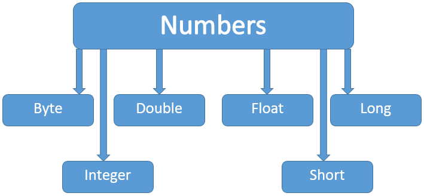

&emsp;&emsp;一般情况下，当需要使用数字的时候，我们通常使用内置数据类型，例如`byte`、`int`、`long`、`double`等：<!--more-->

``` java
int a = 5000;
float b = 13.65f;
byte c = 0x4a;
```

然而在实际开发过程中，我们经常会遇到需要使用对象，而不是内置数据类型的情形。为了解决这个问题，`Java`为每一个内置数据类型提供了对应的包装类。
&emsp;&emsp;所有的包装类(`Integer`、`Long`、`Byte`、`Double`、`Float`、`Short`)都是抽象类`Number`的子类：



&emsp;&emsp;这种由编译器特别支持的包装称为装箱，所以当内置数据类型被当作对象使用的时候，编译器会把内置类型装箱为包装类。相似的，编译器也可以把一个对象拆箱为内置类型。`Number`类属于`java.lang`包。

``` java
public class Test {
    public static void main(String args[]) {
        Integer x = 5;
        x = x + 10;
        System.out.println(x); /* 输出“15” */
    }
}
```

当`x`被赋为整型值时，由于`x`是一个对象，所以编译器要对`x`进行装箱。然后为了使`x`能进行加运算，所以要对`x`进行拆箱。

### Math类

&emsp;&emsp;`Java`的`Math`包含了用于执行基本数学运算的属性和方法，例如初等指数、对数、平方根和三角函数。`Math`的方法都被定义为`static`形式，通过`Math`类可以在主函数中直接调用。

``` java
public class Test {
    public static void main(String[] args) {
        System.out.println("90度的正弦值：" + Math.sin(Math.PI / 2));
        System.out.println("0度的余弦值：" + Math.cos(0));
        System.out.println("60度的正切值：" + Math.tan(Math.PI / 3));
        System.out.println("1的反正切值：" + Math.atan(1));
        System.out.println("π/2的角度值：" + Math.toDegrees(Math.PI / 2));
        System.out.println(Math.PI);
    }
}
```

执行结果：

``` java
90度的正弦值：1.0
0度的余弦值：1.0
60度的正切值：1.7320508075688767
1的反正切值：0.7853981633974483
π/2的角度值：90.0
3.141592653589793
```

### Number和Math类方法

&emsp;&emsp;下表列出的是`Number`和`Math`类常用的一些方法：

方法        | 说明
------------|----
`xxxValue`  | 将`Number`对象转换为`xxx`数据类型的值并返回
`compareTo` | 将`Number`对象与参数比较
`equals`    | 判断`Number`对象是否与参数相等
`valueOf`   | 返回一个`Number`对象指定的内置数据类型
`toString`  | 以字符串形式返回值
`parseInt`  | 将字符串解析为`int`类型
`abs`       | 返回参数的绝对值
`ceil`      | 返回大于等于(`>=`)给定参数的的最小整数
`floor`     | 返回小于等于(`<=`)给定参数的最大整数
`rint`      | 返回与参数最接近的整数，返回类型为`double`
`round`     | 它表示四舍五入，算法为`Math.floor(x + 0.5)`
`min`       | 返回两个参数中的最小值
`max`       | 返回两个参数中的最大值
`exp`       | 返回自然数底数`e`的参数次方
`log`       | 返回参数的自然数底数的对数值
`pow`       | 返回第一个参数的第二个参数次方
`sqrt`      | 求参数的算术平方根
`sin`       | 求指定`double`类型参数的正弦值
`cos`       | 求指定`double`类型参数的余弦值
`tan`       | 求指定`double`类型参数的正切值
`asin`      | 求指定`double`类型参数的反正弦值
`acos`      | 求指定`double`类型参数的反余弦值
`atan`      | 求指定`double`类型参数的反正切值
`atan2`     | 将笛卡尔坐标转换为极坐标，并返回极坐标的角度值
`toDegrees` | 将参数转化为角度
`toRadians` | 将角度转换为弧度
`random`    | 返回一个随机数

`Math`的`floor`、`round`和`ceil`方法实例比较：

``` java
public class Main {
    public static void main(String[] args) {
        double[] nums = {1.4, 1.5, 1.6, -1.4, -1.5, -1.6};

        for (double num : nums) {
            test(num);
        }
    }
​
    private static void test(double num) {
        System.out.println("Math.floor(" + num + ") = " + Math.floor(num));
        System.out.println("Math.round(" + num + ") = " + Math.round(num));
        System.out.println("Math.ceil(" + num + ") = " + Math.ceil(num));
    }
}
```

执行结果：

``` java
Math.floor(1.4) = 1.0
Math.round(1.4) = 1
Math.ceil(1.4) = 2.0
Math.floor(1.5) = 1.0
Math.round(1.5) = 2
Math.ceil(1.5) = 2.0
Math.floor(1.6) = 1.0
Math.round(1.6) = 2
Math.ceil(1.6) = 2.0
Math.floor(-1.4) = -2.0
Math.round(-1.4) = -1
Math.ceil(-1.4) = -1.0
Math.floor(-1.5) = -2.0
Math.round(-1.5) = -1
Math.ceil(-1.5) = -1.0
Math.floor(-1.6) = -2.0
Math.round(-1.6) = -2
Math.ceil(-1.6) = -1.0
```

---

### xxxValue方法

&emsp;&emsp;`xxxValue`方法用于将`Number`对象转换为`xxx`数据类型的值并返回。

方法          | 说明
--------------|-----
`byteValue`   | 以`byte`形式返回指定的数值
`doubleValue` | 以`double`形式返回指定的数值
`floatValue`  | 以`float`形式返回指定的数值
`intValue`    | 以`int`形式返回指定的数值
`longValue`   | 以`long`形式返回指定的数值
`shortValue`  | 以`short`形式返回指定的数值

代码如下：

``` java
public class Test {
    public static void main(String args[]) {
        Integer x = 5;
        /* 返回byte原生数据类型 */
        System.out.println(x.byteValue()); /* 输出“5” */
        /* 返回double原生数据类型 */
        System.out.println(x.doubleValue()); /* 输出“5.0” */
        /* 返回long原生数据类型 */
        System.out.println(x.longValue()); /* 输出“5” */
    }
}
```

### compareTo方法

&emsp;&emsp;`compareTo`方法用于将`Number`对象与方法的参数进行比较，可用于比较`Byte`、`Long`、`Integer`等。该方法用于两个相同数据类型的比较，两个不同类型的数据不能用此方法来比较。

``` java
public int compareTo(NumberSubClass referenceName);
```

参数`referenceName`可以是一个`Byte`、`Double`、`Integer`、`Float`、`Long`或`Short`类型的参数。如果指定的数与参数相等，返回`0`；如果指定的数小于参数，返回`-1`；如果指定的数大于参数，返回`1`。

``` java
public class Test {
    public static void main(String args[]) {
        Integer x = 5;
        System.out.println(x.compareTo(3));
        System.out.println(x.compareTo(5));
        System.out.println(x.compareTo(8));
    }
}
```

### equals方法

&emsp;&emsp;`equals`方法用于判断`Number`对象与方法的参数进是否相等。

``` java
public boolean equals(Object o);
```

参数`o`可以是任何对象。如`Number`对象不为`Null`，且与方法的参数类型与数值都相等，就返回`True`，否则返回`False`。

``` java
public class Test {
    public static void main(String args[]) {
        Integer x = 5;
        Integer y = 10;
        Integer z = 5;
        Short a = 5;
​
        System.out.println(x.equals(y)); /* false */
        System.out.println(x.equals(z)); /* true */
        System.out.println(x.equals(a)); /* false */
    }
}
```

注意`==`与`equals`的区别，`==`比较的是对象的地址，`equals`比较的是对象的内容。