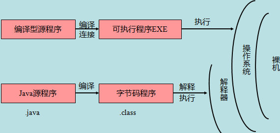

### Java简介

&emsp;&emsp;`Java`是由`Sun Microsystems`公司于`1995`年`5`月推出的`Java`面向对象程序设计语言和`Java`平台的总称。由`James Gosling`和同事们共同研发，分为三个体系：<!--more-->

- `JavaSE(J2SE)`：`Java2 Platform Standard Edition`，`java`平台标准版。
- `JavaEE(J2EE)`：`Java 2 Platform,Enterprise Edition`，`java`平台企业版。
- `JavaME(J2ME)`：`Java 2 Platform Micro Edition`，`java`平台微型版。

### 主要特性

&emsp;&emsp;`Java`是简单的：`Java`的语法与`C/C++`很接近，使得大多数程序员很容易学习和使用。另一方面，`Java`丢弃了`C++`中很少使用的、很难理解的、令人迷惑的那些特性，例如操作符重载、多继承、自动的强制类型转换。特别地，`Java`不使用指针，而是引用，并提供了自动垃圾收集机制，使得程序员不必为内存管理而担忧。
&emsp;&emsp;`Java`是面向对象的：`Java`提供类、接口和继承等面向对象的特性，为了简单起见，只支持类之间的单继承，但支持接口之间的多继承，并支持类与接口之间的实现机制(关键字为`implements`)。`Java`全面支持动态绑定，而`C++`只对虚函数使用动态绑定。总之，`Java`是一个纯的面向对象程序设计语言。
&emsp;&emsp;`Java`是分布式的：`Java`语言支持`Internet`应用的开发，在基本的`Java`应用编程接口中有一个网络应用编程接口(`java net`)，它提供了用于网络应用编程的类库，包括`URL`、`URLConnection`、`Socket`、`ServerSocket`等。`Java`的`RMI`(远程方法激活)机制也是开发分布式应用的重要手段。
&emsp;&emsp;`Java`是健壮的：`Java`的强类型机制、异常处理、垃圾的自动收集等是`Java`程序健壮性的重要保证。对指针的丢弃是`Java`的明智选择。`Java`的安全检查机制使得`Java`更具健壮性。
&emsp;&emsp;`Java`是安全的：`Java`通常被用在网络环境中，为此，`Java`提供了一个安全机制以防恶意代码的攻击。除了`Java`具有的许多安全特性以外，`Java`对通过网络下载的类具有一个安全防范机制(类`ClassLoader`)，例如分配不同的名字空间以防替代本地的同名类、字节代码检查，并提供安全管理机制(类`SecurityManager`)，让`Java`应用设置安全哨兵。
&emsp;&emsp;`Java`是体系结构中立的：`Java`程序(后缀为`java`的文件)在`Java`平台上被编译为体系结构中立的字节码格式(后缀为`class`的文件)，然后可以在实现`Java`平台的任何系统中运行。这种途径适合于异构的网络环境和软件的分发。
&emsp;&emsp;`Java`是可移植的：这种可移植性来源于体系结构中立性，另外`Java`还严格规定了各个基本数据类型的长度。`Java`系统本身也具有很强的可移植性，`Java`编译器是用`Java`实现的，`Java`的运行环境是用`ANSI C`实现的。
&emsp;&emsp;`Java`是解释型的：`Java`程序在`Java`平台上被编译为字节码格式，然后可以在实现`Java`平台的任何系统中运行。在运行时，`Java`平台中的`Java`解释器对这些字节码进行解释执行，执行过程中需要的类在联接阶段被载入到运行环境中。
&emsp;&emsp;`Java`是高性能的：与那些解释型的高级脚本语言相比，`Java`的确是高性能的。事实上，`Java`的运行速度随着`JIT`(`Just-In-Time`)编译器技术的发展越来越接近于`C++`。
&emsp;&emsp;`Java`是多线程的：在`Java`中，线程是一种特殊的对象，它必须由`Thread`类或其子(或孙子)类来创建。通常有两种方法来创建线程：其一，使用型构为`Thread(Runnable)`的构造子将一个实现了`Runnable`接口的对象包装成一个线程；其二，从`Thread`类派生出子类，并重写`run`方法，使用该子类创建的对象即为线程。值得注意的是，`Thread`类已经实现了`Runnable`接口，因此任何一个线程均有它的`run`方法，而`run`方法中包含了线程所要运行的代码。线程的活动由一组方法来控制。`Java`支持多个线程的同时执行，并提供多线程之间的同步机制(关键字为`synchronized`)。
&emsp;&emsp;`Java`是动态的：`Java`的设计目标之一是适应于动态变化的环境。`Java`程序需要的类能够动态地被载入到运行环境，也可以通过网络来载入所需要的类，这也有利于软件的升级。

### Java基础语法

&emsp;&emsp;一个`Java`程序可以认为是一系列对象的集合，而这些对象通过调用彼此的方法来协同工作。下面简要介绍一下类、对象、方法和实例变量的概念：

- 对象：对象是类的一个实例，有状态和行为。例如一条狗是一个对象，它的状态有颜色、名字、品种等；行为有摇尾巴、叫、吃等。
- 类：类是一个模板，它描述一类对象的行为和状态。
- 方法：方法就是行为，一个类可以有很多方法。逻辑运算、数据修改以及所有动作都是在方法中完成的。
- 实例变量：每个对象都有独特的实例变量，对象的状态由这些实例变量的值决定。

&emsp;&emsp;新建文件`HelloWorld.java`：

``` java
public class HelloWorld {
    public static void main(String[] args) {
        System.out.println("Hello World"); /* 打印“Hello World” */
    }
}
```

编写`Java`程序时，应注意以下几点：

- 大小写敏感：`Java`是大小写敏感的，这就意味着标识符`Hello`与`hello`是不同的。
- 类名：对于所有的类来说，类名的首字母应该大写。如果类名由若干单词组成，那么每个单词的首字母应该大写，例如`MyFirstJavaClass`。
- 方法名：所有的方法名都应该以小写字母开头。如果方法名含有若干单词，则后面的每个单词首字母大写。
- 源文件名：源文件名必须和类名相同。当保存文件的时候，你应该使用类名作为文件名保存(切记`Java`是大小写敏感的)，文件名的后缀为`.java`(如果文件名和类名不相同，则会导致编译错误)。
- 主方法入口：所有的`Java`程序由`public static void main(String []args)`方法开始执行。

### Java标识符

&emsp;&emsp;`Java`所有的组成部分都需要名字，类名、变量名以及方法名都被称为标识符。关于`Java`标识符，有以下几点需要注意：

- 所有的标识符都应该以字母(`A-Z`或者`a-z`)、美元符`$`或者下划线`_`开始。
- 首字符之后可以是字母(`A-Z`或者`a-z`)、美元符`$`、下划线`_`或数字的任何字符组合。
- 关键字不能用作标识符。
- 标识符是大小写敏感的。

合法标识符例如`age`、`$salary`、`_value`、`__1_value`，非法标识符例如`123abc`、`-salary`。

### Java修饰符

&emsp;&emsp;像其他语言一样，`Java`可以使用修饰符来修饰类中方法和属性。主要有两类修饰符：

- 访问控制修饰符：`default`、`public`、`protected`和`private`。
- 非访问控制修饰符：`final`、`abstract`和`strictfp`。

### Java变量

&emsp;&emsp;`Java`中主要有如下几种类型的变量：局部变量、类变量(静态变量)和成员变量(非静态变量)

### Java数组

&emsp;&emsp;数组是储存在堆上的对象，可以保存多个同类型变量。

### Java枚举

&emsp;&emsp;`Java 5.0`引入了枚举，枚举限制变量只能是预先设定好的值。使用枚举可以减少代码中的bug。例如我们为果汁店设计一个程序，它将限制果汁为小杯、中杯、大杯，这就意味着它不允许顾客点除了这三种尺寸外的果汁：

``` java
class FreshJuice {
    enum FreshJuiceSize {SMALL, MEDIUM, LARGE}
    FreshJuiceSize size;
}

public class FreshJuiceTest {
    public static void main(String[] args) {
        FreshJuice juice = new FreshJuice();
        juice.size = FreshJuice.FreshJuiceSize.MEDIUM;
    }
}
```

注意，枚举可以单独声明或者声明在类里面。方法、变量、构造函数也可以在枚举中定义。

### Java关键字

&emsp;&emsp;下面列出了`Java`关键字，这些保留字不能用于常量、变量和任何标识符的名称。
&emsp;&emsp;访问控制如下：

访问控制符   | 说明
------------|-----
`private`   | 私有的
`protected` | 受保护的
`public`    | 公共的

&emsp;&emsp;类、方法和变量修饰符如下：

修饰符          | 说明
---------------|----
`abstract`     | 声明抽象
`class`        | 类
`extends`      | 继承
`final`        | 最终值，不可改变的
`implements`   | 实现(接口)
`interface`    | 接口
`native`       | 本地，原生方法(非`Java`实现)
`new`          | 创建
`static`       | 静态
`strictfp`     | 严格，精准
`synchronized` | 线程同步
`transient`    | 短暂
`volatile`     | 易失

&emsp;&emsp;程序控制语句如下：

控制语句      | 说明
-------------|-----
`break`      | 跳出循环
`case`       | 定义一个值以供`switch`选择
`continue`   | 继续
`default`    | 默认
`do`         | 运行
`else`       | 否则
`for`        | 循环
`if`         | 如果
`instanceof` | 实例
`return`     | 返回
`switch`     | 根据值选择执行
`while`      | 循环

&emsp;&emsp;错误处理如下：

错误处理   | 说明
----------|------
`assert`  | 断言表达式是否为真
`catch`   | 捕捉异常
`finally` | 有没有异常都执行
`throw`   | 抛出一个异常对象
`throws`  | 声明一个异常可能被抛出
`try`     | 捕获异常

&emsp;&emsp;包相关如下：

包关键词   | 说明
----------|----
`import`  | 引入
`package` | 包

&emsp;&emsp;基本类型如下：

基本类型   | 说明
----------|------
`boolean` | 布尔型
`byte`    | 字节型
`char`    | 字符型
`double`  | 双精度浮点
`float`   | 单精度浮点
`int`     | 整型
`long`    | 长整型
`short`   | 短整型
`null`    | 空

&emsp;&emsp;变量引用如下：

变量引用 | 说明
--------|-----
`super` | 父类，超类
`this`  | 本类
`void`  | 无返回值

&emsp;&emsp;保留关键字如下：

保留关键字 | 说明
----------|-----
`goto`    | 它是关键字，但不能使用
`const`   | 它是关键字，但不能使用

### Java注释

&emsp;&emsp;类似于`C/C++`，`Java`也支持单行以及多行注释。注释中的字符将被`Java`编译器忽略：

``` java
public class HelloWorld {
    /*
     * 这是第一个Java程序，它将打印“Hello World”
     * 这是一个多行注释的示例
     */
    public static void main(String[] args) {
        // 这是单行注释的示例
        /* 这个也是单行注释的示例 */
        System.out.println("Hello World");
    }
}
```

### 继承

&emsp;&emsp;在`Java`中，一个类可以由其他类派生。如果你要创建一个类，而且已经存在一个类具有你所需要的属性或方法，那么你可以将新创建的类继承该类。
&emsp;&emsp;利用继承的方法，可以重用已存在类的方法和属性，而不用重写这些代码。被继承的类称为超类(`super class`)，派生类称为子类(`subclass`)。

### 接口

&emsp;&emsp;在`Java`中，接口可理解为对象间相互通信的协议。接口在继承中扮演着很重要的角色。接口只定义派生要用到的方法，但是方法的具体实现完全取决于派生类。

### Java源程序与编译型运行区别

&emsp;&emsp;如下图所示：

