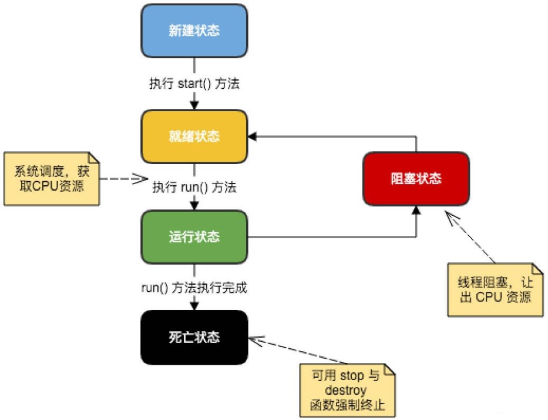

&emsp;&emsp;`Java`为多线程编程提供了内置的支持。一条线程指的是进程中一个单一顺序的控制流，一个进程中可以并发多个线程，每条线程并行执行不同的任务。多线程是多任务的一种特别的形式，但是使用了更小的资源开销。多线程能满足程序员编写高效率的程序来达到充分利用`CPU`的目的。
&emsp;&emsp;这里定义和线程相关的另一个术语`进程`：一个进程包括由操作系统分配的内存空间，包含一个或多个线程。一个线程不能独立的存在，它必须是进程的一部分。一个进程一直运行，直到所有的非守护线程都结束运行后才能结束。

### 一个线程的生命周期

&emsp;&emsp;线程是一个动态执行的过程，它也有一个从产生到死亡的过程。下图显示了一个线程完整的生命周期：



- 新建状态：使用`new`关键字和`Thread`类或其子类建立一个线程对象后，该线程对象就处于新建状态。它保持这个状态，直到程序`start`这个线程。
- 就绪状态：当线程对象调用了`start`方法之后，该线程就进入就绪状态。就绪状态的线程处于就绪队列中，要等待`JVM`里线程调度器的调度。
- 运行状态：如果就绪状态的线程获取了`CPU`资源，就可以执行`run`，此时线程便处于运行状态。处于运行状态的线程最为复杂，它可以变为阻塞状态、就绪状态和死亡状态。
- 阻塞状态：如果一个线程执行了`sleep`(睡眠)、`suspend`(挂起)等方法，失去所占用资源之后，该线程就从运行状态进入阻塞状态。在睡眠时间已到或获得设备资源后，可以重新进入就绪状态。可以分为如下三种：

1. 等待阻塞：运行状态中的线程执行`wait`方法，使线程进入到等待阻塞状态。
2. 同步阻塞：线程在获取`synchronized`同步锁失败(因为同步锁被其他线程占用)。
3. 其他阻塞：通过调用线程的`sleep`或`join`发出了`I/O`请求时，线程就会进入到阻塞状态。当`sleep`状态超时，`join`等待线程终止或超时，或者`I/O`处理完毕，线程重新转入就绪状态。

- 死亡状态：一个运行状态的线程完成任务或者其他终止条件发生时，该线程就切换到终止状态。

### 线程的优先级

&emsp;&emsp;每一个`Java`线程都有一个优先级，这样有助于操作系统确定线程的调度顺序。`Java`线程的优先级是一个整数，其取值范围是`1`(`Thread.MIN_PRIORITY`)至`10`(`Thread.MAX_PRIORITY`)。默认情况下，每一个线程都会分配一个优先级`5`(`Thread.NORM_PRIORITY`)。
&emsp;&emsp;具有较高优先级的线程对程序更重要，并且应该在低优先级的线程之前分配处理器资源。但是线程优先级不能保证线程执行的顺序，而且非常依赖于平台。

### 创建一个线程

&emsp;&emsp;`Java`提供了三种创建线程的方法：通过实现`Runnable`接口；通过继承`Thread`类本身；通过`Callable`和`Future`创建线程。

#### 通过实现Runnable接口来创建线程

&emsp;&emsp;创建一个线程，最简单的方法是创建一个实现`Runnable`接口的类。为了实现`Runnable`，一个类只需要执行一个方法`run`：

``` java
public void run();
```

你可以重写该方法，它可以调用其他方法、使用其他类、声明变量，就像主线程一样。在创建一个实现`Runnable`接口的类之后，你可以在类中实例化一个线程对象。
&emsp;&emsp;`Thread`定义了几个构造方法，下面的这个是经常使用的：

``` java
Thread(Runnable threadOb, String threadName);
```

`threadOb`是一个实现`Runnable`接口的类的实例，并且由`threadName`指定新线程的名字。
&emsp;&emsp;新线程创建之后，你调用它的`start`方法才会运行：

``` java
void start();
```

下面是一个创建线程并开始让它执行的实例：

``` java
class RunnableDemo implements Runnable {
    private Thread t;
    private String threadName;
​
    RunnableDemo(String name) {
        threadName = name;
        System.out.println("Creating " + threadName);
    }
​
    public void run() {
        System.out.println("Running " + threadName);
        try {
            for (int i = 4; i > 0; i--) {
                System.out.println("Thread: " + threadName + ", " + i);
                Thread.sleep(50); /* 让线程睡眠一会 */
            }
        } catch (InterruptedException e) {
            System.out.println("Thread " + threadName + " interrupted.");
        }

        System.out.println("Thread " + threadName + " exiting.");
    }
​
    public void start() {
        System.out.println("Starting " + threadName);

        if (t == null) {
            t = new Thread(this, threadName);
            t.start();
        }
    }
}
​
public class TestThread {
    public static void main(String args[]) {
        RunnableDemo R1 = new RunnableDemo("Thread-1");
        R1.start();
​
        RunnableDemo R2 = new RunnableDemo("Thread-2");
        R2.start();
    }
}
```

执行结果：

``` java
Creating Thread-1
Starting Thread-1
Creating Thread-2
Starting Thread-2
Running Thread-1
Running Thread-2
Thread: Thread-2, 4
Thread: Thread-1, 4
Thread: Thread-2, 3
Thread: Thread-1, 3
Thread: Thread-2, 2
Thread: Thread-1, 2
Thread: Thread-2, 1
Thread: Thread-1, 1
Thread Thread-2 exiting.
Thread Thread-1 exiting.
```

#### 通过继承Thread来创建线程

&emsp;&emsp;创建一个线程的第二种方法是创建一个新的类，该类继承`Thread`类，然后创建一个该类的实例。继承类必须重写`run`方法，该方法是新线程的入口点。它也必须调用`start`方法才能执行。该方法尽管被列为一种多线程实现方式，但是本质上也是实现了`Runnable`接口的一个实例：

``` java
class ThreadDemo extends Thread {
    private Thread t;
    private String threadName;
​
    ThreadDemo(String name) {
        threadName = name;
        System.out.println("Creating " + threadName);
    }
​
    public void run() {
        System.out.println("Running " + threadName);

        try {
            for (int i = 4; i > 0; i--) {
                System.out.println("Thread: " + threadName + ", " + i);
                Thread.sleep(50);
            }
        } catch (InterruptedException e) {
            System.out.println("Thread " + threadName + " interrupted.");
        }

        System.out.println("Thread " + threadName + " exiting.");
    }
​
    public void start() {
        System.out.println("Starting " + threadName);

        if (t == null) {
            t = new Thread(this, threadName);
            t.start();
        }
    }
}
​
public class TestThread {
    public static void main(String args[]) {
        ThreadDemo T1 = new ThreadDemo("Thread-1");
        T1.start();
​
        ThreadDemo T2 = new ThreadDemo("Thread-2");
        T2.start();
    }
}
```

执行结果：

``` java
Creating Thread-1
Starting Thread-1
Creating Thread-2
Starting Thread-2
Running Thread-1
Running Thread-2
Thread: Thread-2, 4
Thread: Thread-1, 4
Thread: Thread-1, 3
Thread: Thread-2, 3
Thread: Thread-2, 2
Thread: Thread-1, 2
Thread: Thread-2, 1
Thread: Thread-1, 1
Thread Thread-1 exiting.
Thread Thread-2 exiting.
```

##### Thread方法

&emsp;&emsp;下表列出了`Thread`类的一些重要方法：

- `public void start()`：使该线程开始执行，`Java`虚拟机调用该线程的`run`方法。
- `public void run()`：如果该线程是使用独立的`Runnable`运行对象构造的，则调用该`Runnable`对象的`run`方法，否则该方法不执行任何操作并返回。
- `public final void setName(String name)`：改变线程名称，使之与参数`name`相同。
- `public final void setPriority(int priority)`：更改线程的优先级。
- `public final void setDaemon(boolean on)`：将该线程标记为守护线程或用户线程。
- `public final void join(long millisec)`：等待该线程终止的时间最长为`millis`毫秒。
- `public void interrupt()`：中断线程。
- `public final boolean isAlive()`：测试线程是否处于活动状态。

上述方法是被`Thread`对象调用的。下面的方法是`Thread`类的静态方法：

- `public static void yield()`：暂停当前正在执行的线程对象，并执行其他线程。
- `public static void sleep(long millisec)`：在指定的毫秒数内让当前正在执行的线程休眠(暂停执行)，此操作受到系统计时器和调度程序精度和准确性的影响。
- `public static boolean holdsLock(Object x)`：当且仅当当前线程在指定的对象上保持监视器锁时，才返回`true`。
- `public static Thread currentThread()`：返回对当前正在执行的线程对象的引用。
- `public static void dumpStack()`：将当前线程的堆栈跟踪打印至标准错误流。

&emsp;&emsp;如下的`ThreadClassDemo`程序演示了`Thread`类的一些方法：

``` java
class DisplayMessage implements Runnable {
    private String message;
​
    public DisplayMessage(String message) {
        this.message = message;
    }
​
    public void run() {
        while (true) {
            System.out.println(message);
        }
    }
}
​
class GuessANumber extends Thread {
    private int number;
​
    public GuessANumber(int number) {
        this.number = number;
    }
​
    public void run() {
        int counter = 0;
        int guess = 0;

        do {
            guess = (int) (Math.random() * 100 + 1);
            System.out.println(this.getName() + " guesses " + guess);
            counter++;
        } while (guess != number);

        System.out.println("** Correct!" + this.getName() + "in" + counter + "guesses.**");
    }
}
​
public class ThreadClassDemo {
    public static void main(String[] args) {
        Runnable hello = new DisplayMessage("Hello");
        Thread thread1 = new Thread(hello);
        thread1.setDaemon(true);
        thread1.setName("hello");
        System.out.println("Starting hello thread...");
        thread1.start();
​
        Runnable bye = new DisplayMessage("Goodbye");
        Thread thread2 = new Thread(bye);
        thread2.setPriority(Thread.MIN_PRIORITY);
        thread2.setDaemon(true);
        System.out.println("Starting goodbye thread...");
        thread2.start();
​
        System.out.println("Starting thread3...");
        Thread thread3 = new GuessANumber(27);
        thread3.start();

        try {
            thread3.join();
        } catch (InterruptedException e) {
            System.out.println("Thread interrupted.");
        }

        System.out.println("Starting thread4...");
        Thread thread4 = new GuessANumber(75);
​
        thread4.start();
        System.out.println("main() is ending...");
    }
}
```

执行结果：

``` java
Starting hello thread...
Starting goodbye thread...
Hello
Hello
Hello
Hello
Hello
Hello
Goodbye
Goodbye
Goodbye
Goodbye
Goodbye
.......
```

#### 通过Callable和Future创建线程

&emsp;&emsp;步骤如下：

- 创建`Callable`接口的实现类，并实现`call`方法，该`call`方法将作为线程执行体，并且有返回值。
- 创建`Callable`实现类的实例，使用`FutureTask`类来包装`Callable`对象，该`FutureTask`对象封装了该`Callable`对象的`call`方法的返回值。
- 使用`FutureTask`对象作为`Thread`对象的`target`，创建并启动新线程。
- 调用`FutureTask`对象的`get`方法来获得子线程执行结束后的返回值。

代码如下：

``` java
import java.util.concurrent.Callable;
import java.util.concurrent.FutureTask;
​
public class CallableThreadTest implements Callable<Integer> {
    public static void main(String[] args) {
        CallableThreadTest ctt = new CallableThreadTest();
        FutureTask<Integer> ft = new FutureTask<>(ctt);

        for (int i = 0; i < 5; i++) {
            System.out.println(Thread.currentThread().getName() + "的循环变量i的值" + i);

            if (i == 3) {
                new Thread(ft, "有返回值的线程").start();
            }
        }

        try {
            System.out.println("子线程的返回值：" + ft.get());
        } catch (InterruptedException e) {
            e.printStackTrace();
        } catch (Exception e) {
            e.printStackTrace();
        }​
    }
​
    @Override
    public Integer call() throws Exception {
        int i = 0;

        for (; i < 5; i++) {
            System.out.println(Thread.currentThread().getName() + " " + i);
        }

        return i;
    }
}
```

执行结果：

``` java
main的循环变量i的值0
main的循环变量i的值1
main的循环变量i的值2
main的循环变量i的值3
main的循环变量i的值4
有返回值的线程 0
有返回值的线程 1
有返回值的线程 2
有返回值的线程 3
有返回值的线程 4
子线程的返回值：5
```