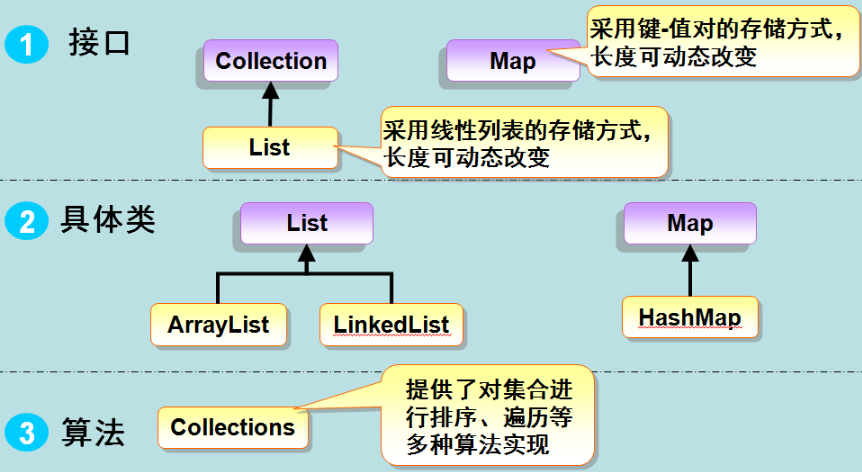

&emsp;&emsp;早在`Java 2`之前，`Java`就提供了特殊类(比如`Vector`、`Stack`和`Properties`)来存储和操作对象组。虽然这些类都非常有用，但是它们缺少一个核心的、统一的主题。因此，使用`Vector`类的方式和使用`Properties`类的方式有着很大不同。
&emsp;&emsp;集合框架是一个用来代表和操作集合的统一架构，所有的集合框架都包含如下内容：

- 接口：代表集合的抽象数据类型。接口允许集合独立操作其代表的细节。在面向对象的语言，接口通常形成一个层次。
- 实现(类)：集合接口的具体实现。从本质上讲，它们是可重复使用的数据结构。
- 算法：实现集合接口的对象里的方法执行的一些有用的计算，例如搜索和排序。这些算法被称为多态，那是因为相同的方法可以在相似的接口上有着不同的实现。

除了集合，该框架也定义了`Map`接口。尽管`Map`不是`collections`，但是它们完全整合在集合中。
&emsp;&emsp;集合框架被设计成要满足以下几个目标：

- 该框架必须是高性能的。基本集合(动态数组、链表、树、哈希表)的实现也必须是高效的。
- 该框架允许不同类型的集合，以类似的方式工作，具有高度的互操作性。
- 对一个集合的扩展和适应必须是简单的。

为此，整个集合框架就围绕一组标准接口而设计。你可以直接使用这些接口的标准实现，诸如`LinkedList`、`HashSet`和`TreeSet`等。除此之外，你也可以通过这些接口实现自己的集合。
&emsp;&emsp;集合框架体系如图所示：



Java集合框架提供了一套性能优良，使用方便的接口和类，它位于`java.util`包中，所以当使用集合框架时需要进行导包。

### 集合接口

&emsp;&emsp;集合框架定义了一些接口：

- `Collection`：`Collection`是最基本的集合接口，一个`Collection`代表一组`Object`，即`Collection`的元素。`Java`不提供直接继承自`Collection`的类，只提供继承于的子接口(如`List`和`set`)。
- `List`：`List`接口是一个有序的`Collection`，使用此接口能够精确的控制每个元素插入的位置，能够通过索引(元素在`List`中位置，类似于数组的下标)来访问`List`中的元素。第一个元素的索引为`0`，而且允许有相同的元素。
- `Set`：`Set`具有与`Collection`完全一样的接口，只是行为上不同，`Set`不保存重复的元素。
- `SortedSet`：继承自`Set`，保存有序的集合。
- `Map`：将唯一的键映射到值。
- `Map.Entry`：描述在一个`Map`中的一个元素(键值对)，是`Map`的内部类。
- `SortedMap`：继承自`Map`，使`Key`保持在升序排列。
- `Enumeration`：这是一个传统的接口和定义的方法，通过它可以枚举(一次获得一个)对象集合中的元素。这个传统接口已被迭代器取代。

&emsp;&emsp;`Set`和`List`的区别：

- `Set`接口实例存储的是无序的、不重复的数据。`List`接口实例存储的是有序的，可以重复的元素。
- `Set`检索效率低下，删除和插入效率高，插入和删除不会引起元素位置改变(实现类有`HashSet`和`TreeSet`)。
- `List`和数组类似，可以动态增长，根据实际存储的数据的长度自动增长`List`的长度。查找元素效率高，插入删除效率低，因为会引起其他元素位置改变(实现类有`ArrayList`、`LinkedList`和`Vector`)。

### 集合实现类(集合类)

&emsp;&emsp;`Java`提供了一套实现了`Collection`接口的标准集合类。其中一些是具体类，这些类可以直接拿来使用，而另外一些是抽象类，提供了接口的部分实现：

- `AbstractCollection`：实现了大部分的集合接口。
- `AbstractList`：继承于`AbstractCollection`，并且实现了大部分`List`接口。
- `AbstractSequentialList`：继承自`AbstractList`，提供了对数据元素的链式访问而不是随机访问。
- `LinkedList`：该类实现了`List`接口，允许有`null`元素，主要用于创建链表数据结构。`LinkedList`查找效率低。该类没有同步方法，如果多个线程同时访问一个`List`，则必须自己实现访问同步，解决方法就是在创建`List`时候构造一个同步的`List`：

``` java
Listlist = Collections.synchronizedList(newLinkedList(...));
```

- `ArrayList`：该类也实现了`List`的接口，也是可变大小的数组，随机访问和遍历元素时，提供更好的性能。该类也是非同步的，在多线程的情况下不要使用。`ArrayList`增长当前长度的`50%`，插入删除效率低。
- `AbstractSet`：继承于`AbstractCollection`，并且实现了大部分`Set`接口。
- `HashSet`：该类实现了`Set`接口，不允许出现重复元素，不保证集合中元素的顺序，允许包含值为`null`的元素，但最多只能一个。
- `LinkedHashSet`：具有可预知迭代顺序的`Set`接口的哈希表和链接列表实现。
- `TreeSet`：该类实现了`Set`接口，可以实现排序等功能。
- `AbstractMap`：实现了大部分的`Map`接口。
- `HashMap`：`HashMap`是一个散列表，它存储的内容是键值对(`key-value`)映射。该类实现了`Map`接口，根据键的`HashCode`值存储数据，具有很快的访问速度，最多允许一条记录的键为`null`，不支持线程同步。
- `TreeMap`：继承于`AbstractMap`，并且使用一棵树。
- `WeakHashMap`：继承于`AbstractMap`类，使用弱密钥的哈希表。
- `LinkedHashMap`：继承于`HashMap`类，使用元素的自然顺序对元素进行排序。
- `IdentityHashMap`：继承于`AbstractMap`类，比较文档时使用。

&emsp;&emsp;`java.util`包中定义的类如下：

- `Vector`：该类和`ArrayList`非常相似，但是该类是同步的，可以用在多线程的情况。该类允许设置默认的增长长度，默认扩容方式为原来的`2`倍。
- `Stack`：栈是`Vector`的一个子类，它实现了一个标准的后进先出的栈。
- `Hashtable`：`Hashtable`是`Dictionary`类的子类，位于`java.util`包中。
- `Properties`：`Properties`继承于`Hashtable`，表示一个持久的属性集，属性列表中每个键及其对应值都是一个字符串。
- `BitSet`：一个`Bitset`类创建一种特殊类型的数组来保存位值。`BitSet`中数组大小会随需要增加。

### 集合算法

&emsp;&emsp;集合框架定义了几种算法，可用于集合和映射。这些算法被定义为集合类的静态方法。在尝试比较不兼容的类型时，一些方法能够抛出`ClassCastException`异常。当试图修改一个不可修改的集合时，抛出`UnsupportedOperationException`异常。
&emsp;&emsp;集合定义三个静态的变量：`EMPTY_SET`，`EMPTY_LIST`和`EMPTY_MAP`，这些变量都不可改变。

### 如何使用迭代器

&emsp;&emsp;通常情况下，你会希望遍历一个集合中的元素，例如显示集合中的每个元素。一般遍历数组都是采用`for`循环或者`增强for`，这两个方法也可以用在集合框架。但是还有一种方法是采用迭代器遍历集合框架，它是一个对象，实现了`Iterator`接口或`ListIterator`接口。
&emsp;&emsp;迭代器使你能够通过循环来得到或删除集合的元素。`ListIterator`继承了`Iterator`，以允许双向遍历列表和修改元素：

``` java
import java.util.*;
​
public class Test {
    public static void main(String[] args) {
        List<String> list = new ArrayList<String>();
        list.add("Hello");
        list.add("World");
        list.add("HAHAHAHA");
​
        /* 使用foreach遍历List */
        for (String str : list) { /* 也可以写成“for(int i=0;i<list.size();i++)”这种形式 */
            System.out.println(str);
        }
​
        /* 把链表变为数组相关的内容进行遍历 */
        String[] strArray = new String[list.size()];
        list.toArray(strArray);
        for (int i = 0; i < strArray.length; i++) { /* 也可以改写成“foreach(String str:strArray)”这种形式 */
            System.out.println(strArray[i]);
        }
​
        Iterator<String> ite = list.iterator(); /* 使用迭代器进行相关遍历 */
        while (ite.hasNext()) { /* 判断下一个元素之后有值 */
            System.out.println(ite.next());
        }
    }
}
```

三种方法都是用来遍历`ArrayList`集合，第三种方法是采用迭代器的方法，该方法可以不用担心在遍历的过程中会超出集合的长度。
&emsp;&emsp;遍历`Map`如下：

``` java
import java.util.*;
​
public class Test {
    public static void main(String[] args) {
        Map<String, String> map = new HashMap<String, String>();
        map.put("1", "value1");
        map.put("2", "value2");
        map.put("3", "value3");
​
        /* 第一种 */
        System.out.println("通过Map.keySet遍历key和value：");
        for (String key : map.keySet()) {
            System.out.println("key = " + key + " and value = " + map.get(key));
        }
​
        /* 第二种 */
        System.out.println("通过Map.entrySet使用iterator遍历key和value：");
        Iterator<Map.Entry<String, String>> it = map.entrySet().iterator();
        while (it.hasNext()) {
            Map.Entry<String, String> entry = it.next();
            System.out.println("key = " + entry.getKey() + " and value = " + entry.getValue());
        }
​
        /* 第三种：推荐该方法，尤其是容量大时 */
        System.out.println("通过Map.entrySet遍历key和value");
        for (Map.Entry<String, String> entry : map.entrySet()) {
            System.out.println("key = " + entry.getKey() + " and value = " + entry.getValue());
        }
​
        /* 第四种 */
        System.out.println("通过Map.values遍历所有的value，但不能遍历key");
        for (String v : map.values()) {
            System.out.println("value = " + v);
        }
    }
}
```

执行结果：

``` java
通过Map.keySet遍历key和value：
key = 1 and value = value1
key = 2 and value = value2
key = 3 and value = value3
通过Map.entrySet使用iterator遍历key和value：
key = 1 and value = value1
key = 2 and value = value2
key = 3 and value = value3
通过Map.entrySet遍历key和value
key = 1 and value = value1
key = 2 and value = value2
key = 3 and value = value3
通过Map.values遍历所有的value，但不能遍历key
value = value1
value = value2
value = value3
```