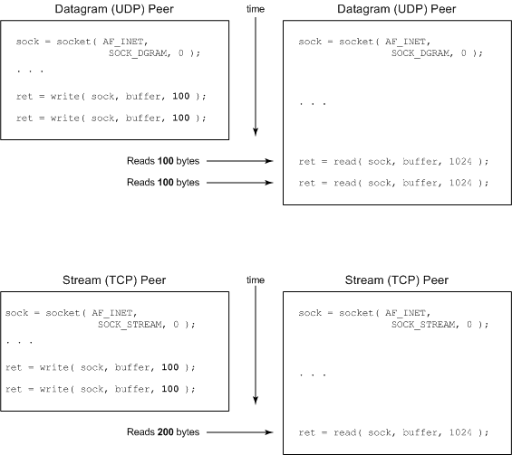

&emsp;&emsp;`Socket API`是网络应用程序开发中实际应用的标准`API`。它是在`4.2 BSD UNIX`操作系统中首次引入的，现在是任何操作系统的标准特性。事实上，很难找到一种不支持`Sockets API`的现代语言。尽管该`API`简单，但是开发新手可能会经历一些常见的问题。本文识别一些最常见的隐患并向您展示如何避免它们。

### 隐患1：忽略返回状态

&emsp;&emsp;第一个隐患很明显，但它是开发新手最容易犯的一个错误。如果您忽略函数的返回状态，当它们失败或部分成功的时候，您也许会迷失。反过来，这可能传播错误，使得定位问题的源头变得困难。捕获并检查每一个返回状态，而不是忽略它们。考虑清单`1`显示的例子：

``` cpp
int status, sock, mode;
/* Create a new stream (TCP) socket */
sock = socket ( AF_INET, SOCK_STREAM, 0 );
...
status = send ( sock, buffer, buflen, MSG_DONTWAIT );
​
if ( status == -1 ) {
    /* send failed */
    printf ( "send failed: %s\n", strerror ( errno ) );
} else {
    /* send succeeded -- or did it? */
}
```

清单`1`探究一个函数片断，它完成套接字`send`操作(通过套接字发送数据)。函数的错误状态被捕获并测试，但这个例子忽略了`send`在无阻塞模式(由`MSG_DONTWAIT`标志启用)下的一个特性。
&emsp;&emsp;`send`函数有三类可能的返回值：

- 如果数据成功地排到传输队列，则返回`0`。
- 如果排队失败，则返回`-1`(通过使用`errno`变量可以了解失败的原因)。
- 如果不是所有的字符都能够在函数调用时排队，则最终的返回值是发送的字符数。

&emsp;&emsp;由于`send`的`MSG_DONTWAIT`变量的无阻塞性质，函数调用在发送完所有的数据、一些数据或没有发送任何数据后返回。在这里忽略返回状态将导致不完全的发送和随后的数据丢失。

### 隐患2：对等套接字闭包

&emsp;&emsp;`UNIX`有趣的一面是，您几乎可以把任何东西看成是一个文件，文件本身、目录、管道、设备和套接字都被当作文件。这是新颖的抽象，意味着一整套的`API`可以用在广泛的设备类型上。
&emsp;&emsp;考虑`read`函数，它从文件读取一定数量的字节。`read`函数返回读取的字节数(最高为您指定的最大值)；或者`-1`，表示错误；或者`0`，如果已经到达文件末尾。
&emsp;&emsp;如果在一个套接字上完成一个`read`操作并得到一个为`0`的返回值，这表明远程套接字端的对等层调用了`close`方法。该指示与文件读取相同，即没有多余的数据可以通过描述符读取。

``` cpp
int sock, status;
sock = socket ( AF_INET, SOCK_STREAM, 0 );
...
status = read ( sock, buffer, buflen );
​
if ( status > 0 ) {
    /* Data read from the socket */
} else if ( status == -1 ) {
    /* Error, check errno, take action... */
} else if ( status == 0 ) {
    /* Peer closed the socket, finish the close */
    close ( sock );
    /* Further processing... */
}
```

同样，可以用`write`函数来探测对等套接字的闭包。在这种情况下，接收`SIGPIPE`信号，或如果该信号阻塞，`write`函数将返回`-1`，并设置`errno`为`EPIPE`。

### 隐患3：地址使用错误(EADDRINUSE)

&emsp;&emsp;您可以使用`bind`函数来绑定一个地址(一个接口和一个端口)到一个套接字端点。可以在服务器设置中使用这个函数，以便限制可能有连接到来的接口。也可以在客户端设置中使用这个函数，以便限制应当供出去的连接所使用的接口。`bind`最常见的用法是关联端口号和服务器，并使用通配符地址(`INADDR_ANY`)，它允许任何接口为到来的连接所使用。
&emsp;&emsp;`bind`普遍遭遇的问题是试图绑定一个已经在使用的端口。该陷阱是也许没有活动的套接字存在，但仍然禁止绑定端口(`bind`返回`EADDRINUSE`)，它由`TCP`套接字状态`TIME_WAIT`引起。该状态在套接字关闭后约保留`2`到`4`分钟。在`TIME_WAIT`状态退出之后，套接字被删除，该地址才能被重新绑定而不出问题。
&emsp;&emsp;等待`TIME_WAIT`结束可能是令人恼火的一件事，特别是如果您正在开发一个套接字服务器，就需要停止服务器来做一些改动，然后重启。幸运的是，有方法可以避开`TIME_WAIT`状态。可以给套接字应用`SO_REUSEADDR`套接字选项，以便端口可以马上重用。
&emsp;&emsp;考虑下面的例子，在绑定地址之前，我以`SO_REUSEADDR`选项调用`setsockopt`。为了允许地址重用，我设置整型参数`on`为`1`(当然可以设为`0`来禁止地址重用)。

``` cpp
int sock, ret, on;
struct sockaddr_in servaddr;
/* Create a new stream (TCP) socket */
sock = socket ( AF_INET, SOCK_STREAM, 0 );
/* Enable address reuse */
on = 1;
ret = setsockopt ( sock, SOL_SOCKET, SO_REUSEADDR, &on, sizeof ( on ) );
/* Allow connections to port 8080 from any available interface */
memset ( &servaddr, 0, sizeof ( servaddr ) );
servaddr.sin_family = AF_INET;
servaddr.sin_addr.s_addr = htonl ( INADDR_ANY );
servaddr.sin_port = htons ( 45000 );
/* Bind to the address (interface/port) */
ret = bind ( sock, ( struct sockaddr * ) &servaddr, sizeof ( servaddr ) );
```

在应用了`SO_REUSEADDR`选项之后，`bind`函数将允许地址的立即重用。

### 隐患4：发送结构化数据

&emsp;&emsp;套接字是发送无结构二进制字节流或`ASCII`数据流(比如`HTTP`上的`HTTP`页面，或`SMTP`上的电子邮件)的完美工具。但是如果试图在一个套接字上发送二进制数据，事情将会变得更加复杂。
&emsp;&emsp;例如您想要发送一个整数，您可以肯定接收者将使用同样的方式来解释该整数吗？运行在同一架构上的应用程序可以依赖它们共同的平台来对该类型的数据做出相同的解释。但是如果一个运行在高位优先的`PowerPC`上的客户端发送一个`32`位的整数到一个低位优先的`Intel`，那将会发生什么呢？字节排列将引起不正确的解释。
&emsp;&emsp;通过套接字发送一个`C`语言结构会怎么样呢？这里也会遇到麻烦，因为不是所有的编译器都以相同的方式排列一个结构的元素。结构也可能被压缩以便使浪费的空间最少，这进一步使结构中的元素错位。
&emsp;&emsp;幸好有解决这个问题的方案，能够保证两端数据的一致解释。过去，远程过程调用(`Remote Procedure Call`，`RPC`)套装工具提供所谓的外部数据表示(`External Data Representation`，`XDR`)。`XDR`为数据定义一个标准的表示来支持异构网络应用程序通信的开发。
&emsp;&emsp;现在有两个新的协议提供相似的功能。`可扩展标记语言/远程过程调用`(`XML/RPC`)以`XML`格式安排`HTTP`上的过程调用。数据和元数据用`XML`进行编码并作为字符串传输，并通过主机架构把值和它们的物理表示分开。`SOAP`跟随`XML-RPC`，以更好的特性和功能扩展了它的思想。

### 隐患5：TCP中的帧同步假定

&emsp;&emsp;`TCP`不提供帧同步，这使得它对于面向字节流的协议是完美的。这是`TCP`与`UDP`的一个重要区别。`UDP`是面向消息的协议，它保留发送者和接收者之间的消息边界。`TCP`是一个面向流的协议，它假定正在通信的数据是无结构的，如图`1`所示：



<p align="center" style="color:green">图1 UDP的帧同步能力和缺乏帧同步的TCP</p>

&emsp;&emsp;图`1`的上部说明一个`UDP`客户端和服务器。左边的对等层完成两个套接字的写操作，每个为`100`字节。协议栈的`UDP`层追踪写的数量，并确保当右边的接收者通过套接字获取数据时，它以同样数量的字节到达。换句话说，为读者保留了写者提供的消息边界。
&emsp;&emsp;现在看图`1`的底部，它为`TCP`层演示了相同粒度的写操作。两个独立的写操作(每个为`100`字节)写入流套接字。但在本例中，流套接字的读者得到的是`200`字节。协议栈的`TCP`层聚合了两次写操作，这种聚合可以发生在`TCP/IP`协议栈的发送者或接收者中任何一方。重要的是，要注意到聚合也许不会发生，即`TCP`只保证数据的有序发送。
&emsp;&emsp;对大多数开发人员来说，该陷阱会引起困惑。您想要获得`TCP`的可靠性和`UDP`的帧同步。除非改用其他的传输协议，比如流传输控制协议`STCP`，否则就要求应用层开发人员来实现缓冲和分段功能。

### 调试套接字应用程序的工具

&emsp;&emsp;`GNU/Linux`提供几个工具，它们可以帮助您发现套接字应用程序中的一些问题。此外，使用这些工具还有教育意义，而且能够帮助解释应用程序和`TCP/IP`协议栈的行为。

#### 查看网络子系统的细节

&emsp;&emsp;`netstat`工具提供查看`GNU/Linux`网络子系统的能力。使用`netstat`可以查看当前活动的连接(按单个协议进行查看)，查看特定状态的连接(比如处于监听状态的服务器套接字)和许多其他的信息。下面展示了`netstat`提供的一些选项和它们启用的特性。

``` bash
netstat --tcp         # View all TCP sockets currently active
netstat --udp         # View all UDP sockets
netstat --listening   # View all TCP sockets in the listening state
netstat --groups      # View the multicast group membership information
netstat --masquerade  # Display the list of masqueraded connections
netstat --statistics  # View statistics for each protocol
```

尽管存在许多其他的实用程序，但`netstat`的功能很全面，它覆盖了`route`、`ifconfig`和其他标准`GNU/Linux`工具的功能。

#### 监视流量

&emsp;&emsp;可以使用`GNU/Linux`的几个工具来检查网络上的低层流量。`tcpdump`工具是一个比较老的工具，它从网上嗅探网络数据包，打印到`stdout`或记录在一个文件中。该功能允许查看应用程序产生的流量和`TCP`生成的低层流控制机制。一个叫做`tcpflow`的新工具与`tcpdump`相辅相成，它提供协议流分析和适当地重构数据流的方法，而不管数据包的顺序或重发。下面展示了`tcpdump`的两个用法模式：

``` bash
tcpdump -l -i eth0  # Display all traffic on the eth0 interface for the local host
tcpdump host plato  # Show all traffic on the network coming from or going to host plato
tcpdump host camus and (port http)  # Show all HTTP traffic for host camus
tcpdump tcp port 45000  # View traffic coming from or going to TCP port 45000 on the local host
```

`tcpdump`和`tcpflow`工具有大量的选项，包括创建复杂过滤表达式的能力。

### 字节交换还是不呢？

&emsp;&emsp;`Endianness`是指内存中字节的排列顺序。高位优先(`big endian`)按最高有效字节在前排列，然而低位优先(`little endian`)按照最低有效字节在前排序。
&emsp;&emsp;高位优先架构(比如`PowerPC`)比低位优先架构(比如`Intel`的`Pentium`系列，其网络字节顺序是高位优先)有优势。这意味着对高位优先的机器来说，在`TCP/IP`内控制数据是自然有序的。低位优先架构要求字节交换，对网络应用程序来说，这是一个轻微的性能弱点。