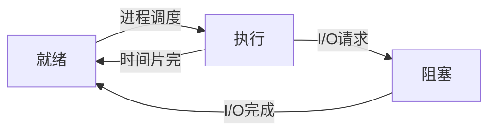

### 系统调用之文件访问

#### 文件编程

&emsp;&emsp;`Linux`文件编程可以使用两种方法：`Linux`系统调用和`C`语言库函数，前者依赖于`Linux`系统，后者与操作系统是独立的，在任何操作系统下，使用`C`语言库函数操作文件的方法都是相同的。<!--more-->

#### 创建文件

``` cpp
int creat ( const char *filename, mode_t mode );
```

参数`filename`是要创建的文件名(包含路径，缺省为当前路径)，`mode`为创建模式。常见创建模式如下：

模式      | 说明
----------|-----
`S_IRUSR` | 可读
`S_IWUSR` | 可写
`S_IXUSR` | 可执行
`S_IRWXU` | 可读、写、执行

&emsp;&emsp;除了可以使用上述宏以外，还可以直接使用数字来表示文件的访问权限：

数字 | 权限
-----|-----
`1`  | 可执行
`2`  | 可写
`4`  | 可读
`6`  | 可写可读(即`4 + 2`)
`0`  | 无任何权限

&emsp;&emsp;使用`creat`函数创建文件：

``` cpp
#include <stdio.h>
#include <stdlib.h>
#include <sys/types.h>
#include <sys/stat.h>
#include <fcntl.h>

void create_file ( char *filename ) {
    if ( creat ( filename, 0755 ) < 0 ) {
        printf ( "create file %s failure!\n", filename );
        exit ( EXIT_FAILURE );
    } else {
        printf ( "create file %s success!\n", filename );
    }
}

int main ( int argc, char *argv[] ) {
    int i;
    if ( argc < 2 ) {
        perror ( "you haven't input the filename, please try again!\n" );
        exit ( EXIT_FAILURE );
    }

    for ( i = 1; i < argc; i++ ) {
        create_file ( argv[i] );
    }

    exit ( EXIT_SUCCESS );
}
```

#### 文件描述

&emsp;&emsp;在`Linux`系统中，所有打开的文件都对应一个文件描述符。文件描述符的本质是一个非负整数。当打开一个文件时，该整数由系统来分配。文件描述符的范围是`0`至`OPEN_MAX`。早期`UNIX`的`OPEN_MAX`为`19`，即允许每个进程同时打开`20`个文件，现在很多系统则将其增加至`1024`。

#### 打开文件

``` cpp
int open ( const char *pathname, int flags );
int open ( const char *pathname, int flags, mode_t mode );
```

参数`pathname`是要打开的文件名(包含路径，缺省为当前路径)，`flags`是打开标志。常见的打开标志：

标志         | 说明
------------|-------
`O_RDONLY`  | 只读方式打开
`O_WRONLY`  | 只写方式打开
`O_RDWR`    | 读写方式打开
`O_APPEND`  | 追加方式打开
`O_CREAT`   | 创建一个文件
`O_NOBLOCK` | 非阻塞方式打开

&emsp;&emsp;如果使用了`O_CREATE`标志，则使用的函数是`int open(const char *pathname, int flags, mode_t mode);`，这时需要指定`mode`来表示文件的访问权限。

#### 关闭文件

&emsp;&emsp;当我们操作完文件以后，需要关闭文件：

``` cpp
int close ( int fd ); /* fd是文件描述符 */
```

对文件进行打开或关闭操作：

``` cpp
#include <stdio.h>
#include <stdlib.h>
#include <sys/types.h>
#include <sys/stat.h>
#include <fcntl.h>

int main ( int argc, char *argv[] ) {
    int fd;
    if ( argc < 2 ) {
        puts ( "please input the open file pathname!\n" );
        exit ( 1 );
    }

    /* 如果flag参数里有O_CREAT，表示该文件如果不存在，系统则会创建该文件，
       该文件的权限由第三个参数决定，此处为0755。如果flah参数里没有O_CREAT参数，
       则第三个参数不起作用。此时，如果要打开的文件不存在，则会报错。
       所以“fd = open(argv[1], O_RDWR)”仅仅只是打开指定文件 */
    if ( ( fd = open ( argv[1], O_CREAT | O_RDWR, 0755 ) ) < 0 ) {
        perror ( "open file failure!\n" );
        exit ( 1 );
    } else {
        printf ( "open file %d  success!\n", fd );
    }

    close ( fd );
    exit ( 0 );
}
```

#### 读文件

``` cpp
int read ( int fd, const void *buf, size_t length );
```

从文件描述符`fd`所指定的文件中读取`length`个字节到`buf`所指向的缓冲区中，返回值为实际读取的字节数。

#### 写文件

``` cpp
int write ( int fd, const void *buf, size_t length );
```

把`length`个字节从`buf`指向的缓冲区中写到文件描述符`fd`所指向的文件中，返回值为实际写入的字节数。

#### 文件定位

``` cpp
int lseek ( int fd, offset_t offset, int whence );
```

将文件读写指针相对`whence`移动`offset`个字节。操作成功时，返回文件指针相对于文件头的位置。`whence`可使用下述值：

whence     | 说明
-----------|------
`SEEK_SET` | 相对文件开头
`SEEK_CUR` | 相对文件读写指针的当前位置
`SEEK_END` | 相对文件末尾

`offset`可取负值，表示向前移动。例如下述调用可将文件指针相对当前位置向前移动`5`个字节：

``` cpp
lseek ( fd, -5, SEEK_CUR );
```

由于`lseek`函数的返回值为文件指针相对于文件头的位置，因此下面调用的返回值就是文件的长度：

``` cpp
lseek ( fd, 0, SEEK_END );
```

&emsp;&emsp;对文件进行读写操作：

``` cpp
#include "sys/types.h"
#include "sys/stat.h"
#include "fcntl.h"
#include "unistd.h"
#include "stdio.h"

#define NO_DUP 0

#if NO_DUP
int main ( void ) {
    int fd;
    char *buf = "123456789";
    char buf1[10];
    fd = open ( "./test.txt", O_RDWR | O_CREAT, 0755 ); /* 打开文件 */

    if ( fd < 0 ) {
        printf ( "open file fail\n" );
    }

    write ( fd, buf, 7 ); /* 写入文件 */
    lseek ( fd, 0, SEEK_SET ); /* 重定位文件指针 */
    read ( fd, buf1, 5 ); /* 读文件 */
    buf1[5] = '\0';
    printf ( "buf1 is %s\n", buf1 );
    return 0;
}
#else
int main ( void ) {
    int fd;
    int fd1;
    char *buf = "123456789";
    char buf1[10];
    fd = open ( "./test.txt", O_RDWR | O_CREAT, 0755 ); /* 打开文件 */

    if ( fd < 0 ) {
        printf ( "open file fail\n" );
    }

    fd1 = dup ( fd );
    write ( fd1, buf, 7 ); /* 写入文件 */
    lseek ( fd1, 0, SEEK_SET ); /* 重定位文件指针 */
    read ( fd1, buf1, 5 ); /* 读文件 */
    buf1[5] = '\0';
    printf ( "buf1 is %s\n", buf1 );
    return 0;
}
#endif
```

#### 文件访问判断

&emsp;&emsp;有时需要判断文件是否可以进行某种操作(读、写等)，这时可以使用`access`函数：

``` cpp
int access ( const char *pathname, int mode );
```

参数`pathname`是文件名称；`mode`是要判断的访问权限，可以取以下值或者是它们的组合：

mode   | 说明
-------|------
`R_OK` | 文件可读
`W_OK` | 文件可写
`X_OK` | 文件可执行
`F_OK` | 文件存在

当我们测试成功时，函数返回`0`，否则如果一个条件不符时，返回`-1`。

``` cpp
#include <unistd.h>
#include "stdio.h"

int main() {
    if ( access ( "/etc/passwd", R_OK ) == 0 ) {
        printf ( "/etc/passwd can be read!\n" );
    }

    return 0;
}
```

&emsp;&emsp;使用系统调用实现对文件的复制：

``` cpp
#include <sys/types.h>
#include <sys/stat.h>
#include <fcntl.h>
#include <stdio.h>
#include <errno.h>

#define BUFFER_SIZE 1024

int main ( int argc, char **argv ) {
    int from_fd, to_fd;
    int bytes_read, bytes_write;
    char buffer[BUFFER_SIZE];
    char *ptr;

    if ( argc != 3 ) {
        fprintf ( stderr, "Usage:%s fromfile tofile/n/a", argv[0] );
        exit ( 1 );
    }

    if ( ( from_fd = open ( argv[1], O_RDONLY ) ) == -1 ) { /* 打开源文件 */
        fprintf ( stderr, "Open %s Error:%s/n", argv[1], strerror ( errno ) );
        exit ( 1 );
    }

    /* 创建目的文件 */
    if ( ( to_fd = open ( argv[2], O_WRONLY | O_CREAT, S_IRUSR | S_IWUSR ) ) == -1 ) {
        fprintf ( stderr, "Open %s Error:%s/n", argv[2], strerror ( errno ) );
        exit ( 1 );
    }

    /* 以下代码是一个经典的拷贝文件的代码 */
    while ( bytes_read = read ( from_fd, buffer, BUFFER_SIZE ) ) {
        if ( ( bytes_read == -1 ) && ( errno != EINTR ) ) { /* 一个致命的错误发生了 */
            break;
        } else if ( bytes_read > 0 ) {
            ptr = buffer;

            while ( bytes_write = write ( to_fd, ptr, bytes_read ) ) {
                if ( ( bytes_write == -1 ) && ( errno != EINTR ) ) { /* 一个致命错误发生了 */
                    break;
                } else if ( bytes_write == bytes_read ) { /* 写完了所有读的字节 */
                    break;
                } else if ( bytes_write > 0 ) { /* 只写了一部分，继续写 */
                    ptr += bytes_write;
                    bytes_read -= bytes_write;
                }
            }

            if ( bytes_write == -1 ) { /* 写的时候发生的致命错误 */
                break;
            }
        }
    }

    close ( from_fd );
    close ( to_fd );
    exit ( 0 );
}
```

### 进程控制理论基础

#### 定义

&emsp;&emsp;进程是一个具有一定独立功能的程序的一次运行活动。其特点有：动态性、并发性、独立性和异步性。进程的状态变换如下：

<div align="center">



</div>

#### 进程ID

&emsp;&emsp;进程`ID`(`PID`)是标识进程的唯一数字；`PPID`是父进程的`ID`，`UID`是启动进程的用户`ID`。

#### 进程互斥

&emsp;&emsp;进程互斥是指当有若干进程都要使用某一共享资源时，任何时刻最多允许一个进程使用，其他要使用该资源的进程必须等待，直到占用该资源者释放了该资源为止。

#### 临界资源

&emsp;&emsp;操作系统中将一次只允许一个进程访问的资源称为`临界资源`。进程中访问临界资源的那段程序代码称为`临界区`。为实现对临界资源的互斥访问，应保证诸进程互斥地进入各自的临界区。

#### 进程同步

&emsp;&emsp;一组并发进程按一定的顺序执行的过程称为`进程间的同步`。具有同步关系的一组并发进程称为`合作进程`，合作进程间互相发送的信号称为`消息`或`事件`。

#### 进程调度

&emsp;&emsp;概念：按一定算法，从一组待运行的进程中选出一个来占有`CPU`运行。调度方式主要有`抢占式`和`非抢占式`。调度算法主要有`先来先服务调度算法`、`短进程优先调度算法`、`高优先级优先调度算法`和`时间片轮转法`。

#### 死锁

&emsp;&emsp;多个进程因竞争资源而形成一种僵局，若无外力作用，这些进程都将永远不能再向前推进。

#### 进程控制编程

&emsp;&emsp;获取`ID`：

``` cpp
#include <sys/types.h>
#include <unistd.h>
pid_t getpid ( void ); /* 获取本进程ID */
pid_t getppid ( void ); /* 获取父进程ID */
```

&emsp;&emsp;使用例程如下：

``` cpp
#include <stdio.h>
#include <unistd.h>
#include <stdlib.h>

int main ( void ) {
    printf ( "PID = %d\n", getpid() );
    printf ( "PPID = %d\n", getppid() );
    return 0;
}
```

### 进程间通讯概述

&emsp;&emsp;为什么进程间需要通信？

- 数据传输：一个进程需要将它的数据发送给另一个进程。
- 资源共享：多个进程之间共享同样的资源。
- 通知事件：一个进程需要向另一个或一组进程发送消息，通知它们发生了某种事件。
- 进程控制：有些进程希望完全控制另一个进程的执行(如`Debug`进程)，此时控制进程希望能够拦截另一个进程的所有操作，并能够及时知道它的状态改变。

#### 发展

&emsp;&emsp;`Linux`进程间通信(`IPC`)由以下几部分发展而来：

- `UNIX`进程间通信。
- 基于`System V`进程间通信。
- `POSIX`进程间通信。

#### 分类

&emsp;&emsp;现在`Linux`使用的进程间通信方式包括：管道(`pipe`)和有名管道(`FIFO`)、信号(`signal`)、消息队列、共享内存、信号量、套接字(`socket`)。

### 线程理论基础

#### 多线程

&emsp;&emsp;线程(`thread`)技术早在`60`年代就被提出，但真正应用多线程到操作系统中去，是在`80`年代中期，`solaris`是这方面的佼佼者。传统的`Unix`也支持线程的概念，但是在一个进程(`process`)中只允许有一个线程，这样多线程就意味着多进程。现在，多线程技术已经被许多操作系统所支持，包括`Windows NT`、`Linux`。

#### 优点

&emsp;&emsp;使用多线程的理由之一：和进程相比，它是一种非常`节俭`的多任务操作方式。在`Linux`系统下，启动一个新的进程必须分配给它独立的地址空间，建立众多的数据表来维护它的代码段、堆栈段和数据段，这是一种`昂贵`的多任务工作方式。运行于一个进程中的多个线程，它们之间使用相同的地址空间，而且线程间彼此切换所需的时间也远远小于进程间切换所需要的时间。据统计，一个进程的开销大约是一个线程开销的`30`倍左右。
&emsp;&emsp;使用多线程的理由之二：线程间方便的通信机制。对不同进程来说，它们具有独立的数据空间，要进行数据的传递只能通过进程间通信的方式进行，这种方式不仅费时，而且很不方便。线程则不然，由于同一进程下的线程之间共享数据空间，所以一个线程的数据可以直接为其它线程所用，这不仅快捷，而且方便。线程之间共享数据段，全局变量是数据段，局部变量是在栈里。多线程共享也有优先级，先用数据段(全局变量)，再用局部变量(栈)，进程的共享与之相反。
&emsp;&emsp;除了以上所说的优点外，多线程程序作为一种多任务、并发的工作方式，有如下优点：

- 使多`CPU`系统更加有效：操作系统会保证当线程数不大于`CPU`数目时，不同的线程运行于不同的`CPU`上。
- 改善程序结构：一个既长又复杂的进程可以考虑分为多个线程，成为几个独立或半独立的运行部分，这样的程序会利于理解和修改。

&emsp;&emsp;`Linux`系统下的多线程遵循`POSIX`线程接口，称为`pthread`。编写`Linux`下的多线程程序，需要使用头文件`pthread.h`，连接时需要使用库`libpthread.a`。默认情况下，`GCC`在编译的时候使用的是`C`库。

#### 创建线程

``` cpp
#include <pthread.h>
int pthread_create (
    pthread_t *tidp, const pthread_attr_t *attr,
    void * ( *start_rtn ) ( void ), void *arg );
```

参数`tidp`是线程`id`，`attr`是线程属性(通常为空)，`start_rtn`是线程要执行的函数，`arg`是`start_rtn`的参数。
&emsp;&emsp;`pthread_create`创建线程并使线程进入就绪态，而不是执行态。在进程执行到`sleep`函数时，它交出`cpu`控制权，于是线程得以执行。执行完线程后，这个线程也消失了。
&emsp;&emsp;线程的使用(无参数)：

``` cpp
#include <stdio.h>
#include <pthread.h>
#include <unistd.h> /* getpid() */

void *create ( void *arg ) {
    printf ( "New thread .... \n" );
    printf ( "This thread's id is %u\n", ( unsigned int ) pthread_self() );
    printf ( "The process pid is %d\n", getpid() );
    return ( void * ) 0;
}

int main ( int argc, char *argv[] ) {
    pthread_t tid;
    int error;
    printf ( "Main thread is starting ... \n" );
    error = pthread_create ( &tid, NULL, create, NULL );

    if ( error ) {
        printf ( "thread is not created ... \n" );
        return -1;
    }

    printf ( "The main process's pid is %d \n", getpid() );
    sleep ( 1 );
    return 0;
}
```

&emsp;&emsp;线程的使用(使用参数)：

``` cpp
#include <stdio.h>
#include <pthread.h>
#include <unistd.h>

void *create ( void *arg ) {
    int *num;
    num = ( int * ) arg;
    printf ( "create parameter is %d \n", *num );
    return ( void * ) 0;
}

int main ( int argc, char *argv[] ) {
    pthread_t tidp;
    int error;
    int test = 4;
    int *attr = &test;
    error = pthread_create ( &tidp, NULL, create, ( void * ) attr );

    if ( error ) {
        printf ( "pthread_create is created is not created ... \n" );
        return -1;
    }

    sleep ( 1 );
    printf ( "pthread_create is created ...\n" );
    return 0;
}
```

&emsp;&emsp;线程的使用(使用复杂参数)：

``` cpp
#include <stdio.h>
#include <pthread.h>
#include <unistd.h>
#include <stdlib.h>

struct menber {
    int a;
    char *s;
};

void *create ( void *arg ) { /* 线程执行函数 */
    struct menber *temp;
    temp = ( struct menber * ) arg;
    printf ( "menber->a = %d \n", temp->a );
    printf ( "menber->s = %s \n", temp->s );
    return ( void * ) 0;
}

int main ( int argc, char *argv[] ) {
    pthread_t tidp;
    int error;
    struct menber *b;
    /* 为结构体指针b分配内存并赋值 */
    b = ( struct menber * ) malloc ( sizeof ( struct menber ) );
    b->a = 4;
    b->s = "zieckey";
    /* 创建线程并运行线程执行函数 */
    error = pthread_create ( &tidp, NULL, create, ( void * ) b );

    if ( error ) {
        printf ( "phread is not created...\n" );
        return -1;
    }

    sleep ( 1 ); /* 进程睡眠一秒使线程执行完后进程才会结束 */
    printf ( "pthread is created...\n" );
    return 0;
}
```

#### 编译多线程代码

&emsp;&emsp;因为`pthread`的库不是`linux`系统的库，所以在进行编译的时候要加上`-lpthread`，如`gcc filename -lpthread`。

#### 终止线程

&emsp;&emsp;如果进程中任何一个线程中调用`exit`或`_exit`，那么整个进程都会终止。线程的正常退出方式有：

- 线程从启动例程中返回。
- 线程可以被另一个进程终止。
- 线程自己调用`pthread_exit`函数。

#### 线程退出

``` cpp
#include <pthread.h>
void pthread_exit ( void *rval_ptr );
```

功能为终止调用线程。参数`rval_ptr`是线程退出返回值的指针。
&emsp;&emsp;线程的设置与退出：

``` cpp
#include "stdio.h"
#include "stdlib.h"
#include "string.h"
#include "pthread.h"

char message[32] = "Hello World";
void *thread_function ( void *arg );

int main ( void ) {
    pthread_t a_thread;
    void *thread_result;

    if ( pthread_create ( &a_thread, NULL, thread_function, ( void * ) message ) < 0 ) {
        perror ( "fail to pthread_create" );
        exit ( -1 );
    }

    printf ( "waiting for thread to finish\n" );

    if ( pthread_join ( a_thread, &thread_result ) < 0 ) {
        perror ( "fail to pthread_join" );
        exit ( -1 );
    }

    printf ( "MESSAGE is now %s\n", message );
    return 0;
}

void *thread_function ( void *arg ) {
    printf ( "thread_function is running, argument is %s\n", ( char * ) arg );
    strcpy ( message, "marked by thread" );
    pthread_exit ( "Thank you for the cpu time" );
}
```

#### 线程等待

``` cpp
#include <pthread.h>
int pthread_join ( pthread_t tid, void **rval_ptr );
```

功能是阻塞调用线程，直到指定的线程终止。参数`tid`是等待退出的线程`id`，`rval_ptr`是线程退出的返回值的指针。
&emsp;&emsp;`pthread_join`的使用：

``` cpp
#include <pthread.h>
#include <unistd.h>
#include <stdio.h>

void *thread ( void *str ) {
    int i;

    for ( i = 0; i < 3; ++i ) {
        sleep ( 1 );
        printf ( "This in the thread : %d\n", i );
    }

    return NULL;
}

int main() {
    pthread_t pth;
    int i;
    int ret = pthread_create ( &pth, NULL, thread, ( void * ) ( 0 ) );
    pthread_join ( pth, NULL );
    printf ( "\n" );

    for ( i = 0; i < 3; ++i ) {
        sleep ( 1 );
        printf ( "This in the main : %d\n", i );
    }

    return 0;
}
```

&emsp;&emsp;带有参数的`pthread_join`函数：

``` cpp
#include <stdio.h>
#include <pthread.h>
#include <unistd.h>

void *create ( void *arg ) {
    printf ( "new thread is created ... \n" );
    return ( void * ) 8;
}

int main ( int argc, char *argv[] ) {
    pthread_t tid;
    int error;
    void *temp;
    error = pthread_create ( &tid, NULL, create, NULL );
    printf ( "main thread!\n" );

    if ( error ) {
        printf ( "thread is not created ... \n" );
        return -1;
    }

    error = pthread_join ( tid, &temp );

    if ( error ) {
        printf ( "thread is not exit ... \n" );
        return -2;
    }

    printf ( "thread is exit code %d \n", ( int ) temp );
    return 0;
}
```

#### 线程标识

``` cpp
#include <pthread.h>
pthread_t pthread_self ( void );
```

功能是获取调用线程的`thread identifier`，返回线程的`ID`。

#### 清除

&emsp;&emsp;线程终止有两种情况：正常终止和非正常终止。线程主动调用`pthread_exit`或者从线程函数中`return`都将使线程正常退出，这是可预见的退出方式；非正常终止是线程在其他线程的干预下，或者由于自身运行出错(比如访问非法地址)而退出，这种退出方式是不可预见的(非正常的例子有访问空指针)。
&emsp;&emsp;不论是可预见的线程终止还是异常终止，都会存在资源释放的问题，如何保证线程终止时能顺利的释放掉自己所占用的资源，是一个必须考虑解决的问题。
&emsp;&emsp;从`pthread_cleanup_push`的调用点到`pthread_cleanup_pop`之间的程序段中的终止动作(包括调用`pthread_exit`和异常终止，不包括`return`)都将执行`pthread_cleanup_push`所指定的清理函数。当某段代码有不可预知的非正常终止行为，就用`push`和`pop`保护起来。保护了之后，如果这段代码有不可预知的终止，我们就可以固定地在它终止之前去执行某一个函数。

``` cpp
#include <pthread.h>
void pthread_cleanup_push ( void ( *rtn ) ( void * ), void *arg );
```

功能是将清除函数压入清除栈。参数`Rtn`是清除函数，`Arg`是清除函数的参数。

``` cpp
#include <pthread.h>
void pthread_cleanup_pop ( int execute );
```

功能是将清除函数弹出清除栈。参数`execute`决定执行到`pthread_cleanup_pop`时是否在弹出清理函数的同时执行该函数，非`0`为执行，`0`为不执行。
&emsp;&emsp;线程的清除：

``` cpp
#include <stdio.h>
#include <pthread.h>
#include <unistd.h>

void *clean ( void *arg ) {
    printf ( "cleanup :%s \n", ( char * ) arg );
    return ( void * ) 0;
}

void *thr_fn1 ( void *arg ) {
    printf ( "thread 1 start \n" );
    pthread_cleanup_push ( ( void * ) clean, "thread 1 first handler" );
    pthread_cleanup_push ( ( void * ) clean, "thread 1 second hadler" );
    printf ( "thread 1 push complete \n" );

    if ( arg ) {
        return ( ( void * ) 1 );
    }

    pthread_cleanup_pop ( 0 );
    pthread_cleanup_pop ( 0 );
    return ( void * ) 1;
}

void *thr_fn2 ( void *arg ) {
    printf ( "thread 2 start \n" );
    pthread_cleanup_push ( ( void * ) clean, "thread 2 first handler" );
    pthread_cleanup_push ( ( void * ) clean, "thread 2 second handler" );
    printf ( "thread 2 push complete \n" );

    if ( arg ) {
        pthread_exit ( ( void * ) 2 );
    }

    pthread_cleanup_pop ( 0 );
    pthread_cleanup_pop ( 0 );
    pthread_exit ( ( void * ) 2 );
}

int main ( void ) {
    int err;
    pthread_t tid1, tid2;
    void *tret;
    err = pthread_create ( &tid1, NULL, thr_fn1, ( void * ) 1 );

    if ( err != 0 ) {
        printf ( "error .... \n" );
        return -1;
    }

    err = pthread_create ( &tid2, NULL, thr_fn2, ( void * ) 1 );

    if ( err != 0 ) {
        printf ( "error .... \n" );
        return -1;
    }

    err = pthread_join ( tid1, &tret );

    if ( err != 0 ) {
        printf ( "error .... \n" );
        return -1;
    }

    printf ( "thread 1 exit code %d \n", ( int ) tret );
    err = pthread_join ( tid2, &tret );

    if ( err != 0 ) {
        printf ( "error .... " );
        return -1;
    }

    printf ( "thread 2 exit code %d \n", ( int ) tret );
    return 1;
}
```

&emsp;&emsp;具体解释如下：

``` cpp
push ( A );
可能出现异常终止的代码;
pop ( 0或非0 );
```

假如`push`函数指明了`A`函数，在异常终止时，函数得到调用，可以在函数里释放资源，由`A`函数执行清除工作。如果没有出现异常，当执行到`pop`函数时，`pop`函数会决定`A`函数是否还要执行。

#### 线程同步

&emsp;&emsp;进行多线程编程，因为无法知道哪个线程会在哪个时候对共享资源进行操作，因此让如何保护共享资源变得复杂，通过下面这些技术的使用，可以解决线程之间对资源的竞争：

- 互斥量`Mutex`。
- 信号灯`Semaphore`。
- 条件变量`Conditions`。

&emsp;&emsp;线程的同步：

``` cpp
#include "stdio.h"
#include "stdlib.h"
#include "string.h"
#include "pthread.h"
#include "semaphore.h"

char buf[60];
sem_t sem;
void *function ( void *arg );

int main() {
    pthread_t a_thread;
    void *thread_result;

    if ( sem_init ( &sem, 0, 0 ) < 0 ) {
        perror ( "fail to sem_init" );
        exit ( -1 );
    }

    if ( pthread_create ( &a_thread, NULL, function, NULL ) < 0 ) {
        perror ( "fail to pthread_creat" );
        exit ( -1 );
    }

    printf ( "input 'quit' to exit\n" );

    do {
        fgets ( buf, 60, stdin );
        sem_post ( &sem );
    } while ( strncmp ( buf, "quit", 4 ) != 0 );

    return 0;
}

void *function ( void *argc ) {
    while ( 1 ) {
        sem_wait ( &sem );
        printf ( "You enter %d character\n", strlen ( buf ) - 1 );
    }
}
```

#### 互斥量

&emsp;&emsp;为什么需要互斥量？代码如下：

``` cpp
Item *p = queue_list;
Queue_list = queue_list->next;
process_job ( p );
free ( p );
```

当线程`1`处理完`Item *p = queue_list`后，系统停止线程`1`的运行，改而运行线程`2`。线程`2`照样取出头节点，然后进行处理，最后释放了该节点。过了一段时间，线程`1`重新得到运行。而这个时候，`p`所指向的节点已经被线程`2`释放掉，而线程`1`对此毫无知晓，它会接着运行`process_job(p)`，而这将导致无法预料的后果！
&emsp;&emsp;对于这种情况，系统给我们提供了互斥量。线程在取出头节点前必须要等待互斥量，如果此时有其他线程已经获得该互斥量，那么该线程将会阻塞在这里。只有等到其他线程释放掉该互斥量后，该线程才有可能得到该互斥量。互斥量从本质上说就是一把锁，提供对共享资源的保护访问。

#### 创建互斥量

&emsp;&emsp;在`Linux`中，互斥量使用类型`pthread_mutex_t`表示。在使用前，要对它进行初始化：

- 对于静态分配的互斥量，可以把它设置为默认的`mutex`对象`PTHREAD_MUTEX_INITIALIZER`。
- 对于动态分配的互斥，在申请内存(`malloc`)之后，通过`pthread_mutex_init`进行初始化，并且在释放内存(`free`)前需要调用`pthread_mutex_destroy`。

``` cpp
#include <pthread.h>
int pthread_mutex_init ( pthread_mutex_t *mutex, const pthread_mutexattr_t *attr );
int pthread_mutex_destroy ( pthread_mutex_t *mutex );
```

#### 加锁

&emsp;&emsp;对共享资源的访问，要使用互斥量进行加锁，如果互斥量已经上了锁，调用线程会阻塞，直到互斥量被解锁。

``` cpp
int pthread_mutex_lock ( pthread_mutex_t *mutex );
int pthread_mutex_trylock ( pthread_mutex_t *mutex );
```

函数执行成功则返回`0`，出错则返回错误编号。
&emsp;&emsp;`trylock`是非阻塞调用模式，如果互斥量没被锁住，`trylock`函数将对互斥量加锁，并获得对共享资源的访问权限；如果互斥量被锁住了，`trylock`函数将不会阻塞等待而直接返回`EBUSY`，表示共享资源处于忙状态。

#### 解锁

&emsp;&emsp;在操作完成后，必须给互斥量解锁，也就是前面所说的释放。这样，其他等待该锁的线程才有机会获得该锁，否则其他线程将会永远阻塞。

``` cpp
int pthread_mutex_unlock ( pthread_mutex_t *mutex );
```

#### 互斥量 vs 信号量

&emsp;&emsp;`Mutex`是一把钥匙，一个人拿了就可进入一个房间，出来的时候把钥匙交给队列的第一个。`Semaphore`是一件可以容纳`N`人的房间，如果人不满就可以进去；如果人满了，就要等待有人出来。对于`N = 1`的情况，称为`binary semaphore`。`Binary semaphore`与`Mutex`的差异：`mutex`要由获得锁的线程来释放(谁获得，谁释放)，`semaphore`可以由其它线程释放；初始状态可能不一样，`mutex`的初始值是`1`，而`semaphore`的初始值可能是`0`(或者为`1`)。
&emsp;&emsp;线程的互斥：

``` cpp
#include "stdio.h"
#include "stdlib.h"
#include "string.h"
#include "pthread.h"

#define _LOCK_ 1

int value1 = 1, value2 = 2;
unsigned int count = 0;
pthread_mutex_t mutex;
void *function ( void *arg );

int main() {
    pthread_t a_thread;
    void *thread_result;

    if ( pthread_mutex_init ( &mutex, NULL ) < 0 ) {
        perror ( "fail to mutex_init" );
        exit ( -1 );
    }

    if ( pthread_create ( &a_thread, NULL, function, NULL ) < 0 ) {
        perror ( "fail to pthread_create" );
        exit ( -1 );
    }

    while ( 1 ) {
        sleep ( 1 );
#ifdef _LOCK_
        pthread_mutex_lock ( &mutex );
#endif
        value1 = count;
        value2 = count;
        printf ( "count = %d, value1 = %d, value2 = %d\n", count, value1, value2 );
        value1 = ++count;
#ifdef _LOCK_
        pthread_mutex_unlock ( &mutex );
#endif
    }

    return 0;
}

void *function ( void *arg ) {
    while ( 1 ) {
        sleep ( 1 );
#ifdef _LOCK_
        pthread_mutex_lock ( &mutex );
#endif
        if ( value1 != value2 ) {
            printf ( "count = %d, value1 = %d, value2 = %d\n", count, value1, value2 );
        }
#ifdef _LOCK_
        pthread_mutex_unlock ( &mutex );
#endif
    }

    return 0;
}
```

### Linux网络编程

#### 网络模型


#### TCP/IP协议族

&emsp;&emsp;`TCP/IP`实际上一个协同工作的通信家族，为网络数据通信提供通路。为讨论方便可`TCP/IP`协议组大体上分为三部分：

- `Internet`协议(`IP`)。
- 传输控制协议(`TCP`)和用户数据报协议(`UDP`)。
- 处于`TCP`和`UDP`之上的一组应用协议，它们包括`TELNET`、文件传送协议(`FTP`)、域名服务(`DNS`)和简单邮件传送程序(`SMTP`)等。

#### 网络层

&emsp;&emsp;第一部分称为`网络层`。主要包括`Internet`协议(`IP`)、网际控制报文协议(`ICMP`)和地址解析协议(`ARP`)。

- `Internet`协议(`IP`)：该协议被设计成互联分组交换通信网，以形成一个网际通信环境。它负责在源主机和目的地主机之间传输来自其较高层软件的，称为`数据报文`的数据块，它在源和目的地之间提供非连接型传递服务。
- 网际控制报文协议(`ICMP`)：它实际上不是`IP`层部分，但直接同`IP`层一起工作，报告网络上的某些出错情况。允许网际路由器传输差错信息或测试报文。
- 地址解析协议(`ARP`)：`ARP`实际上不是网络层部分，它处于`IP`和数据链路层之间，它是在`32`位`IP`地址和`48`位物理地址之间执行翻译的协议。

#### 传输层协议

&emsp;&emsp;第二部分是传输层协议，包括传输控制协议和用户数据报文协议。

- 传输控制协议(`TCP`)：该协议对建立网络上用户进程之间的对话负责，它确保进程之间的可靠通信，所提供的功能如下：监听输入对话建立请求、请求另一网络站点对话、可靠的发送和接收数据和适度的关闭对话。
- 用户数据报文协议(`UDP`)：`UDP`提供不可靠的非连接型传输层服务，它允许在源和目的地之间传送数据，而不必在传送数据之前建立对话。它主要用于那些非连接型的应用程序，如视频点播。

#### 应用协议

&emsp;&emsp;这部分主要包括`Telnet`、文件传送协议(`FTP`和`TFTP`)，简单文件传送协议(`SMTP`)和域名服务(`DNS`)等协议。

#### IP协议

&emsp;&emsp;`IP`主要有以下四个主要功能：数据传送、寻址、路由选择和数据报文的分段。
&emsp;&emsp;`IP`的主要目的是为数据`输入/输出`网络提供基本算法，为高层协议提供无连接的传送服务。这意味着在`IP`将数据递交给接收站点以前不在传输站点和接收站点之间建立对话。它只是封装和传递数据，但不向发送者或接收者报告包的状态，不处理所遇到的故障。

#### TCP协议

&emsp;&emsp;`TCP`是重要的传输层协议，目的是允许数据同网络上的其他节点进行可靠的交换。它能提供端口编号的译码，以识别主机的应用程序，而且完成数据的可靠传输。`TCP`协议具有严格的内装差错检验算法确保数据的完整性。`TCP`是面向字节的顺序协议，这意味着包内的每个字节被分配一个顺序编号，并分配给每包一个顺序编号。

#### UDP协议

&emsp;&emsp;`UDP`也是传输层协议，它是无连接的，不可靠的传输服务。当接收数据时它不向发送方提供确认信息，它不提供输入包的顺序，如果出现丢失包或重份包的情况，也不会向发送方发出差错报文。由于它执行功能时具有较低的开销，因而执行速度比`TCP`快。

#### Socket

&emsp;&emsp;`Linux`中的网络编程通过`Socket`接口实现，`Socket`是一种文件描述符。套接字`socket`有三种类型：

- 流式套接字(`SOCK_STREAM`)：流式的套接字可以提供可靠的、面向连接的通讯流。它使用了`TCP`协议。`TCP`保证了数据传输的正确性和顺序性。
- 数据报套接字(`SOCK_DGRAM`)：数据报套接字定义了一种无连接的服务，数据通过相互独立的报文进行传输，是无序的，并且不保证可靠，无差错，它使用数据报协议`UDP`。
- 原始套接字：原始套接字允许对低层协议如`IP`或`ICMP`直接访问，主要用于新的网络协议的测试等。

#### 地址结构

``` cpp
struct sockaddr {
    u_short sa_family; /* 地址族，采用“AF_xxx”的形式，如AF_INET */
    char sa_data[14]; /* 14字节的特定协议地址 */
}

struct in_addr {
    unsigned long s_addr; /* 32位的地址 */
}

struct sockaddr_in {
    short int sin_family;        /* Internet地址族 */
    unsigned short int sin_port; /* 端口号         */
    struct in_addr sin_addr;     /* IP地址         */
    unsigned char sin_zero[8];   /* 填0            */
}
```

编程中一般并不直接针对`sockaddr`数据结构操作，而是使用与`sockaddr`等价的`sockaddr_in`数据结构。

#### 地址转换

&emsp;&emsp;`IP`地址通常由数字加点(`192.168.0.1`)的形式表示，而在`struct in_addr`中使用的是`IP`地址是由`32`位的整数表示的。为了进行转换，我们可以使用下面两个函数：

``` cpp
int inet_aton ( const char *cp, struct in_addr *inp );
char *inet_ntoa ( struct in_addr in );
```

函数里面的`a`代表`ascii`，`n`代表`network`。第一个函数表示将`a.b.c.d`形式的`IP`转换为`32`位的`IP`，存储在`inp`指针里面。第二个是将`32`位`IP`转换为`a.b.c.d`的格式。

#### 字节序转换

&emsp;&emsp;不同类型的`CPU`对变量的字节存储顺序可能不同：有的系统是高位在前，低位在后，而有的系统是低位在前，高位在后，而网络传输的数据顺序是一定要统一的。所以当内部字节存储顺序和网络字节顺序不同时，就一定要进行转换。
&emsp;&emsp;网络字节顺序是`TCP/IP`中规定好的一种数据表示格式，它与具体的`CPU`类型、操作系统等无关，从而可以保证数据在不同主机之间传输时能够被正确解释。网络字节顺序采用`big endian`排序方式。

- `htons`：把`unsigned short`类型从主机序转换到网络序。
- `htonl`：把`unsigned long`类型从主机序转换到网络序。
- `ntohs`：把`unsigned short`类型从网络序转换到主机序。
- `ntohl`：把`unsigned long`类型从网络序转换到主机序。

#### IP与主机名

&emsp;&emsp;在网络上标识一台机器可以用`IP`，也可以使用主机名。

``` cpp
struct hostent {
    char *h_name;       /* 主机的正式名称   */
    char *h_aliases;    /* 主机的别名       */
    int h_addrtype;     /* 主机的地址类型   */
    int h_length;       /* 主机的地址长度   */
    char **h_addr_list; /* 主机的IP地址列表 */
}

#define h_addr h_addr_list[0] /* 主机的第一个IP地址 */
struct hostent *gethostbyname ( const char *hostname );
```

#### 操作函数

&emsp;&emsp;进行`Socket`编程的常用函数有：

- `socket`：创建一个`socket`。
- `bind`：用于绑定`IP`地址和端口号到`socket`。
- `connect`：该函数用于绑定之后的`client`端，与服务器建立连接。
- `listen`：设置能处理的最大连接要求，`Listen`并未开始接收连线，只是设置`socket`为`listen`模式。
- `accept`：用来接受`socket`连接。
- `send`：发送数据。
- `recv`：接收数据。

#### 基于TCP的服务器

1. 创建一个`socket`，用函数`socket`。
2. 绑定`IP`地址、端口等信息到`socket`上，用函数`bind`。
3. 设置允许的最大连接数，用函数`listen`。
4. 接收客户端上来的连接，用函数`accept`。
5. 收发数据，用函数`send`和`recv`，或者`read`和`write`。
6. 关闭网络连接。

#### 基于TCP的客户端

1. 创建一个`socket`，用函数`socket`。
2. 设置要连接的对方的`IP`地址和端口等属性。
3. 连接服务器，用函数`connect`。
4. 收发数据，用函数`send`和`recv`，或者`read`和`write`。
5. 关闭网络连接。


#### 基于UDP的服务器

1. 创建一个`socket`，用函数`socket`。
2. 绑定`IP`地址、端口等信息到`socket`上，用函数`bind`。
3. 设置对方的`IP`地址和端口等属性。
4. 发送数据，用函数`sendto`。
5. 关闭网络连接。


#### 服务器模型

&emsp;&emsp;在网络程序里面，一般来说都是许多客户对应一个服务器，为了处理客户的请求，对服务端的程序就提出了特殊的要求。目前最常用的服务器模型有：

- 循环服务器：服务器在同一个时刻只可以响应一个客户端的请求。
- 并发服务器：服务器在同一个时刻可以响应多个客户端的请求。

#### UDP循环服务器

&emsp;&emsp;`UDP`循环服务器的实现方法：`UDP`服务器每次从套接字上读取一个客户端的请求，然后进行处理，最后将结果返回给客户机。

``` cpp
socket ( ... );
bind ( ... );

while ( 1 ) {
    recvfrom ( ... );
    process ( ... );
    sendto ( ... );
}
```

因为`UDP`是非面向连接的，没有一个客户端可以老是占住服务端，服务器对于每一个客户机的请求总是能够满足。

#### TCP循环服务器

&emsp;&emsp;`TCP`服务器接受一个客户端的连接，然后处理，完成了这个客户的所有请求后，断开连接。算法如下：

``` cpp
socket ( ... );
bind ( ... );
listen ( ... );

while ( 1 ) {
    accept ( ... );
    process ( ... );
    close ( ... );
}
```

`TCP`循环服务器一次只能处理一个客户端的请求。只有在这个客户的所有请求都满足后，服务器才可以继续后面的请求。这样如果有一个客户端占住服务器不放时，其它的客户机都不能工作了，因此`TCP`服务器一般很少用循环服务器模型的。

#### TCP并发服务器

&emsp;&emsp;并发服务器的思想是每一个客户机的请求并不由服务器直接处理，而是由服务器创建一个子进程来处理。算法如下：

``` CPP
socket ( ... );
bind ( ... );
listen ( ... );

while ( 1 ) {
    accept ( ... );

    if ( fork ( ... ) == 0 ) {
        process ( ... );
        close ( ... );
        exit ( ... );
    }

    close ( ... );
}
```

`TCP`并发服务器可以解决`TCP`循环服务器客户机独占服务器的情况。但同时也带来了问题：为了响应客户的请求，服务器要创建子进程来处理，而创建子进程是一种非常消耗资源的操作。

#### 多路复用I/O

&emsp;&emsp;阻塞函数在完成其指定的任务以前不允许程序继续向下执行。例如，当服务器运行到`accept`语句时，而没有客户请求连接，服务器就会停止在`accept`语句上等待连接请求的到来，这种情况称为`阻塞`(`blocking`)。而非阻塞操作则可以立即完成，例如，如果你希望服务器仅仅检查是否有客户在等待连接，有就接受连接，否则就继续做其他事情，则可以通过使用`select`系统调用来实现。除此之外，`select`还可以同时监视多个套接字。

``` cpp
int select (
    int maxfd, fd_set *readfds, fd_set *writefds,
    fe_set *exceptfds, const struct timeval *timeout );
```

参数`Maxfd`是文件描述符的范围，比待检的最大文件描述符大`1`；`Readfds`是被读监控的文件描述符集；`Writefds`是被写监控的文件描述符集；`Exceptfds`是被异常监控的文件描述符集；`Timeout`是定时器，取不同的值，该调用有不同的表现：

- `Timeout`值为`0`，不管是否有文件满足要求，都立刻返回，无文件满足要求返回`0`，有文件满足要求返回一个正值。
- `Timeout`为`NULL`，`select`将阻塞进程，直到某个文件满足要求。
- `Timeout`值为正整数，就是等待的最长时间，即`select`在`timeout`时间内阻塞进程。

&emsp;&emsp;`Select`调用返回时，返回值有如下情况：

- 正常情况下返回满足要求的文件描述符个数。
- 经过了`timeout`等待后仍无文件满足要求，返回值为`0`。
- 如果`select`被某个信号中断，它将返回`-1`，并设置`errno`为`EINTR`。
- 如果出错，返回`-1`并设置相应的`errno`。

&emsp;&emsp;多路复用的步骤为：

1. 设置要监控的文件。
2. 调用`Select`开始监控。
3. 判断文件是否发生变化。

&emsp;&emsp;系统提供了`4`个宏对描述符集进行操作：

``` cpp
#include <sys/select.h>
void FD_SET ( int fd, fd_set *fdset );
void FD_CLR ( int fd, fd_set *fdset );
void FD_ZERO ( fd_set *fdset );
void FD_ISSET ( int fd, fd_set *fdset );
```

宏`FD_SET`将文件描述符`fd`添加到文件描述符集`fdset`中；宏`FD_CLR`从文件描述符集`fdset`中清除文件描述符`fd`；宏`FD_ZERO`清空文件描述符集`fdset`；在调用`select`后使用`FD_ISSET`来检测文件描述符集`fdset`中的文件`fd`发生了变化。
&emsp;&emsp;编程模型为：

``` cpp
FD_ZERO ( &fds ); /* 清空集合 */
sock1 = socket ( ... );
sock2 = socket ( ... );
bind ( sock1, ... );
bind ( sock2, ... );
listen ( sock1, ... );
listen ( sock1, ... );
FD_SET ( sock1, &fds ); /* 设置描述符 */
FD_SET ( sock2, &fds ); /* 设置描述符 */

maxfdp = ( sock1 > sock2 ? sock1 : sock2 ) + 1;

switch ( select ( maxfdp, &fds, NULL, NULL, &timeout ) ) {
    case -1: exit ( -1 ); break; /* select发送错误，退出程序 */
    case  0:              break;
    default:
        if ( FD_ISSET ( sock1, &fds ) ) { /* 测试sock1是否可读 */
            accpet ( sock1, ... );
        }

        break;
}
```