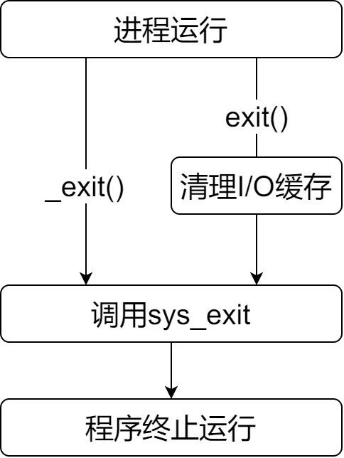

&emsp;&emsp;`exit`与`_exit`最大的区别就在于：`exit`在执行之前，要清理`I/O`缓冲区中的内容。<!--more-->



&emsp;&emsp;程序`1`如下：

``` cpp
#include "stdio.h"
#include "stdlib.h"

int main() { /* 程序1 */
    printf ( "this is a test function!\n" );
    printf ( "test exit" );
    exit ( 0 );
}
```

&emsp;&emsp;程序`2`如下：

``` cpp
#include "stdio.h"
#include "unistd.h"

int main() { /* 程序2 */
    printf ( "this is a test function!\n" );
    printf ( "test exit" );
    _exit ( 0 );
}
```

程序`1`输出两句话，而程序`2`只输出一句话。