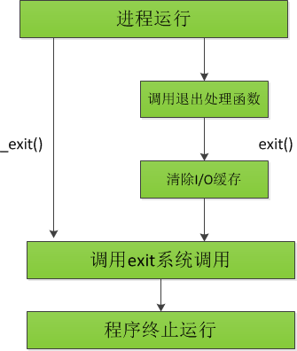

&emsp;&emsp;在`Linux`的标准库中，有一套称作高级`I/O`的函数，例如`printf`、`fopen`、`fread`、`fwrite`，也被称作`缓冲I/O`。其特征是对应每一个打开的文件，在内存中都有一片缓冲区，每次读文件会多读若干条记录，这样下次读文件时就可以直接从内存的缓存中取出；每次写文件时也仅仅是写入到内存的缓冲区，等待满足一定的条件(达到一定的数量或者遇到特定字符，例如换行和文件结束符`EOF`)，再将缓冲区的内容一次性的写入文件，这样就大大增加了文件读写的速度，但也为我们编程带来了一点点麻烦。如果有些数据，我们认为已经写入了文件，实际上因为没有满足特定的条件，它们还只是保存在缓冲区内，这时用`_exit`函数直接将程序关闭，缓冲区中的数据就会丢失；反之，如果想保证数据的完整性，就一定要使用`exit`函数。
&emsp;&emsp;`exit`函数与`_exit`函数最大的区别就在于：`exit`函数在调用`exit`系统调用之前要检查文件的打开情况，把文件缓冲区中的内容写回文件，就是图中的`清理I/O缓冲`一项。
&emsp;&emsp;`exit`函数定义在`stdlib.h`中，而`_exit`定义在`unistd.h`中。`exit`和`_exit`都用于正常终止一个函数，但`_exit`直接是一个`sys_exit`系统调用，而`exit`则通常是普通函数库中的一个函数。它会先执行一些清除操作，例如调用执行各终止处理函数、关闭所有标准`IO`等，然后调用`sys_exit`。

``` cpp
int main() { /* 程序1 */
    printf ( "this is a test function!\n" )
    printf ( "test exit" );
    exit ( 0 );
}
​
int main() { /* 程序2 */
    printf ( "this is a test function!\n" )
    printf ( "test exit" );
    _exit ( 0 );
}
```

程序`1`输出两句话，而程序`2`只输出一句话。其原因就是程序`2`的`printf ( "test exit" );`没有加上特殊的字符，这时的文件是存放在缓冲区的。输出函数要写入数据到缓冲区，首先进行系统调用，然后系统会打开显示设备的缓冲区。`exit`的作用就是结束并清理，先检查缓冲区，把没有写入的数据写入到文件；而`_exit`是立刻关闭文件，文件缓冲区的内容也就消失了，这时就不可能输出到显示设备了。

