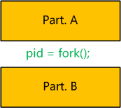
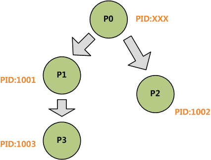

### fork

&emsp;&emsp;`fork`函数的功能是创建子进程：<!--more-->

``` cpp
#include <unistd.h>
pid_t fork ( void );
```

`fork`的奇妙之处在于它被调用一次，却返回两次，它可能有三种不同的返回值：

- 在父进程中，`fork`返回新创建的子进程的`PID`。
- 在子进程中，`fork`返回`0`。
- 如果出现错误，`fork`返回一个负值。

``` cpp
#include "unistd.h"
#include "stdio.h"

int main() {
    pid_t pid;
    pid = fork();

    if ( pid > 0 ) {
        printf ( "This is father process\n" );
        exit ( 0 );
    } else {
        printf ( "This is child process\n" );
        exit ( 0 );
    }
}
```

&emsp;&emsp;在`pid = fork();`之前，只有一个进程在执行，但在这条语句执行之后，就变成两个进程在执行了，这两个进程的共享代码段，将要执行的下一条语句都是`if(pid == 0)`。两个进程中，原来就存在的那个进程被称作`父进程`，新出现的那个进程被称作`子进程`，父子进程的区别在于进程标识符(`PID`)不同。

``` cpp
#include "unistd.h"
#include "stdio.h"
#include "stdlib.h"

int main() {
    pid_t pid;
    int count = 0;
    pid = fork();
    count++;
    printf ( "count is %d\n", count );
    exit ( 0 );
}
```

执行结果：

``` cpp
count = 1
count = 1
```

&emsp;&emsp;对`fork`函数，子进程的数据空间、堆栈空间都会从父进程得到一个拷贝，而不是共享。在子进程中对`count`进行加`1`的操作，并没有影响到父进程中的`count`值，父进程中的`count`值仍然为`0`。

### vfork

&emsp;&emsp;`vfork`函数的功能是创建子进程：

``` cpp
#include <sys/types.h>
#include <unistd.h>
pid_t vfork ( void );
```

`vfork`和`fork`的区别如下：

- `fork`：子进程拷贝父进程的数据段，父、子进程的执行次序不确定。
- `vfork`：子进程与父进程共享数据段，子进程先运行，父进程后运行。

``` cpp
#include "unistd.h"
#include "stdio.h"
#include "stdlib.h"

int main() {
    pid_t pid;
    int count = 0;
    pid = vfork();
    count++;
    printf ( "count is %d\n", count );
    exit ( 0 );
}
```

---

### vfork挂掉的一个问题

&emsp;&emsp;有个人问了这样的一个问题：为什么`vfork`的子进程里用`return`，整个程序会挂掉，而且`exit`不会？但如果把子进程的`return`改成`exit(0)`就没事。

``` cpp
#include <stdio.h>
#include <stdlib.h>
#include <unistd.h>

int main ( void ) {
    int var;
    var = 88;

    if ( ( pid = vfork() ) < 0 ) {
        printf ( "vfork error" );
        exit ( -1 );
    } else if ( pid == 0 ) { /* 子进程 */
        var++;
        return 0;
    }

    printf ( "pid = %d, glob = %d, var = %d\n", getpid(), glob, var );
    return 0;
}
```

#### 基础知识

&emsp;&emsp;首先说一下`fork`和`vfork`的差别：

- `fork`是创建一个子进程，并把父进程的内存数据`copy`到子进程中。
- `vfork`是创建一个子进程，并和父进程的内存数据`share`一起用。

这两个的差别是，一个是`copy`，一个是`share`。`vfork`是这样的工作的：保证子进程先执行；当子进程调用`exit`或`exec`后，父进程往下执行。

#### 为什么return会挂掉，exit不会？

&emsp;&emsp;从上面可以知道，结束子进程的调用是`exit`而不是`return`，如果你在`vfork`中`return`了，那么这就意味`main`函数`return`了，注意因为函数栈父子进程共享，所以整个程序的栈就跪了。如果你在子进程中`return`，那么基本是下面的过程：

1. 子进程的`main`函数`return`了，于是程序的函数栈发生了变化。
2. 而`main`函数`return`后，通常会调用`exit`或相似的函数，如`_exit`、`_exitgroup`。
3. 这时父进程收到子进程`exit`，开始从`vfork`返回。但是父进程的栈都被子进程的`return`给废掉了，于是代码崩溃了(对于某些内核版本，直接报`栈错误`就给跪了。然而对于其他内核版本，有可能会再次调用`main`，于是进入了一个无限循环的结果，直到`vfork`调用返回`error`)。

&emsp;&emsp;现在再回到`return`和`exit`，`return`会释放局部变量并弹栈，回到上级函数执行；`exit`直接退掉。如果用过`C++`就会知道，`return`会调用局部对象的析构函数，`exit`不会(`exit`不是系统调用，是`glibc`对系统调用`_exit`或`_exitgroup`的封装)。可见，子进程调用`exit`没有修改函数栈，所以父进程得以顺利执行。

#### 关于fork的优化

&emsp;&emsp;`fork`太耗费资源，而`vfork`又太危险，所以就有人开始优化`fork`。优化的技术用到了著名的写时拷贝(`COW`)，也就是说对于`fork`后并不是马上拷贝内存，而是只有你在需要改变的时候，才会从父进程中拷贝到子进程中，这样`fork`后立马执行`exec`的成本就非常小了。所以`Linux`的`Man Page`中并不鼓励使用`vfork`。

---

### Linux下fork的运行机制

&emsp;&emsp;面试题代码如下：

``` cpp
#include "stdio.h"
#include "sys/types.h"
#include "unistd.h"

int main() {
    pid_t pid1;
    pid_t pid2;
    pid1 = fork();
    pid2 = fork();
    printf ( "pid1:%d, pid2:%d\n", pid1, pid2 );
}
```

条件为：已知从这个程序执行到这个程序的所有进程结束这个时间段内，没有其它新进程执行。

- 请说出执行这个程序后，将一共运行几个进程。
- 如果其中一个进程的输出结果是`pid1:1001, pid2:1002`，写出其他进程的输出结果(不考虑进程执行顺序)。

#### 预备知识

- 进程可以看做程序的一次执行过程。`Linux`下的每个进程有唯一的`PID`标识进程。`PID`是一个从`1`到`32768`的正整数，其中`1`一般是特殊进程`init`，其它进程从`2`开始依次编号。当用完`32768`后，从`2`重新开始。
- `Linux`中有一个叫进程表的结构，用来存储当前正在运行的进程。可以使用`ps -aux`命令查看所有正在运行的进程。
- 进程在`Linux`中呈树状结构，`init`为根节点，其它进程均有父进程，某进程的父进程就是启动这个进程的进程，这个进程叫做父进程的子进程。
- `fork`的作用是复制一个与当前进程一样的进程。新进程的所有数据(变量、环境变量、程序计数器等)数值都和原进程一致，但是是一个全新的进程，并作为原进程的子进程。

#### 解题的关键

&emsp;&emsp;我认为解题的关键就是要认识到`fork`将程序切成两段：



&emsp;&emsp;上图表示一个含有`fork`的程序，而`fork`语句可以看成将程序切为`A`、`B`两个部分。然后整个程序会如下运行：

1. 设由`shell`直接执行程序，生成了进程`P`。`P`执行完`Part.A`的所有代码。
2. 当执行到`pid = fork();`时，`P`启动一个进程`Q`，`Q`是`P`的子进程，和`P`是同一个程序的进程。`Q`继承`P`的所有变量、环境变量、程序计数器的当前值。
3. 在`P`进程中，`fork()`将`Q`的`PID`返回给变量`pid`，并继续执行`Part.B`的代码。
4. 在进程`Q`中，将`0`赋给`pid`，并继续执行`Part.B`的代码。

&emsp;&emsp;这里有三个点非常关键：

- `P`执行了所有程序，而`Q`只执行了`Part.B`，即`fork`后面的程序，这是因为`Q`继承了`P`的`PC`，即程序计数器。
- `Q`继承了`fork`语句执行时当前的环境，而不是程序的初始环境。
- `P`中`fork`语句启动子进程`Q`，并将`Q`的`PID`返回，而`Q`中的`fork`语句不启动新进程，仅将`0`返回。

#### 解题

&emsp;&emsp;下面利用上文阐述的知识进行解题。这里我把两个问题放在一起进行分析。

1. 从`shell`中执行此程序，启动了一个进程，我们设这个进程为`P0`，设其`PID`为`XXX`(解题过程不需知道其`PID`)。
2. 当执行到`pid1 = fork();`时，`P0`启动一个子进程`P1`，由题目知`P1`的`PID`为`1001`。我们暂且不管`P1`。
3. `P0`中的`fork`返回`1001`给`pid1`，继续执行到`pid2 = fork();`，此时启动另一个新进程，设为`P2`，由题目知`P2`的`PID`为`1002`。同样暂且不管`P2`。
4. `P0`中的第二个`fork`返回`1002`给`pid2`，继续执行完后续程序，结束。所以`P0`的结果为`pid1:1001, pid2:1002`。
5. 再看`P2`，`P2`生成时，`P0`中`pid1`为`1001`，所以`P2`中`pid1`继承`P0`的`1001`，而作为子进程`pid2`为`0`。`P2`从第二个`fork`后开始执行，结束后输出`pid1:1001, pid2:0`。
6. 接着看`P1`，`P1`中第一条`fork`返回`0`给`pid1`，然后接着执行后面的语句。而后面接着的语句是`pid2 = fork();`。执行到这里，`P1`又产生了一个新进程，设为`P3`。先不管`P3`。
7. `P1`中第二条`fork`将`P3`的`PID`返回给`pid2`，由预备知识知`P3`的`PID`为`1003`，所以`P1`的`pid2`为`1003`。`P1`继续执行后续程序，结束，输出`pid1:0, pid2:1003`。
8. `P3`作为`P1`的子进程，继承`P1`中`pid1`为`0`，并且第二条`fork`将`0`返回给`pid2`，所以`P3`最后输出`pid1:0, pid2:0`。至此，整个执行过程完毕。

&emsp;&emsp;所得答案如下：

- 一共执行了四个进程(`P0`、`P1`、`P2`和`P3`)。
- 另外几个进程的输出分别为：

``` cpp
pid1:1001, pid2:0
pid1:0, pid2:1003
pid1:0, pid2:0
```

可以给出一个以`P0`为根的进程树：

