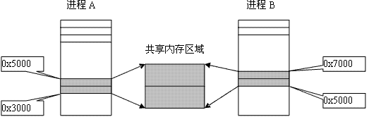

### 共享内存

&emsp;&emsp;共享内存是被多个进程共享的一部分物理内存。一个进程向共享内存写入了数据，共享这个内存区域的所有进程就可以立刻看到其中的内容。<!--more-->
&emsp;&emsp;如下图所示，共享内存的地址在进程`A`中的地址可能是`0x5000`，在进程`B`中的地址可能是`0x7000`，这是因为共享内存映射到不同进程当中的不同位置。



&emsp;&emsp;共享内存的实现分为`2`个步骤：

1. 使用`shmget`函数创建共享内存。
2. 使用`shmat`函数将创建的共享内存映射到具体的进程空间。

### 创建共享内存

&emsp;&emsp;创建共享内存使用函数`shmget`：

``` cpp
int shmget ( key_t key, int size, int shmflg );
```

- `key`是标识共享内存的键值，可以取`非负整数`或`IPC_PRIVATE`。

1. 当`key`是`IPC_PRIVATE`时，`shmflg`不需要`IPC_CREAT`。
2. 当`key`是`非负整数`时，`shmflg`需要`IPC_CREAT`。

- `size`是共享内存的大小，以字节为单位。
- `shmflg`是权限标志，与文件的读写权限一样。

如果函数执行成功，则返回共享内存标识符，否则返回`-1`。

### 映射共享内存

&emsp;&emsp;映射共享内存使用函数`shmat`：

``` cpp
int shmat ( int shmid, char *shmaddr, int flag );
```

- `shmid`：`shmget`函数返回的共享内存标识符。
- `shmaddr`：通常为`0`。
- `flag`：通常为`0`。

如果函数执行成功，则返回共享内存映射到进程中的地址，否则返回`-1`。

### 删除共享内存

&emsp;&emsp;当一个进程不再需要共享内存时，需要把它从进程地址空间中删除：

``` cpp
int shmdt ( char *shmaddr );
```

参数`shmaddr`是从`shmat`中获得的。

### 父子进程共享内存

&emsp;&emsp;代码实例：

``` cpp
#include <stdlib.h>
#include <stdio.h>
#include <string.h>
#include <errno.h>
#include <unistd.h>
#include <sys/stat.h>
#include <sys/types.h>
#include <sys/shm.h>
#include <sys/wait.h>

#define PERM (S_IRUSR | S_IWUSR)

int main ( int argc, char **argv ) {
    int shmid;
    char *p_addr, *c_addr;

    if ( argc != 2 ) {
        fprintf ( stderr, "Usage: %s\n", argv[0] );
        exit ( 1 );
    }

    if ( ( shmid = shmget ( IPC_PRIVATE, 1024, PERM ) ) == -1 ) { /* 创建共享内存 */
        fprintf ( stderr, "Create Share Memory Error: %s\n", strerror ( errno ) );
        exit ( 1 );
    }

    if ( fork() ) { /* 父进程写 */
        p_addr = ( char * ) shmat ( shmid, NULL, 0 );
        memset ( p_addr, '\0', 1024 );
        strncpy ( p_addr, argv[1], 1024 );
        wait ( NULL );
        exit ( 0 );
    } else { /* 子进程读 */
        sleep ( 1 ); /* 暂停1秒 */
        c_addr = ( char * ) shmat ( shmid, NULL, 0 );
        printf ( "Client get %s\n", c_addr );
        exit ( 0 );
    }
}
```

执行结果：

``` cpp
$ ./my_test 12345678
Client get 12345678
```

### 共享内存通信

&emsp;&emsp;`shm_com.h`如下：

``` cpp
#ifndef __SHM_COM__
#define __SHM_COM__

#define TEXT_SZ 2048

struct shared_use_st {
    int written_by_you;
    char some_text[TEXT_SZ];
};

#endif
```

&emsp;&emsp;`shmread.c`如下：

``` cpp
#include <unistd.h>
#include <stdlib.h>
#include <stdio.h>
#include <string.h>
#include <sys/types.h>
#include <sys/ipc.h>
#include <sys/shm.h>
#include "shm_com.h"

int main ( void ) {
    int running = 1;
    void *shared_memory = NULL;
    struct shared_use_st *shared_stuff;
    int shmid = shmget ( ( key_t ) 1234, sizeof ( struct shared_use_st ), 0666 | IPC_CREAT );

    if ( shmid == -1 ) {
        fprintf ( stderr, "shmget failed\n" );
        exit ( EXIT_FAILURE );
    }

    shared_memory = shmat ( shmid, NULL, 0 ); /* 映射共享内存 */

    if ( shared_memory == ( void * ) -1 ) {
        fprintf ( stderr, "shmat failed\n" );
        exit ( EXIT_FAILURE );
    }

    printf ( "Memory attached at %p\n", shared_memory );
    /* 让结构体指针指向这块共享内存 */
    shared_stuff = ( struct shared_use_st * ) shared_memory;
    shared_stuff->written_by_you = 0; /* 控制读写顺序 */

    while ( running ) { /* 循环的从共享内存中读数据，直到读到“end” */
        if ( shared_stuff->written_by_you ) {
            printf ( "You wrote: %s", shared_stuff->some_text );
            sleep ( 1 ); /* 读进程睡一秒，同时会导致写进程睡一秒，这样做到读了之后再写 */
            shared_stuff->written_by_you = 0;

            if ( strncmp ( shared_stuff->some_text, "end", 3 ) == 0 ) {
                running = 0; /* 结束循环 */
            }
        }
    }

    if ( shmdt ( shared_memory ) == -1 ) { /* 删除共享内存 */
        fprintf ( stderr, "shmdt failed\n" );
        exit ( EXIT_FAILURE );
    }

    exit ( EXIT_SUCCESS );
}
```

&emsp;&emsp;`shmwrite.c`如下：

``` cpp
#include <unistd.h>
#include <stdlib.h>
#include <stdio.h>
#include <string.h>
#include <sys/types.h>
#include <sys/ipc.h>
#include <sys/shm.h>
#include "shm_com.h"

int main ( void ) {
    int running = 1;
    void *shared_memory = NULL;
    struct shared_use_st *shared_stuff;
    char buffer[BUFSIZ];
    int shmid = shmget ( ( key_t ) 1234, sizeof ( struct shared_use_st ), 0666 | IPC_CREAT );

    if ( shmid == -1 ) {
        fprintf ( stderr, "shmget failed\n" );
        exit ( EXIT_FAILURE );
    }

    shared_memory = shmat ( shmid, NULL, 0 ); /* 映射共享内存 */

    if ( shared_memory == ( void * ) -1 ) {
        fprintf ( stderr, "shmat failed\n" );
        exit ( EXIT_FAILURE );
    }

    printf ( "Memory attached at %p\n", shared_memory );
    /* 让结构体指针指向这块共享内存 */
    shared_stuff = ( struct shared_use_st * ) shared_memory;

    while ( running ) { /* 循环地向共享内存中写数据 */
        while ( shared_stuff->written_by_you == 1 ) {
            sleep ( 1 ); /* 等到读进程读完之后再写 */
            printf ( "waiting for client...\n" );
        }

        printf ( "Enter some text: " );
        fgets ( buffer, BUFSIZ, stdin );
        strncpy ( shared_stuff->some_text, buffer, TEXT_SZ );
        shared_stuff->written_by_you = 1;

        if ( strncmp ( buffer, "end", 3 ) == 0 ) {
            running = 0; /* 结束循环 */
        }
    }

    if ( shmdt ( shared_memory ) == -1 ) { /* 删除共享内存 */
        fprintf ( stderr, "shmdt failed\n" );
        exit ( EXIT_FAILURE );
    }

    exit ( EXIT_SUCCESS );
}
```