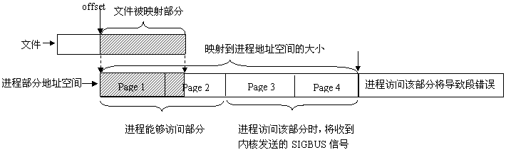
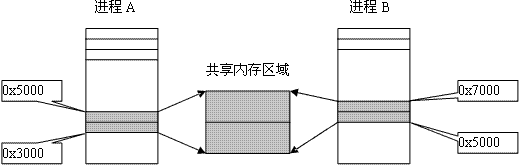

&emsp;&emsp;共享内存可以说是最有用的进程间通信方式，也是最快的`IPC`形式。两个不同进程`A`、`B`共享内存的意思是，同一块物理内存被映射到进程`A`、`B`各自的进程地址空间。进程`A`可以即时看到进程`B`对共享内存中数据的更新，反之亦然。由于多个进程共享同一块内存区域，必然需要某种同步机制，互斥锁和信号量都可以。
&emsp;&emsp;采用共享内存通信的一个显而易见的好处是效率高，因为进程可以直接读写内存，而不需要任何数据的拷贝。对于像管道和消息队列等通信方式，则需要在内核和用户空间进行四次的数据拷贝，而共享内存则只拷贝两次数据：一次从输入文件到共享内存区，另一次从共享内存区到输出文件。实际上，进程之间在共享内存时，并不总是读写少量数据后就解除映射，有新的通信时，再重新建立共享内存区域。而是保持共享区域，直到通信完毕为止，这样数据内容一直保存在共享内存中，并没有写回文件。共享内存中的内容往往是在解除映射时才写回文件的。因此，采用共享内存的通信方式效率是非常高的。
&emsp;&emsp;`Linux`的`2.2.x`内核支持多种共享内存方式，如`mmap`系统调用、`Posix`共享内存以及系统`V`共享内存。`linux`发行版本如`Redhat 8.0`支持`mmap`系统调用及系统`V`共享内存，但还没实现`Posix`共享内存，本文将主要介绍`mmap`系统调用及系统V共享内存`API`的原理及应用。

### 内核怎样保证各个进程寻址到同一个共享内存区域的内存页面

&emsp;&emsp;1. `page cache`及`swap cache`中页面的区分：一个被访问文件的物理页面都驻留在`page cache`或`swap cache`中，一个页面的所有信息由`struct page`来描述。`struct page`中有一个域为指针`mapping`，它指向一个`struct address_space`类型结构。`page cache`或`swap cache`中的所有页面就是根据`address_space`结构以及一个偏移量来区分的。
&emsp;&emsp;2. 文件与`address_space`结构的对应：一个具体的文件在打开后，内核会在内存中为之建立一个`struct inode`结构，其中的`i_mapping`域指向一个`address_space`结构。这样，一个文件就对应一个`address_space`结构，一个`address_space`与一个偏移量能够确定一个`page cache`或`swap cache`中的一个页面。因此，当要寻址某个数据时，很容易根据给定的文件及数据在文件内的偏移量而找到相应的页面。
&emsp;&emsp;3. 进程调用`mmap`时，只是在进程空间内新增了一块相应大小的缓冲区，并设置了相应的访问标识，但并没有建立进程空间到物理页面的映射。因此，第一次访问该空间时，会引发一个缺页异常。
&emsp;&emsp;4. 对于共享内存映射情况，缺页异常处理程序首先在`swap cache`中寻找目标页(符合`address_space`以及偏移量的物理页)，如果找到，则直接返回地址；如果没有找到，则判断该页是否在交换区(`swap area`)，如果在，则执行一个换入操作；如果上述两种情况都不满足，处理程序将分配新的物理页面，并把它插入到`page cache`中。进程最终将更新进程页表。
&emsp;&emsp;对于映射普通文件情况(非共享映射)，缺页异常处理程序首先会在`page cache`中根据`address_space`以及数据偏移量寻找相应的页面。如果没有找到，则说明文件数据还没有读入内存，处理程序会从磁盘读入相应的页面，并返回相应地址，同时进程页表也会更新。
&emsp;&emsp;5. 所有进程在映射同一个共享内存区域时，情况都一样，在建立线性地址与物理地址之间的映射之后，不论进程各自的返回地址如何，实际访问的必然是同一个共享内存区域对应的物理页面。
&emsp;&emsp;注意，一个共享内存区域可以看作是特殊文件系统`shm`中的一个文件，`shm`的安装点在交换区上。

### mmap及其相关系统调用

&emsp;&emsp;`mmap`系统调用使得进程之间通过映射同一个普通文件实现共享内存。普通文件被映射到进程地址空间后，进程可以向访问普通内存一样对文件进行访问，不必再调用`read`、`write`等操作。
&emsp;&emsp;实际上，`mmap`系统调用并不是完全为了用于共享内存而设计的。它本身提供了不同于一般对普通文件的访问方式，进程可以像读写内存一样对普通文件的操作。而`Posix`或系统`V`的共享内存`IPC`则纯粹用于共享目的，当然`mmap`实现共享内存也是其主要应用之一。
&emsp;&emsp;1. `mmap`系统调用形式如下：

``` cpp
void *mmap ( void *addr, size_t len, int prot, int flags, int fd, off_t offset );
```

参数`fd`为即将映射到进程空间的文件描述字，一般由`open`返回，同时`fd`可以指定为`-1`，此时须指定`flags`参数中的`MAP_ANON`，表明进行的是匿名映射(不涉及具体的文件名，避免了文件的创建及打开，很显然只能用于具有亲缘关系的进程间通信)。

- `len`：映射到调用进程地址空间的字节数，它从被映射文件开头`offset`个字节开始算起。
- `prot`：指定共享内存的访问权限。可取如下几个值，可以以进行`或`计算：`PROT_READ`(可读)、`PROT_WRITE`(可写)、`PROT_EXEC`(可执行)、`PROT_NONE`(不可访问)。
- `flags`：由以下几个常值指定：`MAP_SHARED`、`MAP_PRIVATE`、`MAP_FIXED`，其中`MAP_SHARED`、`MAP_PRIVATE`必选其一，而`MAP_FIXED`则不推荐使用。
- `offset`：一般设为`0`，表示从文件头开始映射。
- `addr`：指定文件应被映射到进程空间的起始地址，一般被指定一个空指针，此时选择起始地址的任务留给内核来完成。

函数的返回值为最后文件映射到进程空间的地址，进程可直接操作起始地址为该值的有效地址。
&emsp;&emsp;2. 系统调用`mmap`用于共享内存的两种方式：

- 使用普通文件提供的内存映射：适用于任何进程之间；此时，需要打开或创建一个文件，然后再调用`mmap`。典型调用代码如下：

``` cpp
fd = open ( name, flag, mode );
ptr = mmap ( NULL, len, PROT_READ | PROT_WRITE, MAP_SHARED, fd, 0 );
```

- 使用特殊文件提供匿名内存映射：适用于具有亲缘关系的进程之间；由于父子进程特殊的亲缘关系，在父进程中先调用`mmap`，然后调用`fork`。那么在调用`fork`之后，子进程继承父进程匿名映射后的地址空间，同样也继承`mmap`返回的地址，这样父子进程就可以通过映射区域进行通信了。注意，这里不是一般的继承关系。一般来说，子进程单独维护从父进程继承下来的一些变量，而`mmap`返回的地址，却由父子进程共同维护。对于具有亲缘关系的进程实现共享内存，最好的方式应该是采用匿名内存映射的方式。此时，不必指定具体的文件，只要设置相应的标志即可。

&emsp;&emsp;3. 系统调用`munmap`：

``` cpp
int munmap ( void *addr, size_t len );
```

该调用在进程地址空间中解除一个映射关系，`addr`是调用`mmap`时返回的地址，`len`是映射区的大小。当映射关系解除后，对原来映射地址的访问将导致段错误发生。
&emsp;&emsp;4. 系统调用`msync`：

``` cpp
int msync ( void *addr, size_t len, int flags );
```

一般说来，进程在映射空间的对共享内容的改变并不直接写回到磁盘文件中，往往在调用`munmap`后才执行该操作。可以通过调用`msync`实现磁盘上文件内容与共享内存区的内容一致。

### mmap范例

&emsp;&emsp;范例`1`为两个进程通过映射普通文件实现共享内存通信。范例`1`包含两个子程序：`map_normalfile1.c`和`map_normalfile2.c`。编译两个程序，可执行文件分别为`map_normalfile1`和`map_normalfile2`。两个程序通过命令行参数指定同一个文件来实现共享内存方式的进程间通信。`map_normalfile2`试图打开命令行参数指定的一个普通文件，把该文件映射到进程的地址空间，并对映射后的地址空间进行写操作。`map_normalfile1`把命令行参数指定的文件映射到进程地址空间，然后对映射后的地址空间执行读操作。这样，两个进程通过命令行参数指定同一个文件来实现共享内存方式的进程间通信。
&emsp;&emsp;`map_normalfile1.c`如下：

``` cpp
#include <sys/mman.h>
#include <sys/types.h>
#include <fcntl.h>
#include <unistd.h>
#include "stdio.h"
#include "string.h"

typedef struct {
    char name[4];
    int age;
} people;

int main ( int argc, char **argv ) {
    int fd, i;
    people *p_map;
    char temp;
    fd = open ( argv[1], O_CREAT | O_RDWR | O_TRUNC, 00777 );
    lseek ( fd, sizeof ( people ) * 5 - 1, SEEK_SET );
    write ( fd, " ", 1 );
    p_map = ( people * ) mmap ( NULL, sizeof ( people ) * 10, \
                                PROT_READ | PROT_WRITE, MAP_SHARED, fd, 0 );
    close ( fd );
    temp = 'a';
​
    for ( i = 0; i < 10; i++ ) {
        sprintf ( ( * ( p_map + i ) ).name, "%c", temp );
        ( * ( p_map + i ) ).age = 20 + i;
        temp += 1;
    }
​
    printf ( "initialize over\n" );
    sleep ( 10 );
    munmap ( p_map, sizeof ( people ) * 10 );
    printf ( "umap ok\n" );
}
```

`map_normalfile2.c`如下：

``` cpp
#include <sys/mman.h>
#include <sys/types.h>
#include <fcntl.h>
#include <unistd.h>
#include "stdio.h"
​
typedef struct {
    char name[4];
    int age;
} people;

int main ( int argc, char **argv ) {
    int fd, i;
    people *p_map;
    fd = open ( argv[1], O_CREAT | O_RDWR, 00777 );
    p_map = ( people * ) mmap ( NULL, sizeof ( people ) * 10, \
                                PROT_READ | PROT_WRITE, MAP_SHARED, fd, 0 );
​
    for ( i = 0; i < 10; i++ ) {
        printf ( "name: %s age %d;\n", ( * ( p_map + i ) ).name, ( * ( p_map + i ) ).age );
    }
​
    munmap ( p_map, sizeof ( people ) * 10 );
}
```

&emsp;&emsp;`map_normalfile1.c`首先定义了一个`people`数据结构，在这里采用数据结构的方式是因为，共享内存区的数据往往是有固定格式的，这由通信的各个进程决定，采用结构的方式有普遍代表性。`map_normfile1`首先打开或创建一个文件，并把文件的长度设置为`5`个`people`结构大小。然后从`mmap`的返回地址开始，设置了`10`个`people`结构。然后，进程睡眠`10`秒钟，等待其他进程映射同一个文件，最后解除映射。`map_normfile2.c`只是简单的映射一个文件，并以`people`数据结构的格式从`mmap`返回的地址处读取`10`个`people`结构，并输出读取的值，然后解除映射。
&emsp;&emsp;分别把两个程序编译成可执行文件`map_normalfile1`和`map_normalfile2`后，在一个终端上先运行`./map_normalfile1 /tmp/test_shm`，执行结果如下：

``` cpp
initialize over
umap ok
```

在`map_normalfile1`输出`initialize over`之后，输出`umap ok`之前，在另一个终端上运行`./map_normalfile2 /tmp/test_shm`，将会产生如下输出(为了节省空间，输出结果为稍作整理后的结果)：

``` cpp
name: a age 20;
name: b age 21;
name: c age 22;
name: d age 23;
name: e age 24;
name: f age 25;
name: g age 26;
name: h age 27;
name: i age 28;
name: j age 29;
```

在`map_normalfile1`输出`umap ok`后，运行`map_normalfile2`则输出如下结果：

``` cpp
name: a age 20;
name: b age 21;
name: c age 22;
name: d age 23;
name: e age 24;
name:  age 0;
name:  age 0;
name:  age 0;
name:  age 0;
name:  age 0;
```

从程序的运行结果中可以得出的结论：
&emsp;&emsp;1. 最终被映射文件的内容的长度不会超过文件本身的初始大小，即映射不能改变文件的大小。
&emsp;&emsp;2. 可以用于进程通信的有效地址空间大小大体上受限于被映射文件的大小，但不完全受限于文件大小。打开文件被截短为`5`个`people`结构大小，而在`map_normalfile1`中初始化了`10`个`people`数据结构，在恰当时候(`map_normalfile1`输出`initialize over`之后，输出`umap ok`之前)调用`map_normalfile2`会发现`map_normalfile2`将输出全部`10`个`people`结构的值。
&emsp;&emsp;在`linux`中，内存的保护是以页为基本单位的，即使被映射文件只有一个字节大小，内核也会为映射分配一个页面大小的内存。当被映射文件小于一个页面大小时，进程可以对从`mmap`返回地址开始的一个页面大小进行访问，而不会出错；但是，如果对一个页面以外的地址空间进行访问，则导致错误发生，后面将进一步描述。因此，可用于进程间通信的有效地址空间大小不会超过文件大小及一个页面大小的和。
&emsp;&emsp;3. 文件一旦被映射后，调用`mmap`的进程对返回地址的访问是对某一内存区域的访问，暂时脱离了磁盘上文件的影响。所有对`mmap`返回地址空间的操作只在内存中有意义，只有在调用了`munmap`后或者`msync`时，才把内存中的相应内容写回磁盘文件，所写内容仍然不能超过文件的大小。
&emsp;&emsp;范例`2`为父子进程通过匿名映射实现共享内存：

``` cpp
#include <sys/mman.h>
#include <sys/types.h>
#include <fcntl.h>
#include <unistd.h>
#include "stdio.h"
#include "stdlib.h"
#include "string.h"
​
typedef struct {
    char name[4];
    int age;
} people;
​
int main ( int argc, char **argv ) {
    int i;
    people *p_map;
    char temp;
    p_map = ( people * ) mmap ( NULL, sizeof ( people ) * 10, \
                                PROT_READ | PROT_WRITE, MAP_SHARED | MAP_ANONYMOUS, -1, 0 );
​
    if ( fork() == 0 ) {
        sleep ( 2 );
​
        for ( i = 0; i < 5; i++ ) {
            printf ( "child read: the %d people's age is %d\n", i + 1, ( * ( p_map + i ) ).age );
        }
​
        ( *p_map ).age = 100;
        munmap ( p_map, sizeof ( people ) * 10 ); /* 实际上，进程终止时，会自动解除映射 */
        exit ( 0 );
    }
​
    temp = 'a';
​
    for ( i = 0; i < 5; i++ ) {
        temp += 1;
        memcpy ( ( * ( p_map + i ) ).name, &temp, 2 );
        ( * ( p_map + i ) ).age = 20 + i;
    }
​
    sleep ( 5 );
    printf ( "parent read: the first people's age is %d\n", ( *p_map ).age );
    printf ( "umap\n" );
    munmap ( p_map, sizeof ( people ) * 10 );
    printf ( "umap ok\n" );
}
```

查看程序的输出结果，体会父子进程匿名共享内存：

``` cpp
child read: the 1 people's age is 20
child read: the 2 people's age is 21
child read: the 3 people's age is 22
child read: the 4 people's age is 23
child read: the 5 people's age is 24
parent read: the first people's age is 100
umap
umap ok
```

### 对mmap返回地址的访问

&emsp;&emsp;前面对范例运行结构的讨论中已经提到，`linux`采用的是页式管理机制。对于用`mmap`映射普通文件来说，进程会在自己的地址空间新增一块空间，空间大小由`mmap`的`len`参数指定。注意，进程并不一定能够对全部新增空间都能进行有效访问。进程能够访问的有效地址大小取决于文件被映射部分的大小。简单的说，能够容纳文件被映射部分大小的最少页面个数决定了进程从`mmap`返回的地址开始，能够有效访问的地址空间大小。超过这个空间大小，内核会根据超过的严重程度返回发送不同的信号给进程。可用如下图示说明：



&emsp;&emsp;注意，文件被映射部分而不是整个文件决定了进程能够访问的空间大小。另外，如果指定文件的偏移部分，一定要注意为页面大小的整数倍。下面是对进程映射地址空间的访问范例：

``` cpp
#include <sys/mman.h>
#include <sys/types.h>
#include <fcntl.h>
#include <unistd.h>
#include "stdio.h"
​
typedef struct {
    char name[4];
    int age;
} people;
​
int main ( int argc, char **argv ) {
    int fd, i;
    int pagesize, offset;
    people *p_map;
    pagesize = sysconf ( _SC_PAGESIZE );
    printf ( "pagesize is %d\n", pagesize );
    fd = open ( argv[1], O_CREAT | O_RDWR | O_TRUNC, 00777 );
    lseek ( fd, pagesize * 2 - 100, SEEK_SET );
    write ( fd, " ", 1 );
    offset = 0; /* 此处“offset = 0”编译成版本1；“offset = pagesize”编译成版本2 */
    p_map = ( people * ) mmap ( NULL, pagesize * 3, \
                                PROT_READ | PROT_WRITE, MAP_SHARED, fd, offset );
    close ( fd );
​
    for ( i = 1; i < 10; i++ ) {
        ( * ( p_map + pagesize / sizeof ( people ) *i - 2 ) ).age = 100;
        printf ( "access page %d over\n", i );
        ( * ( p_map + pagesize / sizeof ( people ) *i - 1 ) ).age = 100;
        printf ( "access page %d edge over, now begin to access page %d\n", i, i + 1 );
        ( * ( p_map + pagesize / sizeof ( people ) *i ) ).age = 100;
        printf ( "access page %d over\n", i + 1 );
    }
​
    munmap ( p_map, sizeof ( people ) * 10 );
}
```

&emsp;&emsp;如程序中所注释的那样，把程序编译成两个版本，两个版本主要体现在文件被映射部分的大小不同。文件的大小介于一个页面与两个页面之间(大小为`pagesize * 2 - 99`)，版本`1`的被映射部分是整个文件，版本`2`的文件被映射部分是文件大小减去一个页面后的剩余部分，不到一个页面大小(大小为`pagesize - 99`)。程序中试图访问每一个页面边界，两个版本都试图在进程空间中映射`pagesize * 3`的字节数。
&emsp;&emsp;版本`1`的输出结果如下：

``` cpp
pagesize is 4096
access page 1 over
access page 1 edge over, now begin to access page 2
access page 2 over
access page 2 over
access page 2 edge over, now begin to access page 3
Bus error /* 被映射文件在进程空间中覆盖了两个页面，此时进程试图访问第三个页面 */
```

版本`2`的输出结果如下：

``` cpp
pagesize is 4096
access page 1 over
access page 1 edge over, now begin to access page 2
Bus error /* 被映射文件在进程空间中覆盖了一个页面，此时进程试图访问第二个页面 */
```

&emsp;&emsp;采用系统调用`mmap`实现进程间通信是很方便的，在应用层上接口非常简洁。内部实现机制区涉及到了`linux`存储管理以及文件系统等方面的内容，可以参考一下相关重要数据结构来加深理解。

---

&emsp;&emsp;本部分将讨论系统`V`共享内存，并通过实验结果对比来阐述两者的异同。系统`V`共享内存指的是把所有共享数据放在共享内存区域(`IPC shared memory region`)，任何想要访问该数据的进程都必须在本进程的地址空间新增一块内存区域，用来映射存放共享数据的物理内存页面。
&emsp;&emsp;系统调用`mmap`通过映射一个普通文件实现共享内存，系统`V`则是通过映射特殊文件系统`shm`中的文件实现进程间的共享内存通信。也就是说，每个共享内存区域对应特殊文件系统`shm`中的一个文件(这是通过`shmid_kernel`结构联系起来的)。

### 系统V共享内存原理

&emsp;&emsp;进程间需要共享的数据被放在一个叫做`IPC`共享内存区域的地方，所有需要访问该共享区域的进程都要把该共享区域映射到本进程的地址空间中去。系统`V`共享内存通过`shmget`获得或创建一个`IPC`共享内存区域，并返回相应的标识符。内核在保证`shmget`获得或创建一个共享内存区，初始化该共享内存区相应的`shmid_kernel`结构体时，还将在特殊文件系统`shm`中创建并打开一个同名文件，并在内存中建立起该文件的相应`dentry`及`inode`结构，新打开的文件不属于任何一个进程(任何进程都可以访问该共享内存区)。所有这一切都是系统调用`shmget`完成的。
&emsp;&emsp;每一个共享内存区都有一个控制结构`struct shmid_kernel`，`shmid_kernel`是共享内存区域中非常重要的一个数据结构，它是存储管理和文件系统结合起来的桥梁：

``` cpp
struct shmid_kernel { /* private to the kernel */
    struct kern_ipc_perm shm_perm;
    struct file *shm_file;
    int id;
    unsigned long shm_nattch;
    unsigned long shm_segsz;
    time_t shm_atim;
    time_t shm_dtim;
    time_t shm_ctim;
    pid_t shm_cprid;
    pid_t shm_lprid;
};
```

该结构中最重要的一个域应该是`shm_file`，它存储了将被映射文件的地址。每个共享内存区对象都对应特殊文件系统`shm`中的一个文件，一般情况下，特殊文件系统`shm`中的文件是不能用`read`、`write`等方法访问的，当采取共享内存的方式把其中的文件映射到进程地址空间后，可直接采用访问内存的方式对其访问。
&emsp;&emsp;正如消息队列和信号灯一样，内核通过数据结构`struct ipc_ids shm_ids`维护系统中的所有共享内存区域。`shm_ids.entries`变量指向一个`ipc_id`结构数组，而每个`ipc_id`结构数组中有个指向`kern_ipc_perm`结构的指针。到这里读者应该很熟悉了，对于系统`V`共享内存区来说，`kern_ipc_perm`的宿主是`shmid_kernel`结构，`shmid_kernel`是用来描述一个共享内存区域的，这样内核就能够控制系统中所有的共享区域。同时，在`shmid_kernel`结构的`file`类型指针`shm_file`指向文件系统`shm`中相应的文件，这样共享内存区域就与`shm`文件系统中的文件对应起来。
&emsp;&emsp;在创建了一个共享内存区域后，还要将它映射到进程地址空间，系统调用`shmat`完成此项功能。由于在调用`shmget`时，已经创建了文件系统`shm`中的一个同名文件与共享内存区域相对应，因此调用`shmat`的过程相当于映射文件系统`shm`中的同名文件过程，原理与`mmap`大同小异。

### 系统V共享内存API

&emsp;&emsp;对于系统`V`共享内存，主要有以下几个`API`：`shmget`、`shmat`、`shmdt`及`shmctl`。
&emsp;&emsp;`shmget`用来获得共享内存区域的`ID`，如果不存在指定的共享区域，就创建相应的区域。`shmat`把共享内存区域映射到调用进程的地址空间中去，这样进程就可以方便地对共享区域进行访问操作。`shmdt`调用用来解除进程对共享内存区域的映射。`shmctl`实现对共享内存区域的控制操作。
&emsp;&emsp;`shmget`的内部实现包含了许多重要的系统`V`共享内存机制；`shmat`在把共享内存区域映射到进程空间时，并不真正改变进程的页表。当进程第一次访问内存映射区域访问时，会因为没有物理页表的分配而导致一个缺页异常，然后内核再根据相应的存储管理机制为共享内存映射区域分配相应的页表。

### 系统V共享内存限制

&emsp;&emsp;在`/proc/sys/kernel/`目录下，记录着系统`V`共享内存的一下限制，如一个共享内存区的最大字节数`shmmax`，系统范围内最大共享内存区标识符数`shmmni`等，可以手工对其调整，但不推荐这样做。
&emsp;&emsp;系统`V`共享内存中的数据，从来不写入到实际磁盘文件中去；而通过`mmap`映射普通文件实现的共享内存通信可以指定何时将数据写入磁盘文件中。前面讲到，系统`V`共享内存机制实际是通过映射特殊文件系统`shm`中的文件实现的，文件系统`shm`的安装点在交换分区上，系统重新引导后，所有的内容都丢失。
&emsp;&emsp;系统`V`共享内存是随内核持续的，即使所有访问共享内存的进程都已经正常终止，共享内存区仍然存在(除非显式删除共享内存)，在内核重新引导之前，对该共享内存区域的任何改写操作都将一直保留。
&emsp;&emsp;通过调用`mmap`映射普通文件进行进程间通信时，一定要注意考虑进程何时终止对通信的影响。而通过系统`V`共享内存实现通信的进程则不然。
&emsp;&emsp;共享内存允许两个或多个进程共享一给定的存储区，因为数据不需要来回复制，所以是最快的一种进程间通信机制。共享内存可以通过`mmap`映射普通文件(特殊情况下还可以采用匿名映射)机制实现，也可以通过系统V共享内存机制实现。应用接口和原理很简单，内部机制复杂。为了实现更安全通信，往往还与信号灯等同步机制共同使用。
&emsp;&emsp;共享内存涉及到了存储管理以及文件系统等方面的知识，深入理解其内部机制有一定的难度，关键还要紧紧抓住内核使用的重要数据结构。系统V共享内存是以文件的形式组织在特殊文件系统`shm`中的。通过`shmget`可以创建或获得共享内存的标识符。取得共享内存标识符后，要通过`shmat`将这个内存区映射到本进程的虚拟地址空间。

---

### 共享内存

&emsp;&emsp;共享内存是被多个进程共享的一部分物理内存。共享内存是进程间共享数据的一种最快的方法，一个进程向共享内存区域写入了数据，共享这个内存区域的所有进程就可以立刻看到其中的内容。
&emsp;&emsp;由原理图可知，共享内存的地址在进程`A`中的地址可能是`0x5000`，在进程`B`中的地址可能是`0x7000`，这是因为共享内存映射到不同进程当中的不同位置。



&emsp;&emsp;共享内存实现分为两个步骤：

1. 创建共享内存，使用`shmget`函数(`share memory get`)。
2. 映射共享内存，将这段创建的共享内存映射到具体的进程空间去，使用`shmat`函数。

### 创建共享内存

``` cpp
int shmget ( key_t key, int size, int shmflg );
```

`key`标识共享内存的键值，可以取`0`或`IPC_PRIVATE`。当`key`的取值为`IPC_PRIVATE`，则函数`shmget`将创建一块新的共享内存；如果`key`的取值为`0`，而参数`shmflg`中又设置`IPC_PRIVATE`这个标志，则同样会创建一块新的共享内存。`size`是创建共享内存的大小，以字节为单位。如果函数执行成功，返回共享内存标识符；如果失败，返回`-1`。

### 共享内存映射

``` cpp
int shmat ( int shmid, char *shmaddr, int flag );
```

- `shmid`：`shmget`函数返回的共享存储标识符。
- `flag`：决定以什么方式来确定映射的地址(通常为`0`)。
- `shmaddr`：我们不会向它传值，而是从它那里获取值，为`0`表示由系统来指定地址。

如果函数执行成功，则返回共享内存映射到进程中的地址；如果失败，则返回`-1`。

### 共享内存脱离

&emsp;&emsp;当一个进程不再需要共享内存时，需要把它从进程地址空间中脱离，使用如下函数：

``` cpp
int shmdt ( char *shmaddr );
```

函数参数`shmaddr`是从`shmat`中获得的。
&emsp;&emsp;`ShareMem_1.c`如下：

``` cpp
#include <stdlib.h>
#include <stdio.h>
#include <string.h>
#include <errno.h>
#include <unistd.h>
#include <sys/stat.h>
#include <sys/types.h>
#include <sys/ipc.h>
#include <sys/shm.h>
​
#define PERM S_IRUSR|S_IWUSR
​
int main ( int argc, char **argv ) {
    int shmid;
    char *p_addr, *c_addr;
​
    if ( argc != 2 ) {
        fprintf ( stderr, "Usage:%s\n\a", argv[0] );
        exit ( 1 );
    }
​
    if ( ( shmid = shmget ( IPC_PRIVATE, 1024, PERM ) ) == -1 ) { /* 创建共享内存 */
        fprintf ( stderr, "Create Share Memory Error:%s\n\a", strerror ( errno ) );
        exit ( 1 );
    }
​
    /* 创建子进程 */
    if ( fork() ) { /* 父进程写 */
        p_addr = shmat ( shmid, 0, 0 );
        memset ( p_addr, '\0', 1024 );
        strncpy ( p_addr, argv[1], 1024 );
        wait ( NULL ); /* 释放资源，不关心终止状态 */
        exit ( 0 );
    } else { /* 子进程读 */
        sleep ( 1 ); /* 暂停1秒 */
        c_addr = shmat ( shmid, 0, 0 );
        printf ( "Client get %s\n", c_addr );
        exit ( 0 );
    }
}
```

`ShareMem_2.c`如下：

``` cpp
#include "sys/types.h"
#include "sys/ipc.h"
#include "sys/shm.h"
#include "stdio.h"
#include "stdlib.h"
​
#define BUFSZ 2048
​
int main() {
    int shmid;
    char *shmadd;

    /* 创建共享内存 */
    if ( ( shmid = shmget ( IPC_PRIVATE, BUFSZ, 0666 ) ) < 0 ) {
        perror ( "shmget" );
        exit ( -1 );
    }
​
    printf ( "created shared-memeory: %d\n", shmid );
    system ( "ipcs -m" );
​
    /* 映射共享内存 */
    if ( ( shmadd = ( char * ) shmat ( shmid, 0, 0 ) ) < ( char * ) 0 ) {
        perror ( "shmat" );
        exit ( -1 );
    }
​
    printf ( "attached shared-memory\n" );
    system ( "ipcs -m" ); /* 显示系统内存情况 */
​
    if ( shmdt ( shmadd ) < 0 ) { /* 取消共享内存映射 */
        perror ( "shmat" );
        exit ( -1 );
    }
​
    printf ( "detach shared-memory\n" );
    system ( "ipcs -m" );
    shmctl ( shmid, IPC_RMID, NULL ); /* 删除共享内存对象 */
    system ( "ipcs -m" );
    return 0;
}
```

---

### 共享内存使用示例

&emsp;&emsp;`shm_com.h`如下：

``` cpp
#define TEXT_SZ 2048
​
struct shared_use_st {
    int written_by_you;
    char some_text[TEXT_SZ];
};
```

&emsp;&emsp;`shm1.c`如下：

``` cpp
#include <unistd.h>
#include <stdlib.h>
#include <stdio.h>
#include <string.h>
#include <sys/types.h>
#include <sys/ipc.h>
#include <sys/shm.h>
#include "shm_com.h"
​
int main ( void ) {
    int running = 1;
    void *shared_memory = ( void * ) 0;
    struct shared_use_st *shared_stuff;
    int shmid;
    /* 创建共享内存 */
    shmid = shmget ( ( key_t ) 1234, sizeof ( struct shared_use_st ), 0666 | IPC_CREAT );
​
    if ( shmid == -1 ) {
        fprintf ( stderr, "shmget failed\n" );
        exit ( EXIT_FAILURE );
    }
​
    shared_memory = shmat ( shmid, ( void * ) 0, 0 ); /* 映射共享内存 */
​
    if ( shared_memory == ( void * ) - 1 ) {
        fprintf ( stderr, "shmat failed\n" );
        exit ( EXIT_FAILURE );
    }
​
    printf ( "Memory attached at %X\n", ( int ) shared_memory );
    /* 让结构体指针指向这块共享内存 */
    shared_stuff = ( struct shared_use_st * ) shared_memory;
    shared_stuff->written_by_you = 0; /* 控制读写顺序 */
​
    while ( running ) { /* 循环的从共享内存中读数据，直到读到“end”为止 */
        if ( shared_stuff->written_by_you ) {
            printf ( "You wrote:%s", shared_stuff->some_text );
            sleep ( 1 ); /* 读进程睡一秒，同时会导致写进程睡一秒，这样做到读了之后再写 */
            shared_stuff->written_by_you = 0;
​
            if ( strncmp ( shared_stuff->some_text, "end", 3 ) == 0 ) {
                running = 0; /* 结束循环 */
            }
        }
    }
​
    if ( shmdt ( shared_memory ) == -1 ) { /* 删除共享内存 */
        fprintf ( stderr, "shmdt failed\n" );
        exit ( EXIT_FAILURE );
    }
​
    exit ( EXIT_SUCCESS );
}
```

&emsp;&emsp;`shm2.c`如下：

``` cpp
#include <unistd.h>
#include <stdlib.h>
#include <stdio.h>
#include <string.h>
#include <sys/types.h>
#include <sys/ipc.h>
#include <sys/shm.h>
#include "shm_com.h"
​
int main ( void ) {
    int running = 1;
    void *shared_memory = ( void * ) 0;
    struct shared_use_st *shared_stuff;
    char buffer[BUFSIZ];
    int shmid;
    /* 创建共享内存 */
    shmid = shmget ( ( key_t ) 1234, sizeof ( struct shared_use_st ), 0666 | IPC_CREAT );
​
    if ( shmid == -1 ) {
        fprintf ( stderr, "shmget failed\n" );
        exit ( EXIT_FAILURE );
    }
​
    shared_memory = shmat ( shmid, ( void * ) 0, 0 ); /* 映射共享内存 */
​
    if ( shared_memory == ( void * ) - 1 ) {
        fprintf ( stderr, "shmat failed\n" );
        exit ( EXIT_FAILURE );
    }
​
    printf ( "Memory attached at %X\n", ( int ) shared_memory );
    /* 让结构体指针指向这块共享内存 */
    shared_stuff = ( struct shared_use_st * ) shared_memory;
​
    while ( running ) { /* 循环的向共享内存中写数据，直到写入的为“end”为止 */
        while ( shared_stuff->written_by_you == 1 ) {
            sleep ( 1 ); /* 等到读进程读完之后再写 */
            printf ( "waiting for client...\n" );
        }
​
        printf ( "Ener some text:" );
        fgets ( buffer, BUFSIZ, stdin );
        strncpy ( shared_stuff->some_text, buffer, TEXT_SZ );
        shared_stuff->written_by_you = 1;
​
        if ( strncmp ( buffer, "end", 3 ) == 0 ) {
            running = 0; /* 结束循环 */
        }
    }
​
    if ( shmdt ( shared_memory ) == -1 ) { /*删除共享内存*/
        fprintf ( stderr, "shmdt failed\n" );
        exit ( EXIT_FAILURE );
    }
​
    exit ( EXIT_SUCCESS );
}
```