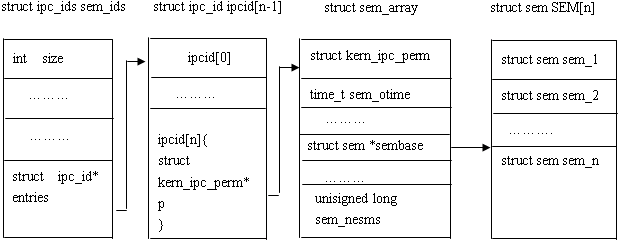
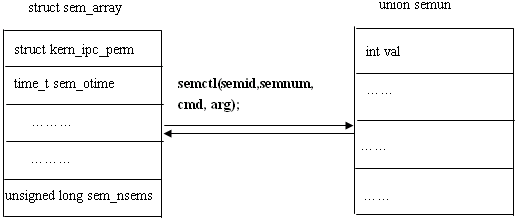
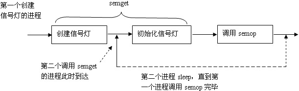

### semget系统调用

&emsp;&emsp;`semget`系统调用创建一个新的信号量集，或者获取一个已经存在的信号量集。

``` cpp
#include <sys/sem.h>
int semget ( key_t key, int num_sems, int sem_flags );
```

- `key`：一个键值，用来标识一个全局唯一的信号量集，就像文件名全局唯一的标识一个文件一样。要通过信号量通信的进程需要使用相同的键值来创建或获取该信号量。
- `num_sems`：指定要创建或获取的信号量集中信号量的数目。如果是创建信号量，则该值必须指定；如果是获取已存在的信号量，则可以设置为`0`。
- `sem_flags`：指定一组标志。它低端的`9`个比特是该信号量的权限，其格式和含义都与系统调用`open`的`mode`参数相同。我们可以和`IPC_CREAT`标志做按位`或`运算，此时即使信号量存大，`semget`也不会报错。我们还可以用`IPC_CREAT`和`IPC_EXCL`标志来确保创建一组新的、唯一的信号量集，此时若信号量存在，`semget`返回错误并设置`errno`为`EEXIST`。

&emsp;&emsp;`semget`调用成功时返回一个正整数，它是信号量集的标识符；失败时返回`-1`，并设置`errno`。

### semop系统调用

&emsp;&emsp;`semop`系统调用改变信号量的值，即执行`P`和`V`操作。

``` cpp
#include <sys/sem.h>
int semop ( int sem_id, struct sembuf *sem_ops, size_t num_sem_ops );
```

- `sem_id`：由`semget`调用返回的信号量集标识符，用以指定被操作的目标信号量集。
- `num_sem_ops`：指定要执行的操作个数，即`sem_ops`数组中无素的个数。`semop`对数组中的每个成员按数组顺序依次执行，该过程是原子操作。
- `sem_ops`：指向一个`sembuf`结构体的数组：

``` cpp
struct sembuf {
    unsigned short int sem_num;
    short int sem_op;
    short int sem_flg;
};
```

该结构体成员说明如下：

1. `sem_num`是信号量集中信号量的编号，像数组一样，从`0`开始。
2. `sem_op`指定操作类型，可选值为正整数、`0`和负整数。每种类型的操作行为又受到`sem_flg`的影响。
3. `sem_flg`的可选值是`IPC_NOWAIT`、`SEM_UNDO`。`IPC_NOWAIT`指无论信号量操作是否成功，`semop`调用都将立即返回，类似于非阻塞；`SEM_UNDO`指当进程退出时取消正在进行的`semop`操作。

&emsp;&emsp;`semop`成功时返回`0`，失败时返回`-1`并设置`errno`。

### semctl系统调用

&emsp;&emsp;`semctl`系统调用允许调用者对信号量进行直接控制。

``` cpp
#include <sys/sem.h>
int semctl ( int sem_id, int sem_num, int command, ... );
```

- `sem_id`：由`semget`调用返回的信号量集标识符，用以指定被操作的信号量集。
- `sem_num`：指定被操作的信号量在信号量集中的编号。
- `command`：指定要执行的命令。

&emsp;&emsp;有的命令需要第`4`个参数。第`4`个参数由用户自己定义，但`sys/sem.h`给出了推荐格式：

``` cpp
union semun {
    int val;               /* 用于SETVAL命令            */
    struct semid_ds *buf;  /* 用于IPC_STAT和IPC_SET命令 */
    unsigned short *array; /* 用于GETALL和SETALL命令    */
    struct seminfo *__buf; /* 用于IPC_INFO命令          */
};
```

`sem_ctl`成功时的返回值取决于`command`参数，失败时返回`-1`并设置`errno`。

### 特殊键值IPC_PRIVATE

&emsp;&emsp;`semget`的调用可以给其`key`参数传递一个特殊的键值`IPC_PRIVATE`，其值为`0`，这样无论该信号量是否存在，`semget`都将创建一个新的信号量。使用该值创建的信号量并非像它的名字声称的那样是进程私有的。

### 使用IPC_PRIVATE创建信号量

``` cpp
#include <sys/sem.h>
#include <stdio.h>
#include <stdlib.h>
#include <unistd.h>
#include <sys/wait.h>
​
union semun {
    int val;
    struct semid_ds *buf;
    unsigned short int *array;
    struct seminfo *__buf;
};
​
void pv ( int sem_id, int op ) { /* op为“-1”时执行P操作，op为1时执行V操作 */
    struct sembuf sem_b;
    sem_b.sem_num = 0;
    sem_b.sem_op = op;
    sem_b.sem_flg = SEM_UNDO;
    semop ( sem_id, &sem_b, 1 );
}
​
int main ( int argc, char *argv[] ) {
    int sem_id = semget ( IPC_PRIVATE, 1, 0666 );
    union semun sem_un;
    sem_un.val = 1;
    semctl ( sem_id, 0, SETVAL, sem_un );
    pid_t id = fork();
​
    if ( id < 0 ) {
        fprintf ( stderr, "fork failed.\n" );
        return 1;
    } else if ( id == 0 ) {
        printf ( "child try to get binary sem\n" );
        pv ( sem_id, -1 );
        printf ( "child get the sem and would release it after 5 seconds\n" );
        sleep ( 5 );
        pv ( sem_id, 1 );
        exit ( 0 );
    } else {
        printf ( "parent try to get binary sem\n" );
        pv ( sem_id, -1 );
        printf ( "parent get the sem and would release it after 3 seconds\n" );
        sleep ( 3 );
        pv ( sem_id, 1 );
    }
​
    waitpid ( id, NULL, 0 );
    semctl ( sem_id, 0, IPC_RMID, sem_un ); /* 删除信号量 */
    return 0;
}
```

---

### linux的信号灯

#### 信号灯概述

&emsp;&emsp;信号灯与其他进程间通信方式不大相同，它主要提供对进程间共享资源访问控制机制。相当于内存中的标志，进程可以根据它判定是否能够访问某些共享资源，同时进程也可以修改该标志。除了用于访问控制外，还可用于进程同步。信号灯有以下两种类型：

- 二值信号灯：最简单的信号灯形式，信号灯的值只能取`0`或`1`，类似于互斥锁。
- 计算信号灯：信号灯的值可以取任意非负值(当然受内核本身的约束)。

&emsp;&emsp;二值信号灯能够实现互斥锁的功能，但两者的关注内容不同。信号灯强调共享资源，只要共享资源可用，其他进程同样可以修改信号灯的值；互斥锁更强调进程，占用资源的进程使用完资源后，必须由进程本身来解锁。

#### Linux信号灯

&emsp;&emsp;`Linux`对信号灯的支持状况与消息队列一样，在`Red hat 8.0`发行版本中支持的是系统`V`的信号灯，因此本文将主要介绍系统`V`信号灯及其相应`API`。在没有声明的情况下，以下讨论中指的都是系统`V`信号灯。注意，通常所说的系统`V`信号灯指的是计数信号灯集。

#### 信号灯与内核

&emsp;&emsp;系统`V`信号灯是随内核持续的，只有在内核重起或者显示删除一个信号灯集时，该信号灯集才会真正被删除。因此系统中记录信号灯的数据结构`struct ipc_ids sem_ids`位于内核中，系统中的所有信号灯都可以在结构`sem_ids`中找到访问入口。
&emsp;&emsp;下图说明了内核与信号灯是怎样建立起联系的，其中`struct ipc_ids sem_ids`是内核中记录信号灯的全局数据结构，描述一个具体的信号灯及其相关信息。



&emsp;&emsp;`struct sem`结构如下：

``` cpp
struct sem {
    int semval; /* current value */
    int sempid /* pid of last operation */
}
```

从上图可以看出，全局数据结构`struct ipc_ids sem_ids`可以访问到`struct kern_ipc_perm`的第一个成员，即`struct kern_ipc_perm`；而每个`struct kern_ipc_perm`能够与具体的信号灯对应起来是因为在该结构中，有一个`key_t`类型成员`key`，而`key`则唯一确定一个信号灯集；同时，结构`struct kern_ipc_perm`的最后一个成员`sem_nsems`确定了该信号灯在信号灯集中的顺序，这样内核就能够记录每个信号灯的信息了。

#### 操作信号灯

&emsp;&emsp;对消息队列的操作无非有下面三种类型：

- 打开或创建信号灯：与消息队列的创建及打开基本相同，不再详述。
- 信号灯值操作：`linux`可以增加或减小信号灯的值，相应于对共享资源的释放和占有。具体参见后面的`semop`系统调用。
- 获得或设置信号灯属性：系统中的每一个信号灯集都对应一个`struct sem_array`结构，该结构记录了信号灯集的各种信息，存在于系统空间。为了设置、获得该信号灯集的各种信息及属性，在用户空间有一个重要的联合结构与之对应，即`union semun`。



#### 信号灯API

&emsp;&emsp;1. 文件名到键值：

``` cpp
#include <sys/types.h>
#include <sys/ipc.h>
key_t ftok ( char *pathname, char proj );
```

它返回与路径`pathname`相对应的一个键值，具体用法请参考消息队列。
&emsp;&emsp;2. `linux`特有的`ipc`调用：

``` cpp
int ipc ( unsigned int call, int first, int second, int third, void *ptr, long fifth );
```

参数`call`取不同值时，对应信号灯的三个系统调用：

- 当`call`为`SEMOP`时，对应`int semop(int semid, struct sembuf *sops, unsigned nsops)`调用。
- 当`call`为`SEMGET`时，对应`int semget(key_t key, int nsems, int semflg)`调用。
- 当`call`为`SEMCTL`时，对应`int semctl(int semid, int semnum, int cmd, union semun arg)`调用。

本人不主张采用系统调用`ipc`，而更倾向于采用系统`V`或者`POSIX`进程间通信`API`。
&emsp;&emsp;3. 系统`V`信号灯`API`：系统`V`消息队列`API`只有三个，使用时需要包括几个头文件：

``` cpp
#include <sys/types.h>
#include <sys/ipc.h>
#include <sys/sem.h>
```

- `semget`函数：

``` cpp
int semget ( key_t key, int nsems, int semflg );
```

1. `key`：一个键值，由`ftok`获得，唯一标识一个信号灯集，用法与`msgget`中的`key`相同。
2. `nsems`：指定打开或者新创建的信号灯集中将包含信号灯的数目。
3. `semflg`：一些标志位。

参数`key`和`semflg`的取值，以及何时打开已有信号灯集或者创建一个新的信号灯集与`msgget`中的对应部分相同，不再祥述。该调用返回与健值`key`相对应的信号灯集描述字。函数执行成功返回信号灯集描述字，否则返回`-1`。
&emsp;&emsp;如果`key`所代表的信号灯已经存在，且`semget`指定了`IPC_CREAT | IPC_EXCL`标志，那么即使参数`nsems`与原来信号灯的数目不等，返回的也是`EEXIST`错误；如果`semget`只指定了`IPC_CREAT`标志。

- `semop`函数：

``` cpp
int semop ( int semid, struct sembuf *sops, unsigned nsops );
```

`semid`是信号灯集`ID`，`sops`指向数组的每一个`sembuf`结构都刻画一个在特定信号灯上的操作；`nsops`为`sops`指向数组的大小。`sembuf`结构如下：

``` cpp
struct sembuf {
    unsigned short sem_num; /* semaphore index in array */
    short sem_op; /* semaphore operation */
    short sem_flg; /* operation flags */
};
```

&emsp;&emsp;`sem_num`对应信号集中的信号灯，`0`对应第一个信号灯。`sem_flg`可取`IPC_NOWAIT`以及`SEM_UNDO`两个标志。如果设置了`SEM_UNDO`标志，那么在进程结束时，相应的操作将被取消，这是比较重要的一个标志位。如果设置了该标志位，那么在进程没有释放共享资源就退出时，内核将代为释放。如果为一个信号灯设置了该标志，内核都要分配一个`sem_undo`结构来记录它，为的是确保以后资源能够安全释放。事实上，如果进程退出了，那么它所占用就释放了，但信号灯值却没有改变，此时，信号灯值反映的已经不是资源占有的实际情况，在这种情况下，问题的解决就靠内核来完成。这有点像僵尸进程，进程虽然退出了，资源也都释放了，但内核进程表中仍然有它的记录，此时就需要父进程调用`waitpid`来解决问题了。
&emsp;&emsp;`sem_op`的值大于`0`，等于`0`以及小于`0`确定了对`sem_num`指定的信号灯进行的三种操作。
&emsp;&emsp;这里需要强调的是`semop`同时操作多个信号灯，在实际应用中，对应多种资源的申请或释放。`semop`保证操作的原子性，这一点尤为重要。尤其对于多种资源的申请来说，要么一次性获得所有资源，要么放弃申请，要么在不占有任何资源情况下继续等待，这样，一方面避免了资源的浪费；另一方面，避免了进程之间由于申请共享资源造成死锁。
&emsp;&emsp;也许从实际含义上更好理解这些操作：信号灯的当前值记录相应资源目前可用数目；`sem_op > 0`对应相应进程要释放`sem_op`数目的共享资源；`sem_op = 0`可以用于对共享资源是否已用完的测试；`sem_op < 0`相当于进程要申请`-sem_op`个共享资源。再联想操作的原子性，更不难理解该系统调用何时正常返回，何时睡眠等待。
&emsp;&emsp;调用返回：成功返回`0`，否则返回`-1`。

- `semctl`函数：

``` cpp
int semctl ( int semid, int semnum, int cmd, union semun arg );
```

该系统调用实现对信号灯的各种控制操作，参数`semid`指定信号灯集；参数`cmd`指定具体的操作类型；参数`semnum`指定对哪个信号灯操作，只对几个特殊的`cmd`操作有意义；`arg`用于设置或返回信号灯信息。该系统调用详细信息请参见其手册页，这里只给出参数`cmd`所能指定的操作：

1. `IPC_STAT`：获取信号灯信息，信息由`arg.buf`返回。
2. `IPC_SET`：设置信号灯信息，待设置信息保存在`arg.buf`中。
3. `GETALL`：返回所有信号灯的值，结果保存在`arg.array`中，参数`sennum`被忽略。
4. `GETNCNT`：返回等待`semnum`所代表信号灯的值增加的进程数，相当于目前有多少进程在等待`semnum`代表的信号灯所代表的共享资源。
5. `GETPID`：返回最后一个对`semnum`所代表信号灯执行`semop`操作的进程`ID`。
6. `GETVAL`：返回`semnum`所代表信号灯的值。
7. `GETZCNT`：返回等待`semnum`所代表信号灯的值变成`0`的进程数。
8. `SETALL`：通过`arg.array`更新所有信号灯的值，并且更新与本信号集相关的`semid_ds`结构的`sem_ctime`成员。
9. `SETVAL`：设置`semnum`所代表信号灯的值为`arg.val`。

&emsp;&emsp;调用返回：调用失败返回`-1`，成功返回与`cmd`相关：

Cmd       | return value
----------|---------------
`GETNCNT` | `Semncnt`
`GETPID`  | `Sempid`
`GETVAL`  | `Semval`
`GETZCNT` | `Semzcnt`

&emsp;&emsp;4. 信号灯的限制：

- 一次系统调用`semop`可同时操作的信号灯数目`SEMOPM`，`semop`中的参数`nsops`如果超过了这个数目，将返回`E2BIG`错误。`SEMOPM`的大小特定于系统，`red hat 8.0`为`32`。
- 信号灯的最大数目`SEMVMX`，当设置信号灯值超过这个限制时，会返回`ERANGE`错误。在`red hat 8.0`中该值为`32767`。
- 系统范围内信号灯集的最大数目`SEMMNI`以及系统范围内信号灯的最大数目`SEMMNS`。超过这两个限制将返回`ENOSPC`错误。`red hat 8.0`中该值为`32000`。
- 每个信号灯集中的最大信号灯数目`SEMMSL`，`red hat 8.0`中为`250`。`SEMOPM`以及`SEMVMX`是使用`semop`调用时应该注意的；`SEMMNI`以及`SEMMNS`是调用`semget`时应该注意的。`SEMVMX`同时也是`semctl`调用应该注意的。

&emsp;&emsp;5. 竞争问题
&emsp;&emsp;第一个创建信号灯的进程同时也初始化信号灯，这样系统调用`semget`包含了两个步骤：创建信号灯；初始化信号灯。由此可能导致一种竞争状态：第一个创建信号灯的进程在初始化信号灯时，第二个进程又调用`semget`，并且发现信号灯已经存在，此时第二个进程必须具有判断是否有进程正在对信号灯进行初始化的能力。这里给出了绕过这种竞争状态的方法：当`semget`创建一个新的信号灯时，信号灯结构`semid_ds`的`sem_otime`成员初始化后的值为`0`。因此，第二个进程在成功调用`semget`后，可再次以`IPC_STAT`命令调用`semctl`，等待`sem_otime`变为非`0`值，此时可判断该信号灯已经初始化完毕。下图描述了竞争状态产生及解决方法：



&emsp;&emsp;实际上，这种解决方法也是基于这样一个假定：第一个创建信号灯的进程必须调用`semop`，这样`sem_otime`才能变为非零值。另外，因为第一个进程可能不调用`semop`，或者`semop`操作需要很长时间，第二个进程可能无限期等待下去，或者等待很长时间。
&emsp;&emsp;信号灯与其它进程间通信方式有所不同，它主要用于进程间同步。通常所说的系统V信号灯实际上是一个信号灯的集合，可用于多种共享资源的进程间同步。每个信号灯都有一个值，可以用来表示当前该信号灯代表的共享资源可用(`available`)数量，如果一个进程要申请共享资源，那么就从信号灯值中减去要申请的数目，如果当前没有足够的可用资源，进程可以睡眠等待，也可以立即返回。当进程要申请多种共享资源时，`linux`可以保证操作的原子性，即要么申请到所有的共享资源，要么放弃所有资源，这样能够保证多个进程不会造成互锁。