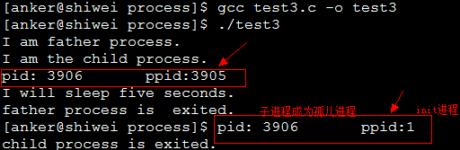
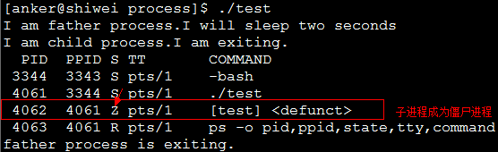
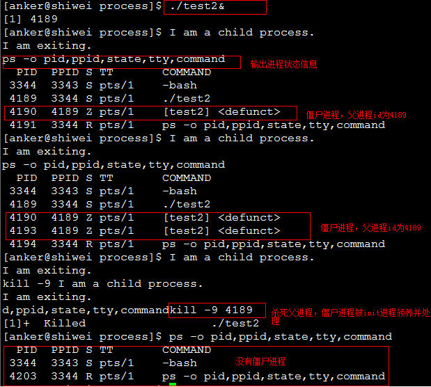
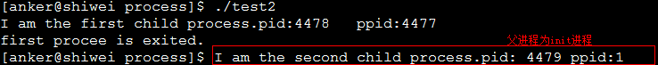

### 基本概念

&emsp;&emsp;我们知道在`unix/linux`中，正常情况下子进程是通过父进程创建的，子进程再创建新的进程。子进程的结束和父进程的运行是一个异步过程，即父进程永远无法预测子进程到底什么时候结束。当一个进程完成它的工作终止之后，它的父进程需要调用`wait`或者`waitpid`系统调用取得子进程的终止状态。<!--more-->

- 孤儿进程：一个父进程退出，而它的一个或多个子进程还在运行，那么那些子进程将成为孤儿进程。孤儿进程将被`init`进程(进程号为`1`)所收养，并由`init`进程对它们完成状态收集工作。
- 僵尸进程：一个进程使用`fork`创建子进程，如果子进程退出，而父进程并没有调用`wait`或`waitpid`获取子进程的状态信息，那么子进程的进程描述符仍然保存在系统中。这种进程称之为僵尸进程。

### 问题及危害

&emsp;&emsp;`unix`提供了一种机制可以保证只要父进程想知道子进程结束时的状态信息就可以得到。这种机制就是：在每个进程退出的时候，内核释放该进程所有的资源，包括打开的文件、占用的内存等。但是仍然为其保留一定的信息(包括进程号`the process ID`、退出状态`the termination status of the process`、运行时间`the amount of CPU time taken by the process`等)，直到父进程通过`wait/waitpid`来取时才释放。但这样就导致了问题，如果父进程不调用`wait/waitpid`的话，那么保留的那段信息就不会释放，其进程号就会一直被占用。但是系统所能使用的进程号是有限的，如果大量地产生僵尸进程，将因为没有可用的进程号而导致系统不能产生新的进程，这就是僵尸进程的危害。
&emsp;&emsp;孤儿进程是没有父进程的进程，孤儿进程的处理这个重任就落到了`init`进程身上。`init`进程就好像是一个收容所，专门负责处理孤儿进程的善后工作。每当出现一个孤儿进程的时候，内核就把孤儿进程的父进程设置为`init`，而`init`进程会循环地`wait`它的已经退出的子进程。这样当一个孤儿进程结束了其生命周期的时候，`init`进程就会处理它的一切善后工作，因此孤儿进程并不会有什么危害。
&emsp;&emsp;任何一个子进程(`init`除外)在`exit`之后，并非马上就消失掉，而是留下一个称为`僵尸进程`(`Zombie`)的数据结构，等待父进程处理，这是每个子进程在结束时都要经过的阶段。如果子进程在`exit`之后，父进程没有来得及处理，这时用`ps`命令就能看到子进程的状态是`Z`。如果父进程能及时处理，可能用`ps`命令就来不及看到子进程的僵尸状态，但这并不等于子进程不经过僵尸状态。如果父进程在子进程结束之前退出，则子进程将由`init`接管。`init`将会以父进程的身份对僵尸状态的子进程进行处理。
&emsp;&emsp;僵尸进程危害场景：例如有个进程，它定期地产生一个子进程，这个子进程需要做的事情很少，做完它该做的事情之后就退出了，因此这个子进程的生命周期很短。但是父进程只管生成新的子进程，至于子进程退出之后的事情，则一概不闻不问。这样，系统运行上一段时间之后，系统中就会存在很多的僵死进程，如果用`ps`命令查看的话，就会看到很多状态为`Z`的进程。严格地来说，僵死进程并不是问题的根源，罪魁祸首是产生出大量僵死进程的那个父进程。因此，当我们寻求如何消灭系统中大量的僵死进程时，答案就是把产生大量僵死进程的那个元凶枪毙掉(也就是通过`kill`发送`SIGTERM`或者`SIGKILL`信号了)。枪毙了元凶进程之后，它产生的僵死进程就变成了孤儿进程，这些孤儿进程会被`init`进程接管，`init`进程会`wait`这些孤儿进程，释放它们占用的系统进程表中的资源。这样，这些已经僵死的孤儿进程就能瞑目而去了。

### 孤儿进程和僵尸进程测试

&emsp;&emsp;孤儿进程测试程序如下：

``` cpp
#include <stdio.h>
#include <stdlib.h>
#include <errno.h>
#include <unistd.h>

int main() {
    pid_t pid;
    pid = fork(); /* 创建一个进程 */

    if ( pid < 0 ) { /* 创建失败 */
        perror ( "fork error:" );
        exit ( 1 );
    }

    if ( pid == 0 ) { /* 子进程 */
        printf ( "I am the child process.\n" );
        /* 输出进程ID和父进程ID */
        printf ( "pid: %d\tppid:%d\n", getpid(), getppid() );
        printf ( "I will sleep five seconds.\n" );
        sleep ( 5 ); /* 睡眠5s，保证父进程先退出 */
        printf ( "pid: %d\tppid:%d\n", getpid(), getppid() );
        printf ( "child process is exited.\n" );
    } else { /* 父进程 */
        printf ( "I am father process.\n" );
        sleep ( 1 ); /* 父进程睡眠1s，保证子进程输出进程id */
        printf ( "father process is  exited.\n" );
    }

    return 0;
}
```



&emsp;&emsp;僵尸进程测试程序`1`如下：

``` cpp
#include <stdio.h>
#include <unistd.h>
#include <errno.h>
#include <stdlib.h>

int main() {
    pid_t pid;
    pid = fork();

    if ( pid < 0 ) {
        perror ( "fork error:" );
        exit ( 1 );
    } else if ( pid == 0 ) {
        printf ( "I am child process.I am exiting.\n" );
        exit ( 0 );
    }

    printf ( "I am father process.I will sleep two seconds\n" );
    sleep ( 2 ); /* 等待子进程先退出 */
    system ( "ps -o pid,ppid,state,tty,command" ); /* 输出进程信息 */
    printf ( "father process is exiting.\n" );
    return 0;
}
```



&emsp;&emsp;僵尸进程测试程序`2`：父进程循环创建子进程，子进程退出，造成多个僵尸进程：

``` cpp
#include <stdio.h>
#include <stdlib.h>
#include <unistd.h>
#include <errno.h>

int main() {
    pid_t pid;

    while ( 1 ) { /* 循环创建子进程 */
        pid = fork();

        if ( pid < 0 ) {
            perror ( "fork error:" );
            exit ( 1 );
        } else if ( pid == 0 ) {
            printf ( "I am a child process.\nI am exiting.\n" );
            exit ( 0 ); /* 子进程退出，成为僵尸进程 */
        } else {
            sleep ( 20 ); /* 父进程休眠20s继续创建子进程 */
            continue;
        }
    }

    return 0;
}
```



### 僵尸进程解决办法

&emsp;&emsp;1. 通过信号机制：子进程退出时向父进程发送`SIGCHLD`信号，父进程处理`SIGCHLD`信号，在信号处理函数中调用`wait`进行处理僵尸进程。

``` cpp
#include <stdio.h>
#include <unistd.h>
#include <errno.h>
#include <stdlib.h>
#include <signal.h>

static void sig_child ( int signo );

int main() {
    pid_t pid;
    signal ( SIGCHLD, sig_child ); /* 创建捕捉子进程退出信号 */
    pid = fork();

    if ( pid < 0 ) {
        perror ( "fork error:" );
        exit ( 1 );
    } else if ( pid == 0 ) {
        printf ( "I am child process, pid id %d. I am exiting.\n", getpid() );
        exit ( 0 );
    }

    printf ( "I am father process. I will sleep two seconds\n" );
    sleep ( 2 ); /* 等待子进程先退出 */
    system ( "ps -o pid,ppid,state,tty,command" ); /* 输出进程信息 */
    printf ( "father process is exiting.\n" );
    return 0;
}

static void sig_child ( int signo ) {
    pid_t pid;
    int stat;

    while ( ( pid = waitpid ( -1, &stat, WNOHANG ) ) > 0 ) { /* 处理僵尸进程 */
        printf ( "child %d terminated.\n", pid );
    }
}
```

&emsp;&emsp;2. `fork`两次：`Unix环境高级编程`的`8.6`节说的非常详细，原理是将子进程成为孤儿进程，从而其父进程变为`init`进程，通过`init`进程可以处理僵尸进程。

``` cpp
#include <stdio.h>
#include <stdlib.h>
#include <unistd.h>
#include <errno.h>

int main() {
    pid_t pid;
    pid = fork(); /* 创建第一个子进程 */

    if ( pid < 0 ) {
        perror ( "fork error:" );
        exit ( 1 );
    } else if ( pid == 0 ) { /* 第一个子进程 */
        /* 子进程再创建子进程 */
        printf ( "I am the first child process.pid: %d\tppid:%d\n", getpid(), getppid() );
        pid = fork();

        if ( pid < 0 ) {
            perror ( "fork error:" );
            exit ( 1 );
        } else if ( pid > 0 ) { /* 第一个子进程退出 */
            printf ( "first procee is exited.\n" );
            exit ( 0 );
        }

        /* 第二个子进程睡眠3s保证第一个子进程退出，这样第二个子进程的父亲就是init进程 */
        sleep ( 3 );
        printf ( "I am the second child process.pid: %d\tppid:%d\n", getpid(), getppid() );
        exit ( 0 );
    }

    if ( waitpid ( pid, NULL, 0 ) != pid ) { /* 父进程处理第一个子进程退出 */
        perror ( "waitepid error:" );
        exit ( 1 );
    }

    exit ( 0 );
    return 0;
}
```



---

### 僵尸进程概念

&emsp;&emsp;僵尸进程(`Zombie Process`)：就是已经结束了的进程，但是没有从进程表中删除。太多了会导致进程表里面条目满了，进而导致系统崩溃，倒是不占用其他系统资源。
&emsp;&emsp;在`Linux`进程的状态中，僵尸进程是非常特殊的一种，它已经放弃了几乎所有内存空间，没有任何可执行代码，也不能被调度，仅仅在进程列表中保留一个位置，记载该进程的退出状态等信息供其他进程收集。除此之外，僵尸进程不再占有任何内存空间。它需要它的父进程来为它收尸，如果他的父进程没安装`SIGCHLD`信号处理函数调用`wait`或`waitpid`等待子进程结束，又没有显式忽略该信号，那么它就一直保持僵尸状态。如果这时父进程结束了，那么`init`进程自动会接手这个子进程，为它收尸，它还是能被清除的。但是如果如果父进程是一个循环，不会结束，那么子进程就会一直保持僵尸状态，这就是为什么系统中有时会有很多的僵尸进程。

### 僵尸进程产生的原因

&emsp;&emsp;每个`Linux`进程在进程表里都有一个进入点(`entry`)，核心程序执行该进程时使用到的一切信息都存储在进入点。当用`ps`命令察看系统中的进程信息时，看到的就是进程表中的相关数据。当用`fork`系统调用建立一个新的进程后，核心进程就会在进程表中给这个新进程分配一个进入点，然后将相关信息存储在该进入点所对应的进程表内。这些信息中有一项是其父进程的识别码。当这个进程走完了自己的生命周期后，它会执行`exit`系统调用，此时原来进程表中的数据会被该进程的退出码(`exit code`)、执行时所用的`CPU`时间等数据所取代，这些数据会一直保留到系统将它传递给它的父进程为止。由此可见，僵尸进程的出现时间是在子进程终止后，但是父进程尚未读取这些数据之前。

### 僵尸进程的解决方法

- 父进程通过`wait`和`waitpid`等函数等待子进程结束，这会导致父进程挂起。执行`wait`或`waitpid`系统调用，则子进程在终止后会立即把它在进程表中的数据返回给父进程，此时系统会立即删除该进入点。在这种情形下就不会产生僵尸进程。
- 如果父进程很忙，那么可以用`signal`函数为`SIGCHLD`安装`handler`。在子进程结束后，父进程会收到该信号，可以在`handler`中调用`wait`回收。
- 如果父进程不关心子进程什么时候结束，那么可以用`signal(SIGCLD, SIG_IGN)`或`signal(SIGCHLD, SIG_IGN)`通知内核，自己对子进程的结束不感兴趣。那么子进程结束后，内核会回收子进程的资源，并不再给父进程发送信号。
- `fork`两次，父进程`fork`一个子进程，然后继续工作。子进程`fork`一个孙进程后退出，那么孙进程会被`init`接管，孙进程结束后，`init`会回收它的资源。不过子进程的回收还要自己来做。