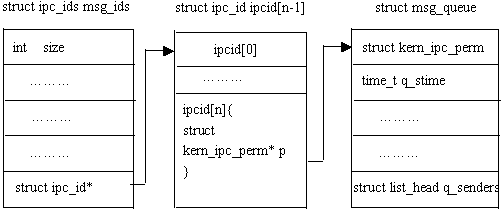
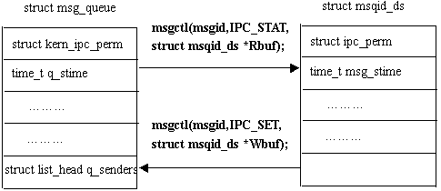

### 键值

&emsp;&emsp;消息队列的内核持续性要求每个消息队列都在系统范围内对应唯一的键值，所以，要获得一个消息队列的描述字，必须提供该消息队列的键值。

``` cpp
#include <sys/types.h>
#include <sys/ipc.h>
key_t ftok ( char *pathname, char proj ); /* f是file，k是key */
```

功能为返回文件名对应的键值。参数`pathname`是文件名，`proj`是项目名(不为`0`即可)。得到键值后，就可以去获取消息队列描述字。

### 打开/创建消息队列

``` cpp
#include <sys/types.h>
#include <sys/ipc.h>
#include <sys/msg.h>
int msgget ( key_t key, int msgflg );
```

参数`key`是键值，由`ftok`获得；`msgflg`是标志位。函数返回与健值`key`相对应的消息队列描述字。`msgflg`有如下选项(或三者的`或`结果)：

- `IPC_CREAT`：创建新的消息队列。
- `IPC_EXCL`：与`IPC_CREAT`一同使用，表示如果要创建的消息队列已经存在，则返回错误。
- `IPC_NOWAIT`：读写消息队列要求无法得到满足时，不阻塞。

&emsp;&emsp;在以下两种情况下，将创建一个新的消息队列：

- 如果没有与健值`key`相对应的消息队列，并且`msgflg`中包含了`IPC_CREAT`标志位。
- `vkey`参数为`IPC_PRIVATE`。

&emsp;&emsp;打开消息队列的操作：

``` cpp
int open_queue ( key_t keyval ) {
    int qid;
​
    if ( ( qid = msgget ( keyval, IPC_CREAT ) ) == -1 ) {
        return ( -1 );
    }
​
    return ( qid );
}
```

### 发送消息

``` cpp
#include <sys/types.h>
#include <sys/ipc.h>
#include <sys/msg.h>
int msgsnd ( int msqid, struct msgbuf *msgp, int msgsz, int msgflg );
```

功能为向消息队列中发送一条消息。

- `msqid`：已打开的消息队列`id`。
- `msgp`：存放消息的结构。
- `msgsz`：消息数据长度。
- `msgflg`：发送标志，有意义的`msgflg`标志为`IPC_NOWAIT`，指明在消息队列没有足够空间容纳要发送的消息时，`msgsnd`是否等待。造成`msgsnd`等待的条件有两种：

1. 当前消息的大小与当前消息队列中的字节数之和超过了消息队列的总容量。
2. 当前消息队列的消息数(单位`个`)不小于消息队列的总容量(单位`字节数`)，此时虽然消息队列中的消息数目很多，但基本上都只有一个字节。

&emsp;&emsp;`msgsnd`解除阻塞的条件有三个：

- 不满足上述两个条件，即消息队列中有容纳该消息的空间。
- `msqid`代表的消息队列被删除。
- 调用`msgsnd`的进程被信号中断。

调用函数成功返回`0`，否则返回`-1`。

### 消息格式

``` cpp
struct msgbuf {
    long mtype;    /* 消息类型 > 0    */
    char mtext[1]; /* 消息数据的首地址 */
};
```

### 接收消息

``` cpp
#include <sys/types.h>
#include <sys/ipc.h>
#include <sys/msg.h>
int msgrcv ( int msqid, struct msgbuf *msgp, int msgsz, long msgtyp, int msgflg );
```

功能为从`msqid`代表的消息队列中读取一个`msgtyp`类型的消息，并把消息存储在`msgp`指向的`msgbuf`结构中。在成功地读取了一条消息以后，队列中的这条消息将被删除。注意，发送的数据类型应该和接收的数据类型一致。读消息标志`msgflg`可以为以下几个常值的`或`：

- `IPC_NOWAIT`：如果没有满足条件的消息，调用立即返回，此时`errno`为`ENOMSG`。
- `IPC_EXCEPT`：与`msgtyp > 0`配合使用，返回队列中第一个类型不为`msgtyp`的消息。
- `IPC_NOERROR`：如果队列中满足条件的消息内容大于所请求的`msgsz`字节，则把该消息截断，截断部分将丢失。

&emsp;&emsp;`msgrcv`解除阻塞的条件有三个：消息队列中有了满足条件的消息；`msqid`代表的消息队列被删除；调用`msgrcv`的进程被信号中断。调用函数成功，返回读出消息的实际字节数，否则返回`-1`。

### 消息队列控制

``` cpp
int msgctl ( int msqid, int cmd, struct msqid_ds *buf );
```

该系统调用对由`msqid`标识的消息队列执行`cmd`操作，共有三种`cmd`操作：

- `IPC_STAT`：该命令用来获取消息队列信息，返回的信息存贮在`buf`指向的`msqid`结构中。
- `IPC_SET`：该命令用来设置消息队列的属性，要设置的属性存储在`buf`指向的`msqid`结构中。可设置属性包括`msg_perm.uid`、`msg_perm.gid`、`msg_perm.mode`以及`msg_qbytes`，同时也影响`msg_ctime`成员。
- `IPC_RMID`：删除`msqid`标识的消息队列。

调用函数成功返回`0`，否则返回`-1`。
&emsp;&emsp;从消息队列中接收数据：

``` cpp
int read_message ( int qid, long type, struct mymsgbuf *qbuf ) {
    int result, length;
    length = sizeof ( struct mymsgbuf ) - sizeof ( long );
​
    if ( ( result = msgrcv ( qid, qbuf, length, type, 0 ) ) == -1 ) {
        return ( -1 );
    }
​
    return ( result );
}
```

### 操作消息队列

&emsp;&emsp;`消息队列_1.c`如下：

``` cpp
#include <sys/types.h>
#include <sys/msg.h>
#include <unistd.h>
​
struct msg_buf {
    int mtype;
    char data[255];
};
​
int main() {
    key_t key;
    int msgid;
    int ret;
    struct msg_buf msgbuf;

    key = ftok ( "./", 'a' );
    printf ( "key =[%x]\n", key );
    msgid = msgget ( key, IPC_CREAT | 0666 ); /* 通过文件对应 */
​
    if ( msgid == -1 ) {
        printf ( "create error\n" );
        return -1;
    }
​
    msgbuf.mtype = getpid();
    strcpy ( msgbuf.data, "test haha" );
    ret = msgsnd ( msgid, &msgbuf, sizeof ( msgbuf.data ), IPC_NOWAIT );
​
    if ( ret == -1 ) {
        printf ( "send message err\n" );
        return -1;
    }
​
    memset ( &msgbuf, 0, sizeof ( msgbuf ) );
    ret = msgrcv ( msgid, &msgbuf, sizeof ( msgbuf.data ), getpid(), IPC_NOWAIT );
​
    if ( ret == -1 ) {
        printf ( "recv message err\n" );
        return -1;
    }
​
    printf ( "recv msg =[%s]\n", msgbuf.data );
    return 0;
}
```

`消息队列_2.c`如下：

``` cpp
#include "stdio.h"
#include "stdlib.h"
#include "string.h"
#include "sys/types.h"
#include "sys/ipc.h"
#include "sys/msg.h"
​
#define BUFSZ 512
#define TRUE 100
​
struct msgbuf {
    long mtype;
    char mtext[BUFSZ];
};
​
int main() {
    int qid, len;
    key_t key;
    struct msgbuf msg;
​
    /* 根据不同报告的路径和关键字产生标准的key */
    if ( ( key = ftok ( "./", 'a' ) ) == -1 ) {
        perror ( "ftok" );
        exit ( 1 );
    }
​
    /* 创建消息队列 */
    if ( ( qid = msgget ( key, IPC_CREAT | 0666 ) ) == -1 ) {
        perror ( "msgget" );
        exit ( 1 );
    }
​
    printf ( "opened queue %d\n", qid );
    puts ( "please enter the message to queue:" );
​
    if ( ( fgets ( ( &msg )->mtext, BUFSZ, stdin ) ) == NULL ) {
        puts ( "no message" );
        exit ( -1 );
    }
​
    msg.mtype = TRUE;
    len = strlen ( msg.mtext ) + 1;
​
    if ( msgsnd ( qid, &msg, len , 0 ) < 0 ) { /* 添加消息到消息队列 */
        perror ( "msgsnd" );
        exit ( -1 );
    }
​
    /* 从消息队列读取消息 */
    if ( ( msgrcv ( qid, &msg, BUFSIZ, 0, 0 ) ) < 0 ) {
        perror ( "msgrcv" );
    }
​
    printf ( "message is %s\n", ( &msg )->mtext );
​
    if ( msgctl ( qid, IPC_RMID, NULL ) < 0 ) {
        perror ( "msgctl" );
        exit ( -1 );
    }
​
    return 0;
}
```

---

### 消息队列

&emsp;&emsp;消息队列(也叫做报文队列)能够克服早期`unix`通信机制的一些缺点。作为早期`unix`通信机制之一的信号能够传送的信息量有限，后来虽然`POSIX 1003.1b`在信号的实时性方面作了拓广，使得信号在传递信息量方面有了相当程度的改进，但是信号这种通信方式更像`即时`的通信方式，它要求接受信号的进程在某个时间范围内对信号做出反应，因此该信号最多在接受信号进程的生命周期内才有意义，信号所传递的信息是接近于随进程持续的概念(`process-persistent`)。管道及有名管道及有名管道则是典型的随进程持续`IPC`，并且只能传送无格式的字节流无疑会给应用程序开发带来不便，另外它的缓冲区大小也受到限制。
&emsp;&emsp;消息队列就是一个消息的链表。可以把消息看作一个记录，具有特定的格式以及特定的优先级。对消息队列有写权限的进程可以向中按照一定的规则添加新消息；对消息队列有读权限的进程则可以从消息队列中读走消息。消息队列是随内核持续的。目前主要有两种类型的消息队列：`POSIX`消息队列以及系统`V`消息队列，系统`V`消息队列目前被大量使用。考虑到程序的可移植性，新开发的应用程序应尽量使用`POSIX`消息队列。
&emsp;&emsp;本文将主要介绍系统`V`消息队列及其相应`API`。在没有声明的情况下，以下讨论中指的都是系统`V`消息队列。

#### 消息队列基本概念

&emsp;&emsp;系统`V`消息队列是随内核持续的，只有在内核重起或者显示删除一个消息队列时，该消息队列才会真正被删除。因此系统中记录消息队列的数据结构(`struct ipc_ids msg_ids`)位于内核中，系统中的所有消息队列都可以在结构`msg_ids`中找到访问入口。
&emsp;&emsp;每个消息队列都有一个队列头，用结构`struct msg_queue`来描述。队列头中包含了该消息队列的大量信息，包括消息队列键值、用户`ID`、组`ID`、消息队列中消息数目等等，甚至记录了最近对消息队列读写进程的`ID`。读者可以访问这些信息，也可以设置其中的某些信息。下图说明了内核与消息队列是怎样建立起联系的，其中`struct ipc_ids msg_ids`是内核中记录消息队列的全局数据结构；`struct msg_queue`是每个消息队列的队列头。



&emsp;&emsp;从上图可以看出，全局数据结构`struct ipc_ids msg_ids`可以访问到每个消息队列头的第一个成员，即`struct kern_ipc_perm`；而每个`struct kern_ipc_perm`能够与具体的消息队列对应起来是因为在该结构中，有一个`key_t`类型成员`key`，而`key`则唯一确定一个消息队列。`kern_ipc_perm`结构如下：

``` cpp
/* 内核中记录消息队列的全局数据结构msg_ids能够访问到该结构 */
struct kern_ipc_perm {
    key_t key; /* 该键值则唯一对应一个消息队列 */
    uid_t uid;
    gid_t gid;
    uid_t cuid;
    gid_t cgid;
    mode_t mode;
    unsigned long seq;
}
```

#### 操作消息队列

&emsp;&emsp;对消息队列的操作无非有下面`3`种类型：
&emsp;&emsp;1. 打开或创建消息队列：消息队列的内核持续性要求每个消息队列都在系统范围内对应唯一的键值，所以要获得一个消息队列的描述字，只需提供该消息队列的键值即可。注意，消息队列描述字是由在系统范围内唯一的键值生成的，而键值可以看作对应系统内的一条路经。
&emsp;&emsp;2. 读写操作：消息读写操作非常简单，对开发人员来说，每个消息都类似如下的数据结构：

``` cpp
struct msgbuf {
    long mtype;
    char mtext[1];
};
```

`mtype`成员代表消息类型，从消息队列中读取消息的一个重要依据就是消息的类型；`mtext`是消息内容，当然长度不一定为`1`。因此，对于发送消息来说，首先预置一个`msgbuf`缓冲区并写入消息类型和内容，调用相应的发送函数即可；对读取消息来说，首先分配这样一个`msgbuf`缓冲区，然后把消息读入该缓冲区即可。
&emsp;&emsp;3. 获得或设置消息队列属性：消息队列的信息基本上都保存在消息队列头中，因此可以分配一个类似于消息队列头的结构`struct msqid_ds`来返回消息队列的属性；同样可以设置该数据结构。



#### 消息队列的限制

&emsp;&emsp;每个消息队列的容量(所能容纳的字节数)都有限制，该值因系统不同而不同。另一个限制是每个消息队列所能容纳的最大消息数：在`redhad 8.0`中，该限制是受消息队列容量制约的：消息个数要小于消息队列的容量(字节数)。
&emsp;&emsp;上述两个限制是针对每个消息队列而言的，系统对消息队列的限制还有系统范围内的最大消息队列个数，以及整个系统范围内的最大消息数。一般来说，实际开发过程中不会超过这个限制。
&emsp;&emsp;消息队列与管道以及有名管道相比，具有更大的灵活性。首先，它提供有格式字节流，有利于减少开发人员的工作量；其次，消息具有类型，在实际应用中，可作为优先级使用。这两点是管道以及有名管道所不能比的。同样，消息队列可以在几个进程间复用，而不管这几个进程是否具有亲缘关系，这一点与有名管道很相似；但消息队列是随内核持续的，与有名管道(随进程持续)相比，生命力更强，应用空间更大。

---

### 消息队列服务器

&emsp;&emsp;本实验需要用消息队列设计一个简易的双人聊天程序(一个服务器，两个客户端)。消息队列重点在于消息类型的匹配，客户端和服务端的`通信协议`的设计。

- 服务器端：接受客户端发来的任何消息，并根据其消息类型，转发给对应的客户端。同时，检测是否有退出标志，有则给所有的客户端发送退出标志，等待`1s`后，确定客户端都退出后，删除消息队列，释放空间，并退出。
- 客户端：`A`和`B`。`A`给`B`发送信息，先发给服务器，由服务器根据自定义协议转发该消息给`B`。同`B`也可以通过服务器给`A`发送消息。

&emsp;&emsp;`server.c`如下：

``` cpp
#include "stdio.h"
#include "sys/types.h"
#include "sys/ipc.h"
#include "sys/msg.h"
#include "string.h"
#include "stdlib.h"
​
#define KEY_MSG 0x101 /* 使用共有的IPC key */
#define MSGSIZE 64
​
typedef struct { /* 定义消息结构体：消息类型和消息数据 */
    long mtype;
    char mtext[MSGSIZE];
} msgbuf;
​
#define LEN sizeof(msgbuf) - sizeof(long)
​
int main ( void ) {
    int msgid;
    msgbuf buf1, buf2;

    msgid = msgget ( KEY_MSG, IPC_CREAT | 0666 );
​
    while ( 1 ) { /* 无限循环，退出标志则会break */
        msgrcv ( msgid, &buf1, LEN, 1L, 0 ); /* 接收客户端1的消息 */
        printf ( "Receive client1, message:%s\n", buf1.mtext );
​
        /* 若是退出标志，则给2个客户端都发退出消息 */
        if ( buf1.mtext[0] == 'x' || buf1.mtext[0] == 'X' ) {
            strcpy ( buf1.mtext, "x" );
            buf1.mtype = 3L;
            msgsnd ( msgid, &buf1, LEN, 0 );
            buf1.mtype = 4L;
            msgsnd ( msgid, &buf1, LEN, 0 );
            break;
        }
​
        buf1.mtype = 4L;
        msgsnd ( msgid, &buf1, LEN, 0 ); /* 将客户端1的消息转发给客户端2 */
        msgrcv ( msgid, &buf2, LEN, 2L, 0 ); /* 接收客户端2的消息 */
        printf ( "Receieve client2 message:%s\n", buf2.mtext );
​
        /* 若是退出标志，则给2个客户端都发退出消息 */
        if ( buf2.mtext[0] == 'x' || buf2.mtext[0] == 'X' ) {
            strcpy ( buf2.mtext, "x" );
            buf1.mtype = 3L;
            msgsnd ( msgid, &buf2, LEN, 0 );
            buf1.mtype = 4L;
            msgsnd ( msgid, &buf2, LEN, 0 );
            break;
        }
​
        buf2.mtype = 3L;
        msgsnd ( msgid, &buf2, LEN, 0 ); /* 将客户端2的消息转发给客户端1 */
    }
​
    sleep ( 1 ); /* 若退出，则先等待，以确保客户端程序退出 */
    msgctl ( msgid, IPC_RMID, NULL ); /* 删除消息队列，释放空间 */
    exit ( 0 );
}
```

`client1.c`如下：

``` cpp
#include "stdio.h"
#include "sys/types.h"
#include "sys/ipc.h"
#include "sys/msg.h"
#include "string.h"
​
#define KEY_MSG 0x101
#define MSGSIZE 64
​
typedef struct {
    long mtype;
    char mtext[MSGSIZE];
} msgbuf;
​
#define LEN sizeof(msgbuf) - sizeof(long)
​
int main ( void ) {
    int msgid;
    msgbuf buf1, buf2;

    msgid = msgget ( KEY_MSG, 0666 );
​
    while ( 1 ) {
        printf ( "input the message to client 2:" );
        scanf ( "%s", buf1.mtext );
        buf1.mtype = 1L;
        msgsnd ( msgid, &buf1, LEN, 0 ); /* 客户端1获取消息并发往服务器 */
        msgrcv ( msgid, &buf2, LEN, 3L, 0 ); /* 准备从客户端2获取数据 */
​
        if ( buf2.mtext[0] == 'x' || buf2.mtext[0] == 'X' ) {
            printf ( "client 1 will quit!\n" );
            break;
        } else {
            printf ( "Receieve from client2, message:%s\n", buf2.mtext );
        }
    }
​
    return 0;
}
```

`client2.c`如下：

``` cpp
#include "stdio.h"
#include "sys/types.h"
#include "sys/ipc.h"
#include "sys/msg.h"
#include "string.h"
​
#define KEY_MSG 0x101
#define MSGSIZE 64
​
typedef struct {
    long mtype;
    char mtext[MSGSIZE];
} msgbuf;
​
#define LEN sizeof(msgbuf) - sizeof(long)
​
int main ( void ) {
    int msgid;
    msgbuf buf1, buf2;

    msgid = msgget ( KEY_MSG, 0666 );
​
    while ( 1 ) {
        msgrcv ( msgid, &buf2, LEN, 4L, 0 ); /* 等待客户端1发消息 */
​
        if ( buf2.mtext[0] == 'x' || buf2.mtext[0] == 'X' ) {
            printf ( "client 2 will quit!\n" );
            break;
        } else {
            printf ( "Receieve from client1, message:%s\n", buf2.mtext );
        }
​
        sleep ( 1 ); /* 等待1秒钟，以确保客户端1已经收到了回执 */
        printf ( "input the message to client 1:" );
        scanf ( "%s", buf1.mtext );
        buf1.mtype = 2L;
        msgsnd ( msgid, &buf1, LEN, 0 ); /* 给客户端1发送回执消息 */
    }
​
    return 0;
}
```

编译后，先运行`server`，再运行`client1`，最后运行`client2`。