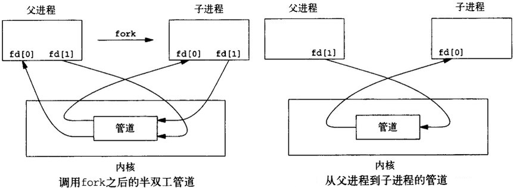

### 管道通信

&emsp;&emsp;什么是管道？管道是单向的、先进先出的，它把一个进程的输出和另一个进程的输入连接在一起。一个进程(写进程)在管道的尾部写入数据，另一个进程(读进程)从管道的头部读出数据。数据被一个进程读出后，将被从管道中删除，其它读进程将不能再读到这些数据。管道提供了简单的流控制机制，进程试图读空管道时，进程将阻塞。同样，管道已经满时，进程再试图向管道写入数据，进程将阻塞。<!--more-->

#### 管道创建

&emsp;&emsp;管道包括无名管道和有名管道两种，前者用于父进程和子进程间(兄弟进程)的通信，后者可用于运行于同一系统中的任意两个进程间的通信。无名管道由`pipe`函数创建：

``` cpp
int pipe ( int filedis[2] );
```

当一个管道建立时，它会创建两个文件描述符：`filedis[0]`用于读管道，`filedis[1]`用于写管道。
&emsp;&emsp;在`linux`系统中，无名管道一旦创建完成后，操作无名管道等同于操作文件，无名管道的读端被视为一个文件，写端也被视为一个文件，因此可以使用`read`、`write`和`close`等函数进行操作。在对`pipe`进行读写时，为了保证数据的流向，需要关闭一个进程的读端和另一个进程的写端。注意，必须在`fork`前调用`pipe`，否则子进程不会继承文件描述符。
&emsp;&emsp;如果管道的读端不存在，则认为已经读到了数据的末尾，读函数返回的读出字节数为`0`；当管道的读端存在时，如果请求的字节数目大于`PIPE_BUF`，则返回管道中现有的数据字节数，如果请求的字节数目不大于`PIPE_BUF`，则返回管道中现有数据字节数(此时，管道中数据量小于请求的数据量)；或者返回请求的字节数(此时，管道中数据量不小于请求的数据量)。`PIPE_BUF`在`include/linux/limits.h`中定义，不同的内核版本可能会有所不同。`Posix.1`要求`PIPE_BUF`至少为`512`字节，`red hat 7.2`中为`4096`。



#### 管道关闭

&emsp;&emsp;关闭管道只需将这两个文件描述符关闭即可，可以使用普通的`close`函数逐个关闭。对无名管道进行操作：

``` cpp
#include <unistd.h>
#include <sys/types.h>
#include <errno.h>
#include <stdio.h>
#include <stdlib.h>

int main() {
    int pipe_fd[2];
    pid_t pid;
    char buf_r[100];
    char *p_wbuf;
    int r_num;
    memset ( buf_r, 0, sizeof ( buf_r ) ); /* 清空buf_r */

    if ( pipe ( pipe_fd ) < 0 ) { /* 创建管道 */
        printf ( "pipe create error\n" );
        return -1;
    }

    if ( ( pid = fork() ) == 0 ) { /* 创建子进程 */
        close ( pipe_fd[1] );
        sleep ( 2 ); /* 睡眠为了保证父进程向管道内写完数据 */

        if ( ( r_num = read ( pipe_fd[0], buf_r, 100 ) ) > 0 ) {
            printf ( "%d numbers read from the pipe is %s\n", r_num, buf_r );
        }

        close ( pipe_fd[0] );
        exit ( 0 );
    } else if ( pid > 0 ) {
        close ( pipe_fd[0] );

        if ( write ( pipe_fd[1], "Hello", 5 ) != -1 ) {
            printf ( "parent write1 Hello!\n" );
        }

        if ( write ( pipe_fd[1], " Pipe", 5 ) != -1 ) {
            printf ( "parent write2 Pipe!\n" );
        }

        close ( pipe_fd[1] );
        sleep ( 3 );
        waitpid ( pid, NULL, 0 ); /* 等待子进程结束 */
        exit ( 0 );
    }

    return 0;
}
```

### 命名管道(FIFO)

&emsp;&emsp;命名管道和无名管道基本相同，但也有不同点：无名管道只能由父子进程使用；但是通过命名管道，不相关的进程也能交换数据。
&emsp;&emsp;`FIFO`文件和普通文件的区别：读取`FIFO`的进程只能以`RDONLY`的方式打开`FIFO`文件；写`FIFO`文件的进程只能以`WRONLY`的方式打开`FIFO`文件；`FIFO`文件里的内容在读取后就消失了。
&emsp;&emsp;1. 从`FIFO`中读取数据：如果一个进程为了从`FIFO`中读取数据而阻塞打开了`FIFO`，那么称该进程内的读操作为设置了阻塞标志的读操作。

- 如果有进程写打开`FIFO`，且当前`FIFO`为空，则对于设置了阻塞标志的读操作来说，将一直阻塞下去，直到有数据可以读时才继续执行；对于没有设置阻塞标志的读操作来说，则返回`-1`，当前`errno`值为`EAGAIN`，提醒以后再试。
- 对于设置了阻塞标志的读操作来说，造成阻塞的原因有两种：

(1) 当前`FIFO`内有数据，但有其它进程在读这些数据。
(2) `FIFO`本身为空。

解阻塞的原因是：`FIFO`中有新的数据写入，不论写入数据量的大小，也不论读操作请求多少数据量，只要有数据写入即可。

- 读打开的阻塞标志只对本进程第一个读操作施加作用，如果本进程中有多个读操作序列，则在第一个读操作被唤醒并完成读操作后，其它将要执行的读操作将不再阻塞，即使在执行读操作时，`FIFO`中没有数据也一样(此时读操作返回`0`)。
- 如果没有进程写打开`FIFO`，则设置了阻塞标志的读操作会阻塞。
- 如果`FIFO`中有数据，则设置了阻塞标志的读操作不会因为`FIFO`中的字节数少于请求的字节数而阻塞，此时读操作会返回`FIFO`中现有的数据量。

&emsp;&emsp;2. 从`FIFO`中写入数据：如果一个进程为了向`FIFO`中写入数据而阻塞打开`FIFO`，那么称该进程内的写操作为设置了阻塞标志的写操作。
&emsp;&emsp;`FIFO`的长度是需要考虑的一个很重要因素。系统对任一时刻在一个`FIFO`中可以存在的数据长度是有限制的。它由`#define PIPE_BUF`定义，在头文件`limits.h`中。在`Linux`和许多其他类`UNIX`系统中，它的值通常是`4096`字节，`Fedora 9`下是`4096`，但在某些系统中它可能会小到`512`字节。
&emsp;&emsp;虽然对于只有一个`FIFO`写进程和一个`FIFO`读进程而言，这个限制并不重要，但只使用一个`FIFO`并允许多个不同进程向一个`FIFO`读进程发送请求的情况是很常见的。如果几个不同的程序尝试同时向`FIFO`写数据，能否保证来自不同程序的数据块不相互交错就非常关键了。也就是说，每个写操作必须`原子化`。
&emsp;&emsp;对于设置了阻塞标志的写操作：

- 当要写入的数据量不大于`PIPE_BUF`时，`Linux`将保证写入的原子性。如果此时管道空闲缓冲区不足以容纳要写入的字节数，则进入睡眠，直到当缓冲区中能够容纳要写入的字节数时，才开始进行一次性写操作。即写入的数据长度小于等于`PIPE_BUF`时，那么或者写入全部字节，或者一个字节都不写入，它属于一个一次性行为，具体要看`FIFO`中是否有足够的缓冲区。
- 当要写入的数据量大于`PIPE_BUF`时，`Linux`将不再保证写入的原子性。`FIFO`缓冲区一有空闲区域，写进程就会试图向管道写入数据，写操作在写完所有请求写的数据后返回。

&emsp;&emsp;对于没有设置阻塞标志的写操作：

- 当要写入的数据量不大于`PIPE_BUF`时，`Linux`将保证写入的原子性。如果当前`FIFO`空闲缓冲区能够容纳请求写入的字节数，写完后成功返回；如果当前`FIFO`空闲缓冲区不能够容纳请求写入的字节数，则返回`EAGAIN`错误，提醒以后再写。
- 当要写入的数据量大于`PIPE_BUF`时，`Linux`将不再保证写入的原子性。在写满所有`FIFO`空闲缓冲区后，写操作返回。

#### 创建FIFO

``` cpp
#include <sys/types.h>
#include <sys/stat.h>
int mkfifo ( const char *pathname, mode_t mode );
```

- `pathname`：`FIFO`文件名。
- `mode`：属性，与文件处理的属性一样。

若成功，则返回`0`，否则返回`-1`，错误原因存于`errno`中：

- `EACCESS`：参数`pathname`所指定的目录路径无可执行的权限。
- `EEXIST`：参数`pathname`所指定的文件已存在。
- `ENAMETOOLONG`：参数`pathname`的路径名称太长。
- `ENOENT`：参数`pathname`包含的目录不存在。
- `ENOSPC`：文件系统的剩余空间不足。
- `ENOTDIR`：参数`pathname`路径中的目录存在，但却非真正的目录。
- `EROFS`：参数`pathname`指定的文件存在于只读文件系统内。

一旦创建了一个`FIFO`，就可用`open`打开它，一般的文件访问函数(`close`、`read`、`write`等)都可用于`FIFO`。

#### 操作FIFO

&emsp;&emsp;当打开`FIFO`时，非阻塞标志(`O_NONBLOCK`)将对以后的读写产生如下影响：

- 没有使用`O_NONBLOCK`：访问要求无法满足时进程将阻塞。如试图读取空的`FIFO`，将导致进程阻塞。
- 使用`O_NONBLOCK`：访问要求无法满足时不阻塞，立刻出错返回，`errno`是`ENXIO`。

&emsp;&emsp;`fifo_read.c`如下：

``` cpp
#include "sys/types.h"
#include "sys/stat.h"
#include "fcntl.h"
#include "stdio.h"

int main ( void ) {
    char c_buf[15];
    int fd;
    fd = open ( "./myfifo", O_RDONLY );
    read ( fd, c_buf, 11 );
    printf ( "read %s\n", c_buf );
    close ( fd );
    unlink ( "./myfifo" );
    return 0;
}
```

`fifo_write.c`如下：

``` cpp
#include "sys/types.h"
#include "sys/stat.h"
#include "fcntl.h"
#include "stdio.h"

int main ( void ) {
    int fd;
    mkfifo ( "./myfifo", 0666 ); /* 创建fifo文件 */
    fd = open ( "./myfifo", O_WRONLY ); /* 打开fifo文件 */
    write ( fd, "hello fifo", 11 ); /* 写入数据到fifo文件 */
    close ( fd );
    return 0;
}
```


---

&emsp;&emsp;关于管道的读规则验证，代码如下：

``` cpp
#include <unistd.h>
#include <sys/types.h>
#include <errno.h>
#include "string.h"
#include "stdio.h"
#include "stdlib.h"

int main() {
    int pipe_fd[2];
    pid_t pid;
    char r_buf[100];
    char w_buf[4];
    char *p_wbuf;
    int r_num;
    int cmd;

    memset ( r_buf, 0, sizeof ( r_buf ) );
    memset ( w_buf, 0, sizeof ( w_buf ) );
    p_wbuf = w_buf;

    if ( pipe ( pipe_fd ) < 0 ) {
        printf ( "pipe create error\n" );
        return -1;
    }

    if ( ( pid = fork() ) == 0 ) {
        close ( pipe_fd[1] );
        sleep ( 3 );/* 确保父进程关闭写端 */
        r_num = read ( pipe_fd[0], r_buf, 100 );
        printf ( "read num is %d, the data read from the pipe is %d\n", r_num, atoi ( r_buf ) );
        close ( pipe_fd[0] );
        exit ( 0 );
    } else if ( pid > 0 ) {
        close ( pipe_fd[0] ); /* read */
        strcpy ( w_buf, "111" );

        if ( write ( pipe_fd[1], w_buf, 4 ) != -1 ) {
            printf ( "parent write over\n" );
        }

        close ( pipe_fd[1] ); /* write */
        printf ( "parent close fd[1] over\n" );
        sleep ( 10 );
    }
}
```

执行结果：

``` cpp
parent write over
parent close fd[1] over
read num is 4, the data read from the pipe is 111
```

结论为：管道写端关闭后，写入的数据将一直存在，直到读出为止。
&emsp;&emsp;向管道中写入数据时，`linux`将不保证写入的原子性，管道缓冲区一有空闲区域，写进程就会试图向管道写入数据。如果读进程不读走管道缓冲区中的数据，那么写操作将一直阻塞。
&emsp;&emsp;只有在管道的读端存在时，向管道中写入数据才有意义。否则，向管道中写入数据的进程将收到内核传来的`SIGPIPE`信号，应用程序可以处理该信号，也可以忽略(默认动作则是应用程序终止)。
&emsp;&emsp;对管道的写规则的验证(写端对读端存在的依赖性)：

``` cpp
#include <unistd.h>
#include <sys/types.h>
#include "string.h"
#include "stdio.h"
#include "stdlib.h"

int main() {
    int pipe_fd[2];
    pid_t pid;
    char r_buf[4];
    char *w_buf;
    int writenum;
    int cmd;

    memset ( r_buf, 0, sizeof ( r_buf ) );

    if ( pipe ( pipe_fd ) < 0 ) {
        printf ( "pipe create error\n" );
        return -1;
    }

    if ( ( pid = fork() ) == 0 ) {
        close ( pipe_fd[0] );
        close ( pipe_fd[1] );
        sleep ( 10 );
        exit ( 0 );
    } else if ( pid > 0 ) {
        sleep ( 1 );
        close ( pipe_fd[0] );
        w_buf = "111";

        if ( ( writenum = write ( pipe_fd[1], w_buf, 4 ) ) == -1 ) {
            printf ( "write to pipe error\n" );
        } else {
            printf ( "the bytes write to pipe is %d\n", writenum );
        }

        close ( pipe_fd[1] );
    }
}
```

则输出结果为无，原因就是该管道以及它的所有`fork`产物的读端都已经被关闭。如果在父进程中保留读端，即在写完`pipe`后，再关闭父进程的读端，也会正常写入`pipe`。因此，在向管道写入数据时，至少应该存在某一个进程，其中管道读端没有被关闭，否则就会出现上述错误(管道断裂，进程收到了`SIGPIPE`信号，默认动作是进程终止)。
&emsp;&emsp;对管道的写规则的验证(`linux`不保证写管道的原子性验证)：

``` cpp
#include <unistd.h>
#include <sys/types.h>
#include <errno.h>
#include "stdio.h"
#include "stdlib.h"
#include "string.h"

int main ( int argc, char **argv ) {
    int pipe_fd[2];
    pid_t pid;
    char r_buf[4096];
    char w_buf[4096 * 2];
    int writenum;
    int rnum;

    memset ( r_buf, 0, sizeof ( r_buf ) );

    if ( pipe ( pipe_fd ) < 0 ) {
        printf ( "pipe create error\n" );
        return -1;
    }

    if ( ( pid = fork() ) == 0 ) {
        close ( pipe_fd[1] );

        while ( 1 ) {
            sleep ( 1 );
            rnum = read ( pipe_fd[0], r_buf, 1000 );
            printf ( "child: readnum is %d\n", rnum );
        }

        close ( pipe_fd[0] );
        exit ( 0 );
    } else if ( pid > 0 ) {
        close ( pipe_fd[0] );
        memset ( r_buf, 0, sizeof ( r_buf ) );

        if ( ( writenum = write ( pipe_fd[1], w_buf, 1024 ) ) == -1 ) {
            printf ( "write to pipe error\n" );
        } else {
            printf ( "the bytes write to pipe is %d\n", writenum );
        }

        writenum = write ( pipe_fd[1], w_buf, 4096 );
        close ( pipe_fd[1] );
    }
}
```

执行结果：

``` cpp
the bytes write to pipe 1000
the bytes write to pipe 1000 /* 注意，此行输出说明了写入的非原子性 */
the bytes write to pipe 1000
the bytes write to pipe 1000
the bytes write to pipe 1000
the bytes write to pipe 120 /* 注意，此行输出说明了写入的非原子性 */
the bytes write to pipe 0
the bytes write to pipe 0
...
```

结论为：写入数目小于`4096`时写入是非原子的。如果把父进程中的两次写入字节数都改为`5000`，则很容易得出下面结论：写入管道的数据量大于`4096`字节时，缓冲区的空闲空间将被写入数据(补齐)，直到写完所有数据为止，如果没有进程读数据，则一直阻塞。

---

### 双子进程pipe

&emsp;&emsp;代码如下：

``` cpp
#include "unistd.h"
#include "stdio.h"
#include "stdlib.h"

int pid1, pid2;

int main() {
    int fd[2];
    char outpipe[100], inpipe[100];

    pipe ( fd );

    while ( ( pid1 = fork() ) == -1 );

    if ( pid1 == 0 ) {
        lockf ( fd[1], 1, 0 );
        sprintf ( outpipe, "child 1 process is sending message!" );
        write ( fd[1], outpipe, 50 );
        sleep ( 5 );
        lockf ( fd[1], 0, 0 );
        exit ( 0 );
    } else {
        while ( ( pid2 = fork() ) == -1 );

        if ( pid2 == 0 ) {
            lockf ( fd[1], 1, 0 ); /* 互斥 */
            sprintf ( outpipe, "child 2 process is sending message!" );
            write ( fd[1], outpipe, 50 );
            sleep ( 5 );
            lockf ( fd[1], 0, 0 );
            exit ( 0 );
        } else {
            wait ( NULL ); /* 同步 */
            read ( fd[0], inpipe, 50 );
            printf ( "%s\n", inpipe );
            wait ( NULL );
            read ( fd[0], inpipe, 50 );
            printf ( "%s\n", inpipe );
            exit ( 0 );
        }
    }
}
```


---

### 基于管道的popen和pclose函数

&emsp;&emsp;标准`I/O`函数库提供了`popen`函数，它启动另外一个进程去执行一个`shell`命令行。这里我们称调用`popen`的进程为父进程，由`popen`启动的进程称为子进程。
&emsp;&emsp;`popen`函数还创建一个管道用于父子进程间通信。父进程要么从管道读信息，要么向管道写信息，至于是读还是写取决于父进程调用`popen`时传递的参数。

``` cpp
FILE *popen ( const char *command, const char *type );
```

`popen`会调用`fork`产生子进程，然后从子进程中调用`/bin/sh -c`来执行参数`command`的指令。参数`type`可使用`r`代表读取，`w`代表写入。依照此`type`值，`popen`会建立管道连到子进程的标准输出设备或标准输入设备，然后返回一个文件指针。随后进程便可利用此文件指针来读取子进程的输出设备或是写入到子进程的标准输入设备中。若成功，则返回文件指针，否则返回`NULL`，错误原因存于`errno`中。
&emsp;&emsp;`pclose`函数原型如下：

``` cpp
int pclose ( FILE *stream );
```

`pclose`用来关闭由`popen`所建立的管道及文件指针。参数`stream`为先前由`popen`所返回的文件指针。若成功，返回`shell`的终止状态(也即子进程的终止状态)，若出错返回`-1`，错误原因存于`errno`中。
&emsp;&emsp;下面通过例子看一下`popen`的使用：假如我们想取得当前目录下的文件个数，在`shell`下我们可以使用命令`ls | wc - l`。可以在程序中这样写：

``` cpp
/* 取得当前目录下的文件个数 */
#include <stdio.h>
#include <stdlib.h>
#include <errno.h>
#include <sys/wait.h>

#define MAXLINE 1024

int main() {
    char result_buf[MAXLINE], command[MAXLINE];
    int rc = 0; /* 用于接收命令返回值 */
    FILE *fp;
    /* 将要执行的命令写入buf */
    snprintf ( command, sizeof ( command ), "ls ./ | wc -l" );
    fp = popen ( command, "r" ); /* 执行预先设定的命令，并读出该命令的标准输出 */

    if ( NULL == fp ) {
        perror ( "popen执行失败！" );
        exit ( 1 );
    }

    while ( fgets ( result_buf, sizeof ( result_buf ), fp ) != NULL ) {
        /* 为了下面输出好看一些，把命令返回的换行符去掉 */
        if ( '\n' == result_buf[strlen ( result_buf ) - 1] ) {
            result_buf[strlen ( result_buf ) - 1] = '\0';
        }

        printf ( "命令【%s】 输出【%s】\r\n", command, result_buf );
    }

    rc = pclose ( fp ); /* 等待命令执行完毕并关闭管道及文件指针 */

    if ( -1 == rc ) {
        perror ( "关闭文件指针失败" );
        exit ( 1 );
    } else {
        printf ( "命令【%s】子进程结束状态【%d】命令返回值【%d】\r\n", \
                 command, rc, WEXITSTATUS ( rc ) );
    }

    return 0;
}
```

执行结果：

``` cpp
命令【ls ./ | wc -l】 输出【2】
命令【ls ./ | wc -l】子进程结束状态【0】命令返回值【0】
```

上面`popen`只捕获了`command`的标准输出，如果`command`执行失败，子进程会把错误信息打印到标准错误输出，父进程就无法获取。比如，`command`命令为`ls nofile.txt`，事实上我们根本没有`nofile.txt`这个文件，这时`shell`会输出`ls: nofile.txt: No such file or directory`。这个输出是在标准错误输出上的。通过上面的程序并无法获取。
&emsp;&emsp;如果你把上面程序中的`command`设成`ls nofile.txt`，则执行结果如下：

``` cpp
ls: nofile.txt: No such file or directory
命令【ls nofile.txt】子进程结束状态【256】命令返回值【1】
```

需要注意的是第一行输出并不是父进程的输出，而是子进程的标准错误输出。
&emsp;&emsp;有时子进程的错误信息是很有用的，那么父进程怎么才能获取子进程的错误信息呢？这里我们可以重定向子进程的错误输出，让错误输出重定向到标准输出(`2>&1`)，这样父进程就可以捕获子进程的错误信息了。例如`command`为`ls nofile.txt 2>&1`，输出如下：

``` cpp
命令【ls nofile.txt 2>&1】 输出【ls: nofile.txt: No such file or directory】
命令【ls nofile.txt 2>&1】子进程结束状态【256】命令返回值【1】
```

&emsp;&emsp;子进程的终止状态判断涉及到的宏，设进程终止状态为`status`。

- `WIFEXITED(status)`：如果子进程正常结束则为非`0`值。
- `WEXITSTATUS(status)`：取得子进程`exit`返回的结束代码，一般会先用`WIFEXITED`来判断是否正常结束才能使用此宏。
- `WIFSIGNALED(status)`：如果子进程是因为信号而结束，则此宏值为真。
- `WTERMSIG(status)`：取得子进程因信号而中止的信号代码，一般会先用`WIFSIGNALED`来判断后才使用此宏。
- `WIFSTOPPED(status)`：如果子进程处于暂停执行情况，则此宏值为真。一般只有使用`WUNTRACED`时才会有此情况。
- `WSTOPSIG(status)`：取得引发子进程暂停的信号代码，一般会先用`WIFSTOPPED`来判断后才使用此宏。