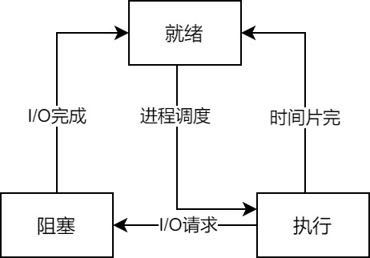

### 定义

&emsp;&emsp;进程是一个具有一定独立功能的程序的一次运行活动，其特点有：并发性、独立性和异步性。<!--more-->
&emsp;&emsp;进程的状态变换如下：



### 进程互斥

&emsp;&emsp;操作系统中将一次只允许一个进程访问的资源称为`临界资源`。进程中访问临界资源的那段程序代码称为`临界区`。
&emsp;&emsp;进程互斥是指当有若干进程都要使用某一共享资源时，任何时刻最多允许一个进程使用，其他要使用该资源的进程必须等待，直到占用该资源者释放了该资源为止。

### 进程同步

&emsp;&emsp;一组并发进程按一定的顺序执行的过程称为`进程间的同步`，具有同步关系的一组并发进程称为`合作进程`。

### 进程ID

&emsp;&emsp;`PID`即进程`ID`，它是标识进程的唯一数字；`PPID`是父进程的`ID`。
&emsp;&emsp;获取`PID`和`PPID`使用如下函数：

``` cpp
#include <sys/types.h>
#include <unistd.h>
pid_t getpid ( void ); /* 获取本进程ID */
pid_t getppid ( void ); /* 获取父进程ID */
```

&emsp;&emsp;代码实例：

``` cpp
#include <stdio.h>
#include <unistd.h>
#include <stdlib.h>

int main ( void ) {
    printf ( "PID = %d\n", getpid() );
    printf ( "PPID = %d\n", getppid() );
    return 0;
}
```