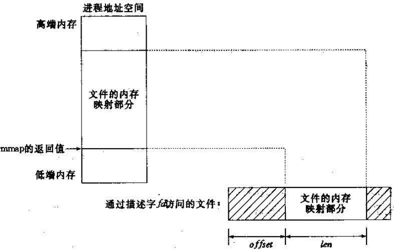
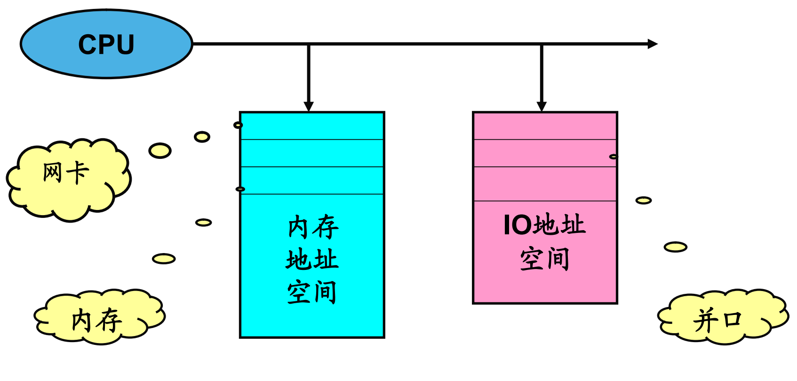

### 驱动程序介绍

&emsp;&emsp;设备驱动分为：字符设备驱动、网络接口驱动和块设备驱动。<!--more-->

- 字符设备：字符设备是一种按字节来访问的设备，字符驱动则负责驱动字符设备，这样的驱动通常实现`open`、`close`、`read`和`write`系统调用。
- 块设备：在大部分的`Unix`系统，块设备不能按字节处理数据，只能一次传送一个或多个长度是`512`字节(或一个更大的`2`次幂的数)的整块数据，而`Linux`则允许块设备传送任意数目的字节。因此，块和字符设备的区别仅仅是驱动的与内核的接口不同。
- 网络接口：任何网络事务都通过一个接口来进行，一个接口通常是一个硬件设备(`eth0`)，但是它也可以是一个纯粹的软件设备，比如回环接口(`lo`)。一个网络接口负责发送和接收数据报文。

&emsp;&emsp;`Linux`用户程序通过设备文件(又称为`设备节点`)来使用驱动程序操作字符设备和块设备。


### 字符设备驱动程序

#### 主次设备号

&emsp;&emsp;字符设备通过字符设备文件来存取。字符设备文件由使用`ls -l`的输出的第一列的`c`标识。如果使用`ls -l`命令，会看到在设备文件项中有`2`个数(由一个逗号分隔)。这些数字就是设备文件的主次设备编号。

#### 设备号作用

&emsp;&emsp;主设备号用来标识与设备文件相连的驱动程序，次编号被驱动程序用来辨别操作的是哪个设备。主设备号用来反映设备类型，次设备号用来区分同类型的设备。内核中使用`dev_t`类型描述设备号，`dev_t`其实质为`unsigned int`的`32`位整数，其中高`12`位为主设备号，低`20`位为次设备号。可以使用`MAJOR(dev_t dev)`从`dev_t`中分解出主设备号，使用`MINOR(dev_t dev)`从`dev_t`中分解出次设备号。

#### 分配主设备号

&emsp;&emsp;`Linux`内核可以采用静态申请、动态分配两种方法给设备分配主设备号。

#### 静态申请

&emsp;&emsp;方法主要有：根据`Documentation/devices.txt`，确定一个没有使用的主设备号；使用`register_chrdev_region`函数注册设备号。优点是简单，缺点是一旦驱动被广泛使用，这个随机选定的主设备号可能会导致设备号冲突，而使驱动程序无法注册。

``` cpp
int register_chrdev_region ( dev_t from, unsigned count, const char *name );
```

申请使用从`from`开始的`count`个设备号(主设备号不变，次设备号增加)。

- `from`：希望申请使用的设备号。
- `count`：希望申请使用设备号数目。
- `name`：设备名(体现在`/proc/devices`)。

#### 动态分配

&emsp;&emsp;使用`alloc_chrdev_region`分配设备号。优点是简单，易于驱动推广。缺点是无法在安装驱动前创建设备文件(因为安装前还没有分配到主设备号)。解决办法：安装驱动后，从`/proc/devices`中查询设备号。

``` cpp
int alloc_chrdev_region ( dev_t *dev, unsigned baseminor, unsigned count, const char *name );
```

请求内核动态分配`count`个设备号，且次设备号从`baseminor`开始。

- `dev`：分配到的设备号。
- `baseminor`：起始次设备号。
- `count`：需要分配的设备号数目。
- `name`：设备名(体现在`/proc/devices`)。

#### 注销设备号

&emsp;&emsp;不论使用何种方法分配设备号，都应该在不再使用它们时释放这些设备号。

``` cpp
void unregister_chrdev_region ( dev_t from, unsigned count );
```

释放从`from`开始的`count`个设备号。

#### 创建设备文件

&emsp;&emsp;`2`种方法分别是：使用`mknod`命令手工创建；自动创建。

#### 手工创建

&emsp;&emsp;`mknod`用法如下：

``` bash
mknod filename type major minor
```

- `filename`：设备文件名。
- `type`：设备文件类型。
- `major`：主设备号。
- `minor`：次设备号。

&emsp;&emsp;使用范例为`mknod serial0 c 100 0`。

#### 重要结构

&emsp;&emsp;在`Linux`字符设备驱动程序设计中，有`3`种非常重要的数据结构：`struct file`、`struct inode`和`struct file_operations`。

#### Struct File

&emsp;&emsp;代表一个打开的文件。系统中每个打开的文件在内核空间都有一个关联的`struct file`。它由内核在打开文件时创建，在文件关闭后释放。重要成员有：

``` cpp
loff_t f_pos; /* 文件读写位置 */
struct file_operations *f_op;
```

#### Struct Inode

&emsp;&emsp;用来记录文件的物理上的信息。因此，它和代表打开文件的`file`结构是不同的。一个文件可以对应多个`file`结构，但只有一个`inode`结构。重要成员有：

``` cpp
dev_t i_rdev; /* 设备号 */
```

#### Struct file_operations

&emsp;&emsp;一个函数指针的集合，定义能在设备上进行的操作。结构中的成员指向驱动中的函数，这些函数实现一个特别的操作，对于不支持的操作保留为`NULL`。

``` cpp
struct file_operations mem_fops = {
    .owner   = THIS_MODULE,
    .llseek  = mem_seek,
    .read    = mem_read,
    .write   = mem_write,
    .ioctl   = mem_ioctl,
    .open    = mem_open,
    .release = mem_release,
};
```

#### 设备注册

&emsp;&emsp;在`linux 2.6`内核中，字符设备使用`struct cdev`来描述。字符设备的注册可分为如下`3`个步骤：

1. 分配`cdev`。
2. 初始化`cdev`。
3. 添加`cdev`。

&emsp;&emsp;`struct cdev`的分配可使用`cdev_alloc`函数来完成：

``` cpp
struct cdev *cdev_alloc ( void );
```

&emsp;&emsp;`struct cdev`的初始化使用`cdev_init`函数来完成：

``` cpp
void cdev_init ( struct cdev *cdev, const struct file_operations *fops );
```

- `cdev`：待初始化的`cdev`结构。
- `fops`：设备对应的操作函数集

&emsp;&emsp;`struct cdev`的注册使用`cdev_add`函数来完成：

``` cpp
int cdev_add ( struct cdev *p, dev_t dev, unsigned count );
```

- `p`：待添加到内核的字符设备结构。
- `dev`：设备号。
- `count`：添加的设备个数。

#### 设备操作

- `int ( *open ) ( struct inode *, struct file * );`：在设备文件上的第一个操作，并不要求驱动程序一定要实现这个方法。如果该项为NULL，设备的打开操作永远成功。
- `void ( *release ) ( struct inode *, struct file * );`：当设备文件被关闭时调用这个操作。与`open`相仿，`release`也可以没有。
- `ssize_t ( *read ) ( struct file *, char __user *, size_t, loff_t * );`：从设备中读取数据。函数返回一个非负值，表示成功地从设备中读取多少字节。
- `ssize_t ( *write ) ( struct file *, const char __user *, size_t, loff_t * );`：向设备发送数据。
- `unsigned int ( *poll ) ( struct file *, struct poll_table_struct * );`：对应`select`系统调用。
- `int ( *ioctl ) ( struct inode *, struct file *, unsigned int, unsigned long );`：控制设备。
- `int ( *mmap ) ( struct file *, struct vm_area_struct * );`：将设备映射到进程虚拟地址空间中。
- `off_t ( *llseek ) ( struct file *, loff_t, int );`：修改文件的当前读写位置，并将新位置作为返回值。
- `int ( *select ) ( struct inode *, struct file *, int, select_table * );`：一般用于程序询问设备是否可读或可写。

#### Open方法

&emsp;&emsp;`Open`方法是驱动程序用来为以后的操作完成初始化准备工作的。在大部分驱动程序中，`open`完成如下工作：初始化设备；标明次设备号。

#### Release方法

&emsp;&emsp;`Release`方法的作用正好与`open`相反。这个设备方法有时也称为`close`，它关闭设备。

#### 读和写

&emsp;&emsp;读和写方法都完成类似的工作：从设备中读取数据到用户空间；将数据传递给驱动程序。它们的原型也相当相似：

``` cpp
ssize_t xxx_read ( struct file *filp, char __user *buff, size_t count, loff_t *offp );
ssize_t xxx_write ( struct file *filp, char __user *buff, size_t count, loff_t *offp );
```

`filp`是文件指针，`count`是请求传输的数据量，`buff`参数指向数据缓存，`offp`指出文件当前的访问位置。
&emsp;&emsp;`Read`和`Write`方法的`buff`参数是用户空间指针。因此，它不能被内核代码直接引用，理由如下：用户空间指针在内核空间时可能根本是无效的，这是因为没有那个地址的映射。内核提供了专门的函数用于访问用户空间的指针：

``` cpp
int copy_from_user ( void *to, const void __user *from, int n );
int copy_to_user ( void __user *to, const void *from, int n );
```

#### 读数据模型

&emsp;&emsp;读数据模型如下：


#### 设备注消

&emsp;&emsp;字符设备的注销使用`cdev_del`函数来完成：

``` cpp
int cdev_del ( struct cdev *p );
```

- `p`：要注销的字符设备结构。

### 驱动调试技术

#### 调试技术分类

&emsp;&emsp;对于驱动程序设计来说，核心问题之一就是如何完成调试。当前常用的驱动调试技术可分为：打印调试、调试器调试和查询调试。

#### 打印调试

&emsp;&emsp;在调试应用程序时，最常用的调试技术是打印，就是在应用程序中合适的点调用`printf`。当调试内核代码的时候，可以用`printk`完成类似任务。

#### 合理使用Printk

&emsp;&emsp;在驱动开发时，`printk`非常有助于调试。但当正式发行驱动程序时，应当去掉这些打印语句。但你有可能很快又发现，你又需要在驱动程序中实现一个新功能(或者修复一个`bug`)，这时你又要用到那些被删除的打印语句。这里介绍一种使用`printk`的合理方法，可以全局地打开或关闭它们，而不是简单地删除。

``` cpp
#ifdef PDEBUG
   #define PLOG(fmt, args...) printk(KERN_DEBUG "scull:"fmt, ##args)
#else
   #define PLOG(fmt, args...) /* do nothing */
#endif
```

&emsp;&emsp;`Makefile`作如下修改：

``` makefile
DEBUG = y

ifeq ($(DEBUG), y)
    DEBFLAGS = -O2 -g -DPDEBUG
else
    DEBFLAGS = -O2
endif

CFLAGS += $(DEBFLAGS)
```

### 并发控制

#### 并发与竞态

&emsp;&emsp;并发是指多个执行单元同时被执行；竞态是指并发的执行单元对共享资源(硬件资源和软件上的全局变量等)的访问导致的竞争状态。

``` cpp
if ( copy_from_user ( & ( dev->data[pos] ), buf, count ) ) {
    ret = -EFAULT;
}
```

假设有`2`个进程试图同时向一个设备的相同位置写入数据，就会造成数据混乱。
&emsp;&emsp;处理并发的常用技术是加锁或者互斥，即确保在任何时间只有一个执行单元可以操作共享资源。在`Linux`内核中主要通过`semaphore`机制和`spin_lock`机制实现。

&emsp;&emsp;`linux`内核什么时候会发生竞态？

- 对称多`cpu`(`SMP`)的多个`cpu`之间的竞态。
- 单`CPU`内进程间的竞态。
- 中断(硬中断、软中断、`Tasklet`、底半部)与进程之间的竞态。

#### 中断屏蔽

&emsp;&emsp;可解决中断与进程之间的并发；也可解决内核抢占进程之间的并发。

- `local_irq_disable()`：禁止中断。
- `local_irq_enable()`：打开中断。
- `local_irq_save(flags)`：禁止中断并保存中断寄存器信息到`flags`。
- `local_irq_restore(flags)`：打开中断并恢复`flags`值到中断寄存器信息。
- `loacl_bh_disable()`：仅禁止中断底半部中断。
- `loacl_bh_enable()`：打开中断底半部中断。

&emsp;&emsp;使用范例：

``` cpp
local_irq_disbale(); /* 屏蔽中断 */
...                  /* 临界资源 */
local_irq_enbale();  /* 打开中断 */
```

#### 信号量

&emsp;&emsp;`Linux`内核的信号量在概念和原理上与用户态的信号量是一样的，但是它不能在内核之外使用，它是一种睡眠锁。如果有一个任务想要获得已经被占用的信号量时，信号量会将这个进程放入一个等待队列，然后让其睡眠。当持有信号量的进程将信号释放后，处于等待队列中的任务将被唤醒，并让其获得信号量。
&emsp;&emsp;信号量在创建时需要设置一个初始值，表示允许有几个任务同时访问该信号量保护的共享资源，初始值为`1`就变成互斥锁(`Mutex`)，即同时只能有一个任务可以访问信号量保护的共享资源。当任务访问完被信号量保护的共享资源后，必须释放信号量，释放信号量通过把信号量的值加`1`实现，如果释放后信号量的值为非正数，表明有任务等待当前信号量，因此要唤醒等待该信号量的任务。
&emsp;&emsp;信号量的实现也是与体系结构相关的，定义在`<asm/semaphore.h>`中，`struct semaphore`类型用来表示信号量。
&emsp;&emsp;1. 定义信号量：

``` cpp
struct semaphore sem;
```

&emsp;&emsp;2. 初始化信号量：

``` cpp
/* 该函用于数初始化设置信号量的初值，它设置信号量sem的值为val */
void sema_init ( struct semaphore *sem, int val );
/* 该函数用于初始化一个互斥锁，即它把信号量sem的值设置为1 */
void init_MUTEX ( struct semaphore *sem );
/* 该函数也用于初始化一个互斥锁，但它把信号量sem的值设置为0，即一开始就处在已锁状态 */
void init_MUTEX_LOCKED ( struct semaphore *sem );
```

&emsp;&emsp;定义与初始化的工作可由如下宏一步完成：

``` cpp
/* 定义一个信号量name，并初始化它的值为1 */
DECLARE_MUTEX ( name );
/* 定义一个信号量name，但把它的初始值设置为0，即锁在创建时就处在已锁状态 */
DECLARE_MUTEX_LOCKED ( name );
```

&emsp;&emsp;3. 获取信号量：

``` cpp
/* 获取信号量sem，可能会导致进程睡眠，因此不能在中断上下文使用该函数。该函数将把sem的值减1，
   如果信号量sem的值非负，就直接返回，否则调用者将被挂起，直到别的任务释放该信号量才能继续运行 */
void down ( struct semaphore *sem );
/* 获取信号量sem。如果信号量不可用，进程将被置为TASK_INTERRUPTIBLE类型的睡眠状态。
   该函数由返回值来区分是正常返回还是被信号中断返回，如果返回0，
   表示获得信号量正常返回，如果被信号打断，返回“-EINTR” */
int down_interruptible ( struct semaphore *sem );
/* 获取信号量sem。如果信号量不可用，进程将被置为TASK_KILLABLE类型的睡眠状态 */
int down_killable ( struct semaphore *sem );
```

注意，`down`函数现已不建议继续使用。建议使用`down_killable`或`down_interruptible`函数。
&emsp;&emsp;4. 释放信号量：

``` cpp
/* 该函数释放信号量sem，即把sem的值加1，如果sem的值为非正数，
   表明有任务等待该信号量，因此唤醒这些等待者 */
void up ( struct semaphore *sem );
```

&emsp;&emsp;信号量使用模板：

``` cpp
DECLARE_MUTEX ( sem )

if ( down_interruptible ( &sem ) ) {
    return -ERESTARTSYS;
}

... /* 临界资源 */

up ( &sem );
```

#### 自旋锁

&emsp;&emsp;自旋锁最多只能被一个可执行单元持有。自旋锁不会引起调用者睡眠，如果一个执行线程试图获得一个已经被持有的自旋锁，那么线程就会一直进行忙循环，一直等待下去，在那里看是否该自旋锁的保持者已经释放了锁，`自旋`就是这个意思。

``` cpp
/* 该宏用于初始化自旋锁x，自旋锁在使用前必须先初始化 */
spin_lock_init ( x );
/* 获取自旋锁lock，如果成功，立即获得锁，并马上返回，否则它将一直自旋在那里，直到该自旋锁的保持者释放 */
spin_lock ( lock );
/* 试图获取自旋锁lock，如果能立即获得锁，并返回真，否则立即返回假。它不会一直等待被释放 */
spin_trylock ( lock );
spin_unlock ( lock ); /* 释放自旋锁lock，它与spin_trylock或spin_lock配对使用 */
```

&emsp;&emsp;读写自旋锁示例：

``` cpp
unsigned long flags;
rwlock_t rwlock;
rwlock_init ( &rwlock );
read_lock ( &rwlock );
... /* 临界资源 */
read_unlock ( &rwlock );
write_lock_irqsave ( &rwlock, flags );
... /* 临界资源 */
write_unlock_irqrestore ( &rwlock, flags );
```

&emsp;&emsp;自旋锁模板：

``` cpp
spinlock_t lock;
spin_lock_init ( &lock );
spin_lock ( &lock );
... /* 临界资源 */
spin_unlock ( &lock );
```

#### 读入者/写入者信号量

&emsp;&emsp;读操作并发，写操作互斥，即一个`rwsem`可允许一个写入者或无数个读取者拥有该信号量。写入者的级别更高，当有大量写入者竞争该信号量时，会导致读取者饿死，即长时间拒绝读取者的访问。但是驱动程序很少用该机制，一般在很少需要写访问且写入者只会短期拥有信号量的时候使用`rwsem`。

``` cpp
rw_semaphere_t rw_sem;
init_rwsem ( &rw_sem );
... /* 读时获取信号量 */
down_read ( &rw_sem );
... /* 临界资源 */
up_read ( &rw_sem );
... /* 写时获取信号量 */
down_write ( &rw_sem );
... /* 临界资源 */
up_write ( &rw_sem );
```

#### 信号量 PK 自旋锁

&emsp;&emsp;信号量可能允许有多个持有者，而自旋锁在任何时候只能允许一个持有者。当然也有信号量叫互斥信号量(只能一个持有者)，允许有多个持有者的信号量叫计数信号量。信号量适合于保持时间较长的情况；而自旋锁适合于保持时间非常短的情况，在实际应用中自旋锁控制的代码只有几行，而持有自旋锁的时间也一般不会超过两次上下文切换的时间，因为线程一旦要进行切换，就至少花费切出切入两次，自旋锁的占用时间如果远远长于两次上下文切换，我们就应该选择信号量。
&emsp;&emsp;开销成本：

- 使用信号量的开销是进程上下文切换时间。
- 自旋锁的开销是忙等待获取自旋锁。

&emsp;&emsp;等待时机不同：

- 信号量可能导致阻塞，所以在不允许阻塞的代码中不能用可能引起阻塞的信号量处理方式。
- 自旋锁是忙等待。

### 设备Ioctl控制

#### ioctl功能

&emsp;&emsp;大部分驱动除了需要具备读写设备的能力外，还需要具备对硬件控制的能力。例如，要求设备报告错误信息，改变波特率，这些操作常常通过`ioctl`方法来实现。

#### 用户使用方法

&emsp;&emsp;在用户空间，使用`ioctl`系统调用来控制设备：

``` cpp
int ioctl ( int fd, unsigned long cmd, ... );
```

原型中的点表示这是一个可选的参数，存在与否依赖于控制命令(第`2`个参数)是否涉及到与设备的数据交互。

#### 驱动ioctl方法

&emsp;&emsp;`ioctl`驱动方法有和用户空间版本不同的原型：

``` cpp
int ( *ioctl ) ( struct inode *inode, struct file *filp, unsigned int cmd, unsigned long arg );
```

`cmd`参数从用户空间传下来，可选的参数`arg`以一个`unsigned long`的形式传递，不管它是一个整数或一个指针。如果`cmd`命令不涉及数据传输，则参数`arg`的值无任何意义。

#### 定义命令

&emsp;&emsp;在编写`ioctl`代码之前，首先需要定义命令。为了防止对错误的设备使用正确的命令，命令号应该在系统范围内是唯一的。`ioctl`命令编码被划分为几个位段，`include/asm/ioctl.h`中定义了这些位字段：类型(幻数)、序号、传送方向、参数的大小。`Documentation/ioctl-number.txt`文件中罗列了在内核中已经使用了的幻数。定义`ioctl`命令的正确方法是使用`4`个位段，这个列表中介绍的符号定义在`linux/ioctl.h`中：

- `Type`：幻数(类型)，表明哪个设备的命令，在参考了`ioctlnumber.txt`之后选出，`8`位宽。
- `Number`：序号，表明设备命令中的第几个，`8`位宽。
- `Direction`：数据传送的方向，可能的值是`_IOC_NONE`(没有数据传输)、`_IOC_READ`或`_IOC_WRITE`。数据传送是从应用程序的观点来看待的，`_IOC_READ`意思是从设备读。
- `Size`：用户数据的大小(`13/14`位宽，视处理器而定)。

&emsp;&emsp;内核提供了下列宏来帮助定义命令：

``` cpp
_IO   ( type, nr )           /* 没有参数的命令 */
_IOR  ( type, nr, datatype ) /* 从驱动中读数据 */
_IOW  ( type, nr, datatype ) /* 写数据到驱动 */
_IOWR ( type, nr, datatype ) /* 双向传送，type和number成员作为参数被传递 */
```

#### 定义命令示例

``` cpp
#define MEM_IOC_MAGIC 'm' /* 定义幻数 */
#define MEM_IOCSET    _IOW ( MEM_IOC_MAGIC, 0, int ) /* int是指传递参数的类型 */
#define MEM_IOCGQSET  _IOR ( MEM_IOC_MAGIC, 1, int )
```

#### Ioctl函数实现

&emsp;&emsp;定义好了命令，下一步就是要实现`Ioctl`函数了，`Ioctl`函数的实现包括如下`3`个技术环节：返回值、参数使用和命令操作。
&emsp;&emsp;`Ioctl`函数的实现通常是根据命令执行的一个`switch`语句。但是，当命令号不能匹配任何一个设备所支持的命令时，通常返回`-EINVAL`，意思是非法参数。
&emsp;&emsp;如何使用`Ioctl`中的参数？如果是一个整数，可以直接使用。如果是指针，我们必须确保这个用户地址是有效的，因此使用前需进行正确的检查。

#### Ioctl函数实现(参数检查)

&emsp;&emsp;不需要检测的函数由`copy_from_user`(等价于`get_user`)、`copy_to_user`(等价于`put_user`)、`get_user`和`put_user`，需要检测的函数有`__get_user`和`__put_user`。

``` cpp
if ( _IOC_DIR ( cmd ) & _IOC_READ ) { /* “_IOC_DIR”是用来提取命令的方向 */
    err = !access_ok ( VERIFY_WRITE, ( void __user * ) arg, _IOC_SIZE ( cmd ) );
} else if ( _IOC_DIR ( cmd ) & _IOC_WRITE ) {
    err = !access_ok ( VERIFY_READ, ( void __user * ) arg, _IOC_SIZE ( cmd ) );
}

if ( err ) {
    return -EFAULT;
}
```

#### Ioctl函数实现(命令操作)

``` cpp
switch ( cmd ) {
    case MEM_IOCSQUANTUM: /* Set: arg points to the value */
        retval = __get_user ( scull_quantum, ( int * ) arg );
        break;
    case MEM_IOCGQUANTUM: /* Get: arg is pointer to result */
        retval = __put_user ( scull_quantum, ( int * ) arg );
        break;
    default:
        return –EINVAL;
}
```

### 内核等待队列

#### 等待队列

&emsp;&emsp;在`Linux`驱动程序设计中，可以使用等待队列来实现进程的阻塞，等待队列可看作保存进程的容器，在阻塞进程时，将进程放入等待队列，当唤醒进程时，从等待等列中取出进程。`Linux 2.6`内核提供了如下关于等待队列的操作：
&emsp;&emsp;1. 定义等待队列：

``` cpp
wait_queue_head_t my_queue;
```

&emsp;&emsp;2. 初始化等待队列：

``` cpp
init_waitqueue_head ( &my_queue );
```

&emsp;&emsp;3. 定义并初始化等待队列：

``` cpp
DECLARE_WAIT_QUEUE_HEAD ( my_queue );
```

&emsp;&emsp;4. 有条件睡眠：

``` cpp
/* 当condition(一个布尔表达式)为真时，立即返回；否则让进程进入
   TASK_UNINTERRUPTIBLE模式的睡眠，并挂在queue参数所指定的等待队列上 */
wait_event(queue, condition);
/* 当condition(一个布尔表达式)为真时，立即返回；否则让进程进入
   TASK_INTERRUPTIBLE的睡眠，并挂在queue参数所指定的等待队列上 */
wait_event_interruptible(queue, condition);
/* 当condition(一个布尔表达式)为真时，立即返回；否则让进程进入
   TASK_KILLABLE的睡眠，并挂在queue参数所指定的等待队列上 */
int wait_event_killable(wait_queue_t queue, condition);
```

&emsp;&emsp;5. 无条件睡眠(老版本，建议不再使用):

``` cpp
sleep_on ( wait_queue_head_t *q ); /* 让进程进入不可中断的睡眠，并把它放入等待队列q */
interruptible_sleep_on ( wait_queue_head_t *q ); /* 让进程进入可中断的睡眠，并把它放入等待队列q */
```

&emsp;&emsp;6. 从等待队列中唤醒进程：

``` cpp
/* 从等待队列q中唤醒状态为TASK_UNINTERRUPTIBLE、TASK_INTERRUPTIBLE和TASK_KILLABLE的所有进程 */
wake_up ( wait_queue_t *q );
/* 从等待队列q中唤醒状态为TASK_INTERRUPTIBLE的进程 */
wake_up_interruptible ( wait_queue_t *q );
```

### 阻塞型字符设备驱动

#### 功能

&emsp;&emsp;前一节我们在设计简单字符驱动程序时，跳过了一个重要的问题：当一个设备无法立刻满足用户的读写请求时应当如何处理？例如，调用`read`时没有数据可读，但以后可能会有；或者一个进程试图向设备写入数据，但是设备暂时没有准备好接收数据。应用程序通常不关心这种问题，应用程序只是调用`read`或`write`并得到返回值。驱动程序应当(缺省地)阻塞进程，使它进入睡眠，直到请求可以得到满足。

#### 阻塞方式

&emsp;&emsp;在阻塞型驱动程序中，`Read`实现方式如下：如果进程调用`read`，但设备没有数据或数据不足，进程阻塞。当新数据到达后，唤醒被阻塞进程。
&emsp;&emsp;在阻塞型驱动程序中，`Write`实现方式如下：如果进程调用了`write`，但设备没有足够的空间供其写入数据，进程阻塞。当设备中的数据被读走后，缓冲区中空出部分空间，则唤醒进程。

#### 非阻塞方式

&emsp;&emsp;阻塞方式是文件读写操作的默认方式，但应用程序员可通过使用`O_NONBLOCK`标志来人为的设置读写操作为非阻塞方式(该标志定义在`linux/fcntl.h`中，在打开文件时指定)。
&emsp;&emsp;如果设置了`O_NONBLOCK`标志，`read`和`write`的行为是不同的。如果进程在没有数据就绪时调用了`read`，或者在缓冲区没有空间时调用了`write`，系统只是简单地返回`-EAGAIN`，而不会阻塞进程。

#### Poll设备操作

&emsp;&emsp;什么是`Poll`方法，功能是什么？

#### Select系统调用(功能)

&emsp;&emsp;`Select`系统调用用于多路监控，当没有一个文件满足要求时，`select`将阻塞调用进程。

``` cpp
int select ( int maxfd, fd_set *readfds, fd_set *writefds,
             fe_set *exceptfds, const struct timeval *timeout );
```

- `Maxfd`：文件描述符的范围，比待检测的最大文件描述符大`1`。
- `Readfds`：被读监控的文件描述符集。
- `Writefds`：被写监控的文件描述符集。
- `Exceptfds`：被异常监控的文件描述符集。
- `Timeout`：定时器。

&emsp;&emsp;`Timeout`取不同的值，该调用有不同的表现：

- `Timeout`值为`0`，不管是否有文件满足要求，都立刻返回，无文件满足要求返回`0`，有文件满足要求返回一个正值。
- `Timeout`为`NULL`，`select`将阻塞进程，直到某个文件满足要求。
- `Timeout`值为正整数，就是等待的最长时间，即`select`在`timeout`时间内阻塞进程。

&emsp;&emsp;`Select`调用返回时，返回值有如下情况：

- 正常情况下返回满足要求的文件描述符个数。
- 经过了`timeout`等待后仍无文件满足要求，返回值为`0`。
- 如果`select`被某个信号中断，它将返回`-1`，并设置`errno`为`EINTR`。
- 如果出错，返回`-1`并设置相应的`errno`。

#### Select系统调用(使用方法)

1. 将要监控的文件添加到文件描述符集。
2. 调用`Select`开始监控。
3. 判断文件是否发生变化。

&emsp;&emsp;系统提供了`4`个宏对描述符集进行操作：

``` cpp
#include <sys/select.h>
void FD_SET ( int fd, fd_set *fdset );
void FD_CLR ( int fd, fd_set *fdset );
void FD_ZERO ( fd_set *fdset );
void FD_ISSET ( int fd, fd_set *fdset );
```

宏`FD_SET`将文件描述符`fd`添加到文件描述符集`fdset`中；宏`FD_CLR`从文件描述符集`fdset`中清除文件描述符`fd`；宏`FD_ZERO`清空文件描述符集`fdset`；在调用`select`后使用`FD_ISSET`来检测文件描述符集`fdset`中的文件`fd`发生了变化。
&emsp;&emsp;使用方法如下：

``` cpp
FD_ZERO ( &fds ); /* 清空集合 */
FD_SET ( fd1, &fds ); /* 设置描述符 */
FD_SET ( fd2, &fds ); /* 设置描述符 */
maxfdp = fd1 + 1; /* 描述符最大值加1，假设fd1大于fd2 */

switch ( select ( maxfdp, &fds, NULL, NULL, &timeout ) ) {
    case -1: exit ( -1 ); break; /* select错误，退出程序 */
    case 0:               break;
    default:
        if ( FD_ISSET ( fd1, &fds ) ) { /* 测试fd1是否可读 */
        }
}
```

#### Poll方法

&emsp;&emsp;`Poll`设备方法负责完成：

1. 使用`poll_wait`将等待队列添加到`poll_table`中。
2. 返回描述设备是否可读或可写的掩码。

位掩码       | 说明
-------------|-----
`POLLIN`     | 设备可读
`POLLRDNORM` | 数据可读
`POLLOUT`    | 设备可写
`POLLWRNORM` | 数据可写

&emsp;&emsp;设备可读通常返回`(POLLIN | POLLRDNORM)`，设备可写通常返回`(POLLOUT | POLLWRNORM)`。

``` cpp
static unsigned int mem_poll ( struct file *filp, poll_table *wait ) {
    struct scull_pipe *dev = filp->private_data;
    unsigned int mask = 0;

    poll_wait ( filp, &dev->inq, wait ); /* 把进程添加到等待队列 */

    if ( /* 有数据可读 */ ) {
        mask = POLLIN | POLLRDNORM; /* 设备可读 */
    }

    return mask; /* 返回掩码 */
}
```

`Poll`方法只是做一个登记，真正的阻塞发生在`select.c`中的`do_select`函数。

### 自动创建设备文件

&emsp;&emsp;从`Linux 2.6.13`开始，`devfs`不复存在，`udev`成为`devfs`的替代。相比`devfs`，`udev(mdev)`存在于应用层。利用`udev(mdev)`来实现设备文件的自动创建很简单，在驱动初始化的代码里调用`class_create`为该设备创建一个`class`，再为每个设备调用`device_create`创建对应的设备。例如：

``` cpp
struct class *myclass = class_create ( THIS_MODULE, "my_device_driver" );
device_create ( myclass, NULL, MKDEV ( major_num, 0 ), NULL, "my_device" );
```

当驱动被加载时，`udev(mdev)`就会自动在`/dev`下创建`my_device`设备文件。注意，应先配置`busybox`，使它支持`mdev`。

### mmap设备操作

#### mmap系统调用(功能)

``` cpp
void *mmap ( void *addr, size_t len, int prot,
             int flags, int fd, off_t offset );
```

内存映射函数`mmap`，负责把文件内容映射到进程的虚拟内存空间，通过对这段内存的读取和修改，来实现对文件的读取和修改，而不需要再调用`read`、`write`等操作。`mmap`不影响原文件的长度。



- `addr`：指定映射的起始地，通常设为`NULL`，由系统指定。
- `len`：映射到内存的文件长度。
- `prot`：映射区的保护方式：

1. `PROT_EXEC`：映射区可被执行。
2. `PROT_READ`：映射区可被读取。
3. `PROT_WRITE`：映射区可被写入。
4. `PROT_NONE`：映射区不能存取。

- `flags`：映射区的特性：

`MAP_SHARED`：写入映射区的数据会复制回文件，且允许其他映射该文件的进程共享)。
`MAP_PRIVATE`：对映射区的写入操作会产生一个映射区的复制(`copy-on-write`)，对此区域所做的修改不会写回原文件。即使映射区的数据被修改，也要复制回文件，修改文件内容。

- `fd`：由`open`返回的文件描述符，代表要映射的文件。
- `offset`：以文件开始处的偏移量，必须是分页大小的整数倍，通常为`0`，表示从文件头开始映射。

#### 解除映射

``` cpp
int munmap ( void *start, size_t length );
```

取消参数`start`所指向的映射内存(`start`源于`mmap`的返回值)，参数`length`表示欲取消的内存大小。
&emsp;&emsp;返回值：解除成功返回`0`，否则返回`-1`，错误原因存于`errno`中。
&emsp;&emsp;当进行结束时，映射内存会自动解除，但关闭对应的文件描述词时不会解除映射。

#### 虚拟内存区域

&emsp;&emsp;虚拟内存区域是进程的虚拟地址空间中的一个同质区间，即具有同样特性的连续地址范围(可以理解为`具有自己属性的内存对象`)。一个进程的内存映象由下面几部分组成：程序代码、数据、`BSS`和栈区域，以及内存映射的区域。一个进程的内存区域可以通过查看文件`/proc/pid/maps`(如`/proc/643/maps`)：

``` cpp
08048000-0804f000 r-xp 00000000 08:01 573748 /sbin/rpc.statd #text
0804f000-08050000 rw-p 00007000 08:01 573748 /sbin/rpc.statd #data
08050000-08055000 rwxp 00000000 00:00 0 #bss
040000000-40015000 r-xp 00000000 08:01 933965 /lib/ld2.3.2.so #text
40015000-40016000 rw-p 00014000 08:01 933965 /lib/ld-2.3.2.so #data
```

&emsp;&emsp;每一行的域为`start_end perm offset major:minor inode`：

- `Start`：该区域起始虚拟地址。
- `End`：该区域结束虚拟地址。
- `Perm`：读、写和执行权限；表示对这个区域，允许进程做什么。这个域的最后一个字符要么是`p`表示私有的，要么是`s`表示共享的。
- `Offset`：被映射部分在文件中的起始地址。
- `Major`、`minor`：主次设备号。
- `Inode`：索引结点。

#### vm_area_struct

&emsp;&emsp;`Linux`内核使用结构`vm_area_struct`(`linux/mm_types.h`)来描述虚拟内存区域，其中几个主要成员如下：

- `unsigned long vm_start`：虚拟内存区域起始地址。
- `unsigned long vm_end`：虚拟内存区域结束地址(一个`VMA`描述的区别介于`VMA->vm_start`和`VMA->vm_end`之间)。
- `unsigned long vm_flags`：该区域的标记，如`VM_IO`和`VM_RESERVED`。`VM_IO`将该`VMA`标记为内存映射的`IO`区域，`VM_IO`会阻止系统将该区域包含在进程的存放转存(`core dump`)中，`VM_RESERVED`标志内存区域不能被换出(用户程序用于虚拟地址，设备用的是实际地址)。

#### mmap设备操作(使用方法)

&emsp;&emsp;映射一个设备是指把用户空间的一段地址关联到设备内存上。当程序读写这段用户空间的地址时，它实际上是在访问设备。但并不是每个设备都适合`mmap`，例如对于串口或其他面向流的设备来说，它的确没有意义。
&emsp;&emsp;`mmap`设备方法需要完成什么功能？`mmap`方法是`file_oprations`结构的成员，在`mmap`系统调用发出时被调用。在此之前，内核已经完成了很多工作。`mmap`设备方法所需要做的就是建立虚拟地址到物理地址的页表：

``` cpp
int ( *mmap ) ( struct file *, struct vm_area_struct * );
```

&emsp;&emsp;`mmap`如何完成页表的建立？方法有两个：

- 使用`remap_pfn_range`一次建立所有页表。
- 使用`nopage VMA`方法每次建立一个页表。

&emsp;&emsp;构造页表的工作可由`remap_pfn_range`函数完成：

``` cpp
int remap_pfn_range ( struct vm_area_struct *vma, unsigned long addr,
                      unsigned long pfn, unsigned long size, pgprot_t prot );
```

### 硬件访问

#### 寄存器与内存

&emsp;&emsp;寄存器与内存的区别在哪里呢？寄存器和`RAM`的主要不同在于寄存器操作有副作用(`side effect`或边际效果)：读取某个地址时可能导致该地址内容发生变化，比如很多设备的中断状态寄存器只要一读取，便自动清零。

#### 内存与I/O

&emsp;&emsp;在`X86`处理器中存在`I/O`空间的概念，`I/O`空间是相对内存空间而言的，它们是彼此独立的地址空间，在`32`位的`x86`系统中，`I/O`空间大小为`64K`，内存空间大小为`4G`。



- `X86`：支持内存空间、`IO`空间。
- `ARM`：只支持内存空间。
- `MIPS`：只支持内存空间。
- `PowerPC`：只支持内存空间。

#### IO端口与IO内存

- `IO`端口：当一个寄存器或内存位于`IO`空间时，称其为`IO`端口。
- `IO`内存：当一个寄存器或内存位于内存空间时，称其为`IO`内存。

#### 操作I/O端口

&emsp;&emsp;对`I/O`端口的操作需按如下步骤完成：申请、访问和释放。

#### 申请I/O端口

&emsp;&emsp;内核提供了一套函数来允许驱动申请它需要的`I/O`端口，其中核心的函数是：

``` cpp
struct resource *request_region ( unsigned long first, unsigned long n, const char *name );
```

这个函数告诉内核，你要使用从`first`开始的`n`个端口，`name`参数是设备的名字。如果申请成功，返回非`NULL`；申请失败，返回`NULL`。
&emsp;&emsp;系统中端口的分配情况记录在`/proc/ioports`中。如果不能分配需要的端口，可以来这里查看谁在使用。

#### 访问I/O端口

&emsp;&emsp;`I/O`端口可分为`8`位、`16`位和`32`位端口。`Linux`内核头文件(体系依赖的头文件`asm/io.h`)定义了下列内联函数来访问`I/O`端口：

``` cpp
unsigned inb ( unsigned port ); /* 读字节端口(8位宽) */
void outb ( unsigned char byte, unsigned port ); /* 写字节端口(8位宽) */
unsigned inw ( unsigned port ); /* 读字节端口(16位宽) */
void outw ( unsigned short word, unsigned port ); /* 写字节端口(16位宽) */
unsigned inl ( unsigned port ); /* 读字节端口(32位宽) */
void outl ( unsigned longword, unsigned port ); /* 写字节端口(32位宽) */
```

#### 释放I/O端口

&emsp;&emsp;当用完一组`I/O`端口(通常在驱动卸载时)，应使用如下函数把它们返还给系统：

``` cpp
void release_region ( unsigned long start, unsigned long n );
```

#### 操作I/O内存

&emsp;&emsp;对`I/O`内存的操作需按如下步骤完成：申请、映射、访问和释放。

#### 申请I/O内存

&emsp;&emsp;内核提供了一套函数来允许驱动申请它需要的`I/O`内存，其中核心的函数是：

``` cpp
struct resource *request_mem_region ( unsigned long start, unsigned long len, char *name );
```

这个函数申请一个从`start`开始，长度为`len`字节的内存区。如果成功，返回非`NULL`；否则返回`NULL`，所有已经在使用的`I/O`内存在`/proc/iomem`中列出。

#### 映射I/O内存

&emsp;&emsp;在访问`I/O`内存之前，必须进行物理地址到虚拟地址的映射，`ioremap`函数具有此功能：

``` cpp
void *ioremap ( unsigned long phys_addr, unsigned long size );
```

#### 访问I/O内存

&emsp;&emsp;访问`I/O`内存的正确方法是通过一系列内核提供的函数：
&emsp;&emsp;1. 从`I/O`内存读，使用下列之一：

``` cpp
unsigned ioread8 ( void *addr );
unsigned ioread16 ( void *addr );
unsigned ioread32 ( void *addr );
```

&emsp;&emsp;2. 写`I/O`内存，使用下列之一：

``` cpp
void iowrite8 ( u8 value, void *addr );
void iowrite16 ( u16 value, void *addr );
void iowrite32 ( u32 value, void *addr );
```

&emsp;&emsp;3. 老版本的`I/O`内存访问函数：从`I/O`内存读，使用下列之一：

``` cpp
unsigned readb ( address );
unsigned readw ( address );
unsigned readl ( address );
```

&emsp;&emsp;写`I/O`内存，使用下列之一：

``` cpp
unsigned writeb ( unsigned value, address );
unsigned writew ( unsigned value, address );
unsigned writel ( unsigned value, address );
```

#### 释放I/O内存

&emsp;&emsp;`I/O`内存不再需要使用时应当释放，步骤如下：

``` cpp
void iounmap ( void *addr );
void release_mem_region ( unsigned long start, unsigned long len );
```

### 混杂设备驱动

&emsp;&emsp;在`Linux`系统中，存在一类字符设备，它们共享一个主设备号(`10`)，但次设备号不同，我们称这类设备为混杂设备(`miscdevice`)。所有的混杂设备形成一个链表，对设备访问时内核根据次设备号查找到相应的`miscdevice`设备。使用混杂设备时，要用`.minor = MISC_DYNAMIC_MINOR`，让系统自动分配设备号。

#### 设备描述

&emsp;&emsp;`Linux`内核使用`struct miscdevice`来描述一个混杂设备。

``` cpp
struct miscdevice {
    int minor; /* 次设备号 */
    const char *name; /* 设备名 */
    const struct file_operations *fops; /* 文件操作 */
    struct list_head list;
    struct device *parent;
    struct device *this_device;
};
```

&emsp;&emsp;`Linux`内核使用`misc_register`函数来注册一个混杂设备驱动。

``` cpp
int misc_register ( struct miscdevice *misc );
```