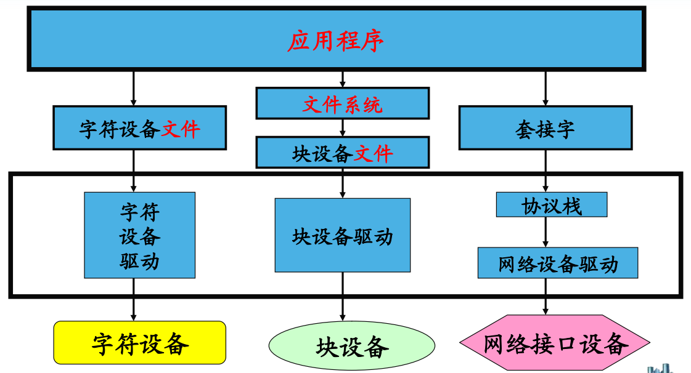
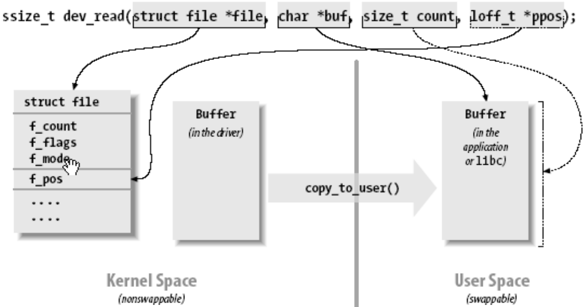

### 驱动程序介绍

&emsp;&emsp;设备驱动分为：字符设备驱动、网络接口驱动和块设备驱动。<!--more-->

- 字符设备：字符设备是一种按字节来访问的设备，字符驱动则负责驱动字符设备，这样的驱动通常实现`open`、`close`、`read`和`write`系统调用。
- 块设备：在大部分的`Unix`系统，块设备不能按字节处理数据，只能一次传送一个或多个长度是`512`字节(或一个更大的`2`次幂的数)的整块数据，而`Linux`则允许块设备传送任意数目的字节。因此，块和字符设备的区别仅仅是驱动的与内核的接口不同。
- 网络接口：任何网络事务都通过一个接口来进行，一个接口通常是一个硬件设备(`eth0`)，但是它也可以是一个纯粹的软件设备，比如回环接口(`lo`)。一个网络接口负责发送和接收数据报文。

&emsp;&emsp;`Linux`用户程序通过设备文件(又称为`设备节点`)来使用驱动程序操作字符设备和块设备。



### 字符设备驱动程序

#### 主次设备号

&emsp;&emsp;字符设备通过字符设备文件来存取。字符设备文件由使用`ls -l`的输出的第一列的`c`标识。如果使用`ls -l`命令，会看到在设备文件项中有`2`个数(由一个逗号分隔)。这些数字就是设备文件的主次设备编号。

#### 设备号作用

&emsp;&emsp;主设备号用来标识与设备文件相连的驱动程序，次编号被驱动程序用来辨别操作的是哪个设备。主设备号用来反映设备类型，次设备号用来区分同类型的设备。内核中使用`dev_t`类型描述设备号，`dev_t`其实质为`unsigned int`的`32`位整数，其中高`12`位为主设备号，低`20`位为次设备号。可以使用`MAJOR(dev_t dev)`从`dev_t`中分解出主设备号，使用`MINOR(dev_t dev)`从`dev_t`中分解出次设备号。

#### 分配主设备号

&emsp;&emsp;`Linux`内核可以采用静态申请、动态分配两种方法给设备分配主设备号。

#### 静态申请

&emsp;&emsp;方法主要有：根据`Documentation/devices.txt`，确定一个没有使用的主设备号；使用`register_chrdev_region`函数注册设备号。优点是简单，缺点是一旦驱动被广泛使用，这个随机选定的主设备号可能会导致设备号冲突，而使驱动程序无法注册。

``` cpp
int register_chrdev_region ( dev_t from, unsigned count, const char *name );
```

申请使用从`from`开始的`count`个设备号(主设备号不变，次设备号增加)。

- `from`：希望申请使用的设备号。
- `count`：希望申请使用设备号数目。
- `name`：设备名(体现在`/proc/devices`)。

#### 动态分配

&emsp;&emsp;使用`alloc_chrdev_region`分配设备号。优点是简单，易于驱动推广。缺点是无法在安装驱动前创建设备文件(因为安装前还没有分配到主设备号)。解决办法：安装驱动后，从`/proc/devices`中查询设备号。

``` cpp
int alloc_chrdev_region ( dev_t *dev, unsigned baseminor, unsigned count, const char *name );
```

请求内核动态分配`count`个设备号，且次设备号从`baseminor`开始。

- `dev`：分配到的设备号。
- `baseminor`：起始次设备号。
- `count`：需要分配的设备号数目。
- `name`：设备名(体现在`/proc/devices`)。

#### 注销设备号

&emsp;&emsp;不论使用何种方法分配设备号，都应该在不再使用它们时释放这些设备号。

``` cpp
void unregister_chrdev_region ( dev_t from, unsigned count );
```

释放从`from`开始的`count`个设备号。

#### 创建设备文件

&emsp;&emsp;`2`种方法分别是：使用`mknod`命令手工创建；自动创建。

#### 手工创建

&emsp;&emsp;`mknod`用法如下：

``` bash
mknod filename type major minor
```

- `filename`：设备文件名。
- `type`：设备文件类型。
- `major`：主设备号。
- `minor`：次设备号。

&emsp;&emsp;使用范例为`mknod serial0 c 100 0`。

#### 重要结构

&emsp;&emsp;在`Linux`字符设备驱动程序设计中，有`3`种非常重要的数据结构：`struct file`、`struct inode`和`struct file_operations`。

#### Struct File

&emsp;&emsp;代表一个打开的文件。系统中每个打开的文件在内核空间都有一个关联的`struct file`。它由内核在打开文件时创建，在文件关闭后释放。重要成员有：

``` cpp
loff_t f_pos; /* 文件读写位置 */
struct file_operations *f_op;
```

#### Struct Inode

&emsp;&emsp;用来记录文件的物理上的信息。因此，它和代表打开文件的`file`结构是不同的。一个文件可以对应多个`file`结构，但只有一个`inode`结构。重要成员有：

``` cpp
dev_t i_rdev; /* 设备号 */
```

#### Struct file_operations

&emsp;&emsp;一个函数指针的集合，定义能在设备上进行的操作。结构中的成员指向驱动中的函数，这些函数实现一个特别的操作，对于不支持的操作保留为`NULL`。

``` cpp
struct file_operations mem_fops = {
    .owner   = THIS_MODULE,
    .llseek  = mem_seek,
    .read    = mem_read,
    .write   = mem_write,
    .ioctl   = mem_ioctl,
    .open    = mem_open,
    .release = mem_release,
};
```

#### 设备注册

&emsp;&emsp;在`linux 2.6`内核中，字符设备使用`struct cdev`来描述。字符设备的注册可分为如下`3`个步骤：

1. 分配`cdev`。
2. 初始化`cdev`。
3. 添加`cdev`。

&emsp;&emsp;`struct cdev`的分配可使用`cdev_alloc`函数来完成：

``` cpp
struct cdev *cdev_alloc ( void );
```

&emsp;&emsp;`struct cdev`的初始化使用`cdev_init`函数来完成：

``` cpp
void cdev_init ( struct cdev *cdev, const struct file_operations *fops );
```

- `cdev`：待初始化的`cdev`结构。
- `fops`：设备对应的操作函数集

&emsp;&emsp;`struct cdev`的注册使用`cdev_add`函数来完成：

``` cpp
int cdev_add ( struct cdev *p, dev_t dev, unsigned count );
```

- `p`：待添加到内核的字符设备结构。
- `dev`：设备号。
- `count`：添加的设备个数。

#### 设备操作

- `int ( *open ) ( struct inode *, struct file * );`：在设备文件上的第一个操作，并不要求驱动程序一定要实现这个方法。如果该项为NULL，设备的打开操作永远成功。
- `void ( *release ) ( struct inode *, struct file * );`：当设备文件被关闭时调用这个操作。与`open`相仿，`release`也可以没有。
- `ssize_t ( *read ) ( struct file *, char __user *, size_t, loff_t * );`：从设备中读取数据。函数返回一个非负值，表示成功地从设备中读取多少字节。
- `ssize_t ( *write ) ( struct file *, const char __user *, size_t, loff_t * );`：向设备发送数据。
- `unsigned int ( *poll ) ( struct file *, struct poll_table_struct * );`：对应`select`系统调用。
- `int ( *ioctl ) ( struct inode *, struct file *, unsigned int, unsigned long );`：控制设备。
- `int ( *mmap ) ( struct file *, struct vm_area_struct * );`：将设备映射到进程虚拟地址空间中。
- `off_t ( *llseek ) ( struct file *, loff_t, int );`：修改文件的当前读写位置，并将新位置作为返回值。
- `int ( *select ) ( struct inode *, struct file *, int, select_table * );`：一般用于程序询问设备是否可读或可写。

#### Open方法

&emsp;&emsp;`Open`方法是驱动程序用来为以后的操作完成初始化准备工作的。在大部分驱动程序中，`open`完成如下工作：初始化设备；标明次设备号。

#### Release方法

&emsp;&emsp;`Release`方法的作用正好与`open`相反。这个设备方法有时也称为`close`，它关闭设备。

#### 读和写

&emsp;&emsp;读和写方法都完成类似的工作：从设备中读取数据到用户空间；将数据传递给驱动程序。它们的原型也相当相似：

``` cpp
ssize_t xxx_read ( struct file *filp, char __user *buff, size_t count, loff_t *offp );
ssize_t xxx_write ( struct file *filp, char __user *buff, size_t count, loff_t *offp );
```

`filp`是文件指针，`count`是请求传输的数据量，`buff`参数指向数据缓存，`offp`指出文件当前的访问位置。
&emsp;&emsp;`Read`和`Write`方法的`buff`参数是用户空间指针。因此，它不能被内核代码直接引用，理由如下：用户空间指针在内核空间时可能根本是无效的，这是因为没有那个地址的映射。内核提供了专门的函数用于访问用户空间的指针：

``` cpp
int copy_from_user ( void *to, const void __user *from, int n );
int copy_to_user ( void __user *to, const void *from, int n );
```

#### 读数据模型

&emsp;&emsp;读数据模型如下：



#### 设备注消

&emsp;&emsp;字符设备的注销使用`cdev_del`函数来完成：

``` cpp
int cdev_del ( struct cdev *p );
```

- `p`：要注销的字符设备结构。

### 驱动调试技术

#### 调试技术分类

&emsp;&emsp;对于驱动程序设计来说，核心问题之一就是如何完成调试。当前常用的驱动调试技术可分为：打印调试、调试器调试和查询调试。

#### 打印调试

&emsp;&emsp;在调试应用程序时，最常用的调试技术是打印，就是在应用程序中合适的点调用`printf`。当调试内核代码的时候，可以用`printk`完成类似任务。

#### 合理使用Printk

&emsp;&emsp;在驱动开发时，`printk`非常有助于调试。但当正式发行驱动程序时，应当去掉这些打印语句。但你有可能很快又发现，你又需要在驱动程序中实现一个新功能(或者修复一个`bug`)，这时你又要用到那些被删除的打印语句。这里介绍一种使用`printk`的合理方法，可以全局地打开或关闭它们，而不是简单地删除。

``` cpp
#ifdef PDEBUG
   #define PLOG(fmt, args...) printk(KERN_DEBUG "scull:"fmt, ##args)
#else
   #define PLOG(fmt, args...) /* do nothing */
#endif
```

&emsp;&emsp;`Makefile`作如下修改：

``` makefile
DEBUG = y

ifeq ($(DEBUG), y)
    DEBFLAGS = -O2 -g -DPDEBUG
else
    DEBFLAGS = -O2
endif

CFLAGS += $(DEBFLAGS)
```

### 自动创建设备文件

&emsp;&emsp;从`Linux 2.6.13`开始，`devfs`不复存在，`udev`成为`devfs`的替代。相比`devfs`，`udev(mdev)`存在于应用层。利用`udev(mdev)`来实现设备文件的自动创建很简单，在驱动初始化的代码里调用`class_create`为该设备创建一个`class`，再为每个设备调用`device_create`创建对应的设备。例如：

``` cpp
struct class *myclass = class_create ( THIS_MODULE, "my_device_driver" );
device_create ( myclass, NULL, MKDEV ( major_num, 0 ), NULL, "my_device" );
```

当驱动被加载时，`udev(mdev)`就会自动在`/dev`下创建`my_device`设备文件。注意，应先配置`busybox`，使它支持`mdev`。