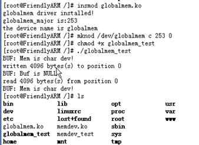
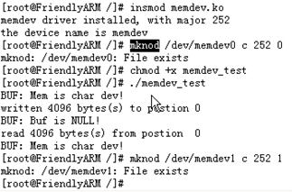

&emsp;&emsp;`memdev`在驱动中分配一块指定大小的内存空间作为虚拟字符设备，并在驱动中提供只对该内存的读写、控制和定位函数(`seek`)，以供用户空间的进程能通过`Linux`系统调用访问该内存。
&emsp;&emsp;测试源代码`globalmem_test.c`如下：

``` cpp
#include <stdio.h>
#include <string.h>
​
int main() {
    FILE *fp0 = NULL;
    char Buf[4096];
    int result;
    strcpy ( Buf, "Mem is char dev!" ); /* 初始化Buf */
    printf ( "BUF: %s\n", Buf );
    /* 打开设备文件 */
    fp0 = fopen ( "/dev/globalmem", "r+" ); /* 驱动对应的文件名为globalmen，以已读的方式打开 */
​
    if ( fp0 == NULL ) {
        perror ( "Open globalmem Error!\n" );
        return -1;
    }
​
    result = fwrite ( Buf, sizeof ( Buf ), 1, fp0 ); /* 写入设备 */
​
    if ( result  == -1 ) {
        perror ( "fwrite Error!\n" );
        return -1;
    }
​
    fseek ( fp0, 0, SEEK_SET ); /* 定位到从文件头开始读，写完后读写指针在文件的尾部 */
    strcpy ( Buf, "Buf is NULL!" ); /* 清除Buf */
    printf ( "BUF: %s\n", Buf );
    sleep ( 1 );
    result = fread ( Buf, sizeof ( Buf ), 1, fp0 ); /* 从设备中读出数据 */
​
    if ( result  == -1 ) {
        perror ( "fread Error!\n" );
        return -1;
    }
​
    printf ( "BUF: %s\n", Buf );
    return 0;
}
```

&emsp;&emsp;驱动源代码`globalmem.c`如下：

``` cpp
#include <linux/module.h>
#include <linux/types.h>
#include <linux/fs.h>
#include <linux/errno.h>
#include <linux/mm.h>
#include <linux/sched.h>
#include <linux/init.h>
#include <linux/cdev.h>
#include <asm/io.h>
#include <asm/system.h>
#include <asm/uaccess.h>
#include <linux/slab.h>
​
#define GLOBALMEM_SIZE 0x1000 /* 全局内存最大为4K字节 */
#define MEM_CLEAR 0x1         /* 全局内存清0 */
#define GLOBALMEM_MAJOR 0     /* 预设的globalmem的主设备号 */
​
static int globalmem_major = GLOBALMEM_MAJOR;
​
struct globalmem_dev { /* globalmem设备结构体 */
    struct cdev cdev; /* cdev结构体 */
    unsigned char mem[GLOBALMEM_SIZE]; /* 全局内存 */
};
​
struct globalmem_dev *globalmem_devp; /* 设备结构体指针 */
​
int globalmem_open ( struct inode *inode, struct file *filp ) { /* 文件打开函数 */
    filp->private_data = globalmem_devp; /* 将设备结构体指针赋值给文件私有数据指针 */
    return 0;
}
​
/* 文件释放函数 */
int globalmem_release ( struct inode *inode, struct file *filp ) { /* file结构描述一个正在打开的设备文件 */
    return 0;
}
​
/* ioctl设备控制函数 */
static int globalmem_ioctl ( struct inode *inodep, struct file *filp, unsigned int cmd, unsigned long arg ) {
    struct globalmem_dev *dev = filp->private_data; /* 获得设备结构体指针 */
​
    switch ( cmd ) {
        case MEM_CLEAR:
            memset ( dev->mem, 0, GLOBALMEM_SIZE );
            printk ( KERN_INFO "globalmem is set to zero\n" );
            break;
​
        default:
            return -EINVAL;
    }
​
    return 0;
}
​
/* 读函数 */
static ssize_t globalmem_read ( struct file *filp, char __user *buf, size_t size, loff_t *ppos ) {
    unsigned long p =  *ppos; /* file结构中保存的loff_t f_pos:当前读写位置 */
    unsigned int count = size;
    int ret = 0;
    struct globalmem_dev *dev = filp->private_data; /* 获得设备结构体指针 */
​
    /* 分析和获取有效的写长度 */
    if ( p >= GLOBALMEM_SIZE ) {
        return count ?  - ENXIO : 0; /* return ENXIO: No such device or address */
    }
​
    if ( count > GLOBALMEM_SIZE - p ) {
        count = GLOBALMEM_SIZE - p;
    }
​
    if ( copy_to_user ( buf, ( void * ) ( dev->mem + p ), count ) ) { /* 内核空间->用户空间 */
        ret = -EFAULT; /* Bad address，拷贝不成功 */
    } else { /* 拷贝成功 */
        *ppos += count;
        ret = count;
        printk ( KERN_INFO "read %d bytes(s) from position %d\n", count, p );
    }
​
    return ret;
}
​
/* 写函数 */
static ssize_t globalmem_write ( struct file *filp, const char __user *buf, size_t size, loff_t *ppos ) {
    unsigned long p =  *ppos;
    unsigned int count = size;
    int ret = 0;
    struct globalmem_dev *dev = filp->private_data; /* 获得设备结构体指针 */
​
    /* 分析和获取有效的写长度 */
    if ( p >= GLOBALMEM_SIZE ) {
        return count ? -ENXIO : 0; /* ENXIO: No such device or addres */
    }
​
    if ( count > GLOBALMEM_SIZE - p ) {
        count = GLOBALMEM_SIZE - p;
    }
​
    if ( copy_from_user ( dev->mem + p, buf, count ) ) { /* 用户空间->内核空间 */
        ret = -EFAULT; /* 写失败 */
    } else { /* 写成功 */
        *ppos += count;
        ret = count;
        printk ( KERN_INFO "written %d bytes(s) to position %d\n", count, p );
    }
​
    return ret;
}
​
static loff_t globalmem_llseek ( struct file *filp, loff_t offset, int orig ) { /* seek文件定位函数 */
    loff_t ret = 0;
​
    switch ( orig ) {
        case 0: /* 相对文件头开始SEEK_SET位置偏移 */
            if ( offset < 0 ) {
                ret =  - EINVAL; /* Invalid argument */
                break;
            }
​
            if ( ( unsigned int ) offset > GLOBALMEM_SIZE ) {
                ret =  - EINVAL;
                break;
            }
​
            filp->f_pos = ( unsigned int ) offset; /* file结构的成员“loff_t f_pos”：当前读写位置 */
            ret = filp->f_pos;
            break;
​
        case 1: /* 相对文件当前位置偏移 */
            if ( ( filp->f_pos + offset ) > GLOBALMEM_SIZE ) {
                ret =  - EINVAL;
                break;
            }
​
            if ( ( filp->f_pos + offset ) < 0 ) {
                ret =  - EINVAL;
                break;
            }
​
            filp->f_pos += offset;
            ret = filp->f_pos;
            break;
​
        default:
            ret =  - EINVAL;
            break;
    }
​
    return ret;
}
​
static const struct file_operations globalmem_fops = { /* 文件操作结构体 */
    .owner   = THIS_MODULE,
    .llseek  = globalmem_llseek,
    .read    = globalmem_read,
    .write   = globalmem_write,
    .ioctl   = globalmem_ioctl,
    .open    = globalmem_open,
    .release = globalmem_release,
};
​
static void globalmem_setup_cdev ( struct globalmem_dev *dev, int index ) { /* 初始化并注册cdev */
    int err, devno = MKDEV ( globalmem_major, index );
    cdev_init ( &dev->cdev, &globalmem_fops );
    dev->cdev.owner = THIS_MODULE;
    dev->cdev.ops = &globalmem_fops;
    err = cdev_add ( &dev->cdev, devno, 1 );
​
    if ( err ) {
        printk ( KERN_NOTICE "Error %d adding LED%d", err, index );
    }
}
​
int globalmem_init ( void ) { /* 设备驱动模块加载函数 */
    int result;
    dev_t devno = MKDEV ( globalmem_major, 0 );
​
    /* 申请设备号 */
    if ( globalmem_major ) {
        result = register_chrdev_region ( devno, 1, "globalmem" );
    } else {
        result = alloc_chrdev_region ( &devno, 0, 1, "globalmem" ); /* 动态申请设备号 */
        globalmem_major = MAJOR ( devno );
    }
​
    if ( result < 0 ) {
        return result;
    }
​
    globalmem_devp = kmalloc ( sizeof ( struct globalmem_dev ), GFP_KERNEL ); /* 动态申请设备结构体的内存 */
​
    if ( !globalmem_devp ) { /* 申请失败 */
        result =  - ENOMEM;
        goto fail_malloc;
    }
​
    memset ( globalmem_devp, 0, sizeof ( struct globalmem_dev ) );
    globalmem_setup_cdev ( globalmem_devp, 0 );
    printk ( "globalmem driver installed!\n" );
    printk ( "globalmem_major is:%d\n", globalmem_major );
    printk ( "the device name is %s\n", "globalmem" );
    return 0;
fail_malloc:
    unregister_chrdev_region ( devno, 1 );
    return result;
}
​
void globalmem_exit ( void ) { /* 模块卸载函数 */
    cdev_del ( &globalmem_devp->cdev ); /* 注销cdev */
    kfree ( globalmem_devp ); /* 释放设备结构体内存 */
    unregister_chrdev_region ( MKDEV ( globalmem_major, 0 ), 1 ); /* 释放设备号 */
    printk ( "globalmem driver uninstalled!\n" );
}
​
module_param ( globalmem_major, int, S_IRUGO );
​
module_init ( globalmem_init );
module_exit ( globalmem_exit );
MODULE_LICENSE ( "Dual BSD/GPL" );
```

---

&emsp;&emsp;目前有两个设备，它们的主设备号是相同的，但次设备号不同。
&emsp;&emsp;测试代码`memdev_test.c`如下：

``` cpp
#include <string.h>
​
int main() {
    FILE *fp0 = NULL;
    char Buf[4096];
    int result;
    strcpy ( Buf, "Mem is char dev!" ); /* 初始化Buf */
    printf ( "BUF: %s\n", Buf );
    fp0 = fopen ( "/dev/memdev0", "r+" ); /* 文件名为memdev0，其中“0”为此设备号 */
​
    if ( fp0 == NULL ) {
        perror ( "Open Memdev0 Error!\n" );
        return -1;
    }
​
    result = fwrite ( Buf, sizeof ( Buf ), 1, fp0 ); /* 向设备中写入数据 */
​
    if ( result  == -1 ) {
        perror ( "fwrite Error!\n" );
        return -1;
    }
​
    fseek ( fp0, 0, SEEK_SET ); /* 重新定位文件位置 */
    strcpy ( Buf, "Buf is NULL!" );
    printf ( "BUF: %s\n", Buf );
    sleep ( 1 );
    result = fread ( Buf, sizeof ( Buf ), 1, fp0 ); /* 从设备中读出数据 */
​
    if ( result  == -1 ) {
        perror ( "fread Error!\n" );
        return -1;
    }
​
    printf ( "BUF: %s\n", Buf );
    return 0;
}
```

&emsp;&emsp;驱动代码`memdev.h`如下：

``` cpp
#ifndef _MEMDEV_H_
#define _MEMDEV_H_
​
#ifndef MEMDEV_MAJOR
    #define MEMDEV_MAJOR 0 /* 预设的mem的主设备号 */
#endif
​
#ifndef MEMDEV_NR_DEVS
    #define MEMDEV_NR_DEVS 2 /* 设备数 */
#endif
​
#ifndef MEMDEV_SIZE
    #define MEMDEV_SIZE 4096
#endif
​
struct mem_dev { /* mem设备描述结构体 */
    char *data;
    unsigned long size;
};
​
#endif
```

&emsp;&emsp;驱动代码`memdev.c`如下：

``` cpp
#include <linux/module.h>
#include <linux/types.h>
#include <linux/fs.h>
#include <linux/errno.h>
#include <linux/mm.h>
#include <linux/sched.h>
#include <linux/init.h>
#include <linux/cdev.h>
#include <asm/io.h>
#include <asm/system.h>
#include <asm/uaccess.h>
#include <linux/slab.h>
#include "memdev.h"
​
static mem_major = MEMDEV_MAJOR;
​
module_param ( mem_major, int, S_IRUGO );
​
struct mem_dev *mem_devp;
struct cdev cdev;
​
int mem_open ( struct inode *inode, struct file *filp ) { /* 文件打开函数 */
    struct mem_dev *dev;
    int num = MINOR ( inode->i_rdev ); /* 获取次设备号 */
​
    if ( num >= MEMDEV_NR_DEVS ) {
        return -ENODEV; /* 出错 */
    }
​
    dev = &mem_devp[num];
    /* 将设备描述结构指针赋值给文件私有数据指针 */
    filp->private_data = dev; /* 传递的是mem_dev结构数组中其中一个的地址 */
    return 0;
}
​
int mem_release ( struct inode *inode, struct file *filp ) { /* 文件释放函数 */
    return 0;
}
​
/* 读函数 */
static ssize_t mem_read ( struct file *filp, char __user *buf, size_t size, loff_t *ppos ) {
    unsigned long p =  *ppos;
    unsigned int count = size;
    int ret = 0;
    struct mem_dev *dev = filp->private_data; /* 获得设备结构体指针 */
​
    if ( p >= MEMDEV_SIZE ) { /* 判断读位置是否有效 */
        return 0;
    }
​
    if ( count > MEMDEV_SIZE - p ) {
        count = MEMDEV_SIZE - p;
    }
​
    if ( copy_to_user ( buf, ( void * ) ( dev->data + p ), count ) ) { /* 读数据到用户空间 */
        ret = -EFAULT;
    } else {
        *ppos += count;
        ret = count;
        printk ( KERN_INFO "read %d bytes(s) from postion  %d\n", count, p );
    }
​
    return ret;
}
​
/* 写函数 */
static ssize_t mem_write ( struct file *filp, const char __user *buf, size_t size, loff_t *ppos ) {
    unsigned long p =  *ppos;
    unsigned int count = size;
    int ret = 0;
    struct mem_dev *dev = filp->private_data; /* 获得设备结构体指针 */
​
    /* 分析和获取有效的写长度 */
    if ( p >= MEMDEV_SIZE ) {
        return 0;
    }
​
    if ( count > MEMDEV_SIZE - p ) {
        count = MEMDEV_SIZE - p;
    }
​
    if ( copy_from_user ( dev->data + p, buf, count ) ) { /* 从用户空间写入数据 */
        ret = -EFAULT;
    } else {
        *ppos += count;
        ret = count;
        printk ( KERN_INFO "written %d bytes(s) to postion %d\n", count, p );
    }
​
    return ret;
}
​
static loff_t mem_llseek ( struct file *filp, loff_t offset, int whence ) { /* seek文件定位函数 */
    loff_t newpos;
​
    switch ( whence ) {
        case 0: /* SEEK_SET */
            newpos = offset;
            break;
​
        case 1: /* SEEK_CUR */
            newpos = filp->f_pos + offset;
            break;
​
        case 2: /* SEEK_END */
            newpos = MEMDEV_SIZE - 1 + offset;
            break;
​
        default: /* can't happen */
            return -EINVAL;
    }
​
    if ( ( newpos < 0 ) || ( newpos > MEMDEV_SIZE ) ) {
        return -EINVAL;
    }
​
    filp->f_pos = newpos;
    return newpos;
}
​
static const struct file_operations mem_fops = { /* 文件操作结构体 */
    .owner   = THIS_MODULE,
    .llseek  = mem_llseek,
    .read    = mem_read,
    .write   = mem_write,
    .open    = mem_open,
    .release = mem_release,
};
​
static int memdev_init ( void ) { /* 设备驱动模块加载函数 */
    int result;
    int i;
    dev_t devno = MKDEV ( mem_major, 0 );
​
    if ( mem_major ) {
        result = register_chrdev_region ( devno, MEMDEV_NR_DEVS, "memdev" ); /* 静态申请设备号 */
    } else { /* 动态分配设备号 */
        result = alloc_chrdev_region ( &devno, 0, MEMDEV_NR_DEVS, "memdev" );
        mem_major = MAJOR ( devno );
    }
​
    if ( result < 0 ) {
        return result;
    }
​
    cdev_init ( &cdev, &mem_fops ); /* 初始化cdev结构 */
    cdev.owner = THIS_MODULE;
    cdev.ops = &mem_fops;
    cdev_add ( &cdev, MKDEV ( mem_major, 0 ), MEMDEV_NR_DEVS ); /* 注册字符设备 */
    mem_devp = kmalloc ( MEMDEV_NR_DEVS * sizeof ( struct mem_dev ), GFP_KERNEL ); /* 为mem_devp结构对象分配内存 */
​
    if ( !mem_devp ) { /* 申请失败 */
        result = -ENOMEM;
        goto fail_malloc;
    }
​
    memset ( mem_devp, 0, sizeof ( struct mem_dev ) );
​
    for ( i = 0; i < MEMDEV_NR_DEVS; i++ ) {/* 为设备分配内存 */
        mem_devp[i].size = MEMDEV_SIZE;
        mem_devp[i].data = kmalloc ( MEMDEV_SIZE, GFP_KERNEL );
        memset ( mem_devp[i].data, 0, MEMDEV_SIZE );
    }
​
    printk ( "memdev driver installed, with major %d\n", mem_major );
    printk ( "the device name is %s\n", "memdev" );
    return 0;
fail_malloc:
    unregister_chrdev_region ( devno, 1 );
    return result;
}
​
static void memdev_exit ( void ) { /* 模块卸载函数 */
    int i;
    cdev_del ( &cdev ); /* 注销设备 */
​
    for ( i = 0; i < MEMDEV_NR_DEVS; i++ ) {
        kfree ( mem_devp[i].data );
    }
​
    kfree ( mem_devp ); /* 释放设备结构体内存 */
    unregister_chrdev_region ( MKDEV ( mem_major, 0 ), 2 ); /* 释放设备号 */
    printk ( "memdev driver uninstalled\n" );
}
​
module_init ( memdev_init );
module_exit ( memdev_exit );
MODULE_LICENSE ( "GPL" );
```

下面的代码先取得对那个设备进行操作的设备描述结构指针，然后通过`struct file`结构中的成员`private_data`进行传递，而其他`ioctl`成员中的函数都有带`struct file`参数，这样就很好传递了`men_dev`结构，便于以后进行各种操作。

``` cpp
struct mem_dev *dev;
int num = MINOR ( inode->i_rdev ); /* 获取次设备号 */
​
if ( num >= MEMDEV_NR_DEVS ) {
    return -ENODEV; /* 出错 */
}
​
dev = &mem_devp[num];
/* 将设备描述结构指针赋值给文件私有数据指针 */
filp->private_data = dev; /* 传递的是mem_dev结构数组中其中一个的地址 */
```



