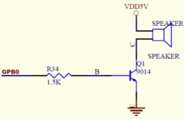
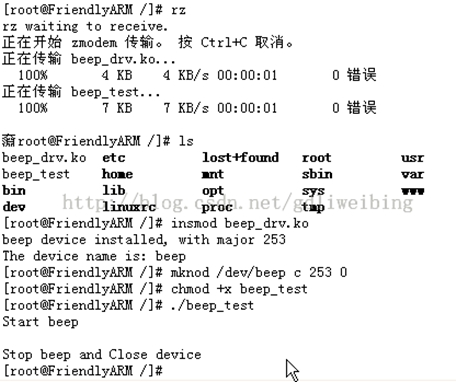

&emsp;&emsp;电路图如下：



&emsp;&emsp;`Linux-2.6.32.2`内核重要头文件目录如下：

``` cpp
linux-2.6.32.2/arch/arm/mach-s3c2410/include/mach/regs-gpio.h
linux-2.6.32.2/arch/arm/mach-s3c2410/include/mach/gpio-nrs.h
linux-2.6.32.2/arch/arm/plat-s3c24xx/gpio.c
linux-2.6.32.2/include/linux/asm-generic/io.h
linux-2.6.32.2/include/linux/wait.h
```

注意链接关系，例如出现`asm`，则链接之后的内容为：

``` cpp
asm  -> linux-2.6.32.2/include/linux/asm-generic
mach -> linux-2.6.32.2/arch/arm/mach-s3c2410/include/mach
plat -> linux-2.6.32.2/arch/arm/plat-s3c24xx/include/plat
        linux-2.6.32.2/arch/arm/plat-s3c/include/plat
```

&emsp;&emsp;`beep_drv.c`如下：

``` cpp
#include <linux/errno.h>
#include <linux/kernel.h>
#include <linux/module.h>
#include <linux/slab.h>
#include <linux/input.h>
#include <linux/init.h>
#include <linux/serio.h>
#include <linux/delay.h>
#include <linux/clk.h>
#include <linux/miscdevice.h>
#include <linux/gpio.h>
#include <asm/io.h> /* 平台相关的文件 */
#include <asm/irq.h> /* 出现asm，它会连接到“linux-2.6.32.2/include/linux/asm-generic” */
#include <asm/uaccess.h>
#include <mach/regs-clock.h>
#include <plat/regs-timer.h>

/* 该文件在“linux-2.6.32.2/arch/arm/mach-s3c2410/include/mach/regs-gpio.h”中 */
#include <mach/regs-gpio.h>
#include <linux/cdev.h>
​
static int beep_major = 0; /* 全局主设备号 */
module_param ( beep_major, int, 0 );
​
#define BEEP_MAGIC 'k'
#define BEEP_START_CMD _IO (BEEP_MAGIC, 1)
#define BEEP_STOP_CMD  _IO (BEEP_MAGIC, 2) /* “_IO(type, nr)”用于构造无参数的命令编号 */
​
/* Open the device; in fact, there's nothing to do here */
int beep_open ( struct inode *inode, struct file *filp ) { /* 没有用到，但必须保持完整性 */
    return 0;
}
​
ssize_t beep_read ( struct file *file, char __user *buff, size_t count, loff_t *offp ) {
    return 0;
}
​
ssize_t beep_write ( struct file *file, const char __user *buff, size_t count, loff_t *offp ) {
    return 0;
}
​
void beep_stop ( void ) {
    s3c2410_gpio_cfgpin ( S3C2410_GPB ( 0 ), S3C2410_GPIO_OUTPUT );
    s3c2410_gpio_setpin ( S3C2410_GPB ( 0 ), 0 );
}
​
void beep_start ( void ) {
    s3c2410_gpio_pullup ( S3C2410_GPB ( 0 ), 1 ); /* 上拉电阻 */
    s3c2410_gpio_cfgpin ( S3C2410_GPB ( 0 ), S3C2410_GPIO_OUTPUT ); /* 配置 */
    s3c2410_gpio_setpin ( S3C2410_GPB ( 0 ), 1 ); /* 置位 */
}
​
static int beep_ioctl ( struct inode *inode, struct file *file, unsigned int cmd, unsigned long arg ) {
    switch ( cmd ) {
        case BEEP_START_CMD: beep_start(); break;
        case BEEP_STOP_CMD:  beep_stop();  break;
        default: break;
    }
​
    return 0;
}
​
static int beep_release ( struct inode *node, struct file *file ) {
    return 0;
}
​
/* Set up the cdev structure for a device */
static void beep_setup_cdev ( struct cdev *dev, int minor, struct file_operations *fops ) {
    int err, devno = MKDEV ( beep_major, minor ); /* 由主次设备号生成设备号 */
    cdev_init ( dev, fops ); /* 初始化cdev */
    dev->owner = THIS_MODULE;
    dev->ops = fops;
    err = cdev_add ( dev, devno, 1 ); /* 注册设备 */
​
    if ( err ) { /* Fail gracefully if need be */
        printk ( KERN_NOTICE "Error %d adding beep%d", err, minor );
    }
}
​
/* Our various sub-devices */
/* Device 0 uses remap_pfn_range */
static struct file_operations beep_remap_ops = { /* file_operations的对象beep_remap_ops，并对其赋值 */
    .owner   = THIS_MODULE, /* 指向模块本身 */
    .open    = beep_open, /* 把open和beep_open函数关联起来 */
    .release = beep_release,
    .read    = beep_read,
    .write   = beep_write,
    .ioctl   = beep_ioctl,
};
​
/* There's no need for us to maintain any special housekeeping info, so we just deal with raw cdevs */
static struct cdev BeepDevs;
​
/* Module housekeeping */
static int beep_init ( void ) { /* 模块加载时调用beep_init函数进行加载 */
    int result;
    dev_t dev = MKDEV ( beep_major, 0 );
    char dev_name[] = "beep";
​
    /* Figure out our device number */
    if ( beep_major ) { /* 设备号的分配 */
        result = register_chrdev_region ( dev, 1, dev_name ); /* 手工分配 */
    } else {
        /* 系统分配一个设备号，“0”表示第一个次设备号，“1”表示一个设备 */
        result = alloc_chrdev_region ( &dev, 0, 1, dev_name );
        beep_major = MAJOR ( dev ); /* 取得主设备号 */
    }
​
    if ( result < 0 ) {
        printk ( KERN_WARNING "beep: unable to get major %d\n", beep_major );
        return result;
    }
​
    if ( beep_major == 0 ) {
        beep_major = result;
    }
​
    /* Now set up cdev */
    beep_setup_cdev ( &BeepDevs, 0, &beep_remap_ops );
    printk ( "beep device installed, with major %d\n", beep_major );
    printk ( "The device name is: %s\n", dev_name );
    return 0;
}
​
static void beep_cleanup ( void ) { /* 模块卸载时调用beep_cleanup函数进行清除 */
    cdev_del ( &BeepDevs ); /* 注销设备 */
    unregister_chrdev_region ( MKDEV ( beep_major, 0 ), 1 ); /* 释放占用的设备号 */
    printk ( "beep device uninstalled\n" );
}
​
module_init ( beep_init ); /* 模块加载时调用beep_init函数进行加载 */
module_exit ( beep_cleanup ); /* 模块卸载时调用beep_cleanup函数进行清除 */
EXPORT_SYMBOL ( beep_major );
MODULE_LICENSE ( "Dual BSD/GPL" );
```

相应的`Makefile`文件如下：

``` makefile
CROSS_COMPILE := arm-linux-
CC :=$(CROSS_COMPILE)gcc
KERNEL_DIR := /home/linux-2.6.32.2

obj-m := beep_drv.o

PWD := $(shell pwd)
all:
    make -C $(KERNEL_DIR) M=$(PWD) modules
clean:
    rm -fr *.o *.ko *.mod.o *.mod.c .*.cmd *.order *.*s *~ .tmp*
```

&emsp;&emsp;创建设备节点的命令如下：

``` bash
mknod /dev/node_name c major minor  # 这里的node_name为beep
```

&emsp;&emsp;测试程序如下：

``` cpp
#include <stdio.h>
#include <stdlib.h>
#include <unistd.h>
#include <fcntl.h>
#include <linux/ioctl.h>
​
#define BEEP_MAGIC 'k' /* 宏是和驱动里一样的 */
#define BEEP_START_CMD _IO (BEEP_MAGIC, 1)
#define BEEP_STOP_CMD  _IO (BEEP_MAGIC, 2)
​
int main ( void ) {
    int i = 0;
    int dev_fd;
    /* 打开设备文件可读可写、非阻塞 */
    dev_fd = open ( "/dev/beep", O_RDWR | O_NONBLOCK );
​
    if ( dev_fd == -1 ) {
        printf ( "Cann't open file /dev/beep\n" );
        exit ( 1 );
    }
​
    printf ( "Start beep\n" );
    ioctl ( dev_fd, BEEP_START_CMD, 0 );
    getchar();
    ioctl ( dev_fd, BEEP_STOP_CMD, 0 );
    printf ( "Stop beep and Close device\n" );
    close ( dev_fd ); /* 关闭设备文件 */
    return 0;
}
```

编写其`Makefile`文件：

``` makefile
KERNELKDIR ?= /opt/linux-2.6.32.2/include
​
all: test
test: test.c
    arm-linux-gcc -I $(KERNELDIR) -o S@ S^  # “-I $(KERNELDIR)”表示包含头文件
clean:
    rm -rf test
```

