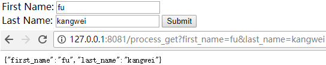
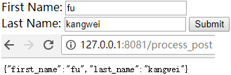

&emsp;&emsp;`Express`是一个简洁而灵活的`Web`应用框架，使用`Express`可以快速地搭建一个完整功能的网站。`Express`框架核心特性如下：

- 可以设置中间件来响应`HTTP`请求。
- 定义了路由表用于执行不同的`HTTP`请求动作。
- 可以通过向模板传递参数来动态渲染`HTML`页面。

### 第一个Express框架实例

&emsp;&emsp;接下来使用`Express`框架来输出`Hello World`。创建`express_demo.js`文件：

``` javascript
var express = require('express');
var app = express();
​
app.get('/', function (req, res) {
    res.send('Hello World');
})
​
var server = app.listen(8081, function () {
    var host = server.address().address
    var port = server.address().port
    console.log("应用实例，访问地址为http://%s:%s", host, port)
})
```

执行结果：

``` javascript
应用实例，访问地址为http://0.0.0.0:8081
```

在浏览器中访问`http://127.0.0.1:8081`，网页显示`Hello World`。

### 请求和响应

&emsp;&emsp;`Express`应用使用回调函数的参数`req`(`request`)和`res`(`response`)对象来处理请求和响应的数据：

``` javascript
app.get('/', function (req, res) {
    // user code
})
```

&emsp;&emsp;`Request`对象表示`HTTP`请求，包含了请求查询字符串、参数、内容、`HTTP`头部等属性。常见属性有：

- `req.app`：当`callback`为外部文件时，用`req.app`访问`express`的实例。
- `req.baseUrl`：获取路由当前安装的`URL`路径。
- `req.body/req.cookies`：获得`请求主体`或`Cookies`。
- `req.fresh/req.stale`：判断请求是否还`新鲜`。
- `req.hostname/req.ip`：获取主机名和`IP`地址。
- `req.originalUrl`：获取原始请求`URL`。
- `req.params`：获取路由的`parameters`。
- `req.path`：获取请求路径。
- `req.protocol`：获取协议类型。
- `req.query`：获取`URL`的查询参数串。
- `req.route`：获取当前匹配的路由。
- `req.subdomains`：获取子域名。
- `req.accepts`：检查可接受的请求的文档类型。
- `req.acceptsCharsets/req.acceptsEncodings/req.acceptsLanguages`：返回指定字符集的第一个可接受字符编码。
- `req.get`：获取指定的`HTTP`请求头。
- `req.is`：判断请求头`Content-Type`的`MIME`类型。

&emsp;&emsp;`Response`对象表示`HTTP`响应，即在接收到请求时向客户端发送的`HTTP`响应数据。常见属性有：

- `res.app`：同`req.app`。
- `res.append`：追加指定`HTTP`头。
- `res.set`：在`res.append`后将重置之前设置的头。
- `res.cookie(name, value [, option])`：设置`Cookie`，而`opition`有`domain`、`expires`、`httpOnly`、`maxAge`、`path`、`secure`和`signed`。
- `res.clearCookie`：清除`Cookie`。
- `res.download`：传送指定路径的文件。
- `res.get`：返回指定的`HTTP`头。
- `res.json`：传送`JSON`响应。
- `res.jsonp`：传送`JSONP`响应。
- `res.location`：只设置响应的`Location HTTP`头，不设置状态码或者`close response`。
- `res.redirect`：设置响应的`Location HTTP`头，并且设置状态码`302`。
- `res.render(view [, locals], callback)`：渲染一个`view`，同时向`callback`传递渲染后的字符串。如果在渲染过程中有错误发生，`next(err)`将会被自动调用。
- `res.send`：传送`HTTP`响应。
- `res.sendFile(path [, options] [, fn])`：传送指定路径的文件，会自动根据文件`extension`设定`Content-Type`。
- `res.set`：设置`HTTP`头，传入`object`可以一次设置多个头。
- `res.status`：设置`HTTP`状态码。
- `res.type`：设置`Content-Type`的`MIME`类型。

### 路由

&emsp;&emsp;我们已经了解了`HTTP`请求的基本应用，而路由决定了由谁(指定脚本)去响应客户端请求。在`HTTP`请求中，我们可以通过路由提取出请求的`URL`以及`GET/POST`参数。
&emsp;&emsp;接下来扩展`Hello World`代码，添加一些功能来处理更多类型的`HTTP`请求：

``` javascript
var express = require('express');
var app = express();
​
// 主页输出“Hello World”
app.get('/', function (req, res) {
    console.log("主页GET请求");
    res.send('Hello GET');
})
​
// POST请求
app.post('/', function (req, res) {
    console.log("主页POST请求");
    res.send('Hello POST');
})
​
// del_user页面响应
app.get('/del_user', function (req, res) {
    console.log("del_user响应DELETE请求");
    res.send('删除页面');
})
​
// list_user页面GET请求
app.get('/list_user', function (req, res) {
    console.log("list_user的GET请求");
    res.send('用户列表页面');
})
​
// 对页面abcd、abxcd、ab123cd等响应GET请求
app.get('/ab*cd', function (req, res) {
    console.log("“ab*cd”的GET请求");
    res.send('正则匹配');
})
​
var server = app.listen(8081, function () {
    var host = server.address().address
    var port = server.address().port
    console.log("应用实例，访问地址为http://%s:%s", host, port)
})
```

### 静态文件

&emsp;&emsp;`Express`提供了内置的中间件`express.static`来设置静态文件，例如图片、`CSS`、`JavaScript`等，你可以使用`express.static`中间件来设置静态文件路径。例如，如果你将图片、`CSS`、`JavaScript`文件放在`public`目录下，可以这么写：

``` javascript
app.use(express.static('public'));
```

我们可以到`public/images`目录下放一些图片，目录结构如下

``` javascript
node_modules
server.js
public/
public/images
public/images/logo.png
```

再修改`Hello World`的应用程序，添加处理静态文件的功能：

``` javascript
var express = require('express');
var app = express();
​
app.use(express.static('public'));
​
app.get('/', function (req, res) {
    res.send('Hello World');
})
​
var server = app.listen(8081, function () {
    var host = server.address().address
    var port = server.address().port
    console.log("应用实例，访问地址为 http://%s:%s", host, port)
})
```

执行以上代码，在浏览器中访问`http://127.0.0.1:8081/images/logo.png`，则会显示一张图片。

### GET方法

&emsp;&emsp;以下实例演示了在表单中通过GET方法提交两个参数，我们可以使用`server.js`文件内的`process_get`路由器来处理输入。
&emsp;&emsp;`index.htm`文件如下：

``` html
<html>
    <head>
        <title></title>
    </head>
    <body>
        <form action="http://127.0.0.1:8081/process_get" method="get">
            First Name: <input type="text" name="first_name"><br>
            Last Name: <input type="text" name="last_name"> <input type="submit" value="Submit">
        </form>
    </body>
</html>
```

server.js文件如下：

``` javascript
var express = require('express');
var app = express();
​
app.use(express.static('public'));
​
app.get('/index.htm', function (req, res) {
    res.sendFile(__dirname + "/" + "index.htm");
})
​
app.get('/process_get', function (req, res) {
    var response = { // 输出JSON格式
        "first_name": req.query.first_name,
        "last_name": req.query.last_name
    };
​
    console.log(response);
    res.end(JSON.stringify(response));
})
​
var server = app.listen(8081, function () {
    var host = server.address().address
    var port = server.address().port
    console.log("应用实例，访问地址为http://%s:%s", host, port)
})
```

执行以上代码，使用浏览器访问`http://127.0.0.1:8081/index.htm`。现在你可以向表单输入数据，并进行提交操作：



### POST方法

&emsp;&emsp;以下实例演示了在表单中通过`POST`方法提交两个参数，我们可以使用`server.js`文件内的`process_post`路由器来处理输入。
&emsp;&emsp;`index.htm`文件如下：

``` html
<html>
    <head>
        <title></title>
    </head>
    <body>
        <form action="http://127.0.0.1:8081/process_post" method="post">
            First Name: <input type="text" name="first_name"><br>
            Last Name: <input type="text" name="last_name"> <input type="submit" value="Submit">
        </form>
    </body>
</html>
```

`server.js`文件如下：

``` javascript
var express = require('express');
var app = express();
var bodyParser = require('body-parser');
​
// 创建“application/x-www-form-urlencoded”编码解析
var urlencodedParser = bodyParser.urlencoded({
    extended: false
})
​
app.use(express.static('public'));
​
app.get('/index.htm', function (req, res) {
    res.sendFile(__dirname + "/" + "index.htm");
})
​
app.post('/process_post', urlencodedParser, function (req, res) {
    var response = { // 输出JSON格式
        "first_name": req.body.first_name,
        "last_name": req.body.last_name
    };
    console.log(response);
    res.end(JSON.stringify(response));
})
​
var server = app.listen(8081, function () {
    var host = server.address().address
    var port = server.address().port
    console.log("应用实例，访问地址为http://%s:%s", host, port)
})
```

执行以上代码，使用浏览器访问`http://127.0.0.1:8081/index.htm`。现在你可以向表单输入数据，并进行提交操作：



### 文件上传

&emsp;&emsp;以下创建一个用于上传文件的表单，使用`POST`方法，表单`enctype`属性设置为`multipart/form-data`。
&emsp;&emsp;`index.htm`文件如下：

``` html
<html>
​
<head>
    <title>文件上传表单</title>
</head>
​
<body>
    <h3>文件上传：</h3>
    选择一个文件上传:
    <br />
    <form action="/file_upload" method="post" enctype="multipart/form-data">
        <input type="file" name="image" size="50" />
        <br />
        <input type="submit" value="上传文件" />
    </form>
</body>
​
</html>
```

`server.js`文件如下：

``` javascript
var express = require('express');
var app = express();
var fs = require("fs");
​
var bodyParser = require('body-parser');
var multer = require('multer');
​
app.use(express.static('public'));
​
app.use(bodyParser.urlencoded({
    extended: false
}));
​
app.use(multer({
    dest: '/tmp/'
}).array('image'));
​
app.get('/index.htm', function (req, res) {
    res.sendFile(__dirname + "/" + "index.htm");
})
​
app.post('/file_upload', function (req, res) {
    console.log(req.files[0]); // 上传的文件信息
    var des_file = __dirname + "/" + req.files[0].originalname;
    fs.readFile(req.files[0].path, function (err, data) {
        fs.writeFile(des_file, data, function (err) {
            if(err) {
                console.log(err);
            } else {
                response = {
                    message: 'File uploaded successfully',
                    filename: req.files[0].originalname
                };
            }
            console.log(response);
            res.end(JSON.stringify(response));
        });
    });
})
​
var server = app.listen(8081, function () {
    var host = server.address().address
    var port = server.address().port
    console.log("应用实例，访问地址为 http://%s:%s", host, port)
})
```

执行以上代码，使用浏览器访问`http://127.0.0.1:8081/index.htm`。现在你可以向表单输入数据，并进行提交操作。