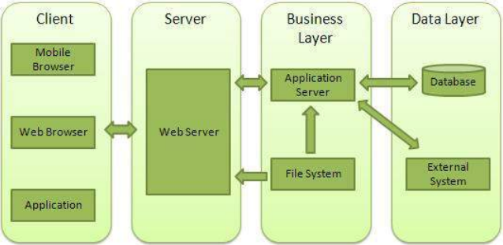

&emsp;&emsp;`Web`服务器一般指网站服务器，是指驻留于因特网上某种类型计算机的程序，`Web`服务器的基本功能就是提供`Web`信息浏览服务。它只需支持`HTTP`协议、`HTML`文档格式及`URL`，与客户端的网络浏览器配合。
&emsp;&emsp;大多数`web`服务器都支持服务端的脚本语言(`php`、`python`、`ruby`)等，并通过脚本语言从数据库获取数据，将结果返回给客户端浏览器。目前最主流的三个`Web`服务器是`Apache`、`Nginx`、`IIS`。

### Web应用架构

&emsp;&emsp;`Web`应用架构如下：



- `Client`：客户端，一般指浏览器，浏览器可以通过`HTTP`协议向服务器请求数据。
- `Server`：服务端，一般指`Web`服务器，可以接收客户端请求，并向客户端发送响应数据。
- `Business`：业务层，通过`Web`服务器处理应用程序，如与数据库交互、逻辑运算、调用外部程序等。
- `Data`：数据层，一般由数据库组成。

### 使用Node创建Web服务器

&emsp;&emsp;`Node.js`提供了`http`模块，`http`模块主要用于搭建`HTTP`服务端和客户端，使用`HTTP`服务器或客户端功能必须调用`http`模块：

``` javascript
var http = require('http');
```

以下是演示一个最基本的`HTTP`服务器架构(使用`8080`端口)，创建`server.js`文件：

``` javascript
var http = require('http');
var fs = require('fs');
var url = require('url');
​
http.createServer(function (request, response) { // 创建服务器
    var pathname = url.parse(request.url).pathname; // 解析请求，包括文件名
    console.log("Request for " + pathname + " received."); // 输出请求的文件名
​
    // 从文件系统中读取请求的文件内容
    fs.readFile(pathname.substr(1), function (err, data) {
        if (err) {
            console.log(err);
            // HTTP状态码为404，即“NOT FOUND”；“Content Type”是“text/plain”
            response.writeHead(404, {
                'Content-Type': 'text/html'
            });
        } else {
            // HTTP状态码为200，即“OK”；“Content Type”是“text/plain”
            response.writeHead(200, {
                'Content-Type': 'text/html'
            });
​
            response.write(data.toString()); // 响应文件内容
        }
​
        response.end(); // 发送响应数据
    });
}).listen(8080);
​
// 控制台会输出以下信息
console.log('Server running at http://127.0.0.1:8080/');
```

接下来在该目录下创建一个`index.html`文件：

``` html
<html>
    <head>
        <meta charset="utf-8">
        <title>菜鸟教程(runoob.com)</title>
    </head>
    <body>
        <h1>我的第一个标题</h1>
        <p>我的第一个段落。</p>
    </body>
</html>
```

执行`server.js`文件：

``` javascript
Server running at http://127.0.0.1:8080/
```

接着在浏览器中打开地址`http://127.0.0.1:8080/index.html`，显示如下：


然后控制台输出如下信息：

``` javascript
Request for /index.html received.
```

### 使用Node创建Web客户端

&emsp;&emsp;`Node.js`创建`Web`客户端需要引入`http`模块，创建`client.js`文件：

``` javascript
var http = require('http');
​
var options = { // 用于请求的选项
    host: 'localhost',
    port: '8080',
    path: '/index.html'
};
​
var callback = function (response) { // 处理响应的回调函数
    // 不断更新数据
    var body = '';
    response.on('data', function (data) {
        body += data;
    });
​
    response.on('end', function () { // 数据接收完成
        console.log(body);
    });
}
​
var req = http.request(options, callback); // 向服务端发送请求
req.end();
```

新开一个终端，执行`client.js`文件：

``` html
<!DOCTYPE html>
<html>
    <head>
        <meta charset="utf-8">
        <title>菜鸟教程(runoob.com)</title>
    </head>
    <body>
        <h1>我的第一个标题</h1>
        <p>我的第一个段落。</p>
    </body>
</html>
```

控制台输出如下信息：

``` javascript
Server running at http://127.0.0.1:8080/
Request for /index.html received.
```